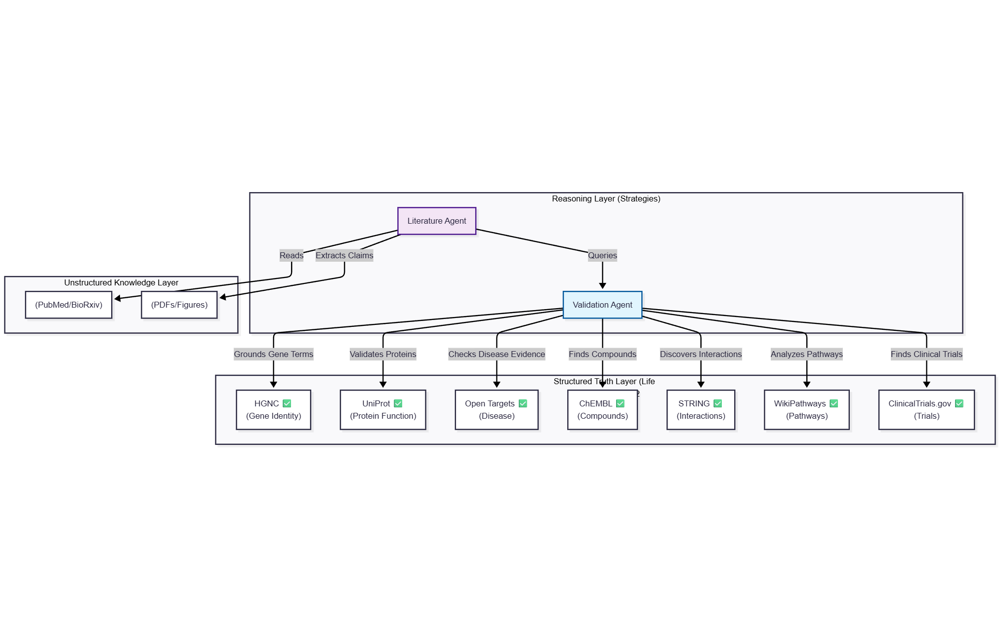

# Life Sciences MCP 🧬🤖

> **A Model Context Protocol platform for grounding agents in live, verifiable biological truth — designed to contain data rot, not amplify it.**

FastMCP wrappers for essential life‑sciences APIs and datasets.  This repository exposes each upstream API as its own micro‑service so agents can ground their reasoning in well‑defined biological facts without hauling around a monolithic knowledge graph.  It is not a knowledge graph replacement; rather it is the **Structured Truth Layer** that complements graph construction and RAG systems by providing canonical identifiers, cross‑references and evidence on demand.

> **Prior Art & Research Context:**  This project stands on two decades of bioinformatics API work (e.g. STRING, STITCH, NCATS Translator) and aligns with emerging standards for LLM knowledge augmentation.  For established patterns, key publications and how this work fits within the broader field, see [Prior Art & Research Context](docs/prior-art-api-patterns.md).

## Why this exists

Drug discovery, drug repurposing and biomedical research depend on accurate, up‑to‑date facts.  Biological identifiers go stale, APIs change, ontologies split and merge and the surface area of “truth” shifts underneath you.  We built the Life Sciences MCP so that agents – whether running on Claude, ChatGPT or any other LLM – can **ground fuzzy claims in resolvable facts**, **contain volatility to the API boundary**, and **self‑heal** when a referenced concept changes.  The key principles are:

* **Containment:**  Each API/database is wrapped in its own MCP server, isolating schema drift and data rot so that one volatile domain doesn’t poison the entire reasoning loop.
* **Correctness:**  All servers implement a **Fuzzy‑to‑Fact** protocol (search → candidate → strict lookup), ensuring canonical IDs are resolved before downstream reasoning.
* **Self‑Healing:**  When an identifier has been deprecated or an API field changes, the server returns a structured error with a recovery hint so the agent can retry with the new canonical ID or schema.

This design stance means the MCP layer can sit behind any knowledge graph or retrieval‑augmented generation system.  It doesn't build the graph for you; it ensures the facts you plug into your graph are still correct.

---

## Vision

Enable AI agents to seamlessly query the world's most important life‑sciences databases through the Model Context Protocol (MCP), accelerating drug discovery, drug repurposing, and biomedical research.  **Current status:** *12 MCP servers operational*, covering genes (HGNC, Ensembl, Entrez), proteins (UniProt, STRING, BioGRID), compounds (ChEMBL, PubChem), pharmacology (IUPHAR/GtoPdb), targets (Open Targets), pathways (WikiPathways) and clinical trials (ClinicalTrials.gov).

---

## Life Sciences Research Stack

This platform provides **12 MCP servers** organized into 5 tiers by research function:

| Tier | Focus | APIs |
|------|-------|------|
| **Tier 0** | Drug Discovery Core | ChEMBL · Open Targets |
| **Tier 1** | Gene/Protein Foundation | HGNC · UniProt · STRING · BioGRID |
| **Tier 2** | Pharmacology & Interactions | IUPHAR/GtoPdb · PubChem |
| **Tier 3** | Pathways & Clinical Trials | WikiPathways · ClinicalTrials.gov |
| **Tier 4** | Genomics & Identifiers | Ensembl · NCBI/Entrez |

---

## MCP Servers

### Tier 0: Strategic Priority (Drug Discovery Core)

| Server | API | Status | Description |
|--------|-----|--------|-------------|
| `chembl-mcp` | [ChEMBL](https://www.ebi.ac.uk/chembl/) | **✅ Complete** | 15M+ bioactivity data points, 1.9M compounds - 62 tests passing ([spec](specs/003-chembl-mcp-server/)) |
| `opentargets-mcp` | [Open Targets](https://platform.opentargets.org/) | **✅ Complete** | Target-disease associations, drug repurposing - 9 tests passing ([spec](specs/004-opentargets-mcp-server/)) |
| `drugbank-mcp` | [DrugBank](https://go.drugbank.com/) | **⛔ BLOCKED** | 500K+ drugs, clinical interactions - 33 unit tests (requires commercial API key) ([spec](specs/005-drugbank-mcp-server/)) |

### Tier 1: Foundation (Gene/Protein Layer)

| Server | API | Status | Description |
|--------|-----|--------|-------------|
| `hgnc-mcp` | [HGNC](https://www.genenames.org/) | **✅ Complete** | Gene nomenclature, symbol resolution - 7 tests passing ([spec](specs/001-hgnc-mcp-server/)) |
| `uniprot-mcp` | [UniProt](https://www.uniprot.org/) | **✅ Complete** | Protein search & lookup (fuzzy-to-fact, cross-DB, error recovery) - 12 tests passing ([spec](specs/002-uniprot-mcp-server/)) |
| `string-mcp` | [STRING](https://string-db.org/) | **✅ Complete** | Protein-protein interactions with evidence scores - 11 tests passing ([spec](specs/006-string-mcp-server/)) |
| `biogrid-mcp` | [BioGRID](https://thebiogrid.org/) | **✅ Complete** | Genetic/protein interactions - 11 tests passing ([spec](specs/007-biogrid-mcp-server/)) |

### Tier 2: Pharmacology & Interactions

| Server | API | Status | Description |
|--------|-----|--------|-------------|
| `iuphar-mcp` | [GtoPdb](https://www.guidetopharmacology.org/) | **✅ Complete** | Pharmacological targets, ligand-receptor interactions - 59 tests passing ([spec](specs/011-iuphar-mcp-server/)) |
| `stitch-mcp` | [STITCH](http://stitch.embl.de/) | Out of Scope (unsupported) | Chemical-protein interactions |
| `pubchem-mcp` | [PubChem](https://pubchem.ncbi.nlm.nih.gov/) | **✅ Complete** | Chemical structures, cross-references - 85 tests passing ([spec](specs/010-pubchem-mcp-server/)) |

### Tier 3: Pathways & Clinical Trials

| Server | API | Status | Description |
|--------|-----|--------|-------------|
| `wikipathways-mcp` | [WikiPathways](https://www.wikipathways.org/) | **✅ Complete** | Biological pathways - 4 tools (search, get pathway, gene pathways, components) ([spec](specs/012-wikipathways-mcp-server/)) |
| `clinicaltrials-mcp` | [ClinicalTrials.gov](https://clinicaltrials.gov/) | **✅ Complete** | Clinical trial data - 3 tools, 13 unit tests ([spec](specs/013-clinicaltrials-mcp-server/)) |
| `kegg-mcp` | [KEGG](https://www.kegg.jp/) | Backlog | Metabolic/signaling pathways |
| `omim-mcp` | [OMIM](https://omim.org/) | Backlog | Genetic disorders |
| `orphanet-mcp` | [Orphanet](https://www.orpha.net/) | Backlog | Rare diseases |

### Tier 4: Genomics & Identifiers

| Server | API | Status | Description |
|--------|-----|--------|-------------|
| `ensembl-mcp` | [Ensembl](https://www.ensembl.org/) | **✅ Complete** | Genomic annotations, genes, transcripts - 86 tests passing ([spec](specs/008-ensembl-mcp-server/)) |
| `entrez-mcp` | [NCBI/Entrez](https://www.ncbi.nlm.nih.gov/gene/) | **✅ Complete** | NCBI gene database, PubMed links - 58 tests passing ([spec](specs/009-entrez-mcp-server/)) |

### Summary

**Completion Status:**
- ✅ **12 servers operational** - HGNC, UniProt, ChEMBL, Open Targets, STRING, BioGRID, IUPHAR/GtoPdb, PubChem, Ensembl, Entrez, WikiPathways, ClinicalTrials.gov
- ⛔ **1 server blocked** - DrugBank (requires commercial API key)
- 🔜 **3 servers in the backlog** - KEGG, OMIM, Orphanet

**Test Coverage:**
- Total tests: 691 passing (integration + unit combined)
- Coverage: All 12 operational servers have comprehensive test suites
- Gateway server: 34+ MCP tools from 12 databases

---

## Agentic Architecture (Team of Tools)

In our agentic workflows we build a **Team of Agents** where each specialized tool plays a role in the scientific reasoning loop.



### The Structured Truth Layer

This repository (`lifesciences-research`) acts as the **Grounding Engine**.  When a Literature Agent reads a paper and claims “Drug X targets Protein Y,” it uses this MCP to:

1. **Resolve** “Protein Y” to a precise UniProt ID (resolving synonyms).
2. **Validate** if “Drug X” actually binds to “Protein Y” in ChEMBL/Open Targets.
3. **Harden** the unstructured text into a structured knowledge graph.

---

## Quick Start

```bash
# Install dependencies
uv sync --extra dev

```

### Choosing Between the Gateway and Individual Servers

Most users start by running a **single MCP server** for a specific task.  Each service (`hgnc-mcp`, `chembl-mcp`, etc.) runs as its own microservice and only exposes the tools relevant to that API.  This keeps your environment lean and ensures the agent’s context window isn’t filled with unused schemas.

When you need to orchestrate queries across multiple domains—e.g. "resolve a gene, find its protein interactions, then fetch related trials"—use the **gateway**.  The gateway composes all 12 MCP servers into a single unified endpoint with prefixed tool names (e.g., `hgnc_search_genes`, `chembl_get_compound`).  This static composition provides predictable behavior and explicit control over which tools are exposed.  Start it with:

```bash
uv run fastmcp run src/lifesciences_mcp/servers/gateway.py
```

For local development or targeted tasks, run individual servers as shown in the original quick‑start commands.  For multi‑hop workflows or production use, run the gateway and call only the tools you need.

---

### Run Individual MCP Servers

```bash
# Tier 0: Drug Discovery Core
uv run fastmcp run src/lifesciences_mcp/servers/chembl.py        # ChEMBL compounds & bioactivity (✅ 112 tests)
uv run fastmcp run src/lifesciences_mcp/servers/opentargets.py   # Target-disease associations (✅ 9 tests)

# Tier 1: Gene/Protein Foundation
uv run fastmcp run src/lifesciences_mcp/servers/hgnc.py          # Gene nomenclature (✅ 21 tests)
uv run fastmcp run src/lifesciences_mcp/servers/uniprot.py       # Protein search & lookup (✅ 29 tests)
uv run fastmcp run src/lifesciences_mcp/servers/string.py        # Protein-protein interactions (✅ 12 tests)
uv run fastmcp run src/lifesciences_mcp/servers/biogrid.py       # Genetic/protein interactions (✅ 11 tests)

# Tier 2: Pharmacology & Interactions
uv run fastmcp run src/lifesciences_mcp/servers/iuphar.py        # Pharmacological targets (✅ 59 tests)
uv run fastmcp run src/lifesciences_mcp/servers/pubchem.py       # Chemical structures (✅ 100 tests)

# Tier 3: Pathways & Clinical Trials
uv run fastmcp run src/lifesciences_mcp/servers/wikipathways.py  # Biological pathways (✅ 4 tools)
uv run fastmcp run src/lifesciences_mcp/servers/clinicaltrials.py # Clinical trials (✅ 3 tools, 13 tests)

# Tier 4: Genomics & Identifiers
uv run fastmcp run src/lifesciences_mcp/servers/ensembl.py       # Genomic annotations (✅ 86 tests)
uv run fastmcp run src/lifesciences_mcp/servers/entrez.py        # NCBI gene database (✅ 58 tests)
```

### Run Tests

```bash
# Install dependencies
uv sync --extra dev

# Run all tests
uv run pytest tests/ -v

# Run integration tests only
uv run pytest -m integration -v

# For per-server test commands, see tests/README.md
```

## Example Usage

All 12 servers follow the **Fuzzy-to-Fact** pattern: fuzzy search → get candidate → strict lookup with cross-references.

### Basic Pattern (HGNC)

```python
from lifesciences_mcp.clients import HGNCClient

async with HGNCClient() as client:
    # Phase 1: Fuzzy search
    results = await client.search_genes("BRCA")
    # Returns: PaginationEnvelope[SearchCandidate]

    # Phase 2: Strict lookup by CURIE
    gene = await client.get_gene("HGNC:1100")  # BRCA1
    # Returns: Gene with cross_references to UniProt, Ensembl, OMIM, etc.
```

### Advanced Pattern (ClinicalTrials.gov)

```python
from lifesciences_mcp.clients import ClinicalTrialsClient

async with ClinicalTrialsClient() as client:
    # Phase 1: Multi-filter search
    results = await client.search_trials(
        query="cancer immunotherapy",
        condition="lung cancer",
        phase="PHASE3",
        status="RECRUITING"
    )

    # Phase 2: Get trial details
    trial = await client.get_trial(results.items[0].id)
    print(f"Trial: {trial.title}, Phase: {trial.phase}, Enrollment: {trial.enrollment}")

    # Phase 3: Get trial locations
    locations = await client.get_trial_locations(trial.id)
    for loc in locations[:3]:
        print(f"  - {loc.facility_name}, {loc.city}, {loc.state}")
```

### MCP Tool Interface

All servers expose functionality as MCP tools:

```python
# Gene lookup (HGNC, Ensembl, Entrez)
await mcp.call_tool("hgnc_search_genes", {"query": "BRCA", "page_size": 5})
await mcp.call_tool("hgnc_get_gene", {"hgnc_id": "HGNC:1100"})

# Protein lookup (UniProt, STRING, BioGRID)
await mcp.call_tool("uniprot_search_proteins", {"query": "insulin", "page_size": 10})
await mcp.call_tool("uniprot_get_protein", {"uniprot_id": "UniProtKB:P04637"})

# Compound lookup (ChEMBL, PubChem)
await mcp.call_tool("chembl_search_compounds", {"query": "aspirin"})
await mcp.call_tool("pubchem_get_compound", {"pubchem_id": "PubChem:CID2244"})

# Clinical trials
await mcp.call_tool("clinicaltrials_search_trials", {
    "query": "cancer immunotherapy",
    "phase": "PHASE3",
    "status": "RECRUITING"
})
```

> **For complete examples of all 12 servers**, see [API Reference](architecture/docs/04_api_reference.md).

---

## Architecture

> **New to this project?** Read [Platform Engineering for AI-Augmented Development](docs/platform-engineering-rationale.md) first to understand our approach to AI-assisted development.

For binding technical specifications, see [ADR-001 v1.3](docs/adr/accepted/adr-001-v1.4.md).

### Design Principles

- **Microservices**: One MCP server per API/database for modularity
- **Async-first**: All tools use async/await for network calls
- **Pydantic models**: Strong typing for API responses
- **Caching**: Redis or in-memory caching for frequent lookups
- **Rate limiting**: Respect upstream API rate limits
- **identifier.org URIs**: Standard URI format for biological identifiers

### Data Standards

Following patterns from [nsclc-pathways](../nsclc-pathways/):

- **identifier.org URIs**: `http://identifiers.org/hgnc/1100` for BRCA1
- **JSON-LD**: Linked data format for semantic interoperability
- **GraphML**: Network export format for visualization tools

---

## Configuration

### Environment Variables

Most life sciences APIs are public and don't require authentication. However, two servers require API keys:

```bash
# Optional - BioGRID (free registration)
BIOGRID_API_KEY=your-key-here  # Get from https://thebiogrid.org/

# Optional NCBI (free registration)
NCBI_API_KEY=your-key-here # Get from https://account.ncbi.nlm.nih.gov/settings/

# Optional - DrugBank (commercial license required)
DRUGBANK_API_KEY=your-key-here  # Get from https://go.drugbank.com/
```

**Note:**
- **BioGRID**: Free API key available with registration at https://thebiogrid.org/
- **NCBI**:  Free API key available with registration at https://account.ncbi.nlm.nih.gov/settings/
- **DrugBank**: Requires commercial license. DrugBank server is excluded from the gateway server and requires manual setup.
- All other 10 servers work without authentication

## Developing New Servers (SpecKit v2)

We provide a standardized process for creating new MCP servers that comply with our [Architectural Standards](docs/adr/accepted/adr-001-v1.4.md).

- **[SpecKit Standard Prompt v2](docs/speckit-standard-prompt-v2.md)**: The "Master Prompt" for generating high-quality, compliant MCP servers.
- **[Scaffold Process Timeline](docs/speckit-scaffold-process-timeline-v2.md)**: The step-by-step lifecycle for scaffolding, implementing, and verifying new servers.

To scaffold a new server:
1. Copy the [Standard Prompt](docs/speckit-standard-prompt-v2.md).
2. Paste it into your AI assistant.
3. Follow the generated implementation plan.

### Testing with FastMCP

```python
import pytest
from fastmcp import Client

@pytest.fixture
async def client():
    from lifesciences_mcp.hgnc import mcp
    async with Client(mcp) as client:
        yield client

async def test_get_gene_info(client):
    result = await client.call_tool("get_gene_info", {"symbol": "BRCA1"})
    assert result["hgnc_id"] == "HGNC:1100"
```

### Quality Assurance

See [tests/README.md](tests/README.md) for comprehensive testing documentation including test categories, patterns, and per-server coverage.

---

## 🧠 Intelligence Included: Pre-Configured Agent Skills

This repository includes a `.claude` directory containing optimized system prompts and skill definitions used to generate our research outputs.

* **[Clinical Trials Skill](.claude/skills/lifesciences-clinical/SKILL.md):** Specialized instructions for navigating ClinicalTrials.gov, filtering by phase/status, and extracting inclusion criteria.
* **[Genomics Skill](.claude/skills/lifesciences-genomics/SKILL.md):** Best practices for resolving gene symbols to Ensembl/HGNC IDs before querying.
* **[Graph Builder Skill](.claude/skills/lifesciences-graph-builder/SKILL.md):** Instructions for constructing Neo4j knowledge graphs from unstructured literature.

## 🔬 Research & Validation

We use these tools to perform real-world analysis. All outputs are validated for factual accuracy.

| Study | Description | Validation |
| :--- | :--- | :--- |
| **[High Commercialization Trials](docs/research-reports/high-commercialization-trials-research.md)** | Identifying trials with high probability of FDA approval. | [✅ Validation Report](docs/research-reports/high-commercialization-trials-validation-report.md) |
| **[Health Emergencies 2026](docs/research-reports/health-emergencies-2026-analysis.md)** | Predictive analysis of emerging pathogen vectors. | N/A |
| **[NSCLC Drug Repurposing](docs/scenarios/scenario1-walkthrough.md)** | ARID1A synthetic lethality pathways. | [✅ Validation Report](docs/scenarios/scenario1-validation-report.md) |

---

## References

### Upstream APIs

- [Open Targets Platform Documentation](https://platform-docs.opentargets.org/)
- [ChEMBL Web Services](https://www.ebi.ac.uk/chembl/ws)
- [HGNC REST API](https://www.genenames.org/help/rest/)
- [UniProt REST API](https://www.uniprot.org/help/api)
- [STRING API](https://string-db.org/help/api/)

### Research

- [Data-driven Drug Repurposing Strategies (2025)](https://academic.oup.com/bib/article/26/6/bbaf625/8341157)
- [AI in Drug Repurposing (2025)](https://advanced.onlinelibrary.wiley.com/doi/10.1002/advs.202411325)
- [Open Targets Drug Index](https://blog.opentargets.org/drug-index-rewrite/)

### Related Projects and Showcases

**Research Workflows:**
- **[Competency Questions Catalog](docs/competency-questions/competency-questions-catalog.md)** - 7 research scenarios (synthetic lethality, drug safety, orphan drug discovery) with re-run instructions
- **[Competency Question Tests](tests/integration/test_competency_questions_mcp.py)** - Integration tests validating multi-server workflows

**Related Projects:**
- [nsclc-pathways](../nsclc-pathways/) - NSCLC signaling pathway analysis (original inspiration for WikiPathways integration)
- [kg_rememberall](../kg_rememberall/) - Knowledge graph construction from text
- [FastMCP Documentation](https://gofastmcp.com/)

**Architecture Documentation:**
- [Architecture](architecture/README.md) - Complete architecture analysis with 13,505 lines of code across 56 Python modules
- [ADR-001 v1.3](docs/adr/accepted/adr-001-v1.4.md) - Binding architecture specification (Fuzzy-to-Fact protocol)
- [Component Inventory](architecture/docs/01_component_inventory.md) - Detailed component reference
- [API Reference](architecture/docs/04_api_reference.md) - Usage guide with examples
- [Competency Questions Catalog](docs/competency-questions/competency-questions-catalog.md) - Research questions for knowledge graph building with the lifesciences-graph-builder skill

---

## License

MIT

---

## Project Tracking

- **Linear Project**: [Life Sciences MCP Server](https://linear.app/agentic-wisdom/project/life-sciences-mcp-server-fc36d8f8e64f)
- **Discovery Issue**: [AGE-65](https://linear.app/agentic-wisdom/issue/AGE-65)

## Acknowledgements

This project leverages public APIs and data from the following rigorous scientific efforts. We gratefully acknowledge their contributions:

- **[HGNC](https://www.genenames.org/)**: HUGO Gene Nomenclature Committee at the European Bioinformatics Institute.
- **[UniProt](https://www.uniprot.org/)**: Universal Protein Resource.
- **[ChEMBL](https://www.ebi.ac.uk/chembl/)**: European Bioinformatics Institute (EMBL-EBI).
- **[Open Targets](https://platform.opentargets.org/)**: A partnership between EMBL-EBI, Wellcome Sanger Institute, and GSK.
- **[STRING](https://string-db.org/)**: STRING Consortium.
- **[BioGRID](https://thebiogrid.org/)**: Tyers Lab at the University of Montreal.
- **[IUPHAR/BPS Guide to Pharmacology](https://www.guidetopharmacology.org/)**: International Union of Basic and Clinical Pharmacology.
- **[PubChem](https://pubchem.ncbi.nlm.nih.gov/)**: National Center for Biotechnology Information (NCBI).
- **[WikiPathways](https://www.wikipathways.org/)**: WikiPathways Community.
- **[ClinicalTrials.gov](https://clinicaltrials.gov/)**: U.S. National Library of Medicine.
- **[Ensembl](https://www.ensembl.org/)**: EMBL-EBI.
- **[NCBI Gene](https://www.ncbi.nlm.nih.gov/gene)**: National Center for Biotechnology Information.
