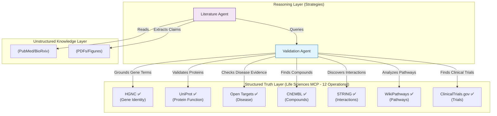

# Life Sciences MCP

FastMCP wrappers for essential life sciences APIs and datasets. A microservices-based approach to accelerate scientific research by providing MCP server access to biological databases, gene nomenclature services, protein interaction networks, and drug-target databases.

## Vision

Enable AI agents to seamlessly query the world's most important life sciences databases through the Model Context Protocol (MCP), accelerating drug discovery, drug repurposing, and biomedical research.

**Current Status: 12 MCP servers operational** covering genes (HGNC, Ensembl, Entrez), proteins (UniProt, STRING, BioGRID), compounds (ChEMBL, PubChem), pharmacology (IUPHAR/GtoPdb), targets (Open Targets), pathways (WikiPathways), and clinical trials (ClinicalTrials.gov).

---

## The Modern Drug Discovery Stack (2025)

The current best practice in computational drug discovery is an **integrative approach** using programmatic APIs across multiple data layers:

```
┌─────────────────────────────────────────────────────────────┐
│                    DRUG REPURPOSING STACK                   │
├─────────────────────────────────────────────────────────────┤
│  Layer 1: Chemical/Drug                                      │
│  ChEMBL → PubChem → DrugBank                                │
├─────────────────────────────────────────────────────────────┤
│  Layer 2: Target/Protein                                     │
│  UniProt → STRING → IUPHAR/GtoPdb → STITCH                  │
├─────────────────────────────────────────────────────────────┤
│  Layer 3: Gene/Genomics                                      │
│  HGNC → Ensembl → NCBI/Entrez                               │
├─────────────────────────────────────────────────────────────┤
│  Layer 4: Disease/Phenotype                                  │
│  OMIM → Orphanet → Open Targets                             │
├─────────────────────────────────────────────────────────────┤
│  Layer 5: Knowledge Integration                              │
│  Open Targets Platform (aggregates all above)               │
└─────────────────────────────────────────────────────────────┘
```

---

## Key Insight: Open Targets as a "Meta-API"

**[Open Targets Platform](https://platform.opentargets.org/)** is emerging as the single most valuable API for drug discovery because it:

- **Aggregates** ChEMBL, UniProt, Ensembl, and disease databases into a unified interface
- **Provides** a modern GraphQL API for flexible querying
- **Maps** targets to diseases with genetic and experimental evidence
- **Enables** drug repurposing by connecting approved drugs to new indications
- **Already does** the integration work you'd otherwise do manually

This makes Open Targets an excellent starting point for AI-driven drug discovery workflows.

---

## Planned MCP Servers

### Tier 0: Strategic Priority (Drug Discovery Core)

| Server | API | Status | Description |
|--------|-----|--------|-------------|
| `chembl-mcp` | [ChEMBL](https://www.ebi.ac.uk/chembl/) | **✅ Complete** | 15M+ bioactivity data points, 1.9M compounds - 62 tests passing ([spec](specs/003-chembl-mcp-server/)) |
| `opentargets-mcp` | [Open Targets](https://platform.opentargets.org/) | **✅ Complete** | Target-disease associations, drug repurposing - 9 tests passing ([spec](specs/004-opentargets-mcp-server/)) |
| `drugbank-mcp` | [DrugBank](https://go.drugbank.com/) | **⛔ BLOCKED** | 500K+ drugs, clinical interactions - 33 unit tests (requires commercial API key) ([spec](specs/005-drugbank-mcp-server/)) |

### Tier 1: Foundation (Gene/Protein Layer)

| Server | API | Status | Description |
|--------|-----|--------|-------------|
| `hgnc-mcp` | [HGNC](https://www.genenames.org/) | **✅ Complete** | Gene nomenclature, symbol resolution - 7 tests passing ([spec](specs/001-hgnc-mcp-server/)) |
| `uniprot-mcp` | [UniProt](https://www.uniprot.org/) | **✅ Complete** | Protein search & lookup (fuzzy-to-fact, cross-DB, error recovery) - 12 tests passing ([spec](specs/002-uniprot-mcp-server/)) |
| `string-mcp` | [STRING](https://string-db.org/) | **✅ Complete** | Protein-protein interactions with evidence scores - 11 tests passing ([spec](specs/006-string-mcp-server/)) |
| `biogrid-mcp` | [BioGRID](https://thebiogrid.org/) | **✅ Complete** | Genetic/protein interactions - 11 tests passing ([spec](specs/007-biogrid-mcp-server/)) |

### Tier 2: Pharmacology & Interactions

| Server | API | Status | Description |
|--------|-----|--------|-------------|
| `iuphar-mcp` | [GtoPdb](https://www.guidetopharmacology.org/) | **✅ Complete** | Pharmacological targets, ligand-receptor interactions - 59 tests passing ([spec](specs/011-iuphar-mcp-server/)) |
| `stitch-mcp` | [STITCH](http://stitch.embl.de/) | Planned | Chemical-protein interactions |
| `pubchem-mcp` | [PubChem](https://pubchem.ncbi.nlm.nih.gov/) | **✅ Complete** | Chemical structures, cross-references - 85 tests passing ([spec](specs/010-pubchem-mcp-server/)) |

### Tier 3: Pathways & Clinical Trials

| Server | API | Status | Description |
|--------|-----|--------|-------------|
| `wikipathways-mcp` | [WikiPathways](https://www.wikipathways.org/) | **✅ Complete** | Biological pathways - 4 tools (search, get pathway, gene pathways, components) ([spec](specs/012-wikipathways-mcp-server/)) |
| `clinicaltrials-mcp` | [ClinicalTrials.gov](https://clinicaltrials.gov/) | **✅ Complete** | Clinical trial data - 3 tools, 13 unit tests ([spec](specs/013-clinicaltrials-mcp-server/)) |
| `kegg-mcp` | [KEGG](https://www.kegg.jp/) | Planned | Metabolic/signaling pathways |
| `omim-mcp` | [OMIM](https://omim.org/) | Planned | Genetic disorders |
| `orphanet-mcp` | [Orphanet](https://www.orpha.net/) | Planned | Rare diseases |

### Tier 4: Genomics & Identifiers

| Server | API | Status | Description |
|--------|-----|--------|-------------|
| `ensembl-mcp` | [Ensembl](https://www.ensembl.org/) | **✅ Complete** | Genomic annotations, genes, transcripts - 86 tests passing ([spec](specs/008-ensembl-mcp-server/)) |
| `entrez-mcp` | [NCBI/Entrez](https://www.ncbi.nlm.nih.gov/gene/) | **✅ Complete** | NCBI gene database, PubMed links - 58 tests passing ([spec](specs/009-entrez-mcp-server/)) |

### Summary

**Completion Status:**
- ✅ **12 servers operational** - HGNC, UniProt, ChEMBL, Open Targets, STRING, BioGRID, IUPHAR/GtoPdb, PubChem, Ensembl, Entrez, WikiPathways, ClinicalTrials.gov
- ⛔ **1 server blocked** - DrugBank (requires commercial API key)
- 🔜 **4 servers planned** - STITCH, KEGG, OMIM, Orphanet

**Test Coverage:**
- Total tests: 691 passing (integration + unit combined)
- Coverage: All 12 operational servers have comprehensive test suites
- Gateway server: 34+ MCP tools from 12 databases

---

## Agentic Architecture (Team of Tools)

We are building a **Team of Agents** where each specialized tool plays a role in the scientific reasoning loop.



### The "Structured Truth Layer"
This repository (`lifesciences-research`) acts as the **Grounding Engine**. When a Literature Agent reads a paper and claims "Drug X targets Protein Y," it uses this MCP to:
1.  **Resolve** "Protein Y" to a precise UniProt ID (resolving synonyms).
2.  **Validate** if "Drug X" actually binds to "Protein Y" in ChEMBL/OpenTargets.
3.  **Harden** the unstructured text into a structured Knowledge Graph.

---

## Quick Start

```bash
# Install dependencies
uv sync --extra dev

# =============================================================================
# Run Individual MCP Servers
# =============================================================================

# Tier 0: Drug Discovery Core
uv run fastmcp run src/lifesciences_mcp/servers/chembl.py        # ChEMBL compounds & bioactivity (✅ 112 tests)
uv run fastmcp run src/lifesciences_mcp/servers/opentargets.py   # Target-disease associations (✅ 9 tests)
uv run fastmcp run src/lifesciences_mcp/servers/drugbank.py      # Drug interactions (⛔ requires API key)

# Tier 1: Gene/Protein Foundation
uv run fastmcp run src/lifesciences_mcp/servers/hgnc.py          # Gene nomenclature (✅ 21 tests)
uv run fastmcp run src/lifesciences_mcp/servers/uniprot.py       # Protein search & lookup (✅ 29 tests)
uv run fastmcp run src/lifesciences_mcp/servers/string.py        # Protein-protein interactions (✅ 12 tests)
uv run fastmcp run src/lifesciences_mcp/servers/biogrid.py       # Genetic/protein interactions (✅ 11 tests)

# Tier 2: Pharmacology & Interactions
uv run fastmcp run src/lifesciences_mcp/servers/iuphar.py        # Pharmacological targets (✅ 59 tests)
uv run fastmcp run src/lifesciences_mcp/servers/pubchem.py       # Chemical structures (✅ 100 tests)

# Tier 3: Pathways & Clinical Trials
uv run fastmcp run src/lifesciences_mcp/servers/wikipathways.py  # Biological pathways (✅ 4 tools)
uv run fastmcp run src/lifesciences_mcp/servers/clinicaltrials.py # Clinical trials (✅ 3 tools, 13 tests)

# Tier 4: Genomics & Identifiers
uv run fastmcp run src/lifesciences_mcp/servers/ensembl.py       # Genomic annotations (✅ 86 tests)
uv run fastmcp run src/lifesciences_mcp/servers/entrez.py        # NCBI gene database (✅ 58 tests)

# =============================================================================
# Run Tests
# =============================================================================

# Run all tests
uv run pytest tests/ -v

# Run integration tests only
uv run pytest -m integration -v

# Test specific server
uv run pytest tests/integration/test_hgnc_api.py -v -m integration         # 7 tests ✅
uv run pytest tests/integration/test_uniprot_api.py -v -m integration      # 12 tests ✅
uv run pytest tests/integration/test_chembl_api.py -v -m integration       # 20 tests ✅
uv run pytest tests/integration/test_opentargets_api.py -v -m integration  # 9 tests ✅
uv run pytest tests/integration/test_drugbank_api.py -v -m integration     # 7 tests (⛔ skipped without API key)
uv run pytest tests/integration/test_string_api.py -v -m integration       # 11 tests ✅
uv run pytest tests/integration/test_biogrid_api.py -v -m integration      # 11 tests ✅
uv run pytest tests/integration/test_iuphar_api.py -v -m integration       # 48 tests ✅
uv run pytest tests/integration/test_pubchem_api.py -v -m integration      # 19 tests ✅
uv run pytest tests/integration/test_ensembl_api.py -v -m integration      # 24 tests ✅
uv run pytest tests/integration/test_entrez_api.py -v -m integration       # 20 tests ✅
uv run pytest tests/integration/test_wikipathways_api.py -v -m integration # 17 tests ✅
uv run pytest tests/unit/test_clinicaltrials_client.py -v                  # 13 unit tests ✅
```

## Example Usage

All 12 servers follow the **Fuzzy-to-Fact** pattern: fuzzy search → get candidate → strict lookup with cross-references.

### Basic Pattern (HGNC)

```python
from lifesciences_mcp.clients import HGNCClient

async with HGNCClient() as client:
    # Phase 1: Fuzzy search
    results = await client.search_genes("BRCA")
    # Returns: PaginationEnvelope[SearchCandidate]

    # Phase 2: Strict lookup by CURIE
    gene = await client.get_gene("HGNC:1100")  # BRCA1
    # Returns: Gene with cross_references to UniProt, Ensembl, OMIM, etc.
```

### Advanced Pattern (ClinicalTrials.gov)

```python
from lifesciences_mcp.clients import ClinicalTrialsClient

async with ClinicalTrialsClient() as client:
    # Phase 1: Multi-filter search
    results = await client.search_trials(
        query="cancer immunotherapy",
        condition="lung cancer",
        phase="PHASE3",
        status="RECRUITING"
    )

    # Phase 2: Get trial details
    trial = await client.get_trial(results.items[0].id)
    print(f"Trial: {trial.title}, Phase: {trial.phase}, Enrollment: {trial.enrollment}")

    # Phase 3: Get trial locations
    locations = await client.get_trial_locations(trial.id)
    for loc in locations[:3]:
        print(f"  - {loc.facility_name}, {loc.city}, {loc.state}")
```

### MCP Tool Interface

All servers expose functionality as MCP tools:

```python
# Gene lookup (HGNC, Ensembl, Entrez)
await mcp.call_tool("hgnc_search_genes", {"query": "BRCA", "page_size": 5})
await mcp.call_tool("hgnc_get_gene", {"hgnc_id": "HGNC:1100"})

# Protein lookup (UniProt, STRING, BioGRID)
await mcp.call_tool("uniprot_search_proteins", {"query": "insulin", "page_size": 10})
await mcp.call_tool("uniprot_get_protein", {"uniprot_id": "UniProtKB:P04637"})

# Compound lookup (ChEMBL, PubChem)
await mcp.call_tool("chembl_search_compounds", {"query": "aspirin"})
await mcp.call_tool("pubchem_get_compound", {"pubchem_id": "PubChem:CID2244"})

# Clinical trials
await mcp.call_tool("clinicaltrials_search_trials", {
    "query": "cancer immunotherapy",
    "phase": "PHASE3",
    "status": "RECRUITING"
})
```

> **For complete examples of all 12 servers**, see [API Reference](architecture/docs/04_api_reference.md).

---

## Architecture

> **New to this project?** Read [Platform Engineering for AI-Augmented Development](docs/platform-engineering-rationale.md) first to understand our approach to AI-assisted development.

For binding technical specifications, see [ADR-001 v1.2](docs/adr/accepted/adr-001-v1.2.md).

### Design Principles

- **Microservices**: One MCP server per API/database for modularity
- **Async-first**: All tools use async/await for network calls
- **Pydantic models**: Strong typing for API responses
- **Caching**: Redis or in-memory caching for frequent lookups
- **Rate limiting**: Respect upstream API rate limits
- **identifier.org URIs**: Standard URI format for biological identifiers

### Data Standards

Following patterns from [nsclc-pathways](../nsclc-pathways/):

- **identifier.org URIs**: `http://identifiers.org/hgnc/1100` for BRCA1
- **JSON-LD**: Linked data format for semantic interoperability
- **GraphML**: Network export format for visualization tools

---

## Configuration

### Environment Variables

Most life sciences APIs are public and don't require authentication. However, two servers require API keys:

```bash
# Optional - BioGRID (free registration)
BIOGRID_API_KEY=your-key-here  # Get from https://thebiogrid.org/

# Optional NCBI (free registration)
NCBI_API_KEY=your-key-here # Get from https://account.ncbi.nlm.nih.gov/settings/

# Optional - DrugBank (commercial license required)
DRUGBANK_API_KEY=your-key-here  # Get from https://go.drugbank.com/
```

**Note:**
- **BioGRID**: Free API key available with registration at https://thebiogrid.org/
- **NCBI**:  Free API key available with registration at https://account.ncbi.nlm.nih.gov/settings/
- **DrugBank**: Requires commercial license. DrugBank server is excluded from the gateway server and requires manual setup.
- All other 10 servers work without authentication

## Development

```bash
# Install with dev dependencies
uv sync --extra dev

# Run tests
uv run pytest tests/ -v

# Lint and format
uv run ruff check --fix . && uv run ruff format .

# Type checking
uv run pyright
```

## Developing New Servers (SpecKit v2)

We provide a standardized process for creating new MCP servers that comply with our [Architectural Standards](docs/adr/accepted/adr-001-v1.3.md).

- **[SpecKit Standard Prompt v2](docs/speckit-standard-prompt-v2.md)**: The "Master Prompt" for generating high-quality, compliant MCP servers.
- **[Scaffold Process Timeline](docs/speckit-scaffold-process-timeline-v2.md)**: The step-by-step lifecycle for scaffolding, implementing, and verifying new servers.

To scaffold a new server:
1. Copy the [Standard Prompt](docs/speckit-standard-prompt-v2.md).
2. Paste it into your AI assistant.
3. Follow the generated implementation plan.

### Testing with FastMCP

```python
import pytest
from fastmcp import Client

@pytest.fixture
async def client():
    from lifesciences_mcp.hgnc import mcp
    async with Client(mcp) as client:
        yield client

async def test_get_gene_info(client):
    result = await client.call_tool("get_gene_info", {"symbol": "BRCA1"})
    assert result["hgnc_id"] == "HGNC:1100"
```

### Quality Assurance

We maintain a comprehensive list of [Test Scenarios](docs/test_scenarios.md) covering data model validation, error handling, and edge cases.

**Example: Search Candidate Validation**
| Scenario | Check | Expected Outcome |
|----------|-------|------------------|
| **Valid** | `id="HGNC:1100", score=1.0` | Object created |
| **Invalid Format** | `id="BRCA1"` (missing prefix) | `ValidationError` |
| **Out of Bounds** | `score=1.5` | `ValidationError` |

See [docs/test_scenarios.md](docs/test_scenarios.md) for the full list.

---

## 🧠 Intelligence Included: Pre-Configured Agent Skills

This repository includes a `.claude` directory containing optimized system prompts and skill definitions used to generate our research outputs.

* **[Clinical Trials Skill](.claude/skills/lifesciences-clinical/SKILL.md):** Specialized instructions for navigating ClinicalTrials.gov, filtering by phase/status, and extracting inclusion criteria.
* **[Genomics Skill](.claude/skills/lifesciences-genomics/SKILL.md):** Best practices for resolving gene symbols to Ensembl/HGNC IDs before querying.
* **[Graph Builder Skill](.claude/skills/lifesciences-graph-builder/SKILL.md):** Instructions for constructing Neo4j knowledge graphs from unstructured literature.

## 🔬 Research & Validation

We use these tools to perform real-world analysis. All outputs are validated for factual accuracy.

| Study | Description | Validation |
| :--- | :--- | :--- |
| **[High Commercialization Trials](docs/research-reports/high-commercialization-trials-research.md)** | Identifying trials with high probability of FDA approval. | [✅ Validation Report](docs/research-reports/high-commercialization-trials-validation-report.md) |
| **[Health Emergencies 2026](docs/research-reports/health-emergencies-2026-analysis.md)** | Predictive analysis of emerging pathogen vectors. | N/A |
| **[NSCLC Drug Repurposing](docs/scenarios/scenario1-walkthrough.md)** | ARID1A synthetic lethality pathways. | [✅ Validation Report](docs/scenarios/scenario1-validation-report.md) |

---

## References

### Upstream APIs

- [Open Targets Platform Documentation](https://platform-docs.opentargets.org/)
- [ChEMBL Web Services](https://www.ebi.ac.uk/chembl/ws)
- [HGNC REST API](https://www.genenames.org/help/rest/)
- [UniProt REST API](https://www.uniprot.org/help/api)
- [STRING API](https://string-db.org/help/api/)

### Research

- [Data-driven Drug Repurposing Strategies (2025)](https://academic.oup.com/bib/article/26/6/bbaf625/8341157)
- [AI in Drug Repurposing (2025)](https://advanced.onlinelibrary.wiley.com/doi/10.1002/advs.202411325)
- [Open Targets Drug Index](https://blog.opentargets.org/drug-index-rewrite/)

### Related Projects and Showcases

**Showcases:**
- **NSCLC Drug Repurposing Showcase** (`docs/showcases/nsclc-drug-repurposing/`) - Complete end-to-end workflow demonstrating WikiPathways and ClinicalTrials.gov integration for non-small cell lung cancer research

**Related Projects:**
- [nsclc-pathways](../nsclc-pathways/) - NSCLC signaling pathway analysis (original inspiration for WikiPathways integration)
- [kg_rememberall](../kg_rememberall/) - Knowledge graph construction from text
- [FastMCP Documentation](https://gofastmcp.com/)

**Architecture Documentation:**
- [Architecture](architecture/README.md) - Complete architecture analysis with 13,505 lines of code across 56 Python modules
- [ADR-001 v1.3](docs/adr/accepted/adr-001-v1.3.md) - Binding architecture specification (Fuzzy-to-Fact protocol)
- [Component Inventory](architecture/docs/01_component_inventory.md) - Detailed component reference
- [API Reference](architecture/docs/04_api_reference.md) - Usage guide with examples
- [Competency Questions Catalog](docs/competency-questions-catalog.md) - Research questions for knowledge graph building with the lifesciences-graph-builder skill

---

## License

MIT

---

## Project Tracking

- **Linear Project**: [Life Sciences MCP Server](https://linear.app/agentic-wisdom/project/life-sciences-mcp-server-fc36d8f8e64f)
- **Discovery Issue**: [AGE-65](https://linear.app/agentic-wisdom/issue/AGE-65)

## Acknowledgements

This project leverages public APIs and data from the following rigorous scientific efforts. We gratefully acknowledge their contributions:

- **[HGNC](https://www.genenames.org/)**: HUGO Gene Nomenclature Committee at the European Bioinformatics Institute.
- **[UniProt](https://www.uniprot.org/)**: Universal Protein Resource.
- **[ChEMBL](https://www.ebi.ac.uk/chembl/)**: European Bioinformatics Institute (EMBL-EBI).
- **[Open Targets](https://platform.opentargets.org/)**: A partnership between EMBL-EBI, Wellcome Sanger Institute, and GSK.
- **[STRING](https://string-db.org/)**: STRING Consortium.
- **[BioGRID](https://thebiogrid.org/)**: Tyers Lab at the University of Montreal.
- **[IUPHAR/BPS Guide to Pharmacology](https://www.guidetopharmacology.org/)**: International Union of Basic and Clinical Pharmacology.
- **[PubChem](https://pubchem.ncbi.nlm.nih.gov/)**: National Center for Biotechnology Information (NCBI).
- **[WikiPathways](https://www.wikipathways.org/)**: WikiPathways Community.
- **[ClinicalTrials.gov](https://clinicaltrials.gov/)**: U.S. National Library of Medicine.
- **[Ensembl](https://www.ensembl.org/)**: EMBL-EBI.
- **[NCBI Gene](https://www.ncbi.nlm.nih.gov/gene)**: National Center for Biotechnology Information.
