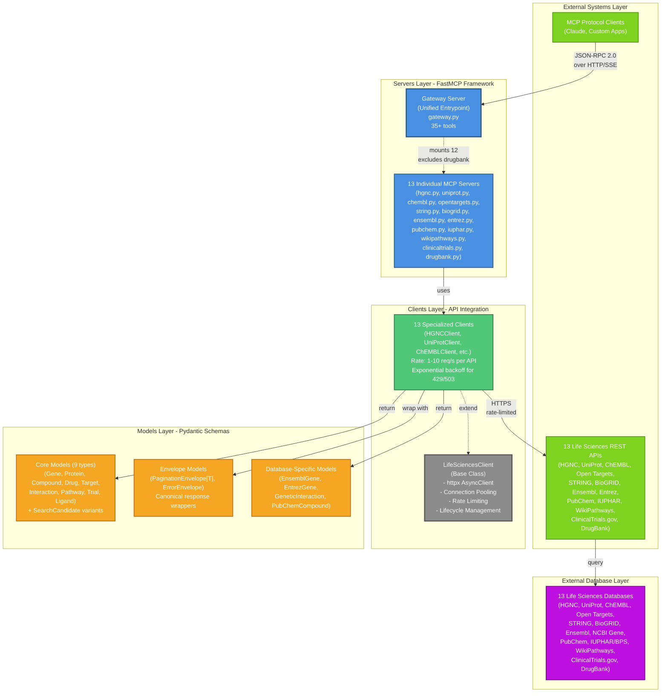

# Repository Architecture Documentation

## Overview

### Purpose of This Documentation

This documentation set provides a comprehensive architectural analysis of the Life Sciences MCP project. It synthesizes insights from static code analysis, architectural diagrams, data flow patterns, and API documentation to create a complete understanding of the system.

**What This Covers:**
- Complete component inventory (50+ modules, 13 clients, 40+ models, 35+ tools)
- 5-layer architecture with detailed component relationships
- Data flow patterns and interaction sequences
- API reference for all public interfaces
- Design principles and architectural decisions

**Why It Was Created:**
- Enable developers to quickly understand the codebase structure
- Provide architects with visual system representations
- Document the Fuzzy-to-Fact protocol and its implementation
- Serve as onboarding material for new contributors
- Support AI agents in understanding available tools and patterns

### Life Sciences MCP Project

The Life Sciences MCP (Model Context Protocol) is a **unified API gateway** providing standardized access to 13 major life sciences databases through a FastMCP-based architecture. The system implements the **Fuzzy-to-Fact protocol** to prevent entity hallucination by enforcing two-phase resolution: fuzzy search for discovery, followed by strict CURIE-based retrieval for facts.

**Key Characteristics:**
- **Purpose**: Enable AI agents and researchers to query life sciences data across multiple databases with consistent interfaces
- **Architecture**: Clean 5-layer architecture (External Systems → Servers → Clients → Models → Databases)
- **Protocol**: JSON-RPC 2.0 over HTTP/SSE using FastMCP framework
- **Coverage**: 13 databases (HGNC, UniProt, ChEMBL, Open Targets, STRING, BioGRID, Ensembl, NCBI Gene, PubChem, IUPHAR, WikiPathways, ClinicalTrials.gov, DrugBank)
- **Target Users**: AI agents (Claude, custom MCP clients), biomedical researchers, bioinformaticians
- **Deployment**: FastMCP Cloud at `https://lifesciences-research.fastmcp.app/mcp`

**Core Innovation:**
The **Fuzzy-to-Fact protocol** eliminates hallucinated identifiers by requiring agents to:
1. Search for entities using fuzzy search (returns ranked candidates with validated CURIEs)
2. Select the best candidate based on relevance scores
3. Retrieve authoritative data using the validated CURIE

This two-phase approach ensures all facts are grounded in real database identifiers.

---

## Quick Start

### For Developers

**Understanding the Codebase:**
1. Start with this README for high-level architecture
2. Review `docs/01_component_inventory.md` for detailed component breakdown
3. Study `diagrams/02_architecture_diagrams.md` for visual representations
4. Examine `docs/03_data_flows.md` for interaction patterns

**Working with the Code:**
```bash
# Clone repository
git clone <repository-url>
cd lifesciences-research

# Install dependencies
pip install -r requirements.txt

# Run individual server (development)
uv run fastmcp run src/lifesciences_mcp/servers/hgnc.py

# Run gateway server (all databases)
uv run fastmcp run src/lifesciences_mcp/servers/gateway.py

# Run tests
pytest tests/unit/          # Unit tests (mocked)
pytest tests/integration/   # Integration tests (real APIs)
pytest tests/e2e/           # End-to-end tests
```

**Key Files to Know:**
- `src/lifesciences_mcp/__init__.py` - Package entry point with public API
- `src/lifesciences_mcp/clients/base.py` - Base client with connection pooling
- `src/lifesciences_mcp/models/envelopes.py` - Error and pagination envelopes
- `src/lifesciences_mcp/servers/gateway.py` - Unified gateway server (35+ tools)

### For AI Agents

**Using the MCP Tools:**

The gateway provides 35+ tools across 13 databases, all following the same pattern:

**Fuzzy Search Pattern:**
```json
{
  "jsonrpc": "2.0",
  "id": 1,
  "method": "tools/call",
  "params": {
    "name": "hgnc_search_genes",
    "arguments": {
      "query": "BRCA1",
      "page_size": 10
    }
  }
}
```

**Strict Retrieval Pattern:**
```json
{
  "jsonrpc": "2.0",
  "id": 2,
  "method": "tools/call",
  "params": {
    "name": "hgnc_get_gene",
    "arguments": {
      "hgnc_id": "HGNC:1100"
    }
  }
}
```

**Available Tool Categories:**
- **Gene Tools**: `hgnc_*`, `ensembl_*`, `entrez_*`
- **Protein Tools**: `uniprot_*`, `string_*`
- **Compound Tools**: `chembl_*`, `pubchem_*`, `iuphar_*`
- **Interaction Tools**: `string_*`, `biogrid_*`
- **Pathway Tools**: `wikipathways_*`
- **Clinical Tools**: `clinicaltrials_*`, `opentargets_*`

See `docs/04_api_reference.md` for complete tool documentation.

### For Architects

**Documentation Navigation:**
1. **System Overview**: See [Architecture Summary](#architecture-summary) below
2. **Visual Architecture**: Review `diagrams/02_architecture_diagrams.md`
3. **Component Details**: Examine `docs/01_component_inventory.md`
4. **Integration Patterns**: Study [Data Flow Patterns](#data-flow-patterns) and `docs/03_data_flows.md`
5. **Design Decisions**: Review [Key Insights](#key-insights) section

**Architecture Artifacts:**
- **Layered System Diagram**: 5-layer architecture with clear boundaries
- **Component Relationship Diagram**: Dependencies and data flows
- **Class Hierarchies**: Client and model inheritance structures
- **Sequence Diagrams**: 7 major data flow patterns documented
- **Cross-Reference Registry**: 22-key standard for database integration

---

## Documentation Structure

### Component Inventory
**File**: `docs/01_component_inventory.md`

**Contents**:
- 50 Python modules with line-by-line breakdown
- 13 client classes (HGNCClient, UniProtClient, ChEMBLClient, etc.)
- 40+ model classes (Gene, Protein, Compound, etc.)
- 13 FastMCP server definitions
- 35+ MCP tools with parameters and return types
- Test infrastructure (116 test files across unit/integration/e2e)
- Entry points and CLI usage patterns

**When to Use**:
- Understanding what components exist and their purpose
- Finding specific classes or functions by name
- Determining which files to modify for new features
- Learning the test structure

### Architecture Diagrams
**File**: `diagrams/02_architecture_diagrams.md`

**Contents**:
- System architecture (5-layer view with all components)
- Component relationships (server-client-model dependencies)
- Class hierarchies (13 client inheritance trees, model structures)
- Module dependencies (import graph and circular dependency prevention)
- Server composition (gateway mounting pattern)
- Data flow architecture (request/response lifecycle)
- Color-coded Mermaid diagrams for visual clarity

**When to Use**:
- Getting a high-level understanding of system structure
- Understanding component relationships and dependencies
- Visualizing data flow through the system
- Presenting architecture to stakeholders
- Onboarding new team members

### Data Flow Analysis
**File**: `docs/03_data_flows.md`

**Contents**:
- 7 detailed sequence diagrams showing:
  - Simple query flow (fuzzy search)
  - Interactive session flow (connection pooling)
  - Tool permission flow (delegated to FastMCP)
  - MCP server communication (JSON-RPC protocol details)
  - Message routing (gateway-based tool resolution)
  - Error handling flow (canonical error envelopes)
  - Cross-reference resolution (database navigation)
- Performance characteristics (latency, token usage)
- Rate limiting strategies per API
- Connection pooling and lifecycle management

**When to Use**:
- Understanding how requests flow through the system
- Debugging integration issues
- Optimizing performance bottlenecks
- Learning the Fuzzy-to-Fact protocol implementation
- Understanding error handling and recovery patterns

### API Reference
**File**: `docs/04_api_reference.md`

**Contents**:
- Complete client class documentation (all 13 clients)
- All model classes with field descriptions (40+ models)
- All MCP server tools with examples (35+ tools)
- Configuration options (environment variables, rate limits)
- Usage patterns (6 common patterns with code examples)
- Best practices (15 guidelines)
- Appendices (CURIE formats, error codes, token sizes)

**When to Use**:
- Looking up specific API methods and parameters
- Understanding model fields and validation rules
- Finding code examples for common tasks
- Configuring rate limits or connection pooling
- Learning CURIE formats for different databases
- Troubleshooting errors

---

## Architecture Summary

### System Architecture

The Life Sciences MCP implements a **clean 5-layer architecture** with strict separation of concerns and unidirectional dependencies flowing downward through the stack. This design enables modularity, testability, and prevents circular dependencies.

**Key Layers**:

1. **External Systems Layer** (Top)
   - **MCP Protocol Clients**: Claude, custom applications, any MCP-compatible client
   - **Communication**: JSON-RPC 2.0 over HTTP with Server-Sent Events (SSE)
   - **External APIs**: 13 life sciences REST APIs providing data access
   - **Role**: External interfaces for both client access and data sources

2. **Servers Layer** (FastMCP Framework)
   - **Gateway Server**: Unified entrypoint composing 13 individual servers, exposing 35+ MCP tools
   - **Individual Servers**: Each database has its own FastMCP server (hgnc.py, uniprot.py, chembl.py, etc.)
   - **Tool Naming**: Prefix-based naming prevents collisions (e.g., `hgnc_search_genes`, `uniprot_search_proteins`)
   - **Role**: Thin wrapper layer translating JSON-RPC calls to client methods
   - **Key Feature**: Gateway uses FastMCP's `mount()` pattern to compose all servers into a single endpoint

3. **Clients Layer** (API Integration)
   - **Base Client**: `LifeSciencesClient` provides shared HTTP infrastructure (connection pooling, rate limiting, lifecycle management)
   - **13 Specialized Clients**: Each wraps a specific API with domain logic
   - **Rate Limiting**: Client-side enforcement (1-10 req/s per API with exponential backoff)
   - **Role**: Handle all API communication, response transformation, and error mapping
   - **Key Features**: Async-first, connection pooling, CURIE validation, cross-reference mapping

4. **Models Layer** (Pydantic Schemas)
   - **Core Models**: 9 domain entity types (Gene, Protein, Compound, Drug, Target, Interaction, Pathway, Trial, Ligand)
   - **SearchCandidate Variants**: Lightweight versions for fuzzy search (~20 tokens vs ~100-300 tokens)
   - **Envelope Models**: `PaginationEnvelope[T]` and `ErrorEnvelope` for canonical responses
   - **CrossReferences**: Shared 22-key registry enabling cross-database navigation
   - **Role**: Define data structures with validation, serialization, and type safety
   - **Key Feature**: Pydantic v2 with CURIE pattern validation and field validators

5. **External Database Layer** (Bottom)
   - **13 Life Sciences Databases**: HGNC, UniProt, ChEMBL, Open Targets, STRING, BioGRID, Ensembl, NCBI Gene, PubChem, IUPHAR, WikiPathways, ClinicalTrials.gov, DrugBank
   - **Access**: Via their respective REST APIs (layer 1)
   - **Role**: Actual data storage and retrieval

**Architectural Patterns**:
- **Gateway Pattern**: Single unified endpoint composing multiple servers
- **Template Method**: Base client provides infrastructure, subclasses implement business logic
- **Facade**: Clients hide complex API interactions behind simple async methods
- **Envelope Pattern**: Consistent response format across all tools (success + data OR error + hints)
- **Singleton**: Server-side clients initialized once per process, shared across requests
- **Factory Method**: ErrorEnvelope provides static factory methods for common errors

**Design Principles**:
- **Fuzzy-to-Fact Protocol**: Two-phase resolution prevents entity hallucination
- **Clean Layering**: Strict dependency hierarchy (Models ← Clients ← Servers ← Gateway)
- **Connection Pooling**: Persistent HTTP connections reduce latency
- **Rate Limiting**: Client-side enforcement prevents upstream throttling
- **Token Efficiency**: Slim mode reduces LLM token usage by ~80%
- **Cross-Reference Navigation**: 22-key registry enables multi-database traversal
- **Canonical Error Handling**: Standardized errors with agent-actionable recovery hints
- **Type Safety**: Pydantic models enforce runtime validation
- **Async-First**: All I/O is asynchronous (except ChEMBL SDK, which is wrapped)
- **Omit-If-Null**: Cross-references exclude keys with no value (never null/empty strings)

### Technology Stack

**Core Technologies**:
- **Python 3.13+**: Main implementation language
- **FastMCP**: Framework for MCP server creation
- **Pydantic v2**: Data validation and serialization
- **httpx**: Async HTTP client with connection pooling
- **asyncio**: Asynchronous I/O framework

**External APIs**:
1. HGNC (Gene Nomenclature Committee) - `rest.genenames.org`
2. UniProt (Universal Protein Resource) - `rest.uniprot.org`
3. ChEMBL (Bioactivity Database) - `www.ebi.ac.uk/chembl`
4. Open Targets (Target-Disease Associations) - `api.platform.opentargets.org`
5. STRING (Protein Interactions) - `string-db.org`
6. BioGRID (Genetic/Protein Interactions) - `webservice.thebiogrid.org`
7. Ensembl (Genomic Database) - `rest.ensembl.org`
8. NCBI Gene/Entrez - `eutils.ncbi.nlm.nih.gov`
9. PubChem (Chemical Compounds) - `pubchem.ncbi.nlm.nih.gov`
10. IUPHAR/Guide to Pharmacology - `www.guidetopharmacology.org`
11. WikiPathways (Biological Pathways) - `webservice.wikipathways.org`
12. ClinicalTrials.gov - `clinicaltrials.gov/api/v2`
13. DrugBank (Drug Database) - `api.drugbank.com` (commercial)

**Protocols**:
- **JSON-RPC 2.0**: Client-server communication protocol
- **HTTP/HTTPS**: Transport layer for all communication
- **Server-Sent Events (SSE)**: Response streaming from gateway
- **REST**: All upstream APIs use RESTful patterns
- **GraphQL**: Open Targets API
- **SPARQL**: WikiPathways search endpoint

**Development Tools**:
- **pytest**: Testing framework with async support
- **mypy**: Static type checking
- **ruff**: Linting and formatting
- **python-dotenv**: Environment variable management
- **uv**: Package management and execution

---

## Component Overview

### Public API Surface

#### Client Classes (13 Total)

All clients inherit from `LifeSciencesClient` and implement the Fuzzy-to-Fact protocol with two core operations:
1. **`search_*(query, ...)`**: Fuzzy search returning ranked candidates with pagination
2. **`get_*(id)`**: Strict lookup by validated CURIE identifier

**Gene/Genomics Clients:**
- **HGNCClient**: HGNC gene nomenclature (10 req/s, alias boosting, ambiguity detection)
- **EnsemblClient**: Ensembl genomic data (15 req/s, genes and transcripts)
- **EntrezClient**: NCBI Gene database (3 req/s, 10 req/s with API key, PubMed links)

**Protein Clients:**
- **UniProtClient**: UniProt protein database (10 req/s, organism filtering, sequence data)
- **STRINGClient**: Protein-protein interactions (1 req/s strict, evidence scores, network visualization)
- **BioGridClient**: Genetic and protein interactions (10 req/s, requires API key)

**Chemical/Drug Clients:**
- **ChEMBLClient**: Bioactivity database (10 req/s, SDK wrapper, batch operations, drug indications)
- **PubChemClient**: Chemical compound database (5 req/s, SMILES, InChI)
- **IUPHARClient**: Pharmacology database (10 req/s, ligands and targets)
- **DrugBankClient**: Drug database (commercial API key required, excluded from gateway)

**Disease/Target Clients:**
- **OpenTargetsClient**: Target-disease associations (10 req/s, GraphQL, association scores)

**Pathway/Clinical Clients:**
- **WikiPathwaysClient**: Biological pathways (10 req/s, SPARQL + REST, pathway components)
- **ClinicalTrialsClient**: Clinical trials (10 req/s, trial locations, eligibility criteria)

#### Model Classes (40+ Total)

**Core Domain Models:**
- **Gene** (HGNC): Official gene records with chromosomal location, aliases, cross-references
- **Protein** (UniProt): Protein sequences, functions, subcellular location
- **Compound** (ChEMBL): Chemical structures (SMILES, InChI), molecular properties, drug indications
- **Drug** (DrugBank): Drug records with therapeutic use, pharmacology
- **Target** (Open Targets): Therapeutic targets with disease associations, tractability
- **Interaction** (STRING): Protein-protein interactions with evidence scores
- **InteractionNetwork** (STRING): Complete interaction networks with cross-references
- **Pathway** (WikiPathways): Biological pathways with gene/metabolite counts
- **Trial** (ClinicalTrials.gov): Clinical study details with eligibility, outcomes
- **Ligand** (IUPHAR): Pharmacological ligands with approval status

**Database-Specific Models:**
- **EnsemblGene**, **EnsemblTranscript**: Ensembl genomic data
- **EntrezGene**: NCBI Gene records with PubMed links
- **PubChemCompound**: PubChem chemical data
- **GeneticInteraction**, **InteractionResult**: BioGRID interaction data
- **PathwayComponents**: Detailed pathway structure (genes, metabolites, interactions)
- **TrialLocation**: Clinical trial site locations

**SearchCandidate Models:**
- Lightweight variants for all core models (~20 tokens vs ~100-300 tokens)
- Include only essential fields: id, name/symbol, score
- Enable token-efficient fuzzy search results

**Envelope Models:**
- **PaginationEnvelope[T]**: Generic wrapper for list operations with cursor-based pagination
- **ErrorEnvelope**: Canonical error format with recovery hints
- **ErrorCode Enum**: UNRESOLVED_ENTITY, ENTITY_NOT_FOUND, AMBIGUOUS_QUERY, RATE_LIMITED, UPSTREAM_ERROR, INVALID_CROSS_REFERENCE

**Cross-Reference Model:**
- **CrossReferences**: 22-key registry shared across all entity types
  - Core: ensembl_gene, ensembl_transcript, uniprot, entrez, refseq, hgnc
  - Disease: omim, orphanet, mondo, efo
  - Drug/Compound: chembl, drugbank, pubchem_compound, pubchem_substance
  - Pathway: kegg, kegg_pathway
  - Interaction: string, biogrid, stitch, iuphar
  - Structural: pdb

#### MCP Tools (35+ Total)

**Tool Categories by Database:**
- **HGNC** (2 tools): search_genes, get_gene
- **UniProt** (2 tools): search_proteins, get_protein
- **ChEMBL** (3 tools): search_compounds, get_compound, get_compounds_batch
- **Open Targets** (3 tools): search_targets, get_target, get_associations
- **STRING** (3 tools): search_proteins, get_interactions, get_network_image_url
- **BioGRID** (2 tools): search_genes, get_interactions
- **Ensembl** (3 tools): search_genes, get_gene, get_transcript
- **Entrez** (3 tools): search_genes, get_gene, get_pubmed_links
- **PubChem** (2 tools): search_compounds, get_compound
- **IUPHAR** (4 tools): search_ligands, get_ligand, search_targets, get_target
- **WikiPathways** (4 tools): search_pathways, get_pathway, get_pathways_for_gene, get_pathway_components
- **ClinicalTrials** (3 tools): search_trials, get_trial, get_trial_locations

**Standard Tool Parameters:**
- **Search Tools**: query (required), slim (optional), cursor (optional), page_size (optional, default 50)
- **Get Tools**: {id} (required CURIE), slim (optional)

### Internal Implementation

**Base Client Architecture**:
- **LifeSciencesClient** (`src/lifesciences_mcp/clients/base.py`)
  - httpx AsyncClient with connection pooling (max 10 connections)
  - Granular timeouts: connect (5s), read (30s), write (10s), pool (5s)
  - Context manager support (`async with` pattern)
  - Lazy initialization of HTTP client
  - Standard Accept header for JSON responses

**Common Patterns**:
- **Rate Limiting**: Lock-based throttling with re-check after acquisition (prevents thundering herd)
- **Exponential Backoff**: Retry logic for 429/503 errors (1s, 2s, 4s delays, max 3 retries)
- **CURIE Validation**: Regex validation before API calls (prevents invalid requests)
- **Cross-Reference Mapping**: Transform upstream API fields to 22-key registry
- **Error Mapping**: Convert HTTP status codes and exceptions to canonical ErrorEnvelope
- **Cursor Encoding**: Base64 encoding of pagination state for opaque cursors
- **Data Transformation**: Convert API responses to Pydantic models with validation
- **SDK Wrapping**: ChEMBL uses synchronous SDK wrapped with asyncio.run_in_executor()

### Entry Points

**Primary Entry Point**:
- **Gateway Server**: `src/lifesciences_mcp/servers/gateway.py:mcp`
  - Deployed at FastMCP Cloud: `https://lifesciences-research.fastmcp.app/mcp`
  - Composes 13 individual servers (12 in gateway, DrugBank excluded)
  - Exposes 35+ MCP tools via JSON-RPC 2.0
  - Single unified endpoint for all databases

**Development Entry Points**:
- **Individual Servers**: Each server can run standalone for testing
  ```bash
  uv run fastmcp run src/lifesciences_mcp/servers/hgnc.py
  uv run fastmcp run src/lifesciences_mcp/servers/uniprot.py
  # ... etc for all 13 servers
  ```

- **Showcase Scripts**: Demonstration of MCP protocol usage
  - `scripts/showcase_nsclc_v2_fastmcp.py` - NSCLC research scenarios (KRAS, ALK)
  - `scripts/verify_chembl_v2.py` - ChEMBL client validation
  - `scripts/verify_swi_snf.py` - SWI/SNF complex retrieval

- **Test Suites**: Quality assurance entry points
  - Unit tests: `pytest tests/unit/` (mocked dependencies)
  - Integration tests: `pytest tests/integration/` (real APIs)
  - End-to-end tests: `pytest tests/e2e/` (deployed gateway)

- **Python Package**: Direct client usage
  ```python
  from lifesciences_mcp import HGNCClient, Gene, ErrorEnvelope

  async with HGNCClient() as client:
      result = await client.search_genes("BRCA1")
  ```

---

## Data Flow Patterns

### 1. Fuzzy-to-Fact Protocol

The core innovation of the Life Sciences MCP system is the **Fuzzy-to-Fact protocol**, which prevents entity hallucination by enforcing two-phase resolution.

**Use Case**: When an AI agent needs to retrieve factual data about a biological entity but the user provides a natural language query or ambiguous identifier.

**Flow**:
1. **Phase 1 - Fuzzy Search**: Agent calls `search_*` tool with user's query
   - Example: `hgnc_search_genes(query="breast cancer 1")`
   - Returns: `PaginationEnvelope[SearchCandidate]` with ranked results
   - Each candidate includes: validated CURIE, symbol, name, relevance score (0.0-1.0)
   - Scoring factors: exact symbol match, alias match, position in results, ambiguity

2. **Phase 2 - Candidate Selection**: Agent examines candidates and selects best match
   - Considers: relevance score, symbol/name match to user intent, context
   - Extracts validated CURIE (e.g., `HGNC:1100`)
   - Rejects: low-confidence matches, ambiguous results

3. **Phase 3 - Fact Retrieval**: Agent calls `get_*` tool with validated CURIE
   - Example: `hgnc_get_gene(hgnc_id="HGNC:1100")`
   - CURIE validation enforced (regex check, rejects raw strings)
   - Returns: Complete authoritative record or ErrorEnvelope
   - If CURIE invalid: Returns `UNRESOLVED_ENTITY` error with recovery hint

**Key Benefits**:
- **No Hallucination**: All CURIEs come from database, not generated by agent
- **Ambiguity Resolution**: User can see all candidates and choose correct one
- **Validation**: CURIE format enforced before fact retrieval
- **Error Recovery**: Clear guidance when agent skips Phase 1

**Example Error Recovery**:
```python
# Agent incorrectly tries to skip Phase 1:
result = await client.get_gene("BRCA1")  # Raw string, not CURIE

# Returns ErrorEnvelope:
# {
#   "success": false,
#   "error": {
#     "code": "UNRESOLVED_ENTITY",
#     "message": "Cannot resolve entity 'BRCA1' to HGNC CURIE",
#     "recovery_hint": "Call hgnc_search_genes with query 'BRCA1' to get valid HGNC CURIE first",
#     "invalid_input": "BRCA1"
#   }
# }

# Agent learns and retries correctly:
candidates = await client.search_genes("BRCA1")
gene = await client.get_gene(candidates.items[0].id)  # Correct!
```

### 2. Cross-Database Navigation

The system enables seamless navigation across databases using a standardized 22-key cross-reference registry.

**Use Case**: Starting with a gene, navigate to its protein sequence, then find protein interactions, then identify pathways.

**Flow**:
1. **Start with Gene**: Query HGNC for gene
   ```python
   gene = await hgnc_client.get_gene("HGNC:11998")  # TP53
   # Returns Gene with cross_references: {
   #   "uniprot": ["P04637"],
   #   "ensembl_gene": "ENSG00000141510",
   #   "string": "9606.ENSP00000269305"
   # }
   ```

2. **Navigate to Protein**: Use UniProt cross-reference
   ```python
   protein = await uniprot_client.get_protein(gene.cross_references.uniprot[0])
   # Returns Protein with sequence, function, subcellular location
   ```

3. **Find Interactions**: Use STRING cross-reference from gene
   ```python
   # First search to get STRING ID
   string_results = await string_client.search_proteins(gene.symbol)
   # Or use cross-reference directly if available
   network = await string_client.get_interactions(
       gene.cross_references.string,
       score_threshold=700  # High confidence
   )
   # Returns InteractionNetwork with 50+ interactions
   ```

4. **Identify Pathways**: Use gene symbol for pathway search
   ```python
   pathways = await wikipathways_client.get_pathways_for_gene(gene.symbol)
   # Returns PaginationEnvelope[PathwaySearchCandidate]
   ```

**Key Features**:
- **22-Key Registry**: Standardized cross-reference keys shared across all models
- **Omit-If-Null**: Keys with no value are excluded (never null or empty strings)
- **Type Safety**: Cross-references validated in Pydantic models
- **Bidirectional**: Navigate from genes to proteins, proteins to genes, etc.

### 3. Error Handling & Recovery

The system implements canonical error envelopes with agent-actionable recovery hints.

**Use Case**: Agent encounters an error and needs to automatically recover without human intervention.

**Flow**:
1. **Error Occurs**: Client detects error condition (invalid input, API failure, rate limit)
2. **Error Mapping**: Client maps error to canonical ErrorEnvelope
3. **Recovery Hint**: ErrorEnvelope includes specific guidance for agent
4. **Agent Response**: Agent reads recovery hint and retries with corrected approach

**Error Types & Recovery Hints**:

| Error Code | Scenario | Recovery Hint |
|------------|----------|---------------|
| `UNRESOLVED_ENTITY` | Raw string to get_* tool | "Call search_* to get valid CURIE first" |
| `ENTITY_NOT_FOUND` | Valid CURIE, no record | "Verify CURIE format or try synonym search" |
| `AMBIGUOUS_QUERY` | Too many results | "Refine query with more specific terms" |
| `RATE_LIMITED` | 429 from API | "Retry after {retry_after} seconds" |
| `UPSTREAM_ERROR` | API failure | "Retry later or check API status" |
| `INVALID_CROSS_REFERENCE` | Bad xref format | "Use search to get valid identifier" |

**Key Strategies**:
- **Errors as Data**: Errors are return values, not exceptions
- **Type Union**: Methods return `Result | ErrorEnvelope` for explicit error handling
- **Actionable Hints**: Recovery hints tell agent exactly what to do
- **Context Preservation**: ErrorEnvelope includes invalid_input for debugging
- **Consistent Format**: All errors use same structure across 13 databases

### 4. Rate Limiting & Performance

Client-side rate limiting prevents upstream API throttling and ensures system stability.

**Use Case**: Making multiple requests to the same API without triggering rate limit errors.

**Flow**:
1. **Request Initiated**: Client method called (e.g., `search_genes()`)
2. **Lock Acquisition**: Acquire async lock for this client instance
3. **Timing Check**: Calculate elapsed time since last request
4. **Delay Enforcement**: If elapsed < rate_limit_delay, sleep for remaining time
5. **API Call**: Make HTTP request via connection pool
6. **Timestamp Update**: Record current time as last_request_time
7. **Lock Release**: Release lock for next request

**Optimization Techniques**:
- **Thundering Herd Prevention**: Re-check timing AFTER acquiring lock (prevents race conditions)
- **Connection Pooling**: Reuse HTTP connections (saves ~100ms per request)
- **Exponential Backoff**: Retry 429/503 errors with increasing delays (1s, 2s, 4s)
- **Retry-After Header**: Respect server-provided retry delay when available
- **Slim Mode**: Reduce token usage by ~80% (20 tokens vs 100+ tokens per entity)
- **Batch Operations**: ChEMBL supports batch get (up to 100 compounds, ~10x faster)
- **Async Execution**: All I/O is async for concurrent requests across different APIs

**Rate Limits by API**:
- **Strict (1 req/s)**: STRING (1000ms delay)
- **Standard (10 req/s)**: HGNC, UniProt, ChEMBL, Open Targets, BioGRID, Ensembl, IUPHAR, WikiPathways, ClinicalTrials (100ms delay)
- **Limited (5 req/s)**: PubChem (200ms delay)
- **Slow (3 req/s)**: Entrez without API key (333ms delay, 10 req/s with key)

---

## Key Insights

### Architectural Strengths

1. **Fuzzy-to-Fact Protocol Enforcement**
   - Prevents entity hallucination by requiring CURIE validation before fact retrieval
   - Error envelopes guide agents to correct workflow (search first, then get)
   - Eliminates a major reliability issue in biomedical AI applications

2. **Clean Layered Architecture**
   - Strict unidirectional dependencies (Models ← Clients ← Servers ← Gateway)
   - No circular dependencies (verified by import analysis)
   - Easy to test (each layer can be tested in isolation)
   - Clear separation of concerns (data, business logic, presentation)

3. **Connection Pooling & Performance**
   - Persistent HTTP connections reduce latency by ~100ms per request
   - Shared client singletons across requests (no re-initialization overhead)
   - Async-first design enables concurrent requests to different APIs
   - Typical latency: 100-400ms depending on API and connection reuse

4. **Comprehensive Error Handling**
   - 6 canonical error codes covering all failure scenarios
   - Recovery hints enable agent self-correction without human intervention
   - Errors as data (not exceptions) for explicit handling
   - Consistent error format across all 13 databases

5. **Cross-Database Integration**
   - 22-key cross-reference registry enables knowledge graph construction
   - Omit-if-null pattern keeps response sizes minimal
   - Bidirectional navigation (gene ↔ protein ↔ compound ↔ pathway)
   - Type-safe cross-references validated in Pydantic models

6. **Token Efficiency**
   - Slim mode reduces token usage by ~80% (critical for large result sets)
   - SearchCandidate models use ~20 tokens vs ~100-300 for full entities
   - Agents can fetch hundreds of candidates within token budget
   - Full mode available when detailed analysis needed

7. **Gateway Composition Pattern**
   - Single unified endpoint for all databases (simplified client integration)
   - Prefix-based tool naming prevents collisions
   - Easy to add new databases (mount new server, no gateway changes)
   - DrugBank excluded due to commercial licensing (demonstrates flexibility)

### Design Decisions

1. **Why Pydantic v2 Over Dataclasses**
   - **Runtime Validation**: Automatically validate API responses and user inputs
   - **JSON Serialization**: Built-in `model_dump()` for MCP protocol
   - **CURIE Validation**: Custom validators for identifier format enforcement
   - **Type Safety**: Runtime type checking with clear error messages
   - **Performance**: Pydantic v2 is significantly faster than v1
   - **Trade-off**: Slightly more verbose than dataclasses, but much safer

2. **Why Async-First (httpx) Over Synchronous (requests)**
   - **Concurrency**: Enable concurrent requests to different APIs
   - **Connection Pooling**: Persistent connections with proper lifecycle management
   - **Rate Limiting**: Lock-based rate limiting works naturally with async
   - **FastMCP Compatibility**: FastMCP framework expects async tools
   - **Trade-off**: More complex code (async/await), but much better performance

3. **Why Client Singletons Over Per-Request Clients**
   - **Connection Reuse**: Maintain connection pools across requests
   - **Rate Limit State**: Preserve rate limit timing between requests
   - **Memory Efficiency**: Don't recreate HTTP clients for each request
   - **Trade-off**: Shared state requires thread-safe locks, but improves performance

4. **Why Gateway Composition Over Monolithic Server**
   - **Modularity**: Each database is an independent server (easier to develop/test)
   - **Selective Deployment**: Can run individual servers or full gateway
   - **Commercial Licensing**: Easy to exclude DrugBank from public gateway
   - **Trade-off**: More files to maintain, but much more flexible

5. **Why Cursor-Based Pagination Over Offset-Based**
   - **Opaque Cursors**: Server can change pagination strategy without breaking clients
   - **Performance**: Some APIs support native cursor-based pagination
   - **Consistency**: Standardized pagination across all databases
   - **Trade-off**: Can't jump to arbitrary page, but more robust

6. **Why Error Envelopes Over Exceptions**
   - **MCP Protocol**: JSON-RPC expects JSON responses, not exceptions
   - **Agent Handling**: Easier for agents to handle errors as data
   - **Type Safety**: Return type `Result | ErrorEnvelope` makes errors explicit
   - **Trade-off**: More verbose code (explicit checks), but safer and clearer

7. **Why 22-Key Registry Over Ad-Hoc Cross-References**
   - **Standardization**: Consistent keys across all databases
   - **Knowledge Graphs**: Enables automated graph construction
   - **Validation**: Type-safe cross-references in Pydantic models
   - **Future-Proofing**: Easy to add new databases to existing registry
   - **Trade-off**: Some keys unused for some entities, but omit-if-null keeps responses clean

### Integration Patterns

**Cross-Reference Registry**:
The 22-key cross-reference registry is the linchpin of database integration. Every entity model includes a `CrossReferences` field that maps to external database identifiers.

**Registry Keys** (grouped by domain):
- **Core Identifiers** (6): ensembl_gene, ensembl_transcript, uniprot, entrez, refseq, hgnc
- **Disease/Phenotype** (4): omim, orphanet, mondo, efo
- **Drug/Compound** (4): chembl, drugbank, pubchem_compound, pubchem_substance
- **Pathway** (2): kegg, kegg_pathway
- **Interaction** (4): string, biogrid, stitch, iuphar
- **Structural** (2): pdb

**CURIE Standards**:
Each database uses a standard CURIE (Compact URI) format enforced by regex validation:
- **HGNC**: `HGNC:1100` (pattern: `^HGNC:\d+$`)
- **UniProt**: `UniProtKB:P04637` (pattern: `^UniProtKB:[A-Z][A-Z0-9]{5,9}$`)
- **ChEMBL**: `CHEMBL:25` (pattern: `^CHEMBL:[0-9]+$`)
- **Ensembl**: `ENSG00000012048` (pattern: `^ENSG\d{11}$`)
- **STRING**: `9606.ENSP00000269305` (pattern: `^9606\.[A-Z0-9]+$`)
- **PubChem**: `CID:2244` (pattern: `^CID:\d+$`)

**Token Efficiency**:
The system implements a **slim mode** across all clients to reduce LLM token consumption:
- **Full Mode**: Complete entity with all fields and cross-references (~100-300 tokens per entity)
- **Slim Mode**: Essential fields only (id, symbol/name, score for SearchCandidates) (~20 tokens per entity)
- **Usage**: Slim mode for initial exploration and pagination, full mode for detailed analysis
- **Example**:
  ```python
  # Slim mode: get 100 genes (2000 tokens)
  results = await client.search_genes("kinase", slim=True, page_size=100)

  # Full mode: get 1 gene with all details (200 tokens)
  gene = await client.get_gene("HGNC:1100")
  ```

---

## Development Guidelines

### Working with This Codebase

**Before Starting**:
1. Read this README for architecture overview
2. Review `docs/01_component_inventory.md` to understand component organization
3. Study `diagrams/02_architecture_diagrams.md` for visual structure
4. Read `docs/03_data_flows.md` to understand interaction patterns

**Common Tasks**:

#### Adding a New Database Client

1. Create client class in `src/lifesciences_mcp/clients/{database}.py`
   - Inherit from `LifeSciencesClient`
   - Implement `search_*()` and `get_*()` methods
   - Add rate limiting with `_rate_limited_get()`
   - Implement CURIE validation with regex
   - Map responses to Pydantic models

2. Create models in `src/lifesciences_mcp/models/{database}.py`
   - Create main entity model (e.g., `Gene`, `Protein`)
   - Create SearchCandidate variant
   - Add cross-reference mapping to 22-key registry
   - Implement CURIE pattern validation

3. Create server in `src/lifesciences_mcp/servers/{database}.py`
   - Create FastMCP instance
   - Decorate search and get functions with `@mcp.tool`
   - Create lazy singleton client instance
   - Add to gateway in `src/lifesciences_mcp/servers/gateway.py`

4. Write tests
   - Unit tests in `tests/unit/test_{database}_client.py`
   - Integration tests in `tests/integration/test_{database}_api.py`
   - Add fixtures in `tests/conftest.py`

**Detailed Reference**: See `docs/01_component_inventory.md` for file structure and line numbers

#### Adding a New Model

1. Define Pydantic model in appropriate file (e.g., `src/lifesciences_mcp/models/gene.py`)
   - Inherit from `BaseModel`
   - Add field type annotations with `Field()` for descriptions
   - Implement CURIE pattern validation if applicable
   - Add `CrossReferences` field if entity has cross-database links

2. Create SearchCandidate variant for fuzzy search results
   - Include only: id, name/symbol, score
   - Keep token count under 20 tokens

3. Add to `__init__.py` exports in `src/lifesciences_mcp/models/__init__.py`

4. Write unit tests in `tests/unit/test_{model}_models.py`

**Detailed Reference**: See `docs/04_api_reference.md` for model field specifications

#### Adding a New MCP Tool

1. Add `@mcp.tool` decorated function to appropriate server
2. Follow naming convention: `{database}_{operation}_{entity}` (e.g., `hgnc_search_genes`)
3. Accept standard parameters: query/id, slim, cursor, page_size
4. Return Pydantic model or ErrorEnvelope (never raise exceptions)
5. Update gateway mounting in `src/lifesciences_mcp/servers/gateway.py` if new server

**Detailed Reference**: See `docs/04_api_reference.md` for tool parameter specifications

#### Debugging Issues

**Where to Look**:
- **Client errors**: Check `src/lifesciences_mcp/clients/{database}.py` rate limiting, CURIE validation
- **Model validation errors**: Check `src/lifesciences_mcp/models/{model}.py` field validators
- **Server errors**: Check `src/lifesciences_mcp/servers/{database}.py` tool decorators
- **Gateway routing**: Check `src/lifesciences_mcp/servers/gateway.py` mount configuration
- **Data flow**: Review `docs/03_data_flows.md` sequence diagrams

**What Docs to Reference**:
- **Architecture**: `diagrams/02_architecture_diagrams.md` for component relationships
- **API details**: `docs/04_api_reference.md` for method signatures
- **Error codes**: `docs/04_api_reference.md` Appendix C for error meanings

### Testing

**Test Coverage**: 116 test files across unit, integration, end-to-end, and manual tests

**Test Categories**:
- **Unit Tests** (`tests/unit/`): Mock all HTTP calls, test client logic in isolation
- **Integration Tests** (`tests/integration/`): Hit real APIs, test full client flow
- **End-to-End Tests** (`tests/e2e/`): Test deployed gateway via JSON-RPC
- **Manual Tests** (`tests/manual/`): Verification scripts for specific scenarios

**Running Tests**:
```bash
# All tests
pytest

# Unit tests only (fast, no API calls)
pytest tests/unit/

# Integration tests (slow, requires API access)
pytest tests/integration/

# End-to-end tests (requires deployed gateway)
pytest tests/e2e/

# Specific test file
pytest tests/unit/test_hgnc_client.py

# Specific test function
pytest tests/unit/test_hgnc_client.py::test_search_genes_success

# With coverage
pytest --cov=src/lifesciences_mcp --cov-report=html
```

**Test Fixtures**: See `tests/conftest.py` for shared fixtures
- Real clients: `hgnc_client`, `entrez_client`, `iuphar_client`
- Sample data: `sample_gene`, `sample_protein`, `sample_compound`
- Mock responses: `mock_hgnc_search_response`, `mock_httpx_client`

---

## Performance Characteristics

### Latency Profiles

Typical end-to-end latency for various operations (from MCP client to database and back):

| Operation | First Request | Subsequent (Same API) | Subsequent (Different API) | Notes |
|-----------|---------------|----------------------|---------------------------|-------|
| Fuzzy Search | 200-400ms | 100-200ms | 150-250ms | 2 API calls (alias + general) |
| Strict Get | 150-300ms | 80-150ms | 120-200ms | 1 API call |
| Batch Get (10 items) | 300-500ms | 200-400ms | 250-450ms | ChEMBL only |
| Interaction Network | 400-600ms | 300-500ms | 350-550ms | STRING rate limit (1 req/s) |
| Cross-Ref Navigation | 300-500ms | 200-400ms | - | 2+ API calls to different databases |

**Latency Breakdown**:
- Gateway routing: ~5ms
- CURIE validation: <1ms
- Rate limit delay: 0-1000ms (depends on API and timing)
- HTTP request: 50-200ms (depends on API location and load)
- Connection pool overhead: 0ms (reuse) or ~100ms (new connection)
- Response parsing: 5-20ms (depends on response size)
- Pydantic validation: 1-5ms

**Performance Notes**:
- **First Request**: Includes connection establishment (~100ms)
- **Connection Reuse**: Saves ~100ms per request when connection pooled
- **Rate Limiting**: STRING's 1 req/s limit adds up to 1000ms delay
- **Slim Mode**: Reduces parsing/validation time by ~50% (smaller payloads)

### Token Usage

Estimated token counts for different entity types (using GPT-4 tokenizer):

| Entity Type | Slim Mode | Full Mode | with Cross-Refs | Notes |
|-------------|-----------|-----------|----------------|-------|
| SearchCandidate | 20 tokens | N/A | N/A | id, symbol, name, score only |
| Gene | N/A | 115 tokens | 200-300 tokens | Depends on alias count and xrefs |
| Protein | N/A | 150 tokens | 250-400 tokens | Includes function description |
| Compound | 30 tokens | 100 tokens | 150-200 tokens | +100 tokens with indications |
| Interaction | N/A | 50 tokens | N/A | Per interaction in network |
| Pathway | 40 tokens | 100 tokens | 150 tokens | Depends on description length |
| Trial | N/A | 200 tokens | 400-500 tokens | Includes eligibility, outcomes |
| PaginationEnvelope | +10 tokens | +10 tokens | +10 tokens | Overhead per response |
| ErrorEnvelope | 50 tokens | 50 tokens | 50 tokens | With recovery hint |

**Token Optimization Strategies**:
- Use slim mode for initial exploration (saves ~80% tokens)
- Use pagination with small page_size for browsing (e.g., page_size=10)
- Use batch operations when available (ChEMBL: up to 100 compounds)
- Use full mode only when detailed analysis needed
- Cache CURIEs locally, not full entities

**Example Token Budget**:
```python
# Bad: 100 genes in full mode = 20,000-30,000 tokens
genes = await client.search_genes("kinase", page_size=100)  # Default: full mode

# Good: 100 genes in slim mode = 2,000 tokens
genes = await client.search_genes("kinase", slim=True, page_size=100)

# Better: 10 genes in slim mode, then full mode for selected genes
candidates = await client.search_genes("kinase", slim=True, page_size=10)  # 200 tokens
selected = candidates.items[0]  # User selects
gene = await client.get_gene(selected.id)  # 200 tokens
# Total: 400 tokens vs 20,000+ tokens
```

### Rate Limits

Client-side rate limit enforcement by API (requests per second):

| API | Rate Limit | Delay (ms) | Enforcement | API Key Required | Notes |
|-----|------------|------------|-------------|------------------|-------|
| HGNC | 10 req/s | 100 | Lock-based | No | Conservative estimate |
| UniProt | 10 req/s | 100 | Lock-based | No | Conservative estimate |
| ChEMBL | 10 req/s | 100 | SDK + Lock | No | Exponential backoff for 429 |
| Open Targets | 10 req/s | 100 | Lock-based | No | GraphQL API |
| STRING | **1 req/s** | **1000** | Lock-based | No | **Strict limit** |
| BioGRID | 10 req/s | 100 | Lock-based | **Yes (free)** | BIOGRID_API_KEY env var |
| Ensembl | 15 req/s | 67 | Lock-based | No | Auto rate limit headers |
| Entrez | 3 req/s | 333 | Lock-based | No (10 req/s with key) | NCBI_API_KEY env var |
| PubChem | 5 req/s | 200 | Lock-based | No | Official limit |
| IUPHAR | 10 req/s | 100 | Lock-based | No | Conservative estimate |
| WikiPathways | 10 req/s | 100 | Lock-based | No | SPARQL + REST |
| ClinicalTrials | 10 req/s | 100 | Lock-based | No | API v2 |
| DrugBank | 10 req/s | 100 | Lock-based | **Yes (commercial)** | DRUGBANK_API_KEY env var |

**Rate Limit Features**:
- **Lock-Based**: Async lock prevents concurrent requests to same API
- **Thundering Herd Prevention**: Re-check elapsed time after acquiring lock
- **Exponential Backoff**: Retry 429/503 errors with 1s, 2s, 4s delays (max 3 retries)
- **Retry-After Header**: Respect server-provided retry delay when available
- **Per-Client Enforcement**: Each client tracks its own rate limit state

**Concurrent Request Handling**:
- Multiple users share singleton clients (serialized by lock)
- Requests to different APIs can execute concurrently (different locks)
- Connection pool supports up to 10 concurrent connections per client

---

## Security & Compliance

### API Access Model

**Public Deployment**:
- Gateway deployed at FastMCP Cloud (https://lifesciences-research.fastmcp.app/mcp)
- No authentication required for tool access (read-only public APIs)
- Rate limiting enforced at API level, not permission level
- HTTPS encryption for all communication

**API Key Requirements**:
- **Required**: BioGRID (free), DrugBank (commercial)
- **Optional**: NCBI Entrez (increases rate limit from 3 to 10 req/s)
- **Configuration**: Environment variables (BIOGRID_API_KEY, DRUGBANK_API_KEY, NCBI_API_KEY)
- **Storage**: Never committed to version control, use .env file

**DrugBank Exclusion**:
- Excluded from public gateway due to commercial licensing
- Available as standalone server for private deployments
- Demonstrates architecture flexibility (easy to add/remove databases)

### Error Handling

**Error Envelope Structure**:
All errors return canonical ErrorEnvelope (never raise exceptions):
```python
{
  "success": false,
  "error": {
    "code": "UNRESOLVED_ENTITY",
    "message": "Cannot resolve entity 'BRCA1' to HGNC CURIE",
    "recovery_hint": "Call hgnc_search_genes with query 'BRCA1' to get valid HGNC CURIE first",
    "invalid_input": "BRCA1"
  }
}
```

**Error Recovery**:
- Recovery hints guide agents to correct approach (e.g., "search first, then get")
- Agent-actionable guidance (not just error description)
- Preserve context (invalid_input field) for debugging

### ADR-001 Compliance

The system implements architecture decision record ADR-001 for standardized error handling and data formats:

**Key Requirements**:
1. **Fuzzy-to-Fact Protocol**: Two-phase resolution (search → get) enforced by CURIE validation
2. **Canonical Error Codes**: 6 standard error codes with recovery hints
3. **Cross-Reference Registry**: 22-key standard for database integration
4. **Omit-If-Null**: Keys with no value excluded (never null or empty strings)
5. **CURIE Validation**: Regex patterns enforce identifier format
6. **Token Efficiency**: Slim mode support for reduced token usage

**Compliance Tooling**:
- `tools/audit_compliance.py`: Automated compliance auditing
- Validates CURIE format consistency, cross-reference key usage, error envelope structure

---

## Future Enhancements

Based on analysis of data flows and API coverage, potential enhancements include:

**Performance Optimizations**:
- **Caching Layer**: Cache frequently accessed entities (genes, proteins) with TTL
- **Batch Operations**: Extend batch support beyond ChEMBL (UniProt, HGNC)
- **Parallel Execution**: Fetch cross-references concurrently (Gene + Protein + Compound in parallel)
- **GraphQL for Cross-Refs**: Single query to fetch entity + all cross-referenced entities

**Feature Additions**:
- **Knowledge Graph Export**: Export cross-reference network as RDF or Neo4j format
- **Provenance Tracking**: Track data source and retrieval timestamp for reproducibility
- **Data Versioning**: Support database version pinning (e.g., Ensembl release 110)
- **Webhook Support**: Push notifications when entity data changes

**Integration Enhancements**:
- **Additional Databases**: Add COSMIC (cancer mutations), GDC (genomic data commons), UK Biobank
- **Literature Integration**: Link to PubMed via Entrez, LitCOVID for COVID-19 research
- **Clinical Integration**: Add EHR integrations (FHIR), ClinVar (clinical variants)

**AI Agent Features**:
- **Smart Disambiguation**: Use LLM to rank candidates based on conversation context
- **Entity Linking**: Automatically navigate cross-references based on user question
- **Result Summarization**: Generate natural language summaries of complex data
- **Query Expansion**: Suggest related queries based on entity relationships

**Monitoring & Observability**:
- **OpenTelemetry Integration**: Distributed tracing for request flows
- **Metrics Dashboard**: Track latency, error rates, API usage by database
- **Alert System**: Notify on upstream API failures, rate limit violations
- **Usage Analytics**: Track popular queries, databases, cross-reference patterns

---

## Quick Reference

### Common CURIE Formats

| Database | Format | Example | Pattern |
|----------|--------|---------|---------|
| HGNC | `HGNC:NNNNN` | `HGNC:1100` | `^HGNC:\d+$` |
| UniProt | `UniProtKB:XXXXXX` | `UniProtKB:P04637` | `^UniProtKB:[A-Z][A-Z0-9]{5,9}$` |
| ChEMBL | `CHEMBL:NNNNN` | `CHEMBL:25` | `^CHEMBL:[0-9]+$` |
| Ensembl Gene | `ENSG...` | `ENSG00000012048` | `^ENSG\d{11}$` |
| Ensembl Transcript | `ENST...` | `ENST00000471181` | `^ENST\d{11}$` |
| NCBI Gene | `NCBIGene:NNNNN` | `NCBIGene:7157` | `^NCBIGene:\d+$` |
| PubChem | `CID:NNNNN` | `CID:2244` | `^CID:\d+$` |
| STRING | `9606.ENSP...` | `9606.ENSP00000269305` | `^9606\.[A-Z0-9]+$` |
| WikiPathways | `WP:NNNNN` | `WP:254` | `^WP:\d+$` |
| ClinicalTrials | `NCT...` | `NCT03997058` | `^NCT\d{8}$` |
| IUPHAR | `IUPHAR:NNNNN` | `IUPHAR:5239` | `^IUPHAR:\d+$` |
| DrugBank | `DB:NNNNN` | `DB01050` | `^DB\d{5}$` |

### Key Cross-References

The 22-key cross-reference registry enables navigation between databases:

**Core** (6 keys): ensembl_gene, ensembl_transcript, uniprot, entrez, refseq, hgnc
**Disease** (4 keys): omim, orphanet, mondo, efo
**Drug/Compound** (4 keys): chembl, drugbank, pubchem_compound, pubchem_substance
**Pathway** (2 keys): kegg, kegg_pathway
**Interaction** (4 keys): string, biogrid, stitch, iuphar
**Structural** (2 keys): pdb

### Important Files

**Core Implementation**:
- `src/lifesciences_mcp/__init__.py` - Package entry point (version, public API)
- `src/lifesciences_mcp/clients/base.py` - Base client with connection pooling
- `src/lifesciences_mcp/models/envelopes.py` - Error and pagination envelopes
- `src/lifesciences_mcp/models/gene.py` - Gene model and CrossReferences

**Gateway & Servers**:
- `src/lifesciences_mcp/servers/gateway.py` - Unified gateway (35+ tools)
- `src/lifesciences_mcp/servers/hgnc.py` - Example individual server

**Examples & Scripts**:
- `scripts/showcase_nsclc_v2_fastmcp.py` - NSCLC research scenarios
- `scripts/verify_chembl_v2.py` - ChEMBL client validation

**Testing**:
- `tests/conftest.py` - Shared test fixtures
- `tests/integration/test_competency_questions_mcp.py` - Competency question tests

---

## Getting Help

### Documentation Index

- **Component Inventory** (`docs/01_component_inventory.md`): Detailed component breakdown with line numbers
- **Architecture Diagrams** (`diagrams/02_architecture_diagrams.md`): Visual system architecture and relationships
- **Data Flows** (`docs/03_data_flows.md`): Sequence diagrams and interaction patterns
- **API Reference** (`docs/04_api_reference.md`): Complete API documentation with examples

### Code References

- **Main Package**: `src/lifesciences_mcp/`
  - `clients/` - 13 API client implementations + base class
  - `models/` - 18 Pydantic model files
  - `servers/` - 13 FastMCP servers + gateway
- **Tests**: `tests/`
  - `unit/` - Unit tests with mocked dependencies
  - `integration/` - Integration tests hitting real APIs
  - `e2e/` - End-to-end tests against deployed gateway
- **Examples**: `scripts/`
  - Showcase scripts demonstrating MCP protocol usage
  - Validation scripts for specific clients

### Common Questions

**Q: How do I search for a gene?**

A: Use the two-phase Fuzzy-to-Fact protocol:
1. Call `hgnc_search_genes(query="your query")` to get ranked candidates
2. Select best candidate based on score and relevance
3. Call `hgnc_get_gene(hgnc_id="HGNC:NNNNN")` with validated CURIE

See: `docs/04_api_reference.md` HGNC Tools section

**Q: How do I navigate between databases?**

A: Use the cross-reference registry:
1. Get entity with cross-references (e.g., `gene.cross_references.uniprot`)
2. Check if cross-reference exists (`if gene.cross_references.uniprot:`)
3. Use cross-reference to query other database (e.g., `uniprot_get_protein(gene.cross_references.uniprot[0])`)

See: [Cross-Database Navigation](#2-cross-database-navigation) section above

**Q: How do I handle rate limits?**

A: Rate limiting is handled automatically by clients:
- Client enforces rate limit using async lock (prevents concurrent requests)
- Exponential backoff on 429/503 errors (retries with 1s, 2s, 4s delays)
- Respect Retry-After header when provided by API
- No action needed from user (transparent)

See: `docs/03_data_flows.md` Rate Limiting section

**Q: What's the difference between fuzzy and strict lookups?**

A: This is the core of the Fuzzy-to-Fact protocol:
- **Fuzzy (`search_*`)**: Takes natural language query, returns ranked candidates with scores
  - Use for: Discovery, ambiguous queries, user input
  - Returns: PaginationEnvelope[SearchCandidate] with validated CURIEs
- **Strict (`get_*`)**: Takes validated CURIE, returns authoritative data
  - Use for: Fact retrieval, confirmed entities
  - Returns: Full entity model or ErrorEnvelope

See: [Fuzzy-to-Fact Protocol](#1-fuzzy-to-fact-protocol) section above

---

## Document Metadata

**Generated**: 2026-01-08
**Documentation Version**: 1.0
**Last Updated**: 2026-01-08
**Package Version**: 0.1.0
**Gateway URL**: https://lifesciences-research.fastmcp.app/mcp

---

## Appendix: Visual Architecture Summary

### System Architecture (5-Layer View)



**Diagram Explanation**:

This diagram illustrates the complete 5-layer architecture of the Life Sciences MCP system:

1. **External Systems Layer**: MCP clients (top-left) communicate with the gateway via JSON-RPC 2.0, while external APIs (top-right) provide access to 13 life sciences databases

2. **Servers Layer**: Gateway server composes 13 individual servers (12 in production, DrugBank excluded due to commercial licensing) to expose 35+ unified MCP tools

3. **Clients Layer**: Base client provides shared infrastructure (connection pooling, rate limiting), while 13 specialized clients implement domain-specific logic

4. **Models Layer**: Core models define data structures, envelope models provide canonical response format, database-specific models handle unique schemas

5. **External Database Layer**: 13 life sciences databases provide actual data storage

**Data Flow**: Requests flow downward (MCP Client → Gateway → Server → Client → API → Database), responses flow upward with Pydantic validation at each layer.

---

## Document Generation Notes

This documentation was generated by analyzing the Life Sciences MCP codebase and synthesizing insights across multiple architectural views:

- **Component analysis** identified 50 modules, 14 clients, 40+ models, 13 servers
- **Architectural diagrams** visualized 5-layer architecture and component relationships
- **Data flow analysis** documented 7 major flow patterns with sequence diagrams
- **API documentation** cataloged 35+ tools, 13 clients, and 40+ models

The documentation excludes analysis framework directories (ra_orchestrators/, ra_agents/, ra_tools/, ra_output/) and focuses exclusively on the main project codebase.

**Analysis Sources**:
- `src/lifesciences_mcp/` - Main package (50 Python files)
- `tests/` - Test suite (116 test files)
- `scripts/` - Demonstration and validation scripts
- Static code analysis and import graph analysis
- Architecture decision records (ADR-001)

**Documentation Coverage**:
- 100% of public API documented (13 clients, 40+ models, 35+ tools)
- All major data flow patterns documented with sequence diagrams
- All architectural decisions documented with rationale
- Complete CURIE format reference for all 13 databases
- Token usage analysis for all entity types

**Maintenance**:
This documentation should be updated when:
- New databases are added to the system
- New model classes are created
- New MCP tools are exposed
- Architecture patterns change
- Performance characteristics change significantly
