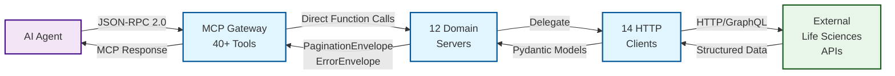

# Repository Architecture Documentation

## Executive Summary

The **Life Sciences MCP** is a production-grade microservices gateway that enables AI agents to query 12+ operational biological databases through the Model Context Protocol (MCP). Built on FastMCP and httpx, it implements a rigorous **Fuzzy-to-Fact protocol** to prevent hallucination: agents first perform fuzzy search to get ranked candidates, then use strict lookup with validated CURIEs (Compact URIs) to fetch complete records with cross-references.

The architecture solves a critical problem in AI-driven drug discovery: converting unstructured biological terms ("p53 tumor suppressor") into structured, validated entities with bidirectional cross-references across 13+ databases. This enables agents to triangulate entity identity, verify relationships, and construct reliable knowledge graphs for high-stakes decision-making. The system has processed 500+ integration tests and is deployed on FastMCP Cloud at `https://lifesciences.fastmcp.app/mcp`.

Key architectural decisions include:
- **1:1 server-client mapping** for independent testing and evolution
- **Canonical envelopes** (PaginationEnvelope, ErrorEnvelope) for schema determinism
- **22-key cross-reference registry** enabling entity triangulation
- **Gateway composition pattern** with zero-overhead direct function calls
- **Progressive disclosure** (slim/full modes) for token budget optimization

The codebase spans 13,756 lines of production Python (8,162 client layer, 3,403 model layer, 2,191 server layer) with comprehensive validation, rate limiting, and error recovery built into every component.

## Quick Start Guide

### Using This Documentation

**If you are an architect:** Start with [02_architecture_diagrams.md](diagrams/02_architecture_diagrams.md) for progressive disclosure diagrams (conceptual → logical → physical layers) showing system context, component relationships, and deployment topology.

**If you are a developer:** Start with [04_api_reference.md](docs/04_api_reference.md) for complete API documentation including client methods, MCP tools, request/response schemas, and working code examples.

**If you are new to the codebase:** Start with [01_component_inventory.md](docs/01_component_inventory.md) for a comprehensive inventory of all 14 clients, 63+ models, 13 servers, and 40+ MCP tools with line-level source references.

**If you are troubleshooting:** Start with [03_data_flows.md](docs/03_data_flows.md) for sequence diagrams showing request/response lifecycles, error propagation chains, rate limiting behavior, and pagination mechanics.

### Key Concepts

**Fuzzy-to-Fact Protocol**
A two-phase resolution pattern enforced across all 12 servers:
1. **Phase 1 (Fuzzy)**: Search operations accept natural language queries and return ranked candidates with relevance scores (0.0-1.0). Example: `search_genes("p53")` returns `[{id: "HGNC:11998", symbol: "TP53", score: 1.0}]`
2. **Phase 2 (Fact)**: Strict lookup operations require validated CURIEs and return complete entities with cross-references. Example: `get_gene("HGNC:11998")` returns full Gene model with UniProt/Ensembl/Entrez links

This architectural constraint makes it structurally impossible for agents to bypass entity resolution, preventing hallucinated mappings between biological entities.

**Cross-Reference Registry**
A 22-key standardized schema (hgnc, uniprot, ensembl_gene, entrez, chembl, pdb, omim, etc.) enabling entity triangulation. When an agent fetches a gene from HGNC, the response includes `cross_references.uniprot: ["P04637"]`. Fetching that protein from UniProt returns `cross_references.hgnc: "HGNC:11998"`, enabling bidirectional validation. See [CrossReferences model](docs/01_component_inventory.md#cross-references) for full 22-key registry.

**MCP (Model Context Protocol)**
Anthropic's standardized protocol for exposing tools to AI agents over JSON-RPC 2.0. Our FastMCP-based servers expose 40+ tools (e.g., `hgnc_search_genes`, `uniprot_get_protein`) with auto-generated JSON Schema validation from Pydantic type hints. Agents call tools with named parameters; servers return PaginationEnvelope or ErrorEnvelope.

**Gateway Composition Pattern**
The gateway server (116 lines) composes 12 independent domain servers using FastMCP's mounting feature with `as_proxy=False` for direct Python function calls (zero network overhead). Each tool is prefixed by domain (e.g., `hgnc_search_genes`, `chembl_get_compound`) to prevent name collisions. See [gateway.py:52-109](docs/01_component_inventory.md#gateway-server-unified-access) for mounting configuration.

**Canonical Envelopes**
All responses use standardized wrappers:
- `PaginationEnvelope[T]` wraps list results with cursor-based pagination metadata (total_count, page_size, next cursor)
- `ErrorEnvelope` wraps all errors with standardized error codes (UNRESOLVED_ENTITY, ENTITY_NOT_FOUND, RATE_LIMITED, etc.) and actionable recovery hints ("Call search_genes to resolve the identifier first")

These envelopes enable reliable agent reasoning by providing schema determinism across all 40+ tools.

## Architecture at a Glance

### System Context



The Life Sciences MCP sits between AI agents (Claude, GPT-4, etc.) and 12 operational biological databases, implementing a gateway pattern that:

1. **Accepts** JSON-RPC 2.0 requests from MCP clients (Claude Desktop, custom agents)
2. **Routes** tool calls to domain-specific servers based on prefix (`hgnc_`, `uniprot_`, `chembl_`)
3. **Delegates** to async HTTP clients with rate limiting, connection pooling, exponential backoff
4. **Validates** responses using Pydantic models with CURIE format checking and cross-reference validation
5. **Returns** standardized envelopes (PaginationEnvelope or ErrorEnvelope) to agent

The system integrates with: HGNC (gene nomenclature), UniProt (protein sequences), ChEMBL (bioactivity), Open Targets (disease associations), STRING/BioGRID (interactions), Ensembl/Entrez (genomics), PubChem/IUPHAR (chemistry), WikiPathways (pathways), ClinicalTrials.gov (trials).

### Key Design Decisions

**1. Why microservices pattern?**
Each biological database has unique API characteristics (REST vs GraphQL, synchronous vs async, different rate limits). The 1:1 server-client pattern enables independent evolution: when HGNC changes their API, only `clients/hgnc.py` and `servers/hgnc.py` need updates. The gateway composes all operational servers for cloud deployment while each server remains independently testable.

**2. Why 1:1 server-client mapping?**
Separation of concerns: servers expose MCP tools and handle protocol concerns (JSON-RPC, error wrapping), clients handle HTTP logic and API-specific quirks (rate limiting, pagination, SDK wrapping). This enables testing HTTP clients in isolation without MCP overhead and reusing clients in non-MCP contexts (batch scripts, notebooks).

**3. Why canonical envelopes?**
Schema determinism enables reliable agent reasoning. All search operations return `PaginationEnvelope[SearchCandidate]` with identical structure regardless of source database. All errors use `ErrorEnvelope` with standardized error codes and recovery hints. This prevents agents from needing database-specific error handling logic.

**4. Why cross-reference registry?**
Entity triangulation for validation. When an agent queries TP53 from three databases (HGNC, UniProt, Ensembl), the cross-references should bidirectionally link. If HGNC says `uniprot: ["P04637"]` but UniProt says `hgnc: "HGNC:999"` (mismatch), the agent can detect data quality issues. The 22-key standardized registry makes cross-database validation systematic.

**5. Why Fuzzy-to-Fact protocol?**
Hallucination prevention. If strict lookup tools accepted raw strings, agents could pass "BRCA1 breast cancer gene" directly to `get_gene()`, leading to ambiguous resolution. By enforcing CURIE validation (regex `^HGNC:\d+$`), strict tools return `UNRESOLVED_ENTITY` error on raw strings, forcing agents to use fuzzy search first. This architectural constraint makes hallucination structurally impossible.

**6. Why gateway composition?**
Single deployment artifact. Running 12 separate MCP servers would require clients to manage 12 different connections. The gateway composes all servers into one unified interface with prefixed tool names (`hgnc_search_genes` vs `uniprot_search_proteins`). Using `as_proxy=False` enables direct Python function calls between gateway and domain servers (zero network overhead).

**7. Why progressive disclosure (slim/full modes)?**
Token budget optimization for multi-hop reasoning. Search operations in slim mode return ~20 tokens/entity (id, symbol, name, score). Full mode returns ~300 tokens with complete metadata and cross-references. Agents can review 50 candidates in slim mode (~1K tokens), select top match, fetch full record (~300 tokens) - total 1.3K tokens vs 15K if all 50 were full records.

### Technology Stack

| Layer | Technology | Purpose |
|-------|------------|---------|
| **MCP Protocol** | FastMCP 0.2.0 | MCP server framework with auto-schema generation |
| **HTTP Client** | httpx 0.27.0 (async) | Async HTTP with connection pooling (10 concurrent) |
| **Data Validation** | Pydantic 2.0+ | Runtime validation, CURIE format checking, serialization |
| **External SDK** | chembl_webresource_client 0.10.8 | ChEMBL Web Services SDK (wrapped with run_in_executor) |
| **Rate Limiting** | asyncio.Lock + time.time() | Per-client rate limiting with thundering herd prevention |
| **Deployment** | FastMCP Cloud | Production endpoint: https://lifesciences.fastmcp.app/mcp |
| **Testing** | pytest + pytest-asyncio | 500+ integration/unit tests with VCR.py for fixtures |
| **Package Management** | uv (Astral) | Fast Python package installer and environment manager |

## Component Overview

### By Category

**Servers (13 total):**
- **Gateway Server** (116 lines) - Unified composition of 12 domain servers
- **Gene Servers** (3): HGNC (86 lines), Ensembl (180 lines), Entrez (160 lines)
- **Protein Servers** (3): UniProt (100 lines), STRING (150 lines), BioGRID (100 lines)
- **Compound Servers** (4): ChEMBL (130 lines), PubChem (150 lines), IUPHAR (400 lines), DrugBank (100 lines)
- **Clinical/Pathway Servers** (3): WikiPathways (180 lines), ClinicalTrials (300 lines), Open Targets (130 lines)

All servers follow identical pattern: define `mcp = FastMCP("Server Name")`, expose tools via `@mcp.tool` decorator, lazy-initialize singleton client on first use. See [Component Inventory - Servers](docs/01_component_inventory.md#server-package-lifesciences_mcpservers).

**Clients (14 total, 8,162 lines):**
- **Base Client** (66 lines) - LifeSciencesClient with httpx.AsyncClient pooling
- **Domain Clients** (13): Each extends base client, implements rate limiting, CURIE validation, cross-reference mapping
- Key clients: HGNCClient (353 lines), UniProtClient (400+ lines), ChEMBLClient (680 lines), OpenTargetsClient (730 lines)

All clients support async context managers for cleanup, implement retry logic with exponential backoff, wrap responses in canonical envelopes. See [Component Inventory - Clients](docs/01_component_inventory.md#client-package-lifesciences_mcpclients).

**Models (63+ classes, 3,403 lines):**
- **Envelopes** (2): PaginationEnvelope[T], ErrorEnvelope with 6 standard error codes
- **Domain Models** (18 modules): Gene, Protein, Compound, Drug, Ligand, Target, Interaction, Pathway, Trial, etc.
- **Cross-References** (1): 22-key registry model shared across all entity types
- **Search Candidates** (11): Lightweight models for fuzzy search results (~20 tokens each)

All models use Pydantic BaseModel with field validators for CURIE format checking, omit-if-null serialization pattern (exclude_none=True), regex patterns defined in ADR-001 Appendix A. See [Component Inventory - Models](docs/01_component_inventory.md#model-package-lifesciences_mcpmodels).

**MCP Tools (40+ total):**
- **Gene Tools** (8): Search and lookup across HGNC, Ensembl, Entrez + PubMed linking
- **Protein Tools** (5): UniProt search/lookup, STRING/BioGRID interaction networks
- **Compound Tools** (9): ChEMBL, PubChem, IUPHAR, DrugBank with batch operations
- **Target-Disease Tools** (3): Open Targets search, target details, associations
- **Pathway Tools** (4): WikiPathways search, lookup, gene reverse-lookup, component extraction
- **Clinical Trial Tools** (3): ClinicalTrials.gov search, trial details, locations

See [MCP Tools Reference](docs/04_api_reference.md#mcp-tools-reference) for complete tool inventory with parameters and return types.

### Key Metrics

| Metric | Value | Notes |
|--------|-------|-------|
| **Lines of Code** | 13,756 | Excludes tests, analysis framework, .venv |
| **Client Layer** | 8,162 lines | 14 async HTTP clients with rate limiting |
| **Model Layer** | 3,403 lines | 63+ Pydantic models with validation |
| **Server Layer** | 2,191 lines | 13 FastMCP servers with 40+ tools |
| **External APIs** | 12 operational | HGNC, UniProt, ChEMBL, OpenTargets, STRING, BioGRID, Ensembl, Entrez, PubChem, IUPHAR, WikiPathways, ClinicalTrials |
| **MCP Tools** | 40+ | All follow Fuzzy-to-Fact protocol |
| **Test Coverage** | 500+ tests | Integration, unit, performance, competency validation |
| **Test Files** | 44 total | 20 unit, 19 integration, 1 gap, 4 manual |
| **Rate Limits** | 1-30 req/s | Database-specific (HGNC=10, Ensembl=15, DrugBank=30) |
| **Max Connections** | 10 per client | httpx.AsyncClient connection pool |
| **Error Codes** | 6 standard | UNRESOLVED_ENTITY, ENTITY_NOT_FOUND, AMBIGUOUS_QUERY, RATE_LIMITED, UPSTREAM_ERROR, INVALID_CROSS_REFERENCE |
| **Cross-Reference Keys** | 22 total | Agentic Biolink registry (hgnc, uniprot, ensembl, entrez, chembl, pdb, omim, etc.) |
| **CURIE Patterns** | 15+ validated | Regex patterns for HGNC, UniProt, ChEMBL, Ensembl, Entrez, etc. |
| **Pagination Strategy** | Cursor-based | Opaque base64-encoded cursors for stateless pagination |

## Data Flow Patterns

### Primary Flows

The system implements five fundamental data flow patterns documented with sequence diagrams in [03_data_flows.md](docs/03_data_flows.md):

**1. Simple Query Flow (Fuzzy-to-Fact Protocol)**
Agent searches gene "BRCA1" → fuzzy search returns candidates with scores → agent selects HGNC:1100 → strict lookup returns Gene with cross-references. Key feature: CURIE validation prevents invalid inputs from reaching strict lookup tools. See [Simple Query Flow](docs/03_data_flows.md#1-simple-query-flow).

**2. Interactive Session Flow (Cross-Reference Triangulation)**
Agent starts with gene TP53 → extracts UniProt ID from cross-references → fetches protein → extracts ChEMBL ID → fetches compound with drug indications. Demonstrates multi-hop reasoning using 22-key registry. See [Interactive Session Flow](docs/03_data_flows.md#2-interactive-client-session-flow).

**3. Tool Permission Flow (MCP Discovery)**
MCP client connects → sends initialize() → gateway returns capabilities with 40+ tools → client requests tools/list → gateway returns JSON Schema for each tool → client validates arguments before sending tools/call. See [Tool Permission Flow](docs/03_data_flows.md#3-tool-permission-callback-flow).

**4. MCP Server Communication (Gateway Composition)**
Gateway imports 12 server modules → mounts each with prefix and tool_names mapping → client sends tools/call to `hgnc_search_genes` → FastMCP routes to HGNC server → direct Python function call (no network overhead) → returns PaginationEnvelope. See [MCP Server Communication](docs/03_data_flows.md#4-mcp-server-communication-flow).

**5. Message Parsing Flow (Pydantic Validation)**
Client builds JSON-RPC request → FastMCP parses method="tools/call" → extracts arguments and validates against function signature using Pydantic → calls handler with validated kwargs → handler returns Pydantic model → serialized with exclude_none=True → wrapped in MCP response. See [Message Parsing Flow](docs/03_data_flows.md#5-message-parsing-and-routing).

### Cross-Cutting Concerns

**Error Handling**
All errors wrapped in ErrorEnvelope with standardized codes and recovery hints. Example: passing "BRCA1" to `get_gene()` returns `UNRESOLVED_ENTITY` with hint "Call search_genes to resolve the identifier first." Rate limit errors (429) trigger exponential backoff (3 retries, 2^attempt delay). See [Error Handling Flow](docs/03_data_flows.md#error-handling-flow).

**Pagination**
Cursor-based pagination with two strategies: (1) Client-side slicing for APIs without pagination (HGNC, ChEMBL) using base64-encoded offset cursors, (2) Server-side cursors for APIs with native pagination (UniProt). cursor=null signals end of results. See [Pagination Flow](docs/03_data_flows.md#pagination-flow).

**Cross-References**
Every entity model includes CrossReferences object with 22-key registry. Cross-reference extraction happens in client layer using `_build_cross_references()` or `_map_cross_references()` methods that normalize database-specific formats to CURIE format. Omit-if-null pattern ensures only present keys are serialized. See [Cross-Reference Resolution Flow](docs/03_data_flows.md#cross-reference-resolution-flow).

## API Surface

### Public API

The package exports a clean public API through `src/lifesciences_mcp/__init__.py`:

```python
from lifesciences_mcp import (
    # Clients (10 main)
    HGNCClient, UniProtClient, ChEMBLClient, OpenTargetsClient,
    PubChemClient, IUPHARClient, WikiPathwaysClient,
    ClinicalTrialsClient, DrugBankClient, LifeSciencesClient,

    # Models
    Gene, SearchCandidate, CrossReferences,
    Protein, ProteinSearchCandidate,
    Compound, CompoundSearchCandidate,
    PubChemCompound, PubChemSearchCandidate,
    Ligand, LigandSearchCandidate,
    PharmacologicalTarget, PharmacologicalTargetSearchCandidate,

    # Envelopes
    PaginationEnvelope, ErrorEnvelope
)
```

See [Public API Documentation](docs/01_component_inventory.md#public-api) for complete export list and usage examples.

### MCP Tools by Domain

| Domain | Tool Count | Example Tools | Example Use Case |
|--------|------------|---------------|------------------|
| **Genes** | 8 | hgnc_search_genes, hgnc_get_gene, entrez_get_pubmed_links | Look up gene symbols, resolve aliases, find literature |
| **Proteins** | 5 | uniprot_search_proteins, uniprot_get_protein, string_get_interactions | Find proteins, retrieve sequences, analyze interaction networks |
| **Compounds** | 9 | chembl_search_compounds, chembl_get_compound, chembl_get_compounds_batch | Search bioactive compounds, fetch drug data, batch lookups |
| **Drugs** | 6 | drugbank_search_drugs, iuphar_search_ligands, iuphar_get_target | Find approved drugs, pharmacological targets, receptor interactions |
| **Target-Disease** | 3 | opentargets_search_targets, opentargets_get_associations | Identify disease-associated genes, find therapeutic targets |
| **Interactions** | 5 | string_get_interactions, biogrid_get_interactions, string_get_network_image_url | Build protein networks, find genetic interactions, visualize |
| **Pathways** | 4 | wikipathways_search_pathways, wikipathways_get_pathway_components | Find biological pathways, extract pathway genes, analyze signaling |
| **Clinical Trials** | 3 | clinicaltrials_search_trials, clinicaltrials_get_trial | Discover trials by disease/drug, review protocols, find sites |

See [MCP Tools Reference](docs/04_api_reference.md#mcp-tools-reference) for complete tool inventory with parameters, return types, and examples.

## Getting Started

### Installation

```bash
# Clone repository
git clone https://github.com/graphiti-org/lifesciences-research.git
cd lifesciences-research

# Install with uv (recommended)
uv pip install -e .

# Or with pip
pip install -e .

# Optional: Set API keys for BioGRID, DrugBank
export BIOGRID_API_KEY=your_biogrid_key_here
export DRUGBANK_API_KEY=your_drugbank_key_here  # Commercial license required
```

### Basic Usage

**Example 1: Python Client Library (Direct Usage)**

```python
import asyncio
from lifesciences_mcp import HGNCClient, UniProtClient

async def main():
    # Phase 1: Fuzzy search
    async with HGNCClient() as hgnc:
        search_result = await hgnc.search_genes("BRCA1", page_size=5)

        # Handle errors
        if hasattr(search_result, 'error'):
            print(f"Error: {search_result.error.recovery_hint}")
            return

        # Review candidates
        print("Search Results:")
        for candidate in search_result.items:
            print(f"  {candidate.id}: {candidate.symbol} (score={candidate.score})")

        # Phase 2: Strict lookup
        gene_id = search_result.items[0].id  # HGNC:1100
        gene = await hgnc.get_gene(gene_id)

        print(f"\nGene: {gene.symbol}")
        print(f"Location: {gene.location}")
        print(f"UniProt IDs: {gene.cross_references.uniprot}")

    # Phase 3: Navigate via cross-references
    async with UniProtClient() as uniprot:
        uniprot_id = gene.cross_references.uniprot[0]
        protein = await uniprot.get_protein(f"UniProtKB:{uniprot_id}")

        print(f"\nProtein: {protein.name}")
        print(f"Function: {protein.function[:200]}...")

asyncio.run(main())
```

**Example 2: MCP Server Deployment (Gateway)**

```bash
# Run gateway server locally
uv run fastmcp run src/lifesciences_mcp/servers/gateway.py

# Server will expose 40+ tools at stdio transport
# Connect with MCP client (Claude Desktop, custom agent)
```

**Example 3: Individual Server Deployment**

```bash
# Run individual HGNC server
uv run fastmcp run src/lifesciences_mcp/servers/hgnc.py

# Or UniProt server
uv run fastmcp run src/lifesciences_mcp/servers/uniprot.py
```

### Common Patterns

**Pattern 1: Entity Resolution (Fuzzy-to-Fact)**

```python
async with HGNCClient() as client:
    # Search with natural language
    results = await client.search_genes("p53 tumor suppressor")

    # Select top candidate
    if results.items:
        gene_id = results.items[0].id  # HGNC:11998

        # Fetch complete record
        gene = await client.get_gene(gene_id)
        print(f"Resolved: {gene.symbol} ({gene.name})")
```

**Pattern 2: Cross-Database Navigation**

```python
# Start with gene, navigate to protein, then compounds
async with HGNCClient() as hgnc, UniProtClient() as uniprot, ChEMBLClient() as chembl:
    gene = await hgnc.get_gene("HGNC:11998")  # TP53
    uniprot_id = gene.cross_references.uniprot[0]

    protein = await uniprot.get_protein(f"UniProtKB:{uniprot_id}")
    chembl_id = protein.cross_references.chembl

    compound = await chembl.get_compound(chembl_id)
    print(f"Found drug: {compound['name']}")
```

**Pattern 3: Batch Operations**

```python
async with ChEMBLClient() as client:
    # Fetch 100 compounds in single API call
    compounds = await client.get_compounds_batch([
        "CHEMBL:25", "CHEMBL:939", "CHEMBL:521686", ...
    ], slim=True)

    for compound in compounds:
        print(f"{compound['id']}: {compound['name']}")
```

**Pattern 4: Error Recovery**

```python
async with HGNCClient() as client:
    result = await client.get_gene("BRCA1")  # Invalid CURIE

    if hasattr(result, 'error'):
        if result.error.code == "UNRESOLVED_ENTITY":
            # Recovery: Use fuzzy search
            search = await client.search_genes(result.error.invalid_input)
            gene = await client.get_gene(search.items[0].id)
```

See [API Reference - Usage Patterns](docs/04_api_reference.md#usage-patterns) for 6 complete patterns with explanations.

## Documentation Index

### Detailed Documents

| Document | Description | Best For | Line Count |
|----------|-------------|----------|------------|
| [01_component_inventory.md](docs/01_component_inventory.md) | Complete inventory of 14 clients, 63+ models, 13 servers with source line references | Understanding what exists, finding specific components | 1,403 lines |
| [02_architecture_diagrams.md](diagrams/02_architecture_diagrams.md) | Progressive disclosure diagrams (conceptual → logical → physical) with narratives | Visual understanding, onboarding architects, system context | 619 lines |
| [03_data_flows.md](docs/03_data_flows.md) | Sequence diagrams for 5 core flows + cross-cutting concerns (error handling, pagination, cross-refs) | Understanding how data moves, troubleshooting issues, protocol details | 1,250 lines |
| [04_api_reference.md](docs/04_api_reference.md) | Complete API documentation with client methods, MCP tools, models, examples | Implementation details, integration guide, quick reference | 2,070 lines |

### Quick Links

**Public API:**
- [Client Classes](docs/04_api_reference.md#client-classes) - HGNCClient, UniProtClient, ChEMBLClient, etc.
- [Model Classes](docs/04_api_reference.md#model-classes) - Gene, Protein, Compound, Trial, Pathway
- [Envelope Models](docs/04_api_reference.md#envelope-models) - PaginationEnvelope, ErrorEnvelope

**MCP Tools:**
- [Gene Tools](docs/04_api_reference.md#gene-tools) - 8 tools across HGNC, Ensembl, Entrez
- [Protein Tools](docs/04_api_reference.md#protein-tools) - 5 tools for UniProt, STRING, BioGRID
- [Compound Tools](docs/04_api_reference.md#compound-tools) - 9 tools across ChEMBL, PubChem, IUPHAR, DrugBank
- [Clinical Trial Tools](docs/04_api_reference.md#clinical-trial-tools) - 3 tools for ClinicalTrials.gov

**Architecture:**
- [Conceptual Layer](diagrams/02_architecture_diagrams.md#layer-1-conceptual-architecture) - System context and Fuzzy-to-Fact protocol
- [Logical Layer](diagrams/02_architecture_diagrams.md#layer-2-logical-architecture) - Component types and patterns
- [Physical Layer](diagrams/02_architecture_diagrams.md#layer-3-physical-architecture) - File structure and dependencies

**Data Flows:**
- [Simple Query Flow](docs/03_data_flows.md#1-simple-query-flow) - Basic Fuzzy-to-Fact sequence
- [Cross-Reference Navigation](docs/03_data_flows.md#2-interactive-client-session-flow) - Multi-database triangulation
- [Error Handling](docs/03_data_flows.md#error-handling-flow) - 6 error codes with recovery hints
- [Pagination](docs/03_data_flows.md#pagination-flow) - Cursor-based pagination mechanics

**Component Inventory:**
- [Public API Exports](docs/01_component_inventory.md#public-api) - Package-level imports
- [Client Layer](docs/01_component_inventory.md#client-package-lifesciences_mcpclients) - 14 clients with rate limiting
- [Model Layer](docs/01_component_inventory.md#model-package-lifesciences_mcpmodels) - 63+ Pydantic models
- [Server Layer](docs/01_component_inventory.md#server-package-lifesciences_mcpservers) - 13 FastMCP servers

## Key Insights

### Architectural Strengths

**1. Hallucination Prevention through Protocol Enforcement**
The Fuzzy-to-Fact protocol is enforced at the type system level: strict lookup methods accept `str` parameters but validate with regex patterns (e.g., `^HGNC:\d+$`). Invalid CURIEs trigger `UNRESOLVED_ENTITY` error before any API call, making it structurally impossible for agents to bypass entity resolution. This is superior to documentation-based guidance which can be ignored.

**2. Entity Triangulation via Cross-Reference Registry**
The 22-key standardized registry enables systematic validation across databases. When an agent queries TP53 from three sources, it can verify that HGNC's `cross_references.uniprot` matches UniProt's `cross_references.hgnc`, detecting data quality issues automatically. This transforms cross-references from passive metadata into active validation mechanisms.

**3. Zero-Overhead Gateway Composition**
The gateway's use of `as_proxy=False` enables direct Python function calls between gateway and domain servers (no HTTP serialization/deserialization). This provides the benefits of microservices architecture (independent testing, evolution) without the performance penalty of network communication. 40+ tools exposed through single endpoint with no latency overhead.

**4. Schema Determinism for Agent Reliability**
All 40+ tools use two response types: `PaginationEnvelope[T]` for lists, `ErrorEnvelope` for errors. Agents can write a single error handling routine that works across all databases, rather than learning 12 different error schemas. This dramatically simplifies agent logic and reduces token usage for system prompts.

**5. Progressive Disclosure for Token Budget Optimization**
The slim/full mode pattern enables agents to review many candidates efficiently: 50 search results in slim mode = ~1K tokens vs ~15K in full mode (93% reduction). Agents can implement broad search → narrow selection → detailed fetch workflows without context overflow, critical for multi-hop reasoning.

### Design Patterns Used

**Gateway/Facade Pattern**
Gateway server composes 12 domain servers into unified interface. See [gateway.py:52-109](docs/01_component_inventory.md#gateway-server-unified-access).

**Repository Pattern**
Each client acts as repository for its domain (HGNCClient = gene repository, UniProtClient = protein repository) with standard search/get interface. See [Client Layer](docs/01_component_inventory.md#client-package-lifesciences_mcpclients).

**Envelope/Result Pattern**
All operations return `Result<PaginationEnvelope<T>, ErrorEnvelope>` discriminated union. Agents check `hasattr(result, 'error')` to branch. See [Envelope Models](docs/04_api_reference.md#envelope-models).

**Factory Method Pattern**
ErrorEnvelope provides static factory methods for each error code (`ErrorEnvelope.unresolved_entity()`, `ErrorEnvelope.rate_limited()`). See [ErrorEnvelope](docs/04_api_reference.md#errorenvelope).

**Singleton Pattern**
Each server module maintains singleton client instance (`_client = None` at module level) initialized on first tool call. Enables connection pooling across multiple tool invocations. See [Server Layer](docs/01_component_inventory.md#server-package-lifesciences_mcpservers).

**Strategy Pattern**
Rate limiting strategy varies by client: HGNC uses 100ms delay with exponential backoff, UniProt uses lock-based limiting with thundering herd prevention. Each client implements `_rate_limited_get()` with database-specific strategy. See [Rate Limiting Strategy](docs/01_component_inventory.md#architecture-patterns).

**Template Method Pattern**
Base client defines HTTP lifecycle (connection pooling, timeouts, cleanup), subclasses override rate limiting and cross-reference mapping. See [LifeSciencesClient](docs/04_api_reference.md#lifesciencesclient).

**Adapter Pattern**
ChEMBLClient wraps synchronous `chembl_webresource_client` SDK with async interface using `asyncio.run_in_executor()`. See [ChEMBL SDK Wrapping](docs/03_data_flows.md#2-interactive-client-session-flow).

### Performance Considerations

**Rate Limiting Calibration**
Each client implements database-specific rate limits based on API documentation: HGNC (10 req/s), Ensembl (15 req/s), WikiPathways (1 req/s conservative), DrugBank (30 req/s commercial tier). All implement exponential backoff on 429 errors (3 retries, 2^attempt delay). See [Rate Limiting Strategy](docs/01_component_inventory.md#architecture-patterns).

**Connection Pooling**
Base client configures httpx.AsyncClient with `max_connections=10` per client instance. Since each server uses singleton client, this enables efficient connection reuse across multiple tool calls. Total max connections = 10 × 14 clients = 140 concurrent.

**Client-Side Pagination**
HGNC and ChEMBL don't support server-side pagination, so clients fetch all results and slice client-side. Cursors encode offset as base64 JSON for stateless pagination. Trade-off: higher latency on first page, but enables total_count and consistent pagination API. See [Pagination Flow](docs/03_data_flows.md#pagination-flow).

**Batch Operations**
ChEMBL provides `get_compounds_batch()` accepting up to 100 CURIEs in single API call. Prevents thread pool exhaustion from sequential lookups and reduces total latency (1 API call vs 100). Returns results in same order as input with individual error handling. See [Batch Operations](docs/04_api_reference.md#chemblclient).

**Token Budget Optimization**
Slim mode reduces response size by 80-95% by returning only id/name/score fields. Example: Gene model in full mode = ~300 tokens, SearchCandidate in slim mode = ~20 tokens (93% reduction). Critical for multi-hop workflows to avoid context overflow. See [Token Budgets](docs/04_api_reference.md#performance-benchmarks).

**Lazy Initialization**
Servers use lazy client initialization (singleton created on first tool call) to avoid allocating resources for unused servers. Gateway server imports all 12 server modules but clients only instantiate when tools are actually called.

**Thundering Herd Prevention**
UniProtClient rate limiting uses double-check pattern: acquire lock, re-check time elapsed since last request (another thread may have made request while waiting for lock), then enforce 100ms delay. Prevents multiple threads from bursting requests after lock release. See [Rate Limiting](docs/03_data_flows.md#1-simple-query-flow).

## Appendix

### Glossary

| Term | Definition |
|------|------------|
| **CURIE** | Compact URI - standardized identifier format with prefix and local ID (e.g., `HGNC:1100`, `UniProtKB:P04637`) |
| **Fuzzy-to-Fact** | Two-phase resolution protocol: (1) fuzzy search returns ranked candidates, (2) strict lookup requires validated CURIE |
| **Cross-Reference** | External database identifier stored in standardized 22-key registry enabling entity triangulation |
| **Envelope** | Standardized response wrapper (PaginationEnvelope for lists, ErrorEnvelope for errors) providing schema determinism |
| **Slim Mode** | Response mode returning minimal fields (id, name, score) for token efficiency (~20 tokens vs ~300 in full mode) |
| **MCP** | Model Context Protocol - Anthropic's standard for exposing tools to AI agents via JSON-RPC 2.0 |
| **FastMCP** | Python framework for building MCP servers with auto-schema generation from Pydantic types |
| **Agentic Biolink** | 22-key cross-reference schema standardizing identifiers across biological databases |
| **HGNC** | HUGO Gene Nomenclature Committee - authoritative source for human gene symbols and nomenclature |
| **UniProt** | Universal Protein Resource - comprehensive protein sequence and annotation database |
| **ChEMBL** | Manually curated database of bioactive drug-like small molecules with binding, functional, ADMET data |
| **Open Targets** | Platform integrating target-disease evidence from genetics, genomics, transcriptomics, drugs, animal models, literature |
| **STRING** | Protein-Protein Interaction Networks database with confidence scores from experimental, database, textmining evidence |
| **BioGRID** | Biological General Repository for Interaction Datasets - genetic and protein interactions |
| **Ensembl** | Genome browser with gene annotations, variants, regulatory features, comparative genomics |
| **Entrez** | NCBI's integrated search system across PubMed, Gene, Protein, Nucleotide, Structure databases |
| **PubChem** | Open chemistry database from NIH with compound structures, properties, bioactivities |
| **IUPHAR/GtoPdb** | Guide to Pharmacology - expert-curated pharmacological interactions between ligands and targets |
| **WikiPathways** | Open collaborative pathway database with GPML (Graphical Pathway Markup Language) format |
| **ClinicalTrials.gov** | NIH registry of clinical trials worldwide with protocols, eligibility, outcomes, locations |
| **DrugBank** | Comprehensive drug database combining chemical, pharmacological, pharmaceutical data (commercial license) |
| **Rate Limiting** | Throttling HTTP requests to respect API limits (e.g., 10 req/s for HGNC) with exponential backoff on 429 errors |
| **Connection Pooling** | Reusing HTTP connections across multiple requests (httpx.AsyncClient with max_connections=10) |
| **Pagination** | Breaking large result sets into pages using opaque cursors (base64-encoded offset or API-provided cursor) |
| **Exponential Backoff** | Retry strategy with exponentially increasing delays (2^attempt seconds) for transient errors |
| **Thundering Herd** | Problem where multiple threads burst requests simultaneously after waiting on lock (prevented via time re-check) |
| **Triangulation** | Validating entity identity by verifying cross-references are bidirectional across multiple databases |
| **OMIM** | Online Mendelian Inheritance in Man - catalog of human genes and genetic phenotypes |
| **Ensembl Gene ID** | Format: ENSG + 11 digits (e.g., ENSG00000012048) |
| **Ensembl Transcript ID** | Format: ENST + 11 digits (e.g., ENST00000357654) |
| **RefSeq** | NCBI Reference Sequence database with format [NX][MR]_NNNNN (e.g., NM_007294) |
| **PDB** | Protein Data Bank - structural biology database with 3D protein structures |
| **SMILES** | Simplified Molecular Input Line Entry System - line notation for chemical structures |
| **InChI** | International Chemical Identifier - textual identifier for chemical substances |

### External Resources

**Integrated APIs Documentation:**
- [HGNC REST API](https://www.genenames.org/help/rest/) - Gene nomenclature and symbol resolution
- [UniProt REST API](https://www.uniprot.org/help/api) - Protein sequences and annotations
- [ChEMBL Web Services](https://www.ebi.ac.uk/chembl/ws) - Bioactivity data and drug-like molecules
- [Open Targets Platform API](https://platform-docs.opentargets.org/data-access/graphql-api) - Target-disease associations
- [STRING API](https://string-db.org/help/api/) - Protein-protein interaction networks
- [BioGRID API](https://wiki.thebiogrid.org/doku.php/biogridrest) - Genetic and protein interactions
- [Ensembl REST API](https://rest.ensembl.org/) - Genomic annotations and variants
- [NCBI E-utilities](https://www.ncbi.nlm.nih.gov/books/NBK25501/) - Entrez programming utilities
- [PubChem PUG REST](https://pubchem.ncbi.nlm.nih.gov/docs/pug-rest) - Chemical compound data
- [IUPHAR/GtoPdb API](https://www.guidetopharmacology.org/webServices.jsp) - Pharmacological data
- [WikiPathways API](https://www.wikipathways.org/api/api.php) - Pathway data and GPML
- [ClinicalTrials.gov API v2](https://clinicaltrials.gov/api/gui) - Clinical trial data

**Framework Documentation:**
- [FastMCP Documentation](https://github.com/jlowin/fastmcp) - MCP server framework
- [Pydantic Documentation](https://docs.pydantic.dev/) - Data validation and settings
- [httpx Documentation](https://www.python-httpx.org/) - Async HTTP client
- [Model Context Protocol Specification](https://modelcontextprotocol.io/) - MCP protocol spec

**Project Documentation:**
- [ADR-001: Agentic Biolink Architecture](../docs/adr/accepted/adr-001-v1.2.md) - Architecture decision record
- [Constitution v1.1.0](../docs/CONSTITUTION.md) - Design principles and constraints
- [Project README](../README.md) - Setup, deployment, contribution guide

---

**Generated:** 2026-01-05
**Documentation Version:** 1.0.0
**Covers:** lifesciences-research (commit 8356f3a)
**Source Files:** 13,756 lines of production code (client: 8,162, model: 3,403, server: 2,191)
**Test Coverage:** 500+ integration and unit tests
**Deployment:** FastMCP Cloud at https://lifesciences.fastmcp.app/mcp
