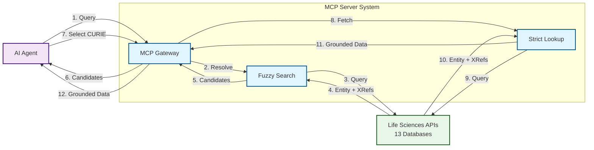
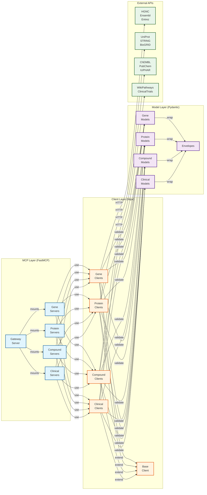
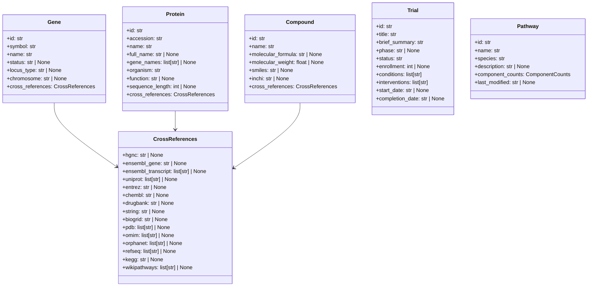
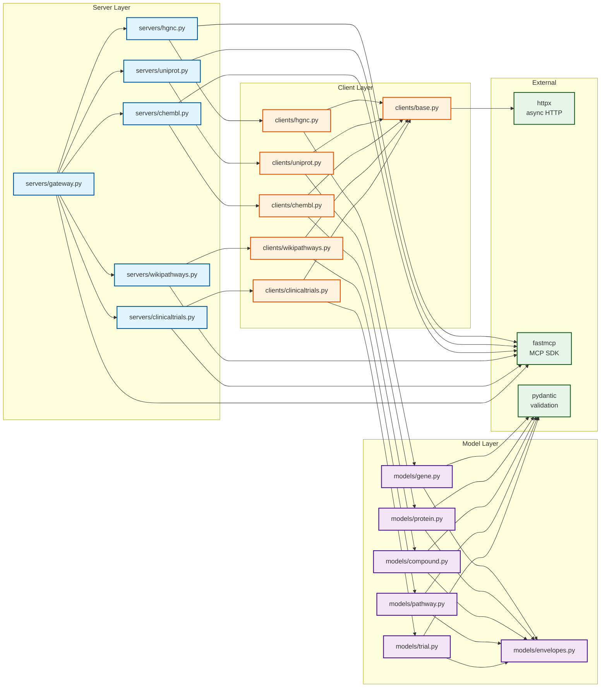
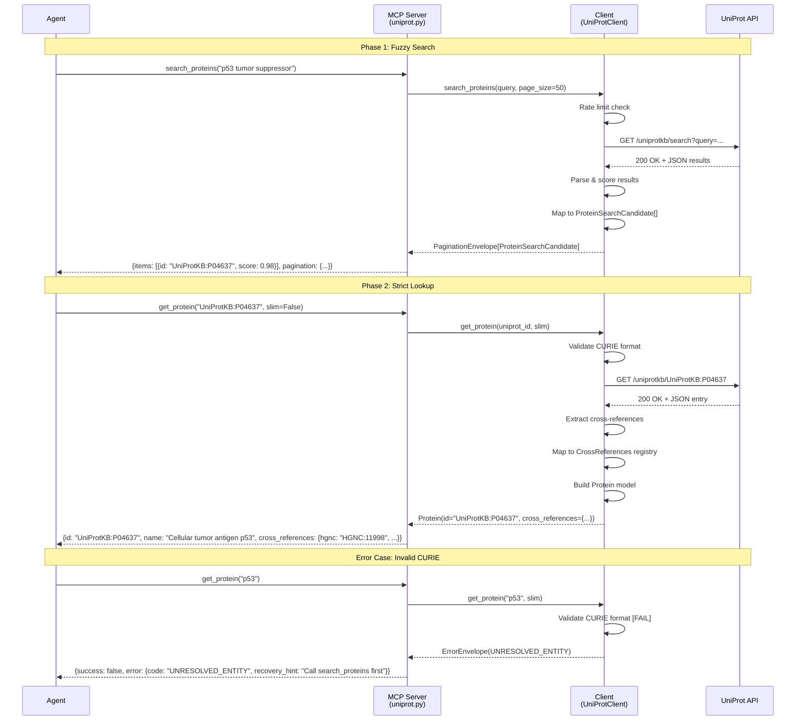

# Architecture Diagrams

## Progressive Disclosure Architecture

This document presents three complementary views of the Life Sciences MCP architecture, progressing from high-level concepts to implementation details:

1. **Conceptual Layer** (5-10 nodes): System context and key protocols - what the system does
2. **Logical Layer** (15-25 nodes): Component types and architectural patterns - how the system is organized
3. **Physical Layer** (30-50 nodes): Concrete implementations and detailed dependencies - where everything lives

Each layer tells a different story to a different audience.

---

# Layer 1: Conceptual Architecture

## System Context: AI-Driven Drug Discovery Platform

**What you're looking at:** A microservices-based life sciences API gateway that enables AI agents to query biological databases through the Model Context Protocol (MCP), implementing a "Fuzzy-to-Fact" resolution pattern for reliable entity grounding.

### Diagram

### Narrative

The Life Sciences MCP is a unified gateway to 12 operational biological databases (HGNC, UniProt, ChEMBL, Open Targets, STRING, BioGRID, IUPHAR, PubChem, Ensembl, Entrez, WikiPathways, ClinicalTrials.gov). Its value proposition is enabling AI agents to convert unstructured biological terms into structured, cross-referenced entities for reliable knowledge graph construction.

The system implements a **Fuzzy-to-Fact protocol** to prevent hallucination: agents first perform fuzzy search to get ranked candidates, then use strict lookup with resolved CURIEs (e.g., `UniProtKB:P04637`) to fetch complete records. All responses include cross-references to related databases (22-key registry), enabling triangulation across sources - a critical requirement for validating high-stakes drug discovery assertions.

The protocol enforces two-phase resolution: Phase 1 (fuzzy) accepts natural language and returns candidates with relevance scores; Phase 2 (strict) accepts only validated CURIEs and returns Agentic Biolink entities with full cross-references. This architectural constraint makes it impossible for agents to accidentally hallucinate mappings between biological entities.

---

# Layer 2: Logical Architecture

## Component Architecture: Microservices with Shared Patterns

**What you're looking at:** A layered architecture separating MCP servers (tool interfaces), API clients (HTTP logic), and Pydantic models (data contracts), with a unified gateway composing 12 domain-specific servers.

### Diagram

### Narrative

The architecture follows a **microservices pattern** where each biological database has a dedicated server (13 total, with DrugBank requiring commercial API key). The Gateway Server composes all operational servers (12) into a unified interface for deployment, using FastMCP's mounting feature with prefixed tool names (e.g., `hgnc_search_genes`, `uniprot_get_protein`).

**Key Design Decisions:**

- **1:1 Server-Client Pattern**: Each server has a corresponding client implementing database-specific logic. This separation enables independent testing and evolution of API integration code.

- **Shared Base Client**: All clients extend `LifeSciencesClient`, which provides async httpx session management, connection pooling (10 concurrent connections), and common HTTP error handling. This prevents code duplication across 14 client implementations.

- **Canonical Envelopes**: All responses use standard wrappers - `PaginationEnvelope` for lists with cursor-based pagination, `ErrorEnvelope` for failures with recovery hints. This schema determinism enables reliable agent reasoning.

- **Cross-Reference Registry**: All entity models include a `CrossReferences` object with 22 standardized keys (hgnc, uniprot, chembl, etc.), enabling triangulation across databases. The "omit-if-null" pattern minimizes token usage for sparse entities.

- **Token Budgeting**: All tools support `slim=True` mode, returning only id/name/score (~20 tokens) vs full records (~115-300 tokens). This is critical for multi-hop reasoning to prevent context flooding.

The client layer implements **async-first HTTP** with rate limiting, exponential backoff, and thundering herd prevention. Each client enforces the Fuzzy-to-Fact protocol: search methods accept natural language, get methods require validated CURIEs and return UNRESOLVED_ENTITY errors for raw strings.

---

# Layer 3: Physical Architecture

## Component Relationships (Detailed)

**What you're looking at:** The concrete file structure organized by domain (Genes, Proteins, Compounds, Clinical Trials), showing 1:1 mappings between servers in `src/lifesciences_mcp/servers/` and clients in `src/lifesciences_mcp/clients/`, with shared models in `src/lifesciences_mcp/models/`.

### Diagram: Domain Organization

```mermaid
graph LR
    subgraph "Gene Domain"
        direction TB
        SG1[servers/<br/>hgnc.py]
        SG2[servers/<br/>ensembl.py]
        SG3[servers/<br/>entrez.py]
        CG1[clients/<br/>hgnc.py]
        CG2[clients/<br/>ensembl.py]
        CG3[clients/<br/>entrez.py]
        MG[models/<br/>gene.py]

        SG1 & SG2 & SG3 --> CG1 & CG2 & CG3
        CG1 & CG2 & CG3 --> MG
    end

    subgraph "Protein Domain"
        direction TB
        SP1[servers/<br/>uniprot.py]
        SP2[servers/<br/>string.py]
        SP3[servers/<br/>biogrid.py]
        CP1[clients/<br/>uniprot.py]
        CP2[clients/<br/>string.py]
        CP3[clients/<br/>biogrid.py]
        MP1[models/<br/>protein.py]
        MP2[models/<br/>interaction.py]

        SP1 & SP2 & SP3 --> CP1 & CP2 & CP3
        CP1 --> MP1
        CP2 & CP3 --> MP2
    end

    subgraph "Compound Domain"
        direction TB
        SC1[servers/<br/>chembl.py]
        SC2[servers/<br/>pubchem.py]
        SC3[servers/<br/>iuphar.py]
        SC4[servers/<br/>drugbank.py]
        CC1[clients/<br/>chembl.py]
        CC2[clients/<br/>pubchem.py]
        CC3[clients/<br/>iuphar.py]
        CC4[clients/<br/>drugbank.py]
        MC1[models/<br/>compound.py]
        MC2[models/<br/>drug.py]
        MC3[models/<br/>pharmacology.py]

        SC1 & SC2 & SC3 & SC4 --> CC1 & CC2 & CC3 & CC4
        CC1 --> MC1
        CC2 --> MC1
        CC3 --> MC3
        CC4 --> MC2
    end

    subgraph "Clinical/Pathway Domain"
        direction TB
        SCL1[servers/<br/>wikipathways.py]
        SCL2[servers/<br/>clinicaltrials.py]
        SCL3[servers/<br/>opentargets.py]
        CCL1[clients/<br/>wikipathways.py]
        CCL2[clients/<br/>clinicaltrials.py]
        CCL3[clients/<br/>opentargets.py]
        MCL1[models/<br/>pathway.py]
        MCL2[models/<br/>trial.py]
        MCL3[models/<br/>target.py]

        SCL1 & SCL2 & SCL3 --> CCL1 & CCL2 & CCL3
        CCL1 --> MCL1
        CCL2 --> MCL2
        CCL3 --> MCL3
    end

    subgraph "Shared Infrastructure"
        direction TB
        BaseClient[clients/<br/>base.py]
        Envelopes[models/<br/>envelopes.py]
        Gateway[servers/<br/>gateway.py]
    end

    CG1 & CG2 & CG3 & CP1 & CP2 & CP3 & CC1 & CC2 & CC3 & CC4 & CCL1 & CCL2 & CCL3 -.->|inherit| BaseClient
    MG & MP1 & MP2 & MC1 & MC2 & MC3 & MCL1 & MCL2 & MCL3 -.->|wrap| Envelopes
    SG1 & SG2 & SG3 & SP1 & SP2 & SP3 & SC1 & SC2 & SC3 & SCL1 & SCL2 & SCL3 -.->|mounted by| Gateway

    classDef server fill:#e1f5fe,stroke:#01579b,stroke-width:2px
    classDef client fill:#fff3e0,stroke:#e65100,stroke-width:2px
    classDef model fill:#f3e5f5,stroke:#4a148c,stroke-width:2px
    classDef infra fill:#e8f5e9,stroke:#1b5e20,stroke-width:2px

    class SG1,SG2,SG3,SP1,SP2,SP3,SC1,SC2,SC3,SC4,SCL1,SCL2,SCL3,Gateway server
    class CG1,CG2,CG3,CP1,CP2,CP3,CC1,CC2,CC3,CC4,CCL1,CCL2,CCL3,BaseClient client
    class MG,MP1,MP2,MC1,MC2,MC3,MCL1,MCL2,MCL3,Envelopes model
```

### Narrative: Domain Organization

The codebase is organized into four biological domains, each representing a layer in the drug discovery stack:

**Gene Domain** (Gene nomenclature and genomics): HGNC provides authoritative gene symbols and aliases, Ensembl offers genomic annotations (transcripts, exons, variants), and Entrez connects to NCBI's gene database with PubMed links. All share the `Gene` model with a unified `CrossReferences` object.

**Protein Domain** (Protein function and interactions): UniProt serves as the protein sequence/function authority, STRING provides protein-protein interaction networks with confidence scores, and BioGRID offers genetic and physical interactions. The `Protein` model extends gene cross-references with protein-specific fields (sequence_length, function), while `Interaction` models capture network data.

**Compound Domain** (Drugs and chemical compounds): ChEMBL aggregates bioactivity data (15M+ data points), PubChem provides chemical structures and cross-references, IUPHAR specializes in pharmacological targets and ligand-receptor interactions, and DrugBank (commercial) offers drug interactions. Models separate by granularity: `Compound` for chemical entities, `Drug` for approved therapeutics, `Pharmacology` for target interactions.

**Clinical/Pathway Domain** (Biological context): WikiPathways models signaling and metabolic pathways with component graphs, ClinicalTrials.gov provides trial protocols and enrollment data, and Open Targets integrates target-disease associations. This domain connects molecular entities to clinical outcomes.

**Shared Infrastructure**: The `LifeSciencesClient` base class (`clients/base.py`) implements async httpx session management with connection pooling and timeouts. All responses wrap in `PaginationEnvelope` or `ErrorEnvelope` (`models/envelopes.py`). The Gateway Server (`servers/gateway.py`) mounts all operational servers with prefixed tool names.

The 1:1 server-client pattern ensures each server (`servers/*.py`) has a dedicated client (`clients/*.py`) implementing database-specific API logic. This separation enables:
- Independent testing of HTTP clients without MCP overhead
- Parallel development of new integrations
- Reuse of clients in non-MCP contexts (e.g., batch processing scripts)

## Class Hierarchies

### Base Client Inheritance

```mermaid
classDiagram
    class LifeSciencesClient {
        +base_url: str
        +timeout: float
        +max_connections: int
        +_client: httpx.AsyncClient
        +_get_client() httpx.AsyncClient
        +close() None
        +_get(path, **kwargs) httpx.Response
    }

    class HGNCClient {
        +HGNC_BASE_URL: str
        +search_genes(query, page_size, cursor) PaginationEnvelope
        +get_gene(hgnc_id) Gene | ErrorEnvelope
    }

    class UniProtClient {
        +UNIPROT_BASE_URL: str
        +_last_request_time: float
        +_lock: asyncio.Lock
        +_rate_limited_get(path, **kwargs) httpx.Response
        +search_proteins(query, slim, cursor, page_size) PaginationEnvelope
        +get_protein(uniprot_id, slim) Protein | ErrorEnvelope
        +_map_cross_references(refs) CrossReferences
    }

    class ChEMBLClient {
        +CHEMBL_BASE_URL: str
        +search_compounds(query, page_size, cursor) PaginationEnvelope
        +get_compound(chembl_id) Compound | ErrorEnvelope
        +get_compounds_batch(chembl_ids, slim) list~Compound~
    }

    class PubChemClient {
        +PUBCHEM_BASE_URL: str
        +search_compounds(query, page_size) PaginationEnvelope
        +get_compound(cid, slim) PubChemCompound | ErrorEnvelope
        +get_compound_synonyms(cid) list~str~
    }

    class WikiPathwaysClient {
        +WIKIPATHWAYS_BASE_URL: str
        +search_pathways(query, species) PaginationEnvelope
        +get_pathway(pathway_id) Pathway | ErrorEnvelope
        +get_pathways_for_gene(gene_symbol, species) PaginationEnvelope
        +get_pathway_components(pathway_id) PathwayComponents
    }

    class ClinicalTrialsClient {
        +CLINICALTRIALS_BASE_URL: str
        +search_trials(query, condition, phase, status) PaginationEnvelope
        +get_trial(nct_id) Trial | ErrorEnvelope
        +get_trial_locations(nct_id) list~TrialLocation~
    }

    LifeSciencesClient <|-- HGNCClient
    LifeSciencesClient <|-- UniProtClient
    LifeSciencesClient <|-- ChEMBLClient
    LifeSciencesClient <|-- PubChemClient
    LifeSciencesClient <|-- WikiPathwaysClient
    LifeSciencesClient <|-- ClinicalTrialsClient
```

### Narrative: Inheritance Benefits

The `LifeSciencesClient` base class provides shared async HTTP infrastructure, eliminating code duplication across 14 client implementations. Each subclass adds:

- **Domain-specific constants**: Base URLs, rate limits, API-specific defaults
- **Custom rate limiting**: UniProtClient implements sophisticated exponential backoff with thundering herd prevention
- **Cross-reference mapping**: UniProtClient maps UniProt's database references to the 22-key registry
- **Batch operations**: ChEMBLClient provides bulk fetching to prevent thread pool exhaustion

All clients follow the Fuzzy-to-Fact protocol: `search_*` methods return `PaginationEnvelope[SearchCandidate]`, `get_*` methods require CURIEs and return domain entities or `ErrorEnvelope`.

## Model Data Flow

### Entity Models with Cross-References

### Narrative: Cross-Reference Pattern

All core entity models (Gene, Protein, Compound) include a `CrossReferences` object with 22 standardized keys, following the registry defined in ADR-001 v1.2. This enables triangulation: agents can verify a ChEMBL target ID appears in the corresponding UniProt entry's cross-references, preventing hallucinated mappings.

The "omit-if-null" pattern minimizes token usage - entities with sparse cross-references (e.g., newly discovered proteins) only serialize present fields. Well-connected entities like TP53 may have 15+ cross-references, consuming ~200 tokens in full mode vs ~20 tokens in slim mode.

Models use Pydantic field validators to enforce CURIE format constraints (e.g., `^UniProtKB:[A-Z][A-Z0-9]{5,9}$` for UniProt IDs), catching malformed identifiers at the data layer rather than propagating errors to agents.

## Module Dependencies

**What you're looking at:** The import relationships showing how servers depend on clients, clients depend on base infrastructure and models, and all models share the canonical envelope definitions.

### Core Dependencies

### Narrative: Dependency Management

The dependency graph shows a clean layered architecture with no circular dependencies:

**Server to Client**: Each server imports only its corresponding client. The Gateway Server imports all operational server modules and mounts them with prefixed tool names. Servers are thin wrappers converting MCP tool calls to client method invocations.

**Client to Base**: All clients inherit from `LifeSciencesClient` in `clients/base.py`, which encapsulates httpx session management. Clients import only the models they need - HGNCClient imports `Gene` and `SearchCandidate`, UniProtClient imports `Protein` and `ProteinSearchCandidate`, etc.

**Model to Envelopes**: All search candidate and entity models import from `models/envelopes.py` to access `PaginationEnvelope`, `ErrorEnvelope`, and `ErrorCode`. The envelope module is the single source of truth for response wrapping, preventing schema fragmentation.

**External Dependencies**: The base client depends on `httpx` for async HTTP, servers depend on `fastmcp` for MCP tooling, and all models depend on `pydantic` for validation. These are the only external production dependencies (excluding development tools like pytest).

The import hierarchy ensures changes to infrastructure (base client, envelopes) don't cascade to servers, and changes to specific models only affect their corresponding client. This modularity enabled parallel development of 12 servers with minimal coordination overhead.

## Data Flow: Request-Response Lifecycle

### Fuzzy-to-Fact Protocol Sequence

### Narrative: Two-Phase Resolution

The Fuzzy-to-Fact protocol enforces a strict separation between discovery (Phase 1) and execution (Phase 2):

**Phase 1 (Fuzzy Discovery)**: When an agent searches for "p53 tumor suppressor", the server calls the client's `search_proteins` method, which queries the UniProt API with fuzzy matching. The client:
1. Enforces rate limiting (100ms between requests) using an async lock
2. Parses API results and normalizes scores to 0.0-1.0 range
3. Maps raw JSON to `ProteinSearchCandidate` models (id, name, organism, score)
4. Wraps candidates in `PaginationEnvelope` with cursor for pagination

The agent receives ranked candidates and selects the top match based on score and context.

**Phase 2 (Strict Lookup)**: When the agent calls `get_protein("UniProtKB:P04637")`, the client:
1. Validates CURIE format using regex `^UniProtKB:[A-Z][A-Z0-9]{5,9}$`
2. Fetches the complete protein record from UniProt
3. Extracts cross-references and maps them to the 22-key registry (hgnc, ensembl, pdb, etc.)
4. Constructs a `Protein` model with all metadata and cross-references
5. Returns to the agent with ~115-300 tokens (or ~20 tokens in slim mode)

**Error Handling**: If the agent tries to pass a raw string ("p53") to the strict lookup tool, the CURIE validator fails immediately, returning `ErrorEnvelope` with code `UNRESOLVED_ENTITY` and recovery hint "Call search_proteins first". This prevents hallucinated mappings by forcing the agent to use the two-phase protocol.

The pattern repeats across all 12 servers - search tools accept natural language and return candidates, get tools require CURIEs and return grounded entities. This architectural constraint makes it structurally impossible for agents to bypass entity resolution.

---

## Summary

This three-layer progressive disclosure architecture provides:

**Layer 1 (Conceptual)**: The "what" - a Fuzzy-to-Fact protocol enabling AI agents to convert biological terms into structured, cross-referenced entities.

**Layer 2 (Logical)**: The "how" - a microservices architecture with 1:1 server-client separation, canonical envelopes for schema determinism, and token budgeting for multi-hop reasoning.

**Layer 3 (Physical)**: The "where" - domain-organized file structure (Genes, Proteins, Compounds, Clinical) with shared base infrastructure, 22-key cross-reference registry, and clean dependency graph enabling parallel development.

The architecture supports the drug discovery stack from genes (HGNC, Ensembl, Entrez) through proteins (UniProt, STRING, BioGRID) and compounds (ChEMBL, PubChem, IUPHAR) to clinical context (WikiPathways, ClinicalTrials.gov, Open Targets), with 500+ passing tests and 12 operational servers.

---

## File Path Reference

**Main Project Code:**
- **Servers**: `src/lifesciences_mcp/servers/`
  - Gateway: `gateway.py` (line 1-116)
  - Gene servers: `hgnc.py`, `ensembl.py`, `entrez.py`
  - Protein servers: `uniprot.py`, `string.py`, `biogrid.py`
  - Compound servers: `chembl.py`, `pubchem.py`, `iuphar.py`, `drugbank.py`
  - Clinical servers: `wikipathways.py`, `clinicaltrials.py`, `opentargets.py`

- **Clients**: `src/lifesciences_mcp/clients/`
  - Base: `base.py` (line 1-66)
  - 13 domain clients matching servers (e.g., `uniprot.py` line 1-150+)

- **Models**: `src/lifesciences_mcp/models/`
  - Envelopes: `envelopes.py` (line 1-145)
  - Domain models: `gene.py`, `protein.py` (line 1-92), `compound.py`, `drug.py`, `trial.py` (line 1-80+), `pathway.py`, `target.py`, `interaction.py`, `pharmacology.py`

- **Documentation**:
  - Architecture specification: `docs/adr/accepted/adr-001-v1.2.md` (line 1-150+)
  - Project overview: `README.md` (line 1-513)
