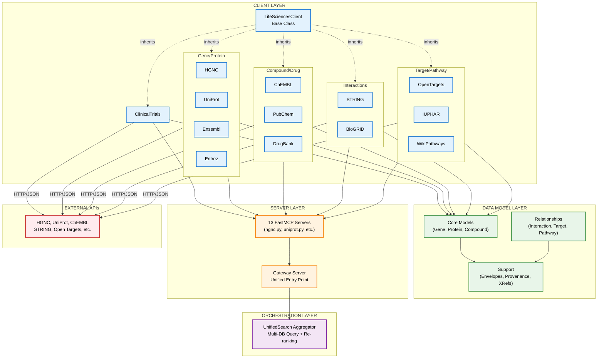
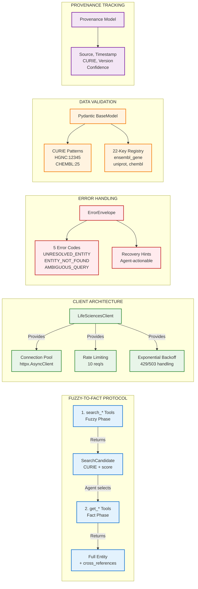
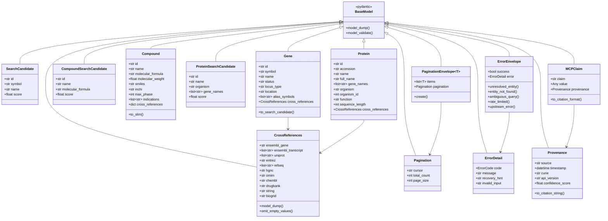
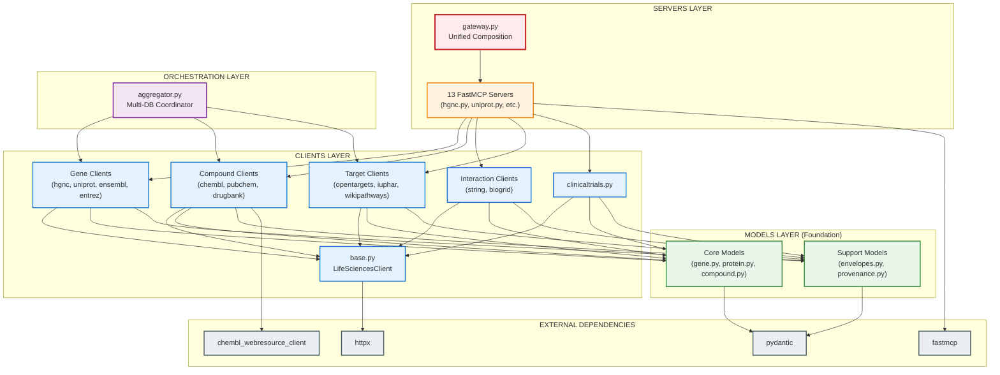
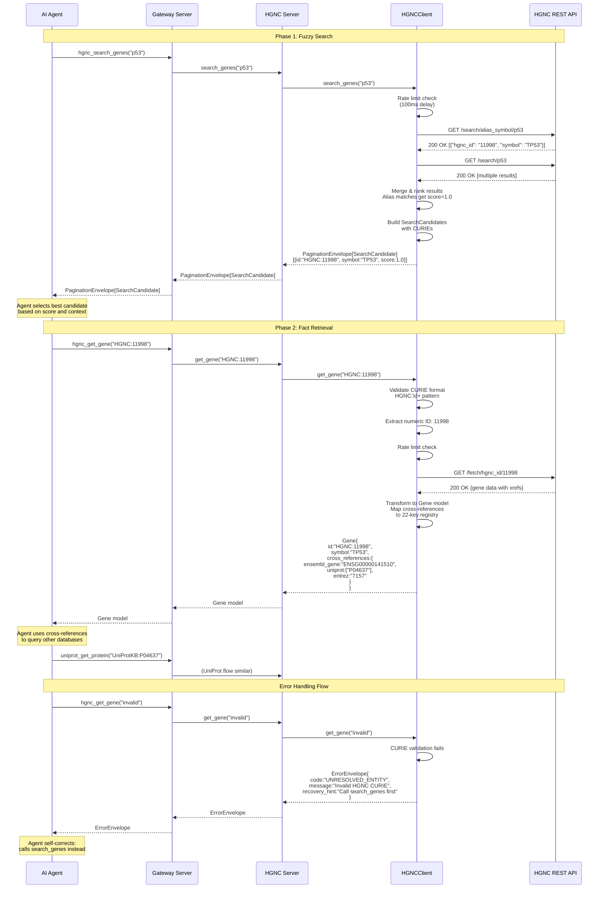
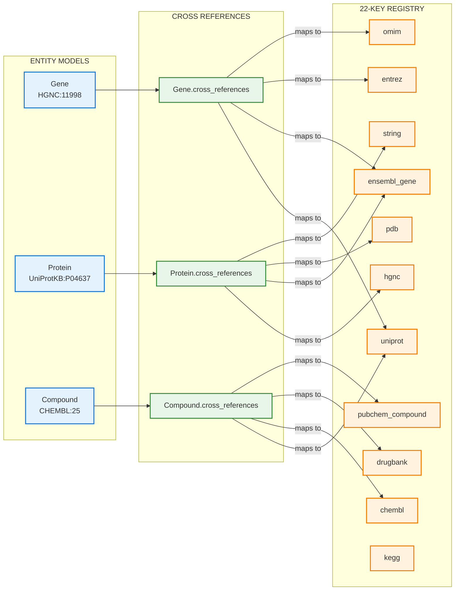
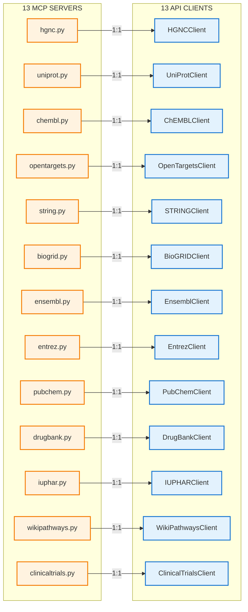

# Architecture Diagrams

## System Architecture



### System Architecture Explanation

The Life Sciences Research codebase follows a **4-layer architecture** implementing the Model Context Protocol (MCP):

1. **Client Layer** - 13 specialized API clients that inherit from `LifeSciencesClient` base class
   - All clients provide async HTTP operations with connection pooling
   - Implement rate limiting (10 req/s) with exponential backoff
   - Follow the "Fuzzy-to-Fact" protocol (search → get pattern)

2. **Data Model Layer** - Pydantic models organized by domain
   - Core entity models (Gene, Protein, Compound, Drug, etc.)
   - Relationship models (Interaction, Target, Pathway, Trial)
   - Support models (PaginationEnvelope, ErrorEnvelope, Provenance, CrossReferences)
   - All models enforce CURIE validation and the 22-key cross-reference registry

3. **Server Layer** - FastMCP servers exposing tools for each API
   - Each server provides 2-4 MCP tools (search, get, batch operations)
   - Gateway server composes all 13 servers into a unified endpoint
   - Tools return either PaginationEnvelope<T> or ErrorEnvelope

4. **Orchestration Layer** - Experimental aggregator for multi-database queries
   - UnifiedSearch aggregator coordinates HGNC, UniProt, and Open Targets
   - Implements result re-ranking and entity resolution

---

## Component Relationships



### Component Relationships Explanation

**Fuzzy-to-Fact Protocol**:
- All APIs implement a two-phase discovery pattern
- Phase 1: `search_*` tools return lightweight `SearchCandidate` objects with CURIEs and relevance scores
- Phase 2: Agent selects best candidate, calls `get_*` with validated CURIE to retrieve full entity
- This prevents hallucination by forcing CURIE resolution before fact retrieval

**Client Architecture**:
- Base class `LifeSciencesClient` provides shared infrastructure:
  - Async HTTP client with connection pooling (httpx.AsyncClient)
  - Rate limiting with lock-based throttling (10 requests/second)
  - Exponential backoff for 429/503 errors with thundering herd prevention
- 13 specialized clients inherit base functionality and add:
  - API-specific response transformation
  - CURIE format validation (regex patterns)
  - Cross-reference mapping to 22-key registry

**Error Handling**:
- Canonical `ErrorEnvelope` with 5 standard error codes
- Each error includes agent-actionable recovery hints
- Enables self-correcting agent behavior

**Data Validation**:
- All models use Pydantic for runtime validation
- CURIE patterns enforce identifier format consistency
- 22-key cross-reference registry enables cross-database linking
- Omit-if-null pattern (exclude_none=True) reduces token usage

**Provenance Tracking**:
- Optional provenance metadata for data lineage
- Tracks source tool, timestamp, CURIE, API version, and confidence
- Enables reproducibility and citation generation

---

## Class Hierarchies

### Data Model Class Hierarchy



### Data Model Class Hierarchy Explanation

The data model layer uses **Pydantic BaseModel** for all entities, providing:
- Runtime type validation
- JSON serialization/deserialization
- Field constraints and validators

**Entity Model Pattern** (Gene, Protein, Compound, Drug, etc.):
- Full entity models contain complete data with cross-references
- SearchCandidate variants provide lightweight representations (~20 tokens)
- All entities have a `id` field containing a validated CURIE
- Cross-references use the shared `CrossReferences` model with 22-key registry

**Envelope Pattern**:
- `PaginationEnvelope<T>` wraps all list/search results with cursor-based pagination
- `ErrorEnvelope` provides canonical error responses with recovery hints
- Generic typing enables type-safe results (e.g., `PaginationEnvelope[SearchCandidate]`)

**Provenance Models**:
- Optional metadata for data lineage tracking
- `Provenance` records source, timestamp, CURIE, API version, and confidence
- `MCPClaim` combines claims with provenance for citation-ready outputs

---

### Client Class Hierarchy

```mermaid
classDiagram
    class LifeSciencesClient {
        <<abstract>>
        +str base_url
        +AsyncClient _client
        +float _timeout
        +int _max_connections
        +_get_client() AsyncClient
        +close() None
        +_get(path, **kwargs) Response
    }

    class HGNCClient {
        +str HGNC_BASE_URL
        +float RATE_LIMIT_DELAY
        +int AMBIGUOUS_THRESHOLD
        +Lock _lock
        +float _last_request_time
        +_rate_limited_get(path) Response
        +search_genes(query, slim, cursor, page_size) PaginationEnvelope|ErrorEnvelope
        +get_gene(hgnc_id) Gene|ErrorEnvelope
        +_search_by_alias(query) list
        +_build_cross_references(doc) CrossReferences
        +__aenter__()
        +__aexit__()
    }

    class ChEMBLClient {
        +str CHEMBL_BASE_URL
        +int RATE_LIMIT_REQUESTS
        +ThreadPoolExecutor _executor
        +Lock _rate_lock
        +_molecule SDK
        +_drug_indication SDK
        +_rate_limited_sdk_call(func) Any
        +_sdk_call_with_backoff(func) Any
        +search_compounds(query, slim, cursor, page_size) PaginationEnvelope|ErrorEnvelope
        +get_compound(chembl_id, slim) dict|ErrorEnvelope
        +get_compounds_batch(chembl_ids, slim) list|ErrorEnvelope
        +_validate_chembl_curie(id) str|ErrorEnvelope
        +_transform_to_compound(result, slim) Compound
        +_build_cross_references(result) dict
    }

    class UniProtClient {
        +str UNIPROT_BASE_URL
        +float RATE_LIMIT_DELAY
        +int MAX_PAGE_SIZE
        +Lock _lock
        +float _last_request_time
        +_rate_limited_get(path, **kwargs) Response
        +search_proteins(query, organism, slim, cursor, page_size) PaginationEnvelope|ErrorEnvelope
        +get_protein(uniprot_id, slim) Protein|ErrorEnvelope
        +_build_cross_references(entry) CrossReferences
        +__aenter__()
        +__aexit__()
    }

    class STRINGClient {
        +str STRING_BASE_URL
        +float RATE_LIMIT_DELAY
        +int DEFAULT_TAXON_ID
        +Lock _lock
        +_rate_limited_get(path, **kwargs) Response
        +search_proteins(query, taxon_id, cursor, page_size) PaginationEnvelope|ErrorEnvelope
        +get_interactions(protein_id, min_score, limit) InteractionNetwork|ErrorEnvelope
        +get_network_image_url(protein_ids, network_type) str|ErrorEnvelope
    }

    class OpenTargetsClient {
        +str OPENTARGETS_BASE_URL
        +Lock _lock
        +search_targets(query, cursor, page_size) PaginationEnvelope|ErrorEnvelope
        +get_target(target_id, slim) Target|ErrorEnvelope
        +get_associations(target_id, disease_id, page_size) list|ErrorEnvelope
    }

    class BioGRIDClient {
        +str BIOGRID_BASE_URL
        +str api_key
        +Lock _lock
        +search_genes(query, organism, cursor, page_size) PaginationEnvelope|ErrorEnvelope
        +get_interactions(gene_id, organism, interaction_type) InteractionResult|ErrorEnvelope
    }

    LifeSciencesClient <|-- HGNCClient
    LifeSciencesClient <|-- ChEMBLClient
    LifeSciencesClient <|-- UniProtClient
    LifeSciencesClient <|-- STRINGClient
    LifeSciencesClient <|-- OpenTargetsClient
    LifeSciencesClient <|-- BioGRIDClient

    note for LifeSciencesClient "Provides:\n- Async HTTP client pool\n- Connection lifecycle\n- Base URL management\n- Common error handling"

    note for HGNCClient "HGNC-specific:\n- Alias boosting\n- CURIE validation\n- Cross-ref mapping\n- Context manager"

    note for ChEMBLClient "ChEMBL-specific:\n- SDK wrapper with run_in_executor\n- Batch operations\n- Thread pool management\n- Indication fetching"

    note for UniProtClient "UniProt-specific:\n- Organism filtering\n- Field selection\n- Pagination via cursor\n- Function extraction"
```



### Client Class Hierarchy Explanation

**Base Class (`LifeSciencesClient`)**:
- Provides shared infrastructure for all API clients
- Manages httpx.AsyncClient lifecycle with connection pooling
- Configurable timeout and max connections
- Base `_get()` method for HTTP GET requests

**Specialized Clients** (13 total):
Each client inherits from `LifeSciencesClient` and adds:

1. **Rate Limiting**: Lock-based throttling (typically 10 req/s)
   - `_rate_limited_get()` enforces minimum delay between requests
   - Exponential backoff for 429/503 errors
   - Thundering herd prevention (re-check timing after acquiring lock)

2. **API-Specific Methods**:
   - `search_*()` - Fuzzy search returning PaginationEnvelope[SearchCandidate]
   - `get_*()` - Strict lookup by CURIE returning full entity or ErrorEnvelope
   - Batch operations (ChEMBL, PubChem)

3. **Response Transformation**:
   - `_transform_to_*()` - Convert API responses to Pydantic models
   - `_build_cross_references()` - Map API xrefs to 22-key registry
   - CURIE validation and normalization

4. **Special Cases**:
   - **ChEMBLClient**: Wraps synchronous SDK with `run_in_executor` and ThreadPoolExecutor
   - **HGNCClient**: Implements alias boosting for common gene symbols (e.g., "p53" → "TP53")
   - **UniProtClient**: Supports organism filtering and field selection
   - **STRINGClient**: Provides network image URL generation

---

## Module Dependencies



### Module Dependencies Explanation

The codebase is organized into **3 main packages** with clear dependency layers:

**1. models Package** (Foundation Layer):
- **No external package dependencies** (only Pydantic)
- Defines all data structures used throughout the system
- `envelopes.py` provides canonical response formats (PaginationEnvelope, ErrorEnvelope)
- `provenance.py` enables data lineage tracking
- Domain-specific models (gene.py, protein.py, compound.py, etc.)
- `__init__.py` exports all models for easy importing

**2. clients Package** (API Access Layer):
- **Depends on**: models, httpx, external SDKs (chembl_webresource_client)
- `base.py` provides LifeSciencesClient base class (httpx wrapper)
- 13 specialized clients inherit from base and use models for validation
- Each client transforms API responses into Pydantic models
- Clients handle rate limiting, retries, and error mapping
- `__init__.py` exports common clients

**3. servers Package** (MCP Tool Layer):
- **Depends on**: clients, models, fastmcp
- Each server wraps a client with MCP tool decorators
- Thin translation layer: receives MCP calls → delegates to client → returns Pydantic models
- `gateway.py` composes all 13 servers into a unified endpoint using FastMCP mount()
- No business logic (just routing and client delegation)

**4. lifesciences_agent Package** (Orchestration Layer):
- **Depends on**: clients, models
- `aggregator.py` provides UnifiedSearch for multi-database queries
- Coordinates multiple clients (HGNC, UniProt, Open Targets)
- Implements result re-ranking and entity resolution

**Dependency Flow**:
```
External APIs → Clients → Models ← Servers → Gateway
                    ↓
                  Agent (Aggregator)
```

**Key Design Principles**:
1. **Models are independent** - No circular dependencies
2. **Clients depend on models** - For type safety and validation
3. **Servers depend on clients** - Thin wrapper, no duplication
4. **Gateway depends on all servers** - Single composition point
5. **Agent depends on clients** - Direct access for orchestration

---

## Data Flow



### Data Flow Explanation

The system implements a **two-phase Fuzzy-to-Fact protocol** that prevents hallucination:

**Phase 1: Fuzzy Search** (`search_*` tools)
1. Agent submits natural language query (e.g., "p53")
2. Request flows: Gateway → Server → Client → External API
3. Client performs rate-limited API call (100ms minimum delay)
4. For HGNC: alias search is performed first for boosting common symbols
5. Results are merged and ranked by relevance (alias matches get perfect score)
6. Client transforms API responses to `SearchCandidate` objects with:
   - Validated CURIE (e.g., "HGNC:11998")
   - Display name and metadata
   - Relevance score (0.0-1.0)
7. Response wrapped in `PaginationEnvelope` with cursor for pagination
8. Agent receives ranked candidates and selects best match

**Phase 2: Fact Retrieval** (`get_*` tools)
1. Agent calls `get_*` with validated CURIE from search results
2. Client validates CURIE format using regex pattern
3. Rate-limited API call fetches complete entity
4. Client transforms response to full Pydantic model:
   - Validates all fields
   - Maps cross-references to 22-key registry
   - Omits null/empty values
5. Agent receives complete entity with cross-references
6. Cross-references enable multi-database traversal

**Error Handling Flow**:
1. If agent calls `get_*` with invalid input (raw string instead of CURIE)
2. Client validation fails immediately (no API call)
3. Returns `ErrorEnvelope` with:
   - Error code: `UNRESOLVED_ENTITY`
   - Human-readable message
   - Recovery hint: "Call search_genes to resolve the identifier first"
4. Agent self-corrects by calling search tool

**Cross-Database Navigation**:
1. Agent retrieves Gene from HGNC with cross-references
2. Uses `cross_references.uniprot` to query UniProt for protein data
3. Uses `cross_references.ensembl_gene` to query Ensembl for genomic data
4. Builds complete knowledge graph across 13 databases

**Rate Limiting & Resilience**:
- All clients enforce 10 req/s limit with lock-based throttling
- Exponential backoff for 429/503 errors (1s, 2s, 4s delays)
- Thundering herd prevention: re-check timing after acquiring lock
- Connection pooling reduces overhead for repeated requests

---

## Additional Diagrams

### Cross-Reference Mapping



### Server-to-Client Mapping



---

## Summary

This Life Sciences Research codebase implements a **comprehensive MCP-based architecture** for querying 13 biological databases:

**Key Architectural Features**:
1. **4-Layer Architecture**: Models → Clients → Servers → Gateway
2. **Fuzzy-to-Fact Protocol**: Two-phase search-then-get pattern prevents hallucination
3. **Unified Gateway**: Single entry point composing 13 specialized servers
4. **22-Key Cross-Reference Registry**: Enables cross-database navigation
5. **Canonical Error Handling**: ErrorEnvelope with agent-actionable recovery hints
6. **Rate Limiting & Resilience**: 10 req/s throttling, exponential backoff, connection pooling
7. **Type Safety**: Pydantic models with CURIE validation and field constraints
8. **Provenance Tracking**: Optional metadata for data lineage and citation

**Entity Coverage**:
- Genes (HGNC, Ensembl, Entrez)
- Proteins (UniProt)
- Compounds (ChEMBL, PubChem)
- Drugs (DrugBank)
- Interactions (STRING, BioGRID)
- Targets (Open Targets, IUPHAR)
- Pathways (WikiPathways)
- Clinical Trials (ClinicalTrials.gov)

**Files by Layer**:
- **Models**: 18 files (gene.py, protein.py, compound.py, envelopes.py, etc.)
- **Clients**: 14 files (base.py + 13 specialized clients)
- **Servers**: 14 files (13 servers + gateway.py)
- **Agent**: 1 file (aggregator.py for multi-database orchestration)

The architecture emphasizes **modularity, type safety, and agent-friendly error handling** to enable robust biological entity resolution and knowledge graph construction.
