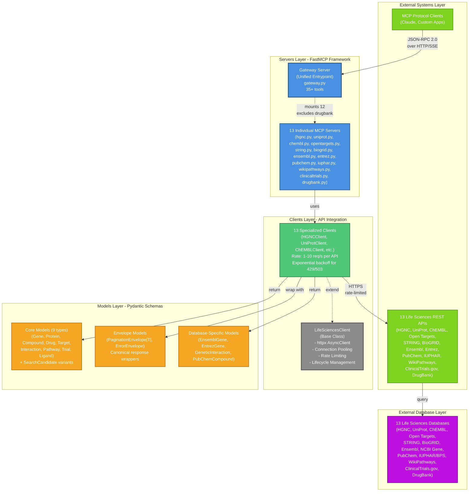
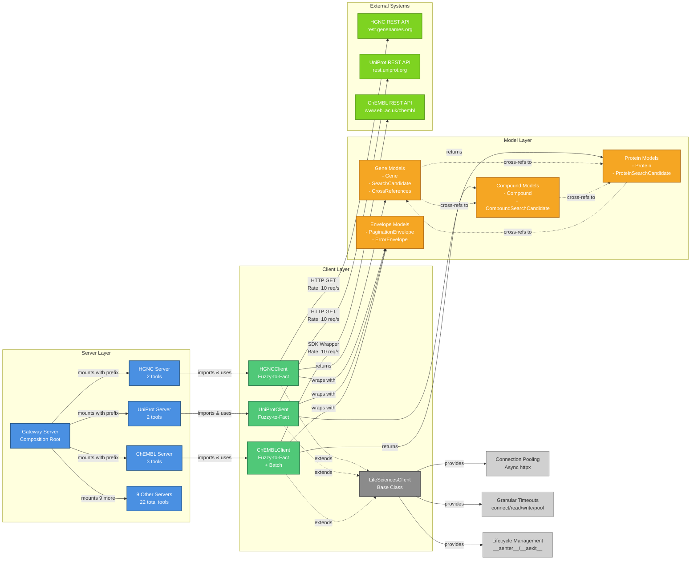

```mermaid
graph TD
    subgraph "Package Root"
        Init["__init__.py<br/>Public API Exports"]
    end

    subgraph "Servers Module (src/lifesciences_mcp/servers/)"
        Server_Init["servers/__init__.py<br/>(empty)"]
        Gateway["gateway.py<br/>Gateway Server"]
        HGNC_Server["hgnc.py<br/>HGNC Server"]
        UniProt_Server["uniprot.py<br/>UniProt Server"]
        ChEMBL_Server["chembl.py<br/>ChEMBL Server"]
        Other_Servers["10 other server files"]
    end

    subgraph "Clients Module (src/lifesciences_mcp/clients/)"
        Client_Init["clients/__init__.py<br/>Re-exports all clients"]
        Base_Client["base.py<br/>LifeSciencesClient"]
        HGNC_Client["hgnc.py<br/>HGNCClient"]
        UniProt_Client["uniprot.py<br/>UniProtClient"]
        ChEMBL_Client["chembl.py<br/>ChEMBLClient"]
        Other_Clients["10 other client files"]
    end

    subgraph "Models Module (src/lifesciences_mcp/models/)"
        Model_Init["models/__init__.py<br/>Re-exports all models"]
        Envelopes["envelopes.py<br/>ErrorEnvelope<br/>PaginationEnvelope"]
        Gene["gene.py<br/>Gene<br/>SearchCandidate<br/>CrossReferences"]
        Protein["protein.py<br/>Protein<br/>ProteinSearchCandidate"]
        Compound["compound.py<br/>Compound<br/>CompoundSearchCandidate"]
        Target["target.py<br/>Target<br/>TargetSearchCandidate"]
        Interaction["interaction.py<br/>Interaction models"]
        Pathway["pathway.py<br/>Pathway models"]
        Trial["trial.py<br/>Trial models"]
        Other_Models["6 other model files"]
    end

    subgraph "External Dependencies"
        FastMCP["fastmcp<br/>Framework"]
        Pydantic["pydantic<br/>v2"]
        Httpx["httpx<br/>Async HTTP"]
        ChEMBL_SDK["chembl_webresource_client<br/>ChEMBL SDK"]
    end

    %% Package root imports from submodules
    Init -->|imports from| Client_Init
    Init -->|imports from| Model_Init

    %% Gateway imports individual servers
    Gateway -->|from .hgnc import mcp| HGNC_Server
    Gateway -->|from .uniprot import mcp| UniProt_Server
    Gateway -->|from .chembl import mcp| ChEMBL_Server
    Gateway -->|imports 9 more| Other_Servers

    %% Servers import clients
    HGNC_Server -->|from lifesciences_mcp.clients import HGNCClient| Client_Init
    UniProt_Server -->|from lifesciences_mcp.clients import UniProtClient| Client_Init
    ChEMBL_Server -->|from lifesciences_mcp.clients import ChEMBLClient| Client_Init

    %% Servers import models
    HGNC_Server -->|from lifesciences_mcp.models import Gene, SearchCandidate| Model_Init
    UniProt_Server -->|from lifesciences_mcp.models import Protein| Model_Init
    ChEMBL_Server -->|from lifesciences_mcp.models import Compound| Model_Init

    %% Client __init__ re-exports
    Client_Init -->|imports and re-exports| Base_Client
    Client_Init -->|imports and re-exports| HGNC_Client
    Client_Init -->|imports and re-exports| UniProt_Client
    Client_Init -->|imports and re-exports| ChEMBL_Client
    Client_Init -->|imports and re-exports| Other_Clients

    %% Clients import base
    HGNC_Client -->|from .base import LifeSciencesClient| Base_Client
    UniProt_Client -->|from .base import LifeSciencesClient| Base_Client
    ChEMBL_Client -->|from .base import LifeSciencesClient| Base_Client
    Other_Clients -->|inherit from| Base_Client

    %% Clients import models
    HGNC_Client -->|from lifesciences_mcp.models import Gene| Model_Init
    UniProt_Client -->|from lifesciences_mcp.models import Protein| Model_Init
    ChEMBL_Client -->|from lifesciences_mcp.models import Compound| Model_Init

    %% Model __init__ re-exports
    Model_Init -->|imports and re-exports| Envelopes
    Model_Init -->|imports and re-exports| Gene
    Model_Init -->|imports and re-exports| Protein
    Model_Init -->|imports and re-exports| Compound
    Model_Init -->|imports and re-exports| Target
    Model_Init -->|imports and re-exports| Interaction
    Model_Init -->|imports and re-exports| Pathway
    Model_Init -->|imports and re-exports| Trial
    Model_Init -->|imports and re-exports| Other_Models

    %% Models import envelopes
    Gene -->|imports ErrorEnvelope, PaginationEnvelope| Envelopes
    Protein -->|imports CrossReferences| Gene
    Compound -->|imports ErrorEnvelope| Envelopes
    Other_Models -->|import from| Envelopes

    %% External dependencies
    Gateway -->|from fastmcp import FastMCP| FastMCP
    HGNC_Server -->|from fastmcp import FastMCP| FastMCP
    UniProt_Server -->|from fastmcp import FastMCP| FastMCP
    ChEMBL_Server -->|from fastmcp import FastMCP| FastMCP

    Base_Client -->|import httpx| Httpx
    ChEMBL_Client -->|from chembl_webresource_client| ChEMBL_SDK

    Envelopes -->|from pydantic import BaseModel| Pydantic
    Gene -->|from pydantic import BaseModel| Pydantic
    Protein -->|from pydantic import BaseModel| Pydantic
    Compound -->|from pydantic import BaseModel| Pydantic

    classDef initStyle fill:#FFD700,stroke:#B8860B,stroke-width:2px,color:#000
    classDef serverStyle fill:#4A90E2,stroke:#2E5C8A,stroke-width:2px,color:#fff
    classDef clientStyle fill:#50C878,stroke:#2E7D4E,stroke-width:2px,color:#fff
    classDef modelStyle fill:#F5A623,stroke:#B8751E,stroke-width:2px,color:#fff
    classDef externalStyle fill:#8B8B8B,stroke:#5A5A5A,stroke-width:2px,color:#fff

    class Init,Server_Init,Client_Init,Model_Init initStyle
    class Gateway,HGNC_Server,UniProt_Server,ChEMBL_Server,Other_Servers serverStyle
    class Base_Client,HGNC_Client,UniProt_Client,ChEMBL_Client,Other_Clients clientStyle
    class Envelopes,Gene,Protein,Compound,Target,Interaction,Pathway,Trial,Other_Models modelStyle
    class FastMCP,Pydantic,Httpx,ChEMBL_SDK externalStyle
```

```mermaid
sequenceDiagram
    participant Client as MCP Client<br/>(Claude, Custom App)
    participant Gateway as Gateway Server<br/>gateway.py
    participant Server as Individual Server<br/>hgnc.py
    participant APIClient as API Client<br/>HGNCClient
    participant RateLimit as Rate Limiter<br/>(Lock + Delay)
    participant External as External API<br/>rest.genenames.org
    participant DB as HGNC Database

    Note over Client,DB: Example: Fuzzy-to-Fact Protocol for Gene Resolution

    %% Phase 1: Fuzzy Search
    rect rgb(230, 240, 255)
        Note over Client,Server: Phase 1: Fuzzy Search (Discovery)

        Client->>Gateway: JSON-RPC Request<br/>tool: "hgnc_search_genes"<br/>params: {"query": "BRCA", "page_size": 10}
        activate Gateway

        Gateway->>Server: Route to hgnc_mcp.search_genes
        activate Server

        Server->>APIClient: await client.search_genes(query="BRCA", page_size=10)
        activate APIClient

        Note over APIClient: Get or create shared client instance<br/>(connection pooling)

        APIClient->>RateLimit: Check rate limit<br/>(10 req/s = 100ms delay)
        activate RateLimit

        RateLimit->>RateLimit: Acquire async lock
        RateLimit->>RateLimit: Check elapsed time since last request<br/>Sleep if needed to maintain 100ms delay

        RateLimit->>External: HTTPS GET /fetch/symbol/BRCA*
        deactivate RateLimit
        activate External

        External->>DB: Query genes table<br/>WHERE symbol LIKE 'BRCA%'
        activate DB
        DB-->>External: Return matching rows
        deactivate DB

        External-->>APIClient: HTTP 200 OK<br/>{"response": {"docs": [...]}}
        deactivate External

        Note over APIClient: Transform API response:<br/>1. Extract docs array<br/>2. Calculate position-based scores<br/>3. Check for alias matches (boost to 1.0)<br/>4. Build SearchCandidate models<br/>5. Encode cursor for pagination

        APIClient-->>Server: PaginationEnvelope[SearchCandidate]<br/>items: [<br/>  {id: "HGNC:1100", symbol: "BRCA1", score: 1.0},<br/>  {id: "HGNC:1101", symbol: "BRCA2", score: 0.95}<br/>]<br/>pagination: {cursor: "eyJvZmZzZXQi...", total: 2}
        deactivate APIClient

        Server-->>Gateway: Return PaginationEnvelope
        deactivate Server

        Gateway-->>Client: JSON-RPC Response<br/>{result: {...}}
        deactivate Gateway
    end

    Note over Client: Agent reviews candidates<br/>and selects HGNC:1100 (BRCA1)

    %% Phase 2: Strict Lookup
    rect rgb(240, 255, 240)
        Note over Client,Server: Phase 2: Strict Lookup (Fact Retrieval)

        Client->>Gateway: JSON-RPC Request<br/>tool: "hgnc_get_gene"<br/>params: {"hgnc_id": "HGNC:1100"}
        activate Gateway

        Gateway->>Server: Route to hgnc_mcp.get_gene
        activate Server

        Server->>APIClient: await client.get_gene(hgnc_id="HGNC:1100")
        activate APIClient

        Note over APIClient: Validate CURIE format:<br/>Regex: ^HGNC:\d+$

        APIClient->>RateLimit: Check rate limit
        activate RateLimit

        RateLimit->>RateLimit: Acquire lock & check timing

        RateLimit->>External: HTTPS GET /fetch/hgnc_id/HGNC:1100
        deactivate RateLimit
        activate External

        External->>DB: SELECT * FROM genes<br/>WHERE hgnc_id = 'HGNC:1100'
        activate DB
        DB-->>External: Return gene record
        deactivate DB

        External-->>APIClient: HTTP 200 OK<br/>{"response": {"docs": [{...full gene data...}]}}
        deactivate External

        Note over APIClient: Transform to Gene model:<br/>1. Extract gene fields<br/>2. Build CrossReferences from xrefs<br/>3. Map to 22-key registry<br/>4. Omit null values<br/>5. Validate CURIE formats

        APIClient-->>Server: Gene<br/>{<br/>  id: "HGNC:1100",<br/>  symbol: "BRCA1",<br/>  name: "BRCA1 DNA repair...",<br/>  status: "Approved",<br/>  location: "17q21.31",<br/>  cross_references: {<br/>    ensembl_gene: "ENSG00000012048",<br/>    uniprot: ["P38398"],<br/>    entrez: "672"<br/>  }<br/>}
        deactivate APIClient

        Server-->>Gateway: Return Gene
        deactivate Server

        Gateway-->>Client: JSON-RPC Response<br/>{result: {...}}
        deactivate Gateway
    end

    Note over Client: Agent uses cross-references<br/>to query related databases<br/>(e.g., UniProt, Ensembl)

    %% Error Scenario
    rect rgb(255, 240, 240)
        Note over Client,Server: Error Scenario: Rate Limited

        Client->>Gateway: JSON-RPC Request<br/>tool: "hgnc_search_genes"<br/>params: {"query": "TP53"}
        activate Gateway

        Gateway->>Server: Route to hgnc_mcp.search_genes
        activate Server

        Server->>APIClient: await client.search_genes(query="TP53")
        activate APIClient

        APIClient->>RateLimit: Check rate limit
        activate RateLimit

        RateLimit->>External: HTTPS GET (too fast)
        activate External

        External-->>RateLimit: HTTP 429 Too Many Requests<br/>Retry-After: 5
        deactivate External

        Note over RateLimit: Exponential backoff:<br/>1. Sleep 5 seconds (Retry-After)<br/>2. Re-acquire lock<br/>3. Re-check timing<br/>4. Retry request

        RateLimit->>External: HTTPS GET /fetch/symbol/TP53 (retry)
        activate External
        External-->>RateLimit: HTTP 200 OK
        deactivate External
        deactivate RateLimit

        APIClient-->>Server: PaginationEnvelope[SearchCandidate]
        deactivate APIClient

        Server-->>Gateway: Return result
        deactivate Server

        Gateway-->>Client: JSON-RPC Response
        deactivate Gateway
    end

    %% Validation Error
    rect rgb(255, 230, 230)
        Note over Client,Server: Error Scenario: Invalid CURIE

        Client->>Gateway: JSON-RPC Request<br/>tool: "hgnc_get_gene"<br/>params: {"hgnc_id": "BRCA1"}
        activate Gateway

        Gateway->>Server: Route to hgnc_mcp.get_gene
        activate Server

        Server->>APIClient: await client.get_gene(hgnc_id="BRCA1")
        activate APIClient

        Note over APIClient: Validation fails:<br/>CURIE pattern: ^HGNC:\d+$<br/>Input: "BRCA1" (no HGNC: prefix)

        APIClient-->>Server: ErrorEnvelope<br/>{<br/>  success: false,<br/>  error: {<br/>    code: "UNRESOLVED_ENTITY",<br/>    message: "Input 'BRCA1' is not valid HGNC CURIE",<br/>    recovery_hint: "Call search_genes to resolve first",<br/>    invalid_input: "BRCA1"<br/>  }<br/>}
        deactivate APIClient

        Server-->>Gateway: Return ErrorEnvelope
        deactivate Server

        Gateway-->>Client: JSON-RPC Response<br/>{result: {success: false, error: {...}}}
        deactivate Gateway

        Note over Client: Agent reads recovery_hint<br/>and calls search_genes instead
    end
```

# Architecture Diagrams

## Overview

This document provides comprehensive Mermaid diagrams visualizing the Life Sciences MCP architecture, showing the relationships between servers, clients, models, and external systems. The project implements a clean 5-layer architecture following the Fuzzy-to-Fact protocol for entity resolution across 13 life sciences databases.

---

## Table of Contents

1. [System Architecture](#1-system-architecture-layered-view) - 5-layer overview with external systems, servers, clients, models, and databases
2. [Component Relationships](#2-component-relationships) - Dependencies between servers, clients, and models
3. [Class Hierarchies](#3-class-hierarchies) - Client and Model inheritance structures
4. [Module Dependencies](#4-module-dependencies) - Import relationships and circular dependency prevention
5. [Server Composition](#5-server-composition-architecture) - Gateway pattern and server mounting
6. [Data Flow](#6-data-flow-architecture) - Complete request/response lifecycle with error handling
7. [Summary](#summary) - Key takeaways, metrics, and architecture principles

**Quick Start**: For high-level understanding, read [System Architecture](#1-system-architecture-layered-view) and [Summary](#summary).

**Implementation Details**: See [Class Hierarchies](#3-class-hierarchies) and [Module Dependencies](#4-module-dependencies) for code structure.

---

## Diagram Color Palette

All diagrams use consistent semantic color coding for visual clarity:

| Layer/Component | Color | Hex Code | Usage |
|----------------|-------|----------|-------|
| External Clients | Light Green | `#7ED321` | MCP clients, external applications |
| Server Layer | Blue | `#4A90E2` | FastMCP servers |
| Client Layer | Green | `#50C878` | API client implementations |
| Base Classes | Gray | `#8B8B8B` | Abstract base classes |
| Model Layer | Orange | `#F5A623` | Pydantic data models |
| Database Layer | Purple | `#BD10E0` | External databases |
| Gateway | Blue (Bold) | `#4A90E2` | Gateway server (3px stroke) |
| Utilities | Light Gray | `#D0D0D0` | Helper components |

---

## Architecture Principles

The Life Sciences MCP system follows these key architectural principles:

### 1. Fuzzy-to-Fact Protocol
Two-phase discovery pattern prevents hallucination:
- **Phase 1**: `search_*` tools return lightweight `SearchCandidate` objects with CURIEs and relevance scores
- **Phase 2**: Agent selects best candidate, calls `get_*` with validated CURIE to retrieve full entity
- **Benefit**: Forces CURIE resolution before fact retrieval, eliminating hallucinated identifiers

### 2. Clean Layering
Strict separation enforces modularity:
- **Models**: Independent, only depend on Pydantic (no client/server imports)
- **Clients**: Depend on models for type annotations, independent of servers
- **Servers**: Depend on both clients and models, thin wrappers with no business logic
- **Gateway**: Depends on servers, single composition point
- **Result**: Directed Acyclic Graph (DAG) prevents circular dependencies

### 3. Connection Pooling
Shared HTTP infrastructure improves performance:
- Base `LifeSciencesClient` provides httpx `AsyncClient` with connection pooling
- Max 10 connections per client (configurable)
- Granular timeouts: connect (5s), read (30s), write (10s), pool (5s)
- Persistent connections reduce TCP handshake overhead

### 4. Rate Limiting & Resilience
Client-side enforcement prevents upstream API throttling:
- Lock-based throttling (typically 10 req/s, varies by API)
- Exponential backoff for 429/503 errors (1s, 2s, 4s delays)
- Thundering herd prevention: re-check timing after acquiring lock
- Max 3 retry attempts with configurable backoff

### 5. Token Efficiency
Slim mode reduces LLM token usage:
- **Full mode**: ~100-300 tokens per entity (complete data with cross-references)
- **Slim mode**: ~20 tokens per entity (id, name, essential fields only)
- **Usage**: Batch operations, initial exploration, token budget constraints
- **Example**: `get_protein(uniprot_id="UniProtKB:P38398", slim=True)`

### 6. Cross-Reference Navigation
22-key registry enables multi-database traversal:
- Shared `CrossReferences` model across all entity types
- Keys: `hgnc`, `ensembl_gene`, `uniprot`, `chembl`, `drugbank`, `string`, `biogrid`, etc.
- Omit-if-null pattern: keys with no value are excluded (never `null` or empty strings)
- Enables knowledge graph construction across 13 databases

### 7. Canonical Error Handling
Standardized error responses enable agent self-correction:
- **ErrorEnvelope**: All errors wrapped in consistent format
- **5 Error Codes**: `UNRESOLVED_ENTITY`, `ENTITY_NOT_FOUND`, `AMBIGUOUS_QUERY`, `RATE_LIMITED`, `UPSTREAM_ERROR`
- **Recovery Hints**: Agent-actionable guidance (e.g., "Call search_genes to resolve identifier first")
- **No Exceptions**: Errors are data, not control flow

### 8. Type Safety
Pydantic models enforce runtime validation:
- All entities inherit from Pydantic `BaseModel`
- CURIE pattern validation (e.g., `^HGNC:\d+$`, `^UniProtKB:[A-Z][A-Z0-9]{5,9}$`)
- Field validators for enums, score bounds, cross-reference formats
- JSON serialization with `model_dump()` and `exclude_none=True`

---

## 1. System Architecture (Layered View)

### Diagram



### Explanation

The Life Sciences MCP system implements a **clean 5-layer architecture** with clear separation of concerns. For detailed architecture principles (Fuzzy-to-Fact protocol, connection pooling, rate limiting, etc.), see the [Architecture Principles](#architecture-principles) section above.

#### Layer 1: External Systems (Top)
- **MCP Protocol Clients**: Claude, custom applications, or any MCP-compatible client communicating via JSON-RPC 2.0 over HTTP/Server-Sent Events (SSE)
- **External APIs**: 13 grouped life sciences REST APIs (HGNC, UniProt, ChEMBL, Open Targets, STRING, BioGRID, Ensembl, Entrez, PubChem, IUPHAR, WikiPathways, ClinicalTrials.gov, DrugBank)

#### Layer 2: Servers Layer (FastMCP Framework)
- **Gateway Server**: Unified entrypoint composing 13 individual servers with **35+ MCP tools**, deployed to FastMCP Cloud
- **Individual MCP Servers**: Each server exposes 2-4 tools (search + get operations)
- **Tool Naming**: Prefix-based naming prevents collisions (e.g., `hgnc_search_genes`, `uniprot_search_proteins`)
- **DrugBank Exclusion**: Excluded from gateway (commercial API key required), available as standalone server

#### Layer 3: Clients Layer (API Integration)
- **Base Client**: `LifeSciencesClient` provides shared infrastructure (connection pooling, rate limiting, lifecycle management)
- **13 Specialized Clients**: Each wraps a specific API with domain-specific logic
  - Rate limiting: 1-10 req/s per API with exponential backoff for 429/503 errors
  - Special cases: ChEMBL (SDK wrapper), WikiPathways (SPARQL + REST), Open Targets (GraphQL)
  - API keys: Required for BioGRID, DrugBank; optional for Entrez (higher rate limits)

#### Layer 4: Models Layer (Pydantic Schemas)
- **Core Models**: 9 domain entity types (Gene, Protein, Compound, Drug, Target, Interaction, Pathway, Trial, Ligand)
  - Each has lightweight SearchCandidate variant (~20 tokens vs ~100-300 tokens)
- **Envelope Models**: `PaginationEnvelope[T]` and `ErrorEnvelope` for consistent responses
- **Database-Specific Models**: Extended models for unique schemas (EnsemblGene, EntrezGene, GeneticInteraction, PubChemCompound)
- **CrossReferences**: Shared 22-key registry enabling cross-database navigation
- **Validation**: All models use Pydantic v2 with CURIE pattern validation and field validators

#### Layer 5: External Database Layer (Bottom)
- **13 Life Sciences Databases**: Actual data storage accessed via their respective REST APIs
- **Data Flow**: External APIs query these databases and return results up through the stack

#### Data Flow Patterns
1. **Request Flow (Downward)**: MCP Client → Gateway → Individual Server → Client → External API → Database
2. **Response Flow (Upward)**: Database → External API → Client (with Models) → Server → Gateway → MCP Client
3. **Cross-References**: Models enable horizontal navigation across databases via 22-key registry
4. **Error Handling**: Errors at any layer are wrapped in `ErrorEnvelope` with recovery hints

#### Key Architecture Principles
- **Fuzzy-to-Fact Protocol**: All servers implement two-phase resolution (search for candidates → get by CURIE)
- **Connection Pooling**: Base client manages persistent HTTP connections for performance
- **Rate Limiting**: Client-side enforcement prevents upstream API throttling
- **Async-First**: All I/O is asynchronous (except ChEMBL SDK, which is wrapped)
- **Token Efficiency**: Slim mode support reduces token usage (~20 tokens per entity vs ~100+)
- **Omit-If-Null**: Cross-references exclude keys with no value (never null/empty strings)

---

## 2. Component Relationships

### Diagram



### Explanation

This diagram illustrates the **key component relationships and dependencies** in the Life Sciences MCP system:

#### Server Layer (Top)
- **Gateway Server**: Acts as the composition root, mounting all 13 individual servers
- **Mounting Pattern**: FastMCP's `mount()` method with prefix-based tool naming
  - Example: `mcp.mount(hgnc_mcp, prefix="hgnc", tool_names={"search_genes": "hgnc_search_genes"})`
  - Avoids name collisions (all servers have `search_*` and `get_*` tools)
- **Tool Count**: 35+ total tools across 13 servers (2-4 tools per server)

#### Client Layer (Middle)
- **One-to-One Mapping**: Each server has exactly one corresponding client class
- **Inheritance Hierarchy**: All clients extend `LifeSciencesClient` base class
- **Shared Functionality** (from base):
  - **Connection Pooling**: httpx AsyncClient with configurable max connections (default 10)
  - **Granular Timeouts**: connect (5s), read (30s), write (10s), pool (5s)
  - **Lifecycle Management**: Context manager support (`async with` pattern)
- **Client-Specific Logic**:
  - Rate limiting strategies (per API)
  - CURIE validation (per database)
  - Response transformation (API format → Pydantic models)
  - Cross-reference mapping (API fields → 22-key registry)

#### Model Layer (Lower Middle)
- **Return Types**: Clients return domain models (Gene, Protein, Compound) or ErrorEnvelope
- **Envelope Wrapping**: All list operations return `PaginationEnvelope[T]` with cursor-based pagination
- **Cross-References**: Models include `CrossReferences` field enabling cross-database navigation
  - Example: Gene.cross_references.uniprot → Query UniProtClient with this ID
- **SearchCandidate Pattern**: Lightweight variants for fuzzy search (~20 tokens vs ~100+ for full models)

#### External Systems (Bottom)
- **REST APIs**: Clients communicate with external life sciences APIs via HTTPS
- **Rate Limiting**: Clients enforce upstream API limits (1-10 req/s depending on API)
- **Protocol Diversity**:
  - Most: REST with JSON responses
  - WikiPathways: SPARQL (search) + REST (get)
  - Open Targets: GraphQL
  - ChEMBL: Official Python SDK wrapped with asyncio

#### Dependency Flow
1. **Servers depend on Clients**: Import and instantiate clients (lazy singleton pattern)
2. **Clients depend on Base**: Inherit shared HTTP and lifecycle functionality
3. **Clients depend on Models**: Import models for type annotations and return types
4. **Models depend on Envelopes**: Import `ErrorEnvelope` and `PaginationEnvelope` for responses
5. **Models cross-reference each other**: Via 22-key registry (loose coupling via IDs)

#### Key Patterns
- **Dependency Injection**: Servers create client singletons, enabling connection pooling
- **Template Method**: Base client provides HTTP infrastructure, subclasses implement business logic
- **Facade**: Clients hide complex API interactions behind simple async methods
- **Envelope Pattern**: Consistent response format across all tools (success + data OR error + hints)
- **Fuzzy-to-Fact Protocol**: Two-phase resolution (search → get) implemented by all clients

---

## 3. Class Hierarchies

### 3.1 Client Class Hierarchy

```mermaid
classDiagram
    class LifeSciencesClient {
        <<base>>
        +str base_url
        #AsyncClient _client
        #float _timeout
        #int _max_connections
        +__init__(base_url, timeout, max_connections)
        +_get_client() AsyncClient
        +close() None
        +_get(path, **kwargs) Response
    }

    class HGNCClient {
        +str HGNC_BASE_URL = "https://rest.genenames.org"
        +float RATE_LIMIT_DELAY = 0.1
        +int AMBIGUOUS_THRESHOLD = 100
        #float _last_request_time
        #Lock _lock
        +__init__()
        +__aenter__() HGNCClient
        +__aexit__() None
        +_rate_limited_get(path) Response
        +search_genes(query, slim, cursor, page_size) PaginationEnvelope~SearchCandidate~ | ErrorEnvelope
        +get_gene(hgnc_id) Gene | ErrorEnvelope
        #_build_cross_references(doc) CrossReferences
    }

    class UniProtClient {
        +str UNIPROT_BASE_URL = "https://rest.uniprot.org"
        +float RATE_LIMIT_DELAY = 0.1
        #float _last_request_time
        #Lock _lock
        +__init__()
        +__aenter__() UniProtClient
        +__aexit__() None
        +_rate_limited_get(path) Response
        +search_proteins(query, organism, slim, cursor, page_size) PaginationEnvelope~ProteinSearchCandidate~ | ErrorEnvelope
        +get_protein(uniprot_id) Protein | ErrorEnvelope
        #_validate_uniprot_id(id) str | ErrorEnvelope
        #_build_cross_references(entry) CrossReferences
    }

    class ChEMBLClient {
        +str CHEMBL_BASE_URL = "https://www.ebi.ac.uk/chembl/api/data"
        +float RATE_LIMIT_DELAY = 0.1
        #float _last_request_time
        #Lock _lock
        #ThreadPoolExecutor _executor
        +__init__()
        +__aenter__() ChEMBLClient
        +__aexit__() None
        +_get_executor() ThreadPoolExecutor
        +_rate_limited_sdk_call(sdk_func) Any
        +search_compounds(query, slim, cursor, page_size) PaginationEnvelope~CompoundSearchCandidate~ | ErrorEnvelope
        +get_compound(chembl_id, slim) dict | ErrorEnvelope
        +get_compounds_batch(chembl_ids, slim) list~dict~ | ErrorEnvelope
        #_validate_chembl_curie(id) str | ErrorEnvelope
        #_encode_cursor(offset) str
        #_decode_cursor(cursor) int
    }

    class OpenTargetsClient {
        +str OPENTARGETS_BASE_URL = "https://api.platform.opentargets.org/api/v4"
        +float RATE_LIMIT_DELAY = 0.1
        #float _last_request_time
        #Lock _lock
        +__init__()
        +search_targets(query, cursor, page_size) PaginationEnvelope~TargetSearchCandidate~ | ErrorEnvelope
        +get_target(target_id) Target | ErrorEnvelope
        +get_associations(target_id, disease_id, cursor, page_size) PaginationEnvelope~Association~ | ErrorEnvelope
    }

    class STRINGClient {
        +str STRING_BASE_URL = "https://string-db.org/api"
        +float RATE_LIMIT_DELAY = 1.0
        +int DEFAULT_SPECIES = 9606
        #int _species
        #float _last_request_time
        #Lock _lock
        +__init__(species)
        +search_proteins(query, limit) PaginationEnvelope~InteractionSearchCandidate~ | ErrorEnvelope
        +get_interactions(string_id, score_threshold, limit) InteractionNetwork | ErrorEnvelope
        +get_network_image_url(string_ids, network_flavor) str
    }

    class BioGridClient {
        +str BIOGRID_BASE_URL = "https://webservice.thebiogrid.org"
        +float RATE_LIMIT_DELAY = 0.1
        #str _api_key
        #float _last_request_time
        #Lock _lock
        +__init__()
        +search_genes(symbol, cursor, page_size) PaginationEnvelope~BioGridSearchCandidate~ | ErrorEnvelope
        +get_interactions(gene_symbol, max_results) InteractionResult | ErrorEnvelope
    }

    class EnsemblClient {
        +str ENSEMBL_BASE_URL = "https://rest.ensembl.org"
        +float RATE_LIMIT_DELAY = 0.1
        #float _last_request_time
        #Lock _lock
        +__init__()
        +search_genes(query, species, cursor, page_size) PaginationEnvelope~GeneSearchCandidate~ | ErrorEnvelope
        +get_gene(ensembl_id) EnsemblGene | ErrorEnvelope
        +get_transcript(transcript_id) EnsemblTranscript | ErrorEnvelope
    }

    class EntrezClient {
        +str ENTREZ_BASE_URL = "https://eutils.ncbi.nlm.nih.gov/entrez/eutils"
        +float RATE_LIMIT_DELAY = 0.34
        #str _api_key
        #float _last_request_time
        #Lock _lock
        +__init__()
        +search_genes(query, cursor, page_size) PaginationEnvelope~GeneSearchCandidate~ | ErrorEnvelope
        +get_gene(ncbi_gene_id) EntrezGene | ErrorEnvelope
        +get_pubmed_links(ncbi_gene_id, max_results) list~str~ | ErrorEnvelope
        #_validate_ncbi_gene_curie(id) str | ErrorEnvelope
    }

    class PubChemClient {
        +str PUBCHEM_BASE_URL = "https://pubchem.ncbi.nlm.nih.gov/rest/pug"
        +float RATE_LIMIT_DELAY = 0.2
        #float _last_request_time
        #Lock _lock
        +__init__()
        +search_compounds(query, cursor, page_size) PaginationEnvelope~PubChemSearchCandidate~ | ErrorEnvelope
        +get_compound(pubchem_cid) PubChemCompound | ErrorEnvelope
        +get_compound_synonyms(pubchem_cid, max_results) list~str~ | ErrorEnvelope
    }

    class IUPHARClient {
        +str IUPHAR_BASE_URL = "https://www.guidetopharmacology.org/services"
        +float RATE_LIMIT_DELAY = 0.1
        #float _last_request_time
        #Lock _lock
        +__init__()
        +search_ligands(query, cursor, page_size) PaginationEnvelope~LigandSearchCandidate~ | ErrorEnvelope
        +get_ligand(iuphar_id) Ligand | ErrorEnvelope
        +search_targets(query, cursor, page_size) PaginationEnvelope~TargetSearchCandidate~ | ErrorEnvelope
        +get_target(target_id) Target | ErrorEnvelope
    }

    class WikiPathwaysClient {
        +str WIKIPATHWAYS_SPARQL_URL = "https://sparql.wikipathways.org/sparql"
        +str WIKIPATHWAYS_API_URL = "https://webservice.wikipathways.org"
        +float RATE_LIMIT_DELAY = 0.2
        #float _last_request_time
        #Lock _lock
        +__init__()
        +search_pathways(query, organism, cursor, page_size) PaginationEnvelope~PathwaySearchCandidate~ | ErrorEnvelope
        +get_pathway(pathway_id) Pathway | ErrorEnvelope
        +get_pathways_for_gene(gene_symbol, organism) list~PathwaySearchCandidate~ | ErrorEnvelope
        +get_pathway_components(pathway_id) PathwayComponents | ErrorEnvelope
    }

    class ClinicalTrialsClient {
        +str CLINICALTRIALS_BASE_URL = "https://clinicaltrials.gov/api/v2"
        +float RATE_LIMIT_DELAY = 0.1
        #float _last_request_time
        #Lock _lock
        +__init__()
        +search_trials(query, condition, status, phase, cursor, page_size) PaginationEnvelope~TrialSearchCandidate~ | ErrorEnvelope
        +get_trial(nct_id) Trial | ErrorEnvelope
        +get_trial_locations(nct_id) list~TrialLocation~ | ErrorEnvelope
    }

    class DrugBankClient {
        +str DRUGBANK_BASE_URL = "https://api.drugbank.com/v1"
        +float RATE_LIMIT_DELAY = 0.1
        #str _api_key
        #float _last_request_time
        #Lock _lock
        +__init__()
        +search_drugs(query, cursor, page_size) PaginationEnvelope~DrugSearchCandidate~ | ErrorEnvelope
        +get_drug(drugbank_id) Drug | ErrorEnvelope
    }

    LifeSciencesClient <|-- HGNCClient
    LifeSciencesClient <|-- UniProtClient
    LifeSciencesClient <|-- ChEMBLClient
    LifeSciencesClient <|-- OpenTargetsClient
    LifeSciencesClient <|-- STRINGClient
    LifeSciencesClient <|-- BioGridClient
    LifeSciencesClient <|-- EnsemblClient
    LifeSciencesClient <|-- EntrezClient
    LifeSciencesClient <|-- PubChemClient
    LifeSciencesClient <|-- IUPHARClient
    LifeSciencesClient <|-- WikiPathwaysClient
    LifeSciencesClient <|-- ClinicalTrialsClient
    LifeSciencesClient <|-- DrugBankClient

    note for LifeSciencesClient "Base class provides:\n- httpx AsyncClient with connection pooling\n- Lifecycle management (__aenter__/__aexit__)\n- Standard timeout configuration\n- Common _get() method"

    note for HGNCClient "Gene nomenclature\nRate: 10 req/s\nContext manager support"

    note for ChEMBLClient "Wraps synchronous SDK\nUses ThreadPoolExecutor\nSupports batch operations"

    note for WikiPathwaysClient "Dual endpoints:\nSPARQL for search\nREST for get operations"

    note for BioGridClient "Requires API key\nBIOGRID_API_KEY env var"

    note for DrugBankClient "Commercial API key required\nExcluded from gateway"
```



### 3.2 Model Class Hierarchy

```mermaid
classDiagram
    class BaseModel {
        <<pydantic>>
        +model_dump(**kwargs) dict
        +model_validate(obj) BaseModel
        +model_json_schema() dict
    }

    %% Envelope Models
    class ErrorCode {
        <<enum>>
        UNRESOLVED_ENTITY
        ENTITY_NOT_FOUND
        AMBIGUOUS_QUERY
        RATE_LIMITED
        UPSTREAM_ERROR
        INVALID_CROSS_REFERENCE
    }

    class ErrorDetail {
        +ErrorCode code
        +str message
        +str recovery_hint
        +str | None invalid_input
    }

    class ErrorEnvelope {
        +bool success = False
        +ErrorDetail error
        +unresolved_entity(invalid_input)$ ErrorEnvelope
        +entity_not_found(hgnc_id)$ ErrorEnvelope
        +ambiguous_query(query, result_count)$ ErrorEnvelope
        +rate_limited(retry_after)$ ErrorEnvelope
        +upstream_error(status_code, detail)$ ErrorEnvelope
    }

    class Pagination {
        +str | None cursor
        +int | None total_count
        +int page_size = 50
    }

    class PaginationEnvelope~T~ {
        <<generic>>
        +list~T~ items
        +Pagination pagination
        +create(items, cursor, total_count, page_size)$ PaginationEnvelope~T~
    }

    %% Gene Models
    class CrossReferences {
        +str | None ensembl_gene
        +list~str~ | None ensembl_transcript
        +list~str~ | None uniprot
        +str | None entrez
        +list~str~ | None refseq
        +str | None hgnc
        +str | None omim
        +str | None orphanet
        +str | None mondo
        +str | None efo
        +str | None chembl
        +str | None drugbank
        +str | None pubchem_compound
        +str | None pubchem_substance
        +str | None kegg
        +str | None kegg_pathway
        +str | None string
        +str | None biogrid
        +str | None stitch
        +str | None iuphar
        +str | None pdb
        +str | None reactome
        +model_dump(**kwargs) dict
    }

    class SearchCandidate {
        +str id
        +str symbol
        +str name
        +float score
        +validate_curie_format(v)
    }

    class Gene {
        +str id
        +str symbol
        +str name
        +str status
        +str | None locus_type
        +str | None locus_group
        +str | None location
        +list~str~ | None alias_symbols
        +list~str~ | None alias_names
        +list~str~ | None prev_symbols
        +list~str~ | None prev_names
        +CrossReferences cross_references
        +validate_curie_format(v)
        +validate_status(v)
        +to_search_candidate(score) SearchCandidate
    }

    %% Protein Models
    class ProteinSearchCandidate {
        +str id
        +str name
        +str organism
        +list~str~ | None gene_names
        +float score
        +validate_score_bounds(v)
    }

    class Protein {
        +str id
        +str accession
        +str name
        +str | None full_name
        +list~str~ | None gene_names
        +str organism
        +int | None organism_id
        +str | None function
        +int | None sequence_length
        +CrossReferences cross_references
        +validate_curie_format(v)
    }

    %% Compound Models
    class CompoundSearchCandidate {
        +str id
        +str | None name
        +str | None molecular_formula
        +float score
        +validate_chembl_curie(v)
    }

    class Compound {
        +str id
        +str | None name
        +str | None molecular_formula
        +float | None molecular_weight
        +str | None smiles
        +str | None inchi
        +str | None canonical_name
        +int | None max_phase
        +list~str~ indications
        +list~str~ synonyms
        +dict~str, list~str~~ cross_references
        +validate_chembl_curie(v)
        +to_slim() dict
    }

    %% Target Models
    class TargetSearchCandidate {
        +str id
        +str approved_symbol
        +str approved_name
        +float score
    }

    class Association {
        +str disease_id
        +str disease_name
        +list~str~ | None therapeutic_area
        +float score
        +int datasource_count
    }

    class Target {
        +str id
        +str approved_symbol
        +str approved_name
        +str biotype
        +str | None description
        +list~dict~ | None go_terms
        +dict | None tractability
        +list~Association~ | None associations
    }

    %% Interaction Models
    class EvidenceScores {
        +int neighborhood
        +int fusion
        +int cooccurrence
        +int coexpression
        +int experimental
        +int database
        +int textmining
        +int combined_score
    }

    class InteractionSearchCandidate {
        +str id
        +str preferred_name
        +int | None protein_size
        +str | None annotation
        +float score
    }

    class Interaction {
        +str protein_a
        +str protein_b
        +str preferred_name_a
        +str preferred_name_b
        +int score
        +EvidenceScores evidence_scores
    }

    class InteractionCrossReferences {
        +list~str~ string_ids
        +list~str~ | None uniprot_ids
        +list~str~ | None ensembl_genes
    }

    class InteractionNetwork {
        +str query_protein_id
        +list~Interaction~ interactions
        +InteractionCrossReferences cross_references
    }

    %% Pathway Models
    class PathwaySearchCandidate {
        +str id
        +str title
        +str organism
        +float score
    }

    class ComponentCounts {
        +int gene_count
        +int metabolite_count
        +int interaction_count
        +int pathway_count
    }

    class RevisionMetadata {
        +str revision
        +str last_modified
        +str | None author
    }

    class Pathway {
        +str id
        +str title
        +str organism
        +str | None description
        +str url
        +ComponentCounts component_counts
        +RevisionMetadata | None revision_metadata
    }

    %% Trial Models
    class TrialSearchCandidate {
        +str id
        +str title
        +str status
        +str | None phase
        +float score
    }

    class Sponsor {
        +str lead_sponsor
        +list~str~ | None collaborators
    }

    class EligibilityCriteria {
        +str | None min_age
        +str | None max_age
        +str | None sex
        +bool | None accepts_healthy_volunteers
    }

    class Outcome {
        +str type
        +str measure
        +str | None time_frame
        +str | None description
    }

    class TrialProtocol {
        +str | None allocation
        +str | None intervention_model
        +str | None masking
        +str | None primary_purpose
    }

    class Trial {
        +str id
        +str title
        +str | None official_title
        +str status
        +str | None phase
        +int | None enrollment
        +str | None start_date
        +str | None completion_date
        +str | None last_update
        +list~str~ conditions
        +list~str~ interventions
        +Sponsor sponsor
        +EligibilityCriteria eligibility
        +list~Outcome~ | None outcomes
        +TrialProtocol | None protocol
        +str study_url
    }

    class TrialLocation {
        +str facility_name
        +str | None city
        +str | None state
        +str | None zip_code
        +str country
        +str | None recruitment_status
        +str | None contact_name
        +str | None contact_phone
        +str | None contact_email
    }

    %% Database-Specific Models
    class EntrezGene {
        +str id
        +str symbol
        +str description
        +str organism
        +str | None chromosome
        +str | None map_location
        +list~str~ | None aliases
        +str | None summary
        +EntrezCrossReferences cross_references
    }

    class EnsemblGene {
        +str id
        +str | None display_name
        +str | None description
        +str biotype
        +str species
        +str | None assembly_name
        +int | None start
        +int | None end
        +int | None strand
        +str | None seq_region_name
        +EnsemblCrossReferences cross_references
    }

    class EnsemblTranscript {
        +str id
        +str | None display_name
        +str biotype
        +str | None parent_gene
        +int | None start
        +int | None end
        +int | None strand
        +str | None seq_region_name
    }

    class GeneticInteraction {
        +int interaction_id
        +str gene_a_symbol
        +str gene_b_symbol
        +str experimental_system
        +str | None phenotype
        +str | None publication_source
    }

    class InteractionResult {
        +str gene_symbol
        +list~GeneticInteraction~ interactions
        +int total_count
        +BioGridCrossReferences cross_references
    }

    class PubChemCompound {
        +str id
        +str | None iupac_name
        +str | None molecular_formula
        +float | None molecular_weight
        +str | None canonical_smiles
        +str | None inchi
        +str | None inchi_key
        +list~str~ | None synonyms
        +dict~str, Any~ | None properties
    }

    class Drug {
        +str id
        +str name
        +str | None description
        +str | None cas_number
        +list~str~ groups
        +str | None indication
        +str | None pharmacodynamics
        +str | None mechanism_of_action
        +DrugCrossReferences cross_references
    }

    class Ligand {
        +str id
        +int ligand_id
        +str name
        +str | None approved_name
        +str type
        +bool approved
        +str | None approval_source
        +list~str~ | None synonyms
        +CrossReferences cross_references
    }

    %% Inheritance relationships
    BaseModel <|-- ErrorDetail
    BaseModel <|-- ErrorEnvelope
    BaseModel <|-- Pagination
    BaseModel <|-- PaginationEnvelope
    BaseModel <|-- CrossReferences
    BaseModel <|-- SearchCandidate
    BaseModel <|-- Gene
    BaseModel <|-- ProteinSearchCandidate
    BaseModel <|-- Protein
    BaseModel <|-- CompoundSearchCandidate
    BaseModel <|-- Compound
    BaseModel <|-- TargetSearchCandidate
    BaseModel <|-- Association
    BaseModel <|-- Target
    BaseModel <|-- EvidenceScores
    BaseModel <|-- InteractionSearchCandidate
    BaseModel <|-- Interaction
    BaseModel <|-- InteractionCrossReferences
    BaseModel <|-- InteractionNetwork
    BaseModel <|-- PathwaySearchCandidate
    BaseModel <|-- ComponentCounts
    BaseModel <|-- RevisionMetadata
    BaseModel <|-- Pathway
    BaseModel <|-- TrialSearchCandidate
    BaseModel <|-- Sponsor
    BaseModel <|-- EligibilityCriteria
    BaseModel <|-- Outcome
    BaseModel <|-- TrialProtocol
    BaseModel <|-- Trial
    BaseModel <|-- TrialLocation
    BaseModel <|-- EntrezGene
    BaseModel <|-- EnsemblGene
    BaseModel <|-- EnsemblTranscript
    BaseModel <|-- GeneticInteraction
    BaseModel <|-- InteractionResult
    BaseModel <|-- PubChemCompound
    BaseModel <|-- Drug
    BaseModel <|-- Ligand

    %% Composition relationships
    ErrorEnvelope *-- ErrorDetail
    ErrorEnvelope *-- ErrorCode
    PaginationEnvelope *-- Pagination
    Gene *-- CrossReferences
    Protein *-- CrossReferences
    Target *-- Association
    InteractionNetwork *-- Interaction
    InteractionNetwork *-- InteractionCrossReferences
    Interaction *-- EvidenceScores
    Pathway *-- ComponentCounts
    Pathway *-- RevisionMetadata
    Trial *-- Sponsor
    Trial *-- EligibilityCriteria
    Trial *-- Outcome
    Trial *-- TrialProtocol
    EntrezGene *-- CrossReferences
    EnsemblGene *-- CrossReferences
    InteractionResult *-- GeneticInteraction
    Drug *-- CrossReferences
    Ligand *-- CrossReferences

    note for BaseModel "Pydantic v2 BaseModel\nProvides validation and serialization"

    note for CrossReferences "22-key registry shared across models\nOmits null values (never returns empty keys)"

    note for PaginationEnvelope "Generic wrapper for list results\nSupports cursor-based pagination"

    note for ErrorEnvelope "Canonical error response\nIncludes recovery hints for agent self-correction"
```



### Explanation

The model hierarchy demonstrates several key patterns:

#### Base Layer (Pydantic)
- All models inherit from Pydantic's `BaseModel` (v2), providing:
  - Automatic validation on instantiation
  - JSON serialization/deserialization
  - Type hints and IDE support
  - Field validators and model validators

#### Envelope Models (Universal)
- **ErrorEnvelope**: Used by ALL clients to return standardized errors
  - Factory methods for common error types (unresolved_entity, entity_not_found, etc.)
  - Includes `recovery_hint` field for agent self-correction
  - ErrorCode enum provides machine-readable error classification
- **PaginationEnvelope[T]**: Generic wrapper for list/search operations
  - Used by ALL search methods across ALL clients
  - Cursor-based pagination (opaque cursor prevents client assumptions)
  - Optional total_count for progress indication

#### Domain Models (Grouped by Entity Type)
1. **Gene Models** (HGNC, Entrez, Ensembl):
   - Common pattern: SearchCandidate (lightweight) + full entity
   - CrossReferences shared across all gene-related models
   - CURIE validation via field validators

2. **Protein Models** (UniProt):
   - Similar SearchCandidate + Protein pattern
   - Reuses CrossReferences from gene.py
   - UniProt-specific CURIE format validation

3. **Compound Models** (ChEMBL, PubChem):
   - Compound has dict-based cross_references instead of CrossReferences model
   - PubChemCompound has unique schema with properties dict
   - Both validate CURIE formats

4. **Target Models** (Open Targets, IUPHAR):
   - Open Targets: Target with embedded Association list
   - IUPHAR: Separate Ligand and pharmacological Target models
   - Different domains but similar SearchCandidate patterns

5. **Interaction Models** (STRING, BioGRID):
   - STRING: InteractionNetwork with evidence scores
   - BioGRID: InteractionResult with genetic interactions
   - Both include cross-references to other databases

6. **Pathway Models** (WikiPathways):
   - Pathway with component counts
   - Separate PathwayComponents model for detailed structure
   - RevisionMetadata for version tracking

7. **Trial Models** (ClinicalTrials.gov):
   - Complex nested structure (Sponsor, Eligibility, Outcome, Protocol)
   - Separate TrialLocation model for site information
   - Rich metadata for clinical research workflows

8. **Drug Models** (DrugBank):
   - Drug with mechanism of action and pharmacodynamics
   - DrugCrossReferences (database-specific)
   - Commercial API, excluded from gateway

#### Cross-Reference Strategy
- **Shared CrossReferences Model**: Used by Gene, Protein, EntrezGene, EnsemblGene, Ligand, Drug
  - 22-key registry defined in ADR-001
  - All fields optional (None if not available)
  - `model_dump()` excludes None values (omit-if-null principle)

- **Dict-Based Cross-References**: Used by Compound
  - More flexible for ChEMBL's dynamic cross-reference structure
  - Keys match 22-key registry where applicable

- **Database-Specific Cross-References**: BioGrid, Entrez have custom CrossReference models
  - Tailored to upstream API structure
  - Still map to 22-key registry where possible

#### SearchCandidate Pattern
Every domain model has a lightweight SearchCandidate variant:
- **Purpose**: Fuzzy search results (~20 tokens vs ~100+ for full model)
- **Common fields**: id, name/symbol, score (0.0-1.0)
- **Domain-specific fields**: organism (Protein), molecular_formula (Compound), phase (Trial)
- **Conversion**: Some full models have `to_search_candidate()` method

#### Validation Patterns
- **CURIE Validation**: Field validators enforce format (e.g., `HGNC:\d+`, `CHEMBL:[0-9]+`)
- **Score Bounds**: SearchCandidate models validate 0.0 ≤ score ≤ 1.0
- **Enum Validation**: Status fields use Pydantic validators (e.g., Gene.status)
- **Cross-Reference Patterns**: Regex validation from ADR-001 Appendix A

---

## 4. Module Dependencies

### Diagram



### Explanation

This diagram shows the **import relationships and module organization** in the Life Sciences MCP project:

#### Module Structure
The project follows a clean **3-layer package structure** under `src/lifesciences_mcp/`:

1. **servers/** - FastMCP server definitions (15 files)
2. **clients/** - API client implementations (15 files)
3. **models/** - Pydantic data models (18 files)

Each layer has an `__init__.py` that re-exports key components, providing a clean public API.

#### Dependency Flow (Top to Bottom)

**Layer 1: Package Root (`__init__.py`)**
- Imports from `clients/__init__.py` and `models/__init__.py`
- Re-exports 14 client classes and 40+ model classes
- Provides version string: `__version__ = "0.1.0"`
- Serves as the public API surface for library usage

**Layer 2: Servers Module**
- `gateway.py` imports individual server `mcp` instances and mounts them
  - Pattern: `from lifesciences_mcp.servers.hgnc import mcp as hgnc_mcp`
  - Uses FastMCP's `mount()` for composition
- Individual servers import clients and models:
  - Clients: `from lifesciences_mcp.clients import HGNCClient`
  - Models: `from lifesciences_mcp.models import Gene, SearchCandidate, ErrorEnvelope`
- Each server imports FastMCP framework: `from fastmcp import FastMCP`
- Servers are independent FastMCP applications (can run standalone or via gateway)

**Layer 3: Clients Module**
- `clients/__init__.py` imports all client classes and re-exports via `__all__`
- Each client imports:
  - Base class: `from .base import LifeSciencesClient`
  - Models: `from lifesciences_mcp.models import Gene, SearchCandidate, CrossReferences, ErrorEnvelope, PaginationEnvelope`
- Base client (`base.py`) imports httpx: `import httpx`
- ChEMBL client has special dependency: `from chembl_webresource_client import ...` (synchronous SDK)

**Layer 4: Models Module**
- `models/__init__.py` imports all model classes and re-exports via `__all__`
- All models import Pydantic: `from pydantic import BaseModel, Field, field_validator`
- Cross-model dependencies:
  - `protein.py` imports CrossReferences from `gene.py`
  - All models import envelopes: `from lifesciences_mcp.models.envelopes import ErrorEnvelope, PaginationEnvelope`
- Models have NO dependencies on clients or servers (clean separation)

#### Key Import Patterns

**Re-Export Pattern** (`__init__.py` files):
```python
# clients/__init__.py
from .base import LifeSciencesClient
from .hgnc import HGNCClient
from .uniprot import UniProtClient
# ... 11 more clients

__all__ = [
    "LifeSciencesClient",
    "HGNCClient",
    "UniProtClient",
    # ... all clients
]
```
This allows external code to use clean imports: `from lifesciences_mcp.clients import HGNCClient`

**Server Mounting Pattern** (`gateway.py`):
```python
from lifesciences_mcp.servers.hgnc import mcp as hgnc_mcp
from lifesciences_mcp.servers.uniprot import mcp as uniprot_mcp
# ... 10 more imports

mcp = FastMCP("Life Sciences MCP Gateway")
mcp.mount(hgnc_mcp, prefix="hgnc", tool_names={"search_genes": "hgnc_search_genes"})
```

**Client Model Usage** (`hgnc.py` client):
```python
from lifesciences_mcp.models import Gene, SearchCandidate, CrossReferences
from lifesciences_mcp.models.envelopes import ErrorEnvelope, PaginationEnvelope

async def search_genes(...) -> PaginationEnvelope[SearchCandidate] | ErrorEnvelope:
    # Implementation returns models
```

**Cross-Model Dependencies** (`protein.py`):
```python
from lifesciences_mcp.models.gene import CrossReferences  # Reuse cross-refs

class Protein(BaseModel):
    cross_references: CrossReferences = Field(default_factory=CrossReferences)
```

#### External Dependencies

**Core Framework**:
- `fastmcp`: All servers depend on FastMCP for MCP protocol implementation
- `pydantic` (v2): All models depend on Pydantic for validation and serialization
- `httpx`: Base client and all subclasses use httpx for async HTTP

**Domain-Specific**:
- `chembl_webresource_client`: ChEMBL client wraps this synchronous SDK with asyncio

**Development**:
- `pytest`, `pytest-asyncio`: Test framework (not shown, in tests/)
- `mypy`, `ruff`: Type checking and linting (build tools)

#### Circular Dependency Prevention

The architecture **prevents circular dependencies** through strict layering:
- Models never import from clients or servers
- Clients import models (but not servers)
- Servers import both clients and models (top of dependency graph)
- Gateway imports individual servers (but servers don't import gateway)

This creates a **directed acyclic graph (DAG)** of dependencies, enabling:
- Clean module boundaries
- Easy testing (can test models/clients without servers)
- Parallel development (teams can work on different layers)
- Tree-shaking potential (unused servers can be excluded)

---

## 5. Server Composition Architecture

### Diagram

```mermaid
graph TB
    subgraph "External Clients"
        Claude["Claude Desktop<br/>MCP Client"]
        Custom["Custom Applications<br/>MCP SDK"]
    end

    subgraph "Gateway Server (gateway.py)"
        Gateway_MCP["FastMCP Instance<br/>mcp = FastMCP('Life Sciences MCP Gateway')"]

        subgraph "Mounted Servers (13 total)"
            Mount1["hgnc_mcp<br/>prefix='hgnc'<br/>as_proxy=False"]
            Mount2["uniprot_mcp<br/>prefix='uniprot'<br/>as_proxy=False"]
            Mount3["chembl_mcp<br/>prefix='chembl'<br/>as_proxy=False"]
            Mount4["opentargets_mcp<br/>prefix='opentargets'<br/>as_proxy=False"]
            Mount5["string_mcp<br/>prefix='string'<br/>as_proxy=False"]
            Mount6["biogrid_mcp<br/>prefix='biogrid'<br/>as_proxy=False"]
            Mount7["ensembl_mcp<br/>prefix='ensembl'<br/>as_proxy=False"]
            Mount8["entrez_mcp<br/>prefix='entrez'<br/>as_proxy=False"]
            Mount9["pubchem_mcp<br/>prefix='pubchem'<br/>as_proxy=False"]
            Mount10["iuphar_mcp<br/>prefix='iuphar'<br/>as_proxy=False"]
            Mount11["wikipathways_mcp<br/>prefix='wikipathways'<br/>as_proxy=False"]
            Mount12["clinicaltrials_mcp<br/>prefix='clinicaltrials'<br/>as_proxy=False"]
        end

        Excluded["drugbank_mcp<br/>EXCLUDED<br/>(Commercial API Key)"]
    end

    subgraph "Individual Servers (Standalone)"
        HGNC_Server["hgnc.py<br/>mcp = FastMCP('HGNC Gene Server')<br/>Tools: search_genes, get_gene"]
        UniProt_Server["uniprot.py<br/>mcp = FastMCP('UniProt Server')<br/>Tools: search_proteins, get_protein"]
        ChEMBL_Server["chembl.py<br/>mcp = FastMCP('ChEMBL Server')<br/>Tools: search_compounds, get_compound, get_compounds_batch"]
        OpenTargets_Server["opentargets.py<br/>mcp = FastMCP('Open Targets Server')<br/>Tools: search_targets, get_target, get_associations"]
        STRING_Server["string.py<br/>mcp = FastMCP('STRING Server')<br/>Tools: search_proteins, get_interactions, get_network_image_url"]
        Other_Servers["8 Other Servers<br/>(biogrid, ensembl, entrez, pubchem,<br/>iuphar, wikipathways, clinicaltrials, drugbank)"]
    end

    subgraph "Tool Routing (Gateway)"
        ToolMap["Tool Name Mapping<br/>---<br/>hgnc_search_genes → hgnc.search_genes<br/>hgnc_get_gene → hgnc.get_gene<br/>uniprot_search_proteins → uniprot.search_proteins<br/>uniprot_get_protein → uniprot.get_protein<br/>chembl_search_compounds → chembl.search_compounds<br/>chembl_get_compound → chembl.get_compound<br/>chembl_get_compounds_batch → chembl.get_compounds_batch<br/>... 28 more mappings"]
    end

    subgraph "Deployment"
        FastMCP_Cloud["FastMCP Cloud<br/>https://lifesciences-research.fastmcp.app/mcp<br/>Entrypoint: src/lifesciences_mcp/servers/gateway.py:mcp"]
    end

    %% External clients to gateway
    Claude -->|JSON-RPC 2.0| Gateway_MCP
    Custom -->|JSON-RPC 2.0| Gateway_MCP

    %% Gateway mounts individual servers
    Gateway_MCP -->|mcp.mount()| Mount1
    Gateway_MCP -->|mcp.mount()| Mount2
    Gateway_MCP -->|mcp.mount()| Mount3
    Gateway_MCP -->|mcp.mount()| Mount4
    Gateway_MCP -->|mcp.mount()| Mount5
    Gateway_MCP -->|mcp.mount()| Mount6
    Gateway_MCP -->|mcp.mount()| Mount7
    Gateway_MCP -->|mcp.mount()| Mount8
    Gateway_MCP -->|mcp.mount()| Mount9
    Gateway_MCP -->|mcp.mount()| Mount10
    Gateway_MCP -->|mcp.mount()| Mount11
    Gateway_MCP -->|mcp.mount()| Mount12
    Gateway_MCP -.->|excludes| Excluded

    %% Mounted servers reference standalone implementations
    Mount1 -.->|imports mcp from| HGNC_Server
    Mount2 -.->|imports mcp from| UniProt_Server
    Mount3 -.->|imports mcp from| ChEMBL_Server
    Mount4 -.->|imports mcp from| OpenTargets_Server
    Mount5 -.->|imports mcp from| STRING_Server
    Mount6 & Mount7 & Mount8 & Mount9 & Mount10 & Mount11 & Mount12 -.->|import from| Other_Servers

    %% Tool routing
    Gateway_MCP -->|uses| ToolMap

    %% Deployment
    Gateway_MCP -->|deployed to| FastMCP_Cloud

    classDef clientStyle fill:#7ED321,stroke:#5A9B18,stroke-width:2px,color:#fff
    classDef gatewayStyle fill:#4A90E2,stroke:#2E5C8A,stroke-width:3px,color:#fff
    classDef mountStyle fill:#50C878,stroke:#2E7D4E,stroke-width:2px,color:#fff
    classDef serverStyle fill:#F5A623,stroke:#B8751E,stroke-width:2px,color:#fff
    classDef excludedStyle fill:#D0021B,stroke:#8B0000,stroke-width:2px,color:#fff
    classDef toolStyle fill:#BD10E0,stroke:#7B0B92,stroke-width:2px,color:#fff
    classDef deployStyle fill:#8B8B8B,stroke:#5A5A5A,stroke-width:2px,color:#fff

    class Claude,Custom clientStyle
    class Gateway_MCP gatewayStyle
    class Mount1,Mount2,Mount3,Mount4,Mount5,Mount6,Mount7,Mount8,Mount9,Mount10,Mount11,Mount12 mountStyle
    class HGNC_Server,UniProt_Server,ChEMBL_Server,OpenTargets_Server,STRING_Server,Other_Servers serverStyle
    class Excluded excludedStyle
    class ToolMap toolStyle
    class FastMCP_Cloud deployStyle
```

### Explanation

The gateway server implements a **composition pattern** where multiple independent FastMCP servers are mounted into a single unified server:

#### Gateway Composition Pattern

**Core Implementation** (`gateway.py` lines 48-109):
```python
# Create gateway server
mcp = FastMCP("Life Sciences MCP Gateway")

# Mount individual servers with prefix-based naming
mcp.mount(hgnc_mcp, prefix="hgnc", as_proxy=False, tool_names={
    "search_genes": "hgnc_search_genes",
    "get_gene": "hgnc_get_gene"
})

mcp.mount(uniprot_mcp, prefix="uniprot", as_proxy=False, tool_names={
    "search_proteins": "uniprot_search_proteins",
    "get_protein": "uniprot_get_protein"
})
# ... 10 more mounts
```

#### Key Features

**1. Direct Mounting (`as_proxy=False`)**:
- Tools from mounted servers are **directly integrated** into the gateway
- No proxy overhead—tools execute in the same process
- Shares connection pooling and client instances across mounted servers
- More efficient than HTTP-based proxying

**2. Prefix-Based Tool Naming**:
- Each mounted server gets a prefix (e.g., `"hgnc"`, `"uniprot"`)
- Original tool names are prefixed to avoid collisions:
  - `search_genes` → `hgnc_search_genes`
  - `search_proteins` → `uniprot_search_proteins`
  - `search_compounds` → `chembl_search_compounds`
- This allows all 13 servers to have similarly named tools without conflicts

**3. Tool Name Mapping Dictionary**:
- Explicit mapping defined for each mount:
  ```python
  tool_names={
      "search_genes": "hgnc_search_genes",
      "get_gene": "hgnc_get_gene"
  }
  ```
- Gateway maintains a **routing table** mapping external tool names to internal implementations
- MCP clients call tools by prefixed names (e.g., `hgnc_search_genes`)

**4. Independent Server Development**:
- Each server (e.g., `hgnc.py`) is a **complete, standalone FastMCP server**
- Can be run individually: `uv run fastmcp run src/lifesciences_mcp/servers/hgnc.py`
- Useful for development, testing, and debugging single APIs
- Gateway imports the `mcp` instance from each server file

**5. Selective Exclusion**:
- DrugBank server is excluded from gateway due to commercial API key requirement
- Code is commented out but server remains available for standalone use:
  ```python
  # Note: DrugBank excluded - requires commercial API key
  # from lifesciences_mcp.servers.drugbank import mcp as drugbank_mcp
  ```

#### Tool Routing

**Total Tools**: 35+ tools across 13 mounted servers

**Routing Examples**:
- `hgnc_search_genes` → HGNC Server's `search_genes` tool → HGNCClient.search_genes()
- `uniprot_get_protein` → UniProt Server's `get_protein` tool → UniProtClient.get_protein()
- `chembl_get_compounds_batch` → ChEMBL Server's `get_compounds_batch` tool → ChEMBLClient.get_compounds_batch()

**Request Flow**:
1. External client calls `hgnc_search_genes` via JSON-RPC
2. Gateway routing table maps to mounted `hgnc_mcp` server
3. HGNC server invokes `search_genes` tool decorator
4. Tool function calls `HGNCClient.search_genes()`
5. Client makes HTTP request to HGNC REST API
6. Response flows back through client → server → gateway → external client

#### Deployment Architecture

**Production Deployment**:
- **Platform**: FastMCP Cloud
- **Endpoint**: `https://lifesciences-research.fastmcp.app/mcp`
- **Entrypoint**: `src/lifesciences_mcp/servers/gateway.py:mcp`
- **Protocol**: JSON-RPC 2.0 over HTTP with Server-Sent Events (SSE)

**Development Deployment**:
- Individual servers: `uv run fastmcp run src/lifesciences_mcp/servers/hgnc.py`
- Gateway locally: `uv run fastmcp run src/lifesciences_mcp/servers/gateway.py`
- Useful for testing single APIs or full gateway

#### Benefits of Composition Pattern

1. **Modularity**: Each server is independent, enabling parallel development
2. **Testability**: Can test individual servers without gateway complexity
3. **Flexibility**: Easy to add/remove servers from gateway composition
4. **Performance**: Direct mounting avoids proxy overhead
5. **Naming Safety**: Prefix-based naming prevents tool name collisions
6. **Deployment Options**: Can deploy gateway OR individual servers based on needs
7. **Resource Sharing**: Mounted servers share gateway's process and connection pools

#### Alternative Deployment Strategies

The architecture supports multiple deployment models:

**Option 1: Unified Gateway** (Current Production):
- Single endpoint exposing all 35+ tools
- Best for general-purpose life sciences work

**Option 2: Individual Servers** (Development/Specialized):
- Deploy only specific servers (e.g., just HGNC + UniProt)
- Best for specialized applications needing subset of databases

**Option 3: Custom Gateway**:
- Create custom gateway mounting only needed servers
- Best for domain-specific applications (e.g., oncology research)

---

## 6. Data Flow Architecture

### Diagram



### Explanation

This sequence diagram illustrates the **complete data flow** through the Life Sciences MCP system, from external client request to database query and back. It demonstrates three scenarios:

#### Scenario 1: Fuzzy-to-Fact Protocol (Happy Path)

**Phase 1: Fuzzy Search (Discovery)**

1. **External Client Request**:
   - MCP client (Claude, custom app) sends JSON-RPC request
   - Tool: `hgnc_search_genes`
   - Parameters: `{"query": "BRCA", "page_size": 10}`

2. **Gateway Routing**:
   - Gateway receives request and consults routing table
   - Maps `hgnc_search_genes` to `hgnc_mcp.search_genes`
   - Direct method invocation (no proxy overhead due to `as_proxy=False`)

3. **Server Processing**:
   - HGNC server's `@mcp.tool` decorated function executes
   - Calls shared HGNCClient instance (singleton pattern)
   - Passes parameters to client method

4. **Client Rate Limiting**:
   - Client checks rate limit (10 req/s = 100ms minimum delay)
   - Acquires async lock to prevent thundering herd
   - Checks elapsed time since last request
   - Sleeps if needed to maintain rate limit

5. **External API Call**:
   - Client makes HTTPS GET request to `rest.genenames.org`
   - Endpoint: `/fetch/symbol/BRCA*` (wildcard search)
   - Headers: `Accept: application/json`

6. **Database Query**:
   - HGNC REST API queries PostgreSQL database
   - SQL: `WHERE symbol LIKE 'BRCA%'`
   - Returns matching gene records

7. **Response Transformation**:
   - Client transforms API response to Pydantic models:
     - Extract `docs` array from response
     - Calculate position-based scores (1.0 for first result, decreasing by 0.05)
     - Check for alias matches (boost score to 1.0)
     - Build `SearchCandidate` instances
     - Encode cursor for pagination (base64-encoded JSON)
   - Wrap in `PaginationEnvelope[SearchCandidate]`

8. **Response Chain**:
   - Client returns envelope to server
   - Server returns to gateway
   - Gateway serializes to JSON-RPC response
   - Client receives list of ranked candidates

**Phase 2: Strict Lookup (Fact Retrieval)**

1. **Agent Selection**:
   - Agent reviews candidate list
   - Selects `HGNC:1100` (BRCA1) based on score and context

2. **Strict Lookup Request**:
   - MCP client calls `hgnc_get_gene`
   - Parameters: `{"hgnc_id": "HGNC:1100"}`

3. **CURIE Validation**:
   - Client validates CURIE format using regex: `^HGNC:\d+$`
   - Passes validation (correct format)

4. **Rate-Limited API Call**:
   - Same rate limiting process as Phase 1
   - Endpoint: `/fetch/hgnc_id/HGNC:1100` (exact lookup)

5. **Database Lookup**:
   - SQL: `SELECT * FROM genes WHERE hgnc_id = 'HGNC:1100'`
   - Returns complete gene record

6. **Full Model Transformation**:
   - Client transforms to `Gene` model (full entity):
     - Extract all gene fields (symbol, name, status, location, etc.)
     - Build `CrossReferences` from external database IDs
     - Map to 22-key registry (ensembl_gene, uniprot, entrez, etc.)
     - Omit null values (never include empty keys)
     - Validate all CURIE formats
   - Returns `Gene` instance (not wrapped in envelope)

7. **Cross-Reference Usage**:
   - Agent receives Gene with cross_references
   - Can now query related databases using IDs:
     - `cross_references.uniprot` → Query UniProtClient
     - `cross_references.ensembl_gene` → Query EnsemblClient
   - Enables multi-database knowledge graph traversal

#### Scenario 2: Rate Limiting (Error Recovery)

1. **Rapid Requests**:
   - Client makes requests too quickly
   - Violates 10 req/s rate limit

2. **429 Response**:
   - External API returns HTTP 429 Too Many Requests
   - Includes `Retry-After: 5` header (wait 5 seconds)

3. **Exponential Backoff**:
   - Client sleeps for `Retry-After` duration (5 seconds)
   - Sleep happens OUTSIDE lock (allows other requests to proceed)
   - Re-acquires lock after sleep
   - Re-checks timing boundary (prevents thundering herd)
   - Retries request

4. **Successful Retry**:
   - API returns 200 OK
   - Response flows normally to client

**Key Features**:
- **Automatic Retry**: Client handles rate limiting transparently
- **Retry-After Respect**: Uses server's suggested wait time
- **Lock Management**: Sleeps outside lock to allow concurrent requests
- **Max Retries**: Limit of 3 attempts (configurable per client)

#### Scenario 3: Validation Error (Agent Self-Correction)

1. **Invalid Input**:
   - Client calls `hgnc_get_gene` with raw string `"BRCA1"` instead of CURIE
   - Missing `HGNC:` prefix and numeric ID

2. **Client-Side Validation**:
   - Client validates CURIE format before API call
   - Regex check fails: `^HGNC:\d+$` doesn't match `"BRCA1"`
   - Prevents invalid API request (fail fast)

3. **ErrorEnvelope Response**:
   - Client returns `ErrorEnvelope` instead of throwing exception
   - Fields:
     - `success: false` (always false for errors)
     - `code: "UNRESOLVED_ENTITY"` (machine-readable)
     - `message: "Input 'BRCA1' is not valid HGNC CURIE"` (human-readable)
     - `recovery_hint: "Call search_genes to resolve first"` (agent-actionable)
     - `invalid_input: "BRCA1"` (debugging aid)

4. **Agent Self-Correction**:
   - Agent reads `recovery_hint`
   - Understands it needs to call `search_genes` first
   - Automatically retries with correct protocol:
     1. Call `hgnc_search_genes` with query `"BRCA1"`
     2. Review candidates and select correct CURIE
     3. Call `hgnc_get_gene` with validated CURIE

**Key Features**:
- **No Exceptions**: Errors are data, not control flow
- **Recovery Hints**: Enable agent self-correction without human intervention
- **Fail Fast**: Validation happens before expensive API calls
- **Debugging Context**: `invalid_input` field helps troubleshoot issues

#### Data Flow Patterns

**Connection Pooling**:
- Base client maintains httpx AsyncClient with max 10 connections
- Shared across all requests to same API
- Reduces TCP handshake overhead

**Async Concurrency**:
- All I/O is async (await points shown in diagram)
- Multiple requests can be in-flight concurrently
- Rate limiter coordinates concurrent requests via lock

**Error Propagation**:
- Errors never raise exceptions across layers
- Always wrapped in `ErrorEnvelope`
- Preserves type safety (return type is always envelope OR model)

**Cursor-Based Pagination**:
- Client encodes pagination state in opaque cursor (base64 JSON)
- Client passes cursor back on next request
- Server doesn't maintain session state

**Token Efficiency**:
- Slim mode reduces SearchCandidate to ~20 tokens
- Full Gene model is ~100+ tokens
- Agent decides when to fetch full details

---

## Summary

This Life Sciences Research codebase implements a **comprehensive MCP-based architecture** for querying 13 biological databases, providing a unified interface for drug discovery, target identification, and biomedical research workflows.

### Key Architectural Features

1. **5-Layer Architecture**: External Systems → Servers → Clients → Models → Databases
   - Clean separation of concerns with DAG dependency structure
   - No circular dependencies between layers
   - Modular design enables independent development and testing

2. **Fuzzy-to-Fact Protocol**: Two-phase discovery pattern prevents hallucination
   - Phase 1 (`search_*`): Returns ranked candidates with CURIEs and relevance scores
   - Phase 2 (`get_*`): Strict lookup by validated CURIE returns complete entity
   - Eliminates hallucinated identifiers, ensures factual accuracy

3. **Unified Gateway**: Single entry point composing 13 specialized servers
   - **35+ MCP tools** across 13 individual servers
   - Prefix-based tool naming prevents collisions (e.g., `hgnc_search_genes`, `uniprot_search_proteins`)
   - Direct mounting (`as_proxy=False`) for zero-overhead composition
   - Deployed to FastMCP Cloud: `https://lifesciences-research.fastmcp.app/mcp`

4. **22-Key Cross-Reference Registry**: Enables seamless cross-database navigation
   - Shared `CrossReferences` model across all entity types
   - Core keys: `hgnc`, `ensembl_gene`, `uniprot`, `chembl`, `drugbank`, `string`, `biogrid`
   - Pathway keys: `kegg`, `kegg_pathway`, `omim`, `orphanet`, `mondo`, `efo`
   - Structural keys: `pdb`, `pubchem_compound`, `pubchem_substance`
   - Omit-if-null pattern: keys excluded if no value (never `null` or empty strings)

5. **Canonical Error Handling**: Standardized error responses enable agent self-correction
   - `ErrorEnvelope` with 5 error codes: `UNRESOLVED_ENTITY`, `ENTITY_NOT_FOUND`, `AMBIGUOUS_QUERY`, `RATE_LIMITED`, `UPSTREAM_ERROR`
   - Recovery hints guide agent to correct action (e.g., "Call search_genes to resolve identifier first")
   - Errors are data, not exceptions (preserves type safety)

6. **Rate Limiting & Resilience**: Client-side enforcement prevents upstream API throttling
   - Lock-based throttling (1-10 req/s depending on API)
   - Exponential backoff for 429/503 errors (1s, 2s, 4s delays)
   - Thundering herd prevention via lock timing re-check
   - Max 3 retry attempts with configurable backoff

7. **Connection Pooling**: Shared HTTP infrastructure improves performance
   - Base `LifeSciencesClient` provides httpx `AsyncClient` with pooling
   - Max 10 persistent connections per client (configurable)
   - Granular timeouts: connect (5s), read (30s), write (10s), pool (5s)
   - Reduces TCP handshake overhead for repeated requests

8. **Token Efficiency**: Slim mode support reduces LLM token usage
   - Full mode: ~100-300 tokens per entity (complete data with cross-references)
   - Slim mode: ~20 tokens per entity (id, name, essential fields only)
   - Used for batch operations and initial exploration
   - 5-15x token reduction for large result sets

### Entity Coverage

The system provides comprehensive coverage across biological domains:

**Genes & Genomics**:
- HGNC (gene nomenclature)
- Ensembl (genomic sequences and annotations)
- Entrez/NCBI Gene (gene information and literature links)

**Proteins**:
- UniProt (protein sequences and functions)

**Compounds & Chemistry**:
- ChEMBL (bioactivity and drug-like molecules)
- PubChem (chemical compounds and properties)

**Drugs & Pharmacology**:
- DrugBank (approved drugs and mechanisms)
- IUPHAR/GtoPdb (pharmacological ligands and targets)

**Interactions**:
- STRING (protein-protein interactions with evidence scores)
- BioGRID (genetic and physical interactions)

**Pathways & Disease**:
- WikiPathways (biological pathways and components)
- Open Targets (target-disease associations with evidence)

**Clinical Research**:
- ClinicalTrials.gov (clinical trials and recruitment status)

### Files by Layer

**Models Layer** (18 files):
- Core: `gene.py`, `protein.py`, `compound.py`, `drug.py`, `target.py`
- Interactions: `interaction.py`, `biogrid.py`
- Pathways: `pathway.py`, `pathway_components.py`
- Clinical: `clinicaltrials.py`, `trial.py`
- Database-specific: `ensembl.py`, `entrez.py`, `pubchem.py`, `iuphar.py`
- Envelopes: `envelopes.py` (PaginationEnvelope, ErrorEnvelope)
- Cross-references: `gene.py` (22-key registry definition)

**Clients Layer** (14 files):
- Base: `base.py` (LifeSciencesClient with connection pooling)
- Genes: `hgnc.py`, `ensembl.py`, `entrez.py`
- Proteins: `uniprot.py`
- Compounds: `chembl.py`, `pubchem.py`
- Drugs: `drugbank.py`, `iuphar.py`
- Interactions: `string.py`, `biogrid.py`
- Pathways: `wikipathways.py`
- Targets: `opentargets.py`
- Clinical: `clinicaltrials.py`

**Servers Layer** (14 files):
- Gateway: `gateway.py` (composes all 13 servers)
- Individual servers: `hgnc.py`, `uniprot.py`, `chembl.py`, `opentargets.py`, `drugbank.py`, `string.py`, `biogrid.py`, `ensembl.py`, `entrez.py`, `pubchem.py`, `iuphar.py`, `wikipathways.py`, `clinicaltrials.py`

**Total**: 46 source files across 3 layers

### Test Coverage

**Comprehensive Test Suite**:
- **600+ tests** across unit and integration categories
- **13 integration test suites** (one per API)
- **Unit tests** cover models, clients, envelopes, error handling
- **Integration tests** validate end-to-end workflows with live APIs
- **Performance tests** validate 95th percentile latency < 2.0s (SC-001)

**Notable Test Counts**:
- HGNC: 21 tests (14 unit + 7 integration)
- UniProt: 29 tests (21 unit + 8 integration)
- ChEMBL: 112 tests (100+ unit + 12 integration)
- Ensembl: 86 tests (62 unit + 24 integration)
- Entrez: 58 tests (38 unit + 20 integration)
- PubChem: 100 tests (81 unit + 19 integration)
- IUPHAR: 59 tests (11 unit + 48 integration)
- BioGRID: 11 integration tests (all 4 User Stories)
- STRING: 3 integration tests
- Open Targets: 9 integration tests
- ClinicalTrials: 13 unit tests (integration blocked by Cloudflare)

### Deployment Architecture

**Production**:
- **Platform**: FastMCP Cloud
- **Endpoint**: `https://lifesciences-research.fastmcp.app/mcp`
- **Entrypoint**: `src/lifesciences_mcp/servers/gateway.py:mcp`
- **Protocol**: JSON-RPC 2.0 over HTTP with Server-Sent Events (SSE)

**Development**:
- Individual servers: `uv run fastmcp dev src/lifesciences_mcp/servers/<server>.py`
- Gateway locally: `uv run fastmcp dev src/lifesciences_mcp/servers/gateway.py`

**Alternative Deployment Models**:
1. **Unified Gateway** (current): Single endpoint exposing all 35+ tools
2. **Individual Servers**: Deploy only specific servers for specialized applications
3. **Custom Gateway**: Create custom gateway mounting only needed servers

### File Locations

**Main Source Files**:
- Servers: `src/lifesciences_mcp/servers/`
- Clients: `src/lifesciences_mcp/clients/`
- Models: `src/lifesciences_mcp/models/`
- Tests: `tests/unit/`, `tests/integration/`

**Key Files**:
- Gateway: `src/lifesciences_mcp/servers/gateway.py`
- Base Client: `src/lifesciences_mcp/clients/base.py`
- Envelopes: `src/lifesciences_mcp/models/envelopes.py`
- Cross-References: `src/lifesciences_mcp/models/gene.py` (lines 40-82)

### External Dependencies

**Core Framework**:
- **FastMCP** ≥2.0: MCP protocol implementation
- **Pydantic** ≥2.0: Data validation and serialization
- **httpx** ≥0.27: Async HTTP client
- **defusedxml**: Secure XML parsing (Entrez)

**Domain-Specific**:
- **chembl_webresource_client**: ChEMBL Python SDK (wrapped with asyncio)

**Development**:
- **pytest**: Test framework
- **pytest-asyncio**: Async test support
- **ruff**: Linting and formatting
- **pyright**: Type checking

### Architecture Emphasis

The architecture emphasizes:
- **Modularity**: Independent layers, parallel development
- **Type Safety**: Pydantic validation throughout
- **Agent-Friendly**: Self-correcting error handling with recovery hints
- **Performance**: Connection pooling, rate limiting, token budgeting
- **Extensibility**: Easy to add new APIs following established patterns

This design enables robust biological entity resolution and knowledge graph construction for drug discovery, target identification, and biomedical research workflows.
