# Deployment Architecture Diagrams

## Overview

This document provides visual representations of the Life Sciences MCP deployment architecture, including current local deployment and proposed cloud infrastructure using Pulumi.

---

## Current Deployment Architecture (Local)

### System Topology

```mermaid
graph TB
    subgraph "Client Layer"
        Client[MCP Client<br/>Claude Desktop/API]
    end

    subgraph "Gateway Server Process"
        Gateway[Gateway Server<br/>localhost:port]

        subgraph "Mounted MCP Servers"
            HGNC[HGNC Server<br/>Gene Nomenclature]
            UniProt[UniProt Server<br/>Protein Data]
            ChEMBL[ChEMBL Server<br/>Compound Bioactivity]
            OpenTargets[OpenTargets Server<br/>Target-Disease Assoc]
            STRING[STRING Server<br/>Protein Interactions]
            BioGRID[BioGRID Server<br/>Genetic Interactions]
            Ensembl[Ensembl Server<br/>Genomic Annotations]
            Entrez[Entrez Server<br/>NCBI Gene DB]
            PubChem[PubChem Server<br/>Chemical Compounds]
            IUPHAR[IUPHAR Server<br/>Pharmacology]
            WikiPathways[WikiPathways Server<br/>Biological Pathways]
            ClinicalTrials[ClinicalTrials Server<br/>Clinical Trials]
        end
    end

    subgraph "External APIs"
        HGNC_API[HGNC REST API<br/>genenames.org]
        UniProt_API[UniProt REST API<br/>uniprot.org]
        ChEMBL_API[ChEMBL SDK/REST<br/>ebi.ac.uk/chembl]
        OpenTargets_API[OpenTargets GraphQL<br/>opentargets.org]
        STRING_API[STRING REST API<br/>string-db.org]
        BioGRID_API[BioGRID REST API<br/>thebiogrid.org]
        Ensembl_API[Ensembl REST API<br/>ensembl.org]
        Entrez_API[Entrez XML API<br/>ncbi.nlm.nih.gov]
        PubChem_API[PubChem REST API<br/>pubchem.ncbi.nlm.nih.gov]
        IUPHAR_API[IUPHAR REST API<br/>guidetopharmacology.org]
        WikiPathways_API[WikiPathways REST API<br/>wikipathways.org]
        ClinicalTrials_API[ClinicalTrials REST API<br/>clinicaltrials.gov]
    end

    Client -->|MCP Protocol| Gateway

    Gateway --> HGNC
    Gateway --> UniProt
    Gateway --> ChEMBL
    Gateway --> OpenTargets
    Gateway --> STRING
    Gateway --> BioGRID
    Gateway --> Ensembl
    Gateway --> Entrez
    Gateway --> PubChem
    Gateway --> IUPHAR
    Gateway --> WikiPathways
    Gateway --> ClinicalTrials

    HGNC -->|HTTPS/REST| HGNC_API
    UniProt -->|HTTPS/REST| UniProt_API
    ChEMBL -->|HTTPS/SDK| ChEMBL_API
    OpenTargets -->|HTTPS/GraphQL| OpenTargets_API
    STRING -->|HTTPS/REST| STRING_API
    BioGRID -->|HTTPS/REST| BioGRID_API
    Ensembl -->|HTTPS/REST| Ensembl_API
    Entrez -->|HTTPS/XML| Entrez_API
    PubChem -->|HTTPS/REST| PubChem_API
    IUPHAR -->|HTTPS/REST| IUPHAR_API
    WikiPathways -->|HTTPS/REST| WikiPathways_API
    ClinicalTrials -->|HTTPS/REST| ClinicalTrials_API

    style Client fill:#e1f5fe,stroke:#01579b
    style Gateway fill:#fff3e0,stroke:#e65100
    style HGNC fill:#f3e5f5,stroke:#4a148c
    style UniProt fill:#f3e5f5,stroke:#4a148c
    style ChEMBL fill:#f3e5f5,stroke:#4a148c
    style OpenTargets fill:#f3e5f5,stroke:#4a148c
```

### Explanation

**Current Architecture**:
- Single Python process running the gateway server
- 12 MCP servers mounted directly (no separate processes)
- Module-level singleton pattern for connection pooling
- All servers share the same event loop
- Outbound HTTPS connections to 12+ external APIs
- Rate limiting per client (1-10 req/sec)
- No persistent storage or caching

**Characteristics**:
- ✅ Simple deployment model
- ✅ Fast startup time (~1-2 seconds)
- ✅ Low resource usage (~100-500 MB RAM)
- ❌ No high availability
- ❌ No horizontal scaling
- ❌ No distributed caching

---

## Proposed Cloud Deployment (AWS with Pulumi)

### High-Level Architecture

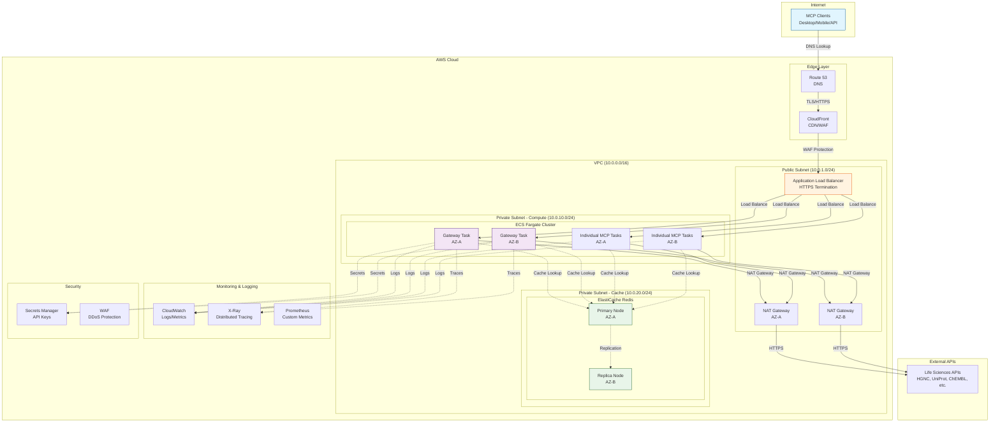

### Explanation

**Proposed Cloud Architecture**:
- Multi-AZ deployment for high availability
- Application Load Balancer for HTTPS termination and routing
- ECS Fargate for serverless container orchestration
- ElastiCache Redis for distributed caching
- CloudWatch for centralized logging and monitoring
- Secrets Manager for secure API key storage
- WAF for DDoS protection and rate limiting

**Benefits**:
- ✅ High availability (multi-AZ)
- ✅ Auto-scaling based on CPU/memory
- ✅ Distributed caching for performance
- ✅ Zero infrastructure management (Fargate)
- ✅ CloudWatch integration for observability
- ✅ Infrastructure-as-code with Pulumi

**Cost Estimate** (monthly):
- ALB: ~$20-30
- ECS Fargate (2 tasks): ~$30-50
- ElastiCache Redis (2 nodes): ~$40-60
- NAT Gateway: ~$30-45
- CloudWatch Logs: ~$5-10
- **Total**: ~$125-195/month

---

## Pulumi Resource Graph

### Infrastructure Dependencies

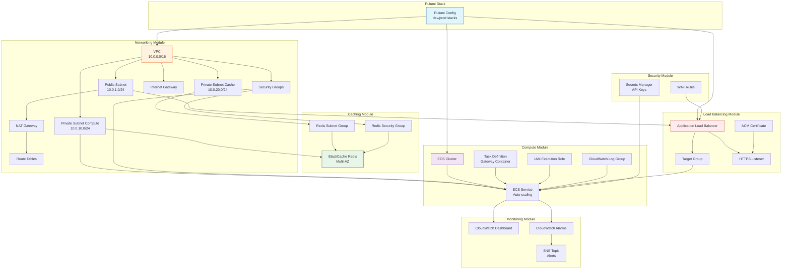

### Explanation

**Pulumi Resource Dependencies**:
- All resources defined in Python using Pulumi SDK
- Automatic dependency resolution and ordering
- State management for drift detection
- Policy enforcement via Pulumi CrossGuard

**Module Breakdown**:
1. **Networking Module**: VPC, subnets, routing, security groups
2. **Compute Module**: ECS cluster, task definitions, services
3. **Caching Module**: ElastiCache Redis with multi-AZ replication
4. **Load Balancing Module**: ALB, target groups, HTTPS listeners
5. **Security Module**: Secrets Manager, WAF rules
6. **Monitoring Module**: CloudWatch dashboards, alarms, SNS

**Pulumi Commands**:
```bash
# Preview changes
pulumi preview --stack dev

# Deploy infrastructure
pulumi up --stack dev

# View current state
pulumi stack --stack dev

# Destroy infrastructure
pulumi destroy --stack dev
```

---

## Container Architecture

### Docker Image Structure

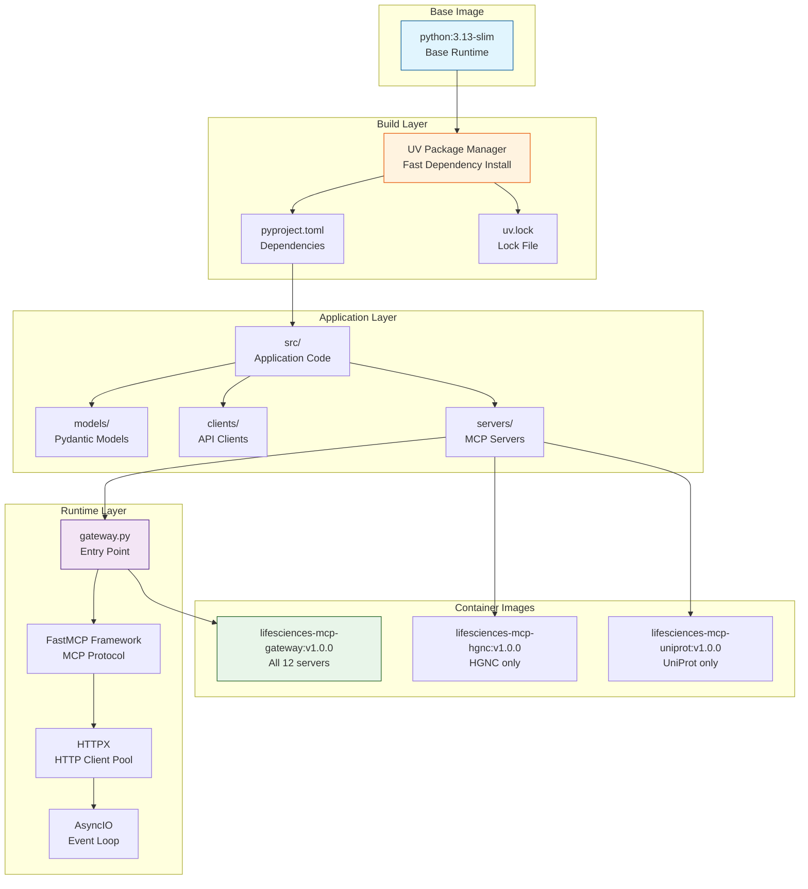

### Dockerfile Example

```dockerfile
# syntax=docker/dockerfile:1

# Base image
FROM python:3.13-slim AS base

# Install UV package manager
COPY --from=ghcr.io/astral-sh/uv:latest /uv /usr/local/bin/uv

# Set working directory
WORKDIR /app

# Install dependencies
FROM base AS deps
COPY pyproject.toml uv.lock ./
RUN uv sync --frozen --no-dev

# Application layer
FROM deps AS app
COPY src/ ./src/

# Runtime configuration
ENV PYTHONUNBUFFERED=1
ENV LOG_LEVEL=INFO

EXPOSE 8000

# Entry point
CMD ["uv", "run", "fastmcp", "run", "src/lifesciences_mcp/servers/gateway.py"]
```

### Multi-Stage Build Benefits

- ✅ Smaller final image size
- ✅ Cached dependency layers
- ✅ Security (no build tools in final image)
- ✅ Fast rebuilds (only changed layers rebuild)

---

## Data Flow - Cloud Deployment

### Request Flow Sequence

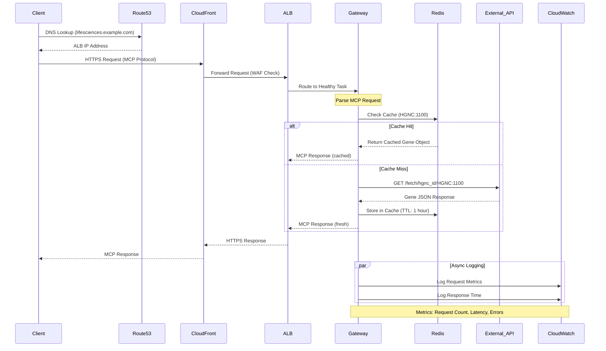

### Explanation

**Request Flow**:
1. **DNS Resolution**: Client resolves domain to ALB IP
2. **WAF Filtering**: CloudFront applies DDoS protection
3. **Load Balancing**: ALB routes to healthy ECS task
4. **Cache Lookup**: Gateway checks Redis for cached response
5. **API Call**: If cache miss, call external API with rate limiting
6. **Cache Storage**: Store fresh response in Redis with TTL
7. **Response**: Return MCP response to client
8. **Logging**: Async logging to CloudWatch

**Performance**:
- Cache hit: ~10-20ms latency
- Cache miss: ~200-500ms latency (external API call)
- Redis read: ~1-3ms
- External API: ~100-400ms (varies by API)

---

## Scaling Strategy

### Auto-scaling Configuration

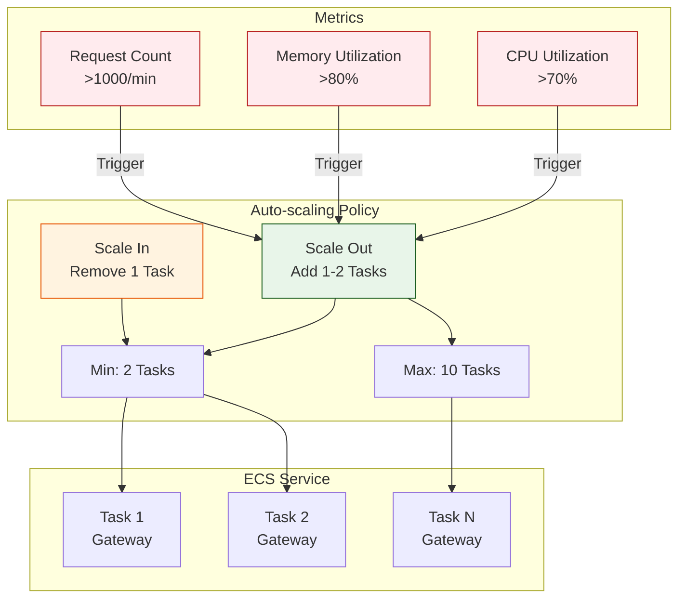

### Explanation

**Auto-scaling Triggers**:
- CPU > 70% for 2 minutes → Scale out
- Memory > 80% for 2 minutes → Scale out
- Request count > 1000/min → Scale out
- CPU < 30% for 10 minutes → Scale in

**Scaling Limits**:
- Minimum tasks: 2 (high availability)
- Maximum tasks: 10 (cost control)
- Cooldown period: 5 minutes

**Cost Optimization**:
- Use Fargate Spot for development (70% cost savings)
- Schedule scaling down to 1 task during off-hours (midnight-6am)
- Use Reserved Capacity for production baseline

---

## Multi-Region Deployment

### Global Architecture

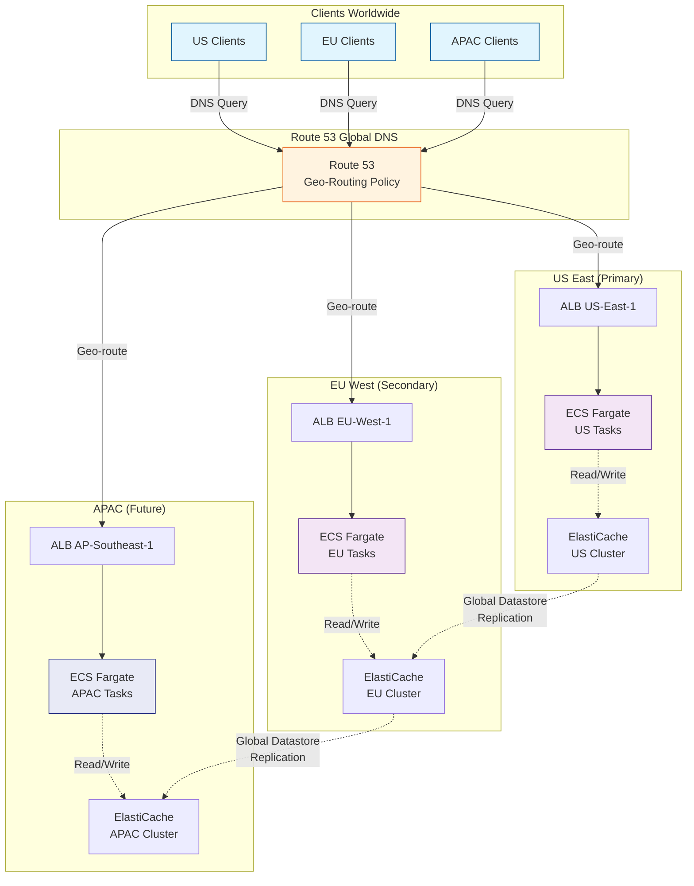

### Explanation

**Multi-Region Strategy**:
- **Primary Region**: US-East-1 (largest user base)
- **Secondary Region**: EU-West-1 (GDPR compliance)
- **Future Region**: AP-Southeast-1 (Asia Pacific expansion)

**Geo-Routing**:
- Route 53 routes requests to nearest region
- Failover to next nearest region if unhealthy
- Cross-region replication for Redis caches

**Benefits**:
- ✅ Low latency for global users
- ✅ Regional redundancy
- ✅ GDPR data residency compliance
- ✅ Disaster recovery

**Cost**:
- ~3x infrastructure cost (3 regions)
- ElastiCache Global Datastore: +$100-200/month
- Cross-region data transfer: ~$0.02/GB

---

## Monitoring and Observability

### Metrics Architecture

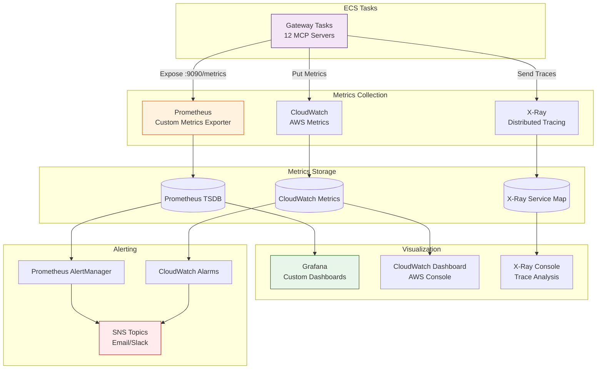

### Key Metrics

**Application Metrics**:
- Request count by MCP tool
- Request latency (p50, p95, p99)
- Error rate by error code
- Cache hit/miss ratio
- External API latency by database
- Rate limit throttle events

**Infrastructure Metrics**:
- ECS task CPU utilization
- ECS task memory utilization
- ALB request count
- ALB target response time
- Redis cache memory usage
- Redis eviction count

**Business Metrics**:
- Most popular databases queried
- Most popular MCP tools used
- User retention (returning clients)
- Data volume transferred

---

## Security Architecture

### Security Layers

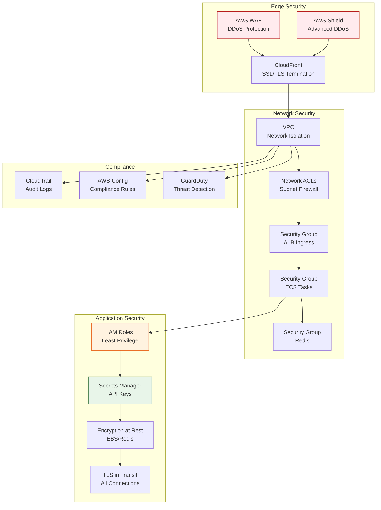

### Security Best Practices

**Network Security**:
- ✅ Private subnets for compute and cache
- ✅ NAT gateway for outbound internet access only
- ✅ Security groups with least-privilege rules
- ✅ No direct internet access to ECS tasks

**Application Security**:
- ✅ IAM roles with minimal permissions
- ✅ API keys stored in Secrets Manager (not env vars)
- ✅ TLS 1.2+ for all connections
- ✅ Container image scanning with ECR

**Compliance**:
- ✅ CloudTrail audit logging enabled
- ✅ AWS Config compliance rules
- ✅ GuardDuty threat detection
- ✅ Regular security assessments

---

## Cost Optimization

### Cost Breakdown (Monthly Estimates)

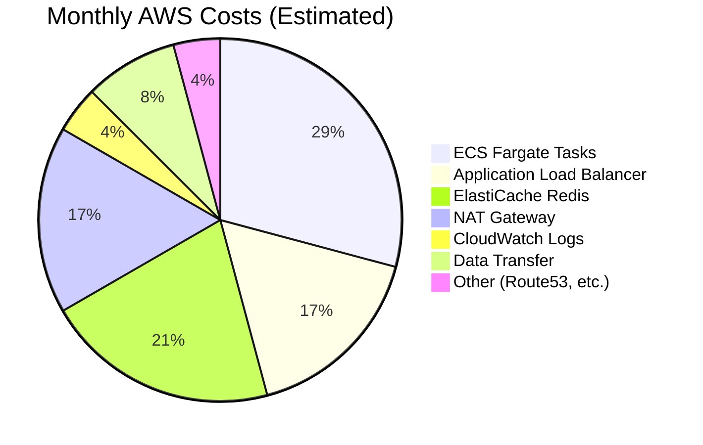

### Cost Optimization Strategies

| Strategy | Savings | Implementation |
|----------|---------|----------------|
| **Fargate Spot** | 70% | Use for dev/staging environments |
| **Reserved Capacity** | 30-50% | Commit to 1-year for production baseline |
| **Right-sizing** | 20-30% | Monitor and reduce CPU/memory allocation |
| **S3 Lifecycle** | 50-80% | Archive old logs to Glacier |
| **Off-hours Scaling** | 30-40% | Scale to 1 task midnight-6am |
| **CloudWatch Logs Retention** | 20-40% | Reduce retention from 30 to 7 days |

### Budget Alerts

```bash
# Pulumi budget definition
budget = aws.budgets.Budget(
    "monthly-budget",
    budget_type="COST",
    limit_amount="200",
    limit_unit="USD",
    time_period_start="2026-01-01_00:00",
    time_unit="MONTHLY",
    notifications=[
        {
            "comparisonOperator": "GREATER_THAN",
            "threshold": 50,
            "thresholdType": "PERCENTAGE",
            "notificationType": "ACTUAL",
            "subscriberEmailAddresses": ["devops@example.com"]
        },
        {
            "comparisonOperator": "GREATER_THAN",
            "threshold": 80,
            "thresholdType": "PERCENTAGE",
            "notificationType": "ACTUAL",
            "subscriberEmailAddresses": ["devops@example.com"]
        },
        {
            "comparisonOperator": "GREATER_THAN",
            "threshold": 100,
            "thresholdType": "PERCENTAGE",
            "notificationType": "FORECASTED",
            "subscriberEmailAddresses": ["devops@example.com"]
        }
    ]
)
```

---

## Disaster Recovery

### Backup and Recovery Strategy

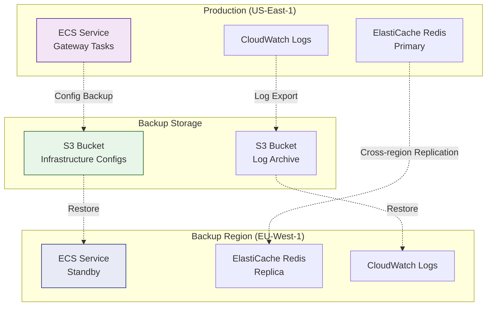

### RTO and RPO Targets

| Scenario | RTO (Recovery Time) | RPO (Data Loss) | Strategy |
|----------|---------------------|-----------------|----------|
| **Task Failure** | < 1 minute | 0 | Auto-restart by ECS |
| **AZ Failure** | < 2 minutes | 0 | Multi-AZ deployment |
| **Region Failure** | < 30 minutes | < 5 minutes | Route 53 failover to backup region |
| **Complete Outage** | < 2 hours | < 1 hour | Restore from S3 backups + Pulumi redeploy |

### Recovery Procedures

**Scenario 1: Single Task Failure**
```bash
# ECS automatically restarts failed tasks
# No manual intervention required
```

**Scenario 2: Region Failure**
```bash
# Route 53 health check fails
# Automatic DNS failover to EU-West-1

# Manual verification
aws ecs describe-services --cluster lifesciences-eu --services gateway
```

**Scenario 3: Complete Infrastructure Loss**
```bash
# Restore from Pulumi state + S3 backups

# 1. Clone infrastructure repo
git clone https://github.com/org/lifesciences-infra.git

# 2. Restore Pulumi stack
pulumi stack select prod-recovery
pulumi up

# 3. Verify deployment
pulumi stack output gateway_url
curl -X POST $(pulumi stack output gateway_url)/mcp
```

---

## Deployment Checklist

### Pre-Deployment

- [ ] Review Pulumi code for security best practices
- [ ] Run `pulumi preview` to verify changes
- [ ] Check cost estimates with `pulumi preview --cost`
- [ ] Verify IAM roles have least-privilege permissions
- [ ] Ensure secrets are in Secrets Manager (not hardcoded)
- [ ] Test container images locally
- [ ] Run integration tests against staging environment

### Deployment

- [ ] Deploy to staging first: `pulumi up --stack staging`
- [ ] Run smoke tests against staging
- [ ] Monitor CloudWatch metrics for 30 minutes
- [ ] Deploy to production: `pulumi up --stack prod`
- [ ] Verify health checks pass
- [ ] Monitor error rates and latency
- [ ] Test failover to backup region

### Post-Deployment

- [ ] Update documentation with new endpoints
- [ ] Notify users of any breaking changes
- [ ] Set up CloudWatch alarms
- [ ] Configure budget alerts
- [ ] Schedule post-deployment review

---

## Conclusion

This deployment architecture provides a robust, scalable, and cost-effective infrastructure for running the Life Sciences MCP servers in production. The Pulumi-based infrastructure-as-code approach ensures:

- **Repeatability**: Infrastructure can be deployed to multiple regions/accounts
- **Version Control**: All infrastructure changes tracked in Git
- **Collaboration**: Team members can review and approve changes
- **Compliance**: Policy-as-code enforcement with Pulumi CrossGuard
- **Disaster Recovery**: Multi-region deployment with automated failover

### Next Steps

1. **Implement Pulumi Infrastructure** - Create `infrastructure/` directory with modules
2. **Build and Push Container Images** - Set up CI/CD pipeline for automated builds
3. **Deploy to Staging** - Test in non-production environment first
4. **Performance Testing** - Load test with realistic traffic patterns
5. **Production Deployment** - Roll out to production with monitoring

### Resources

- **Pulumi AWS Guide**: https://www.pulumi.com/docs/clouds/aws/
- **ECS Fargate Best Practices**: https://docs.aws.amazon.com/AmazonECS/latest/bestpracticesguide/
- **ElastiCache Redis Guide**: https://docs.aws.amazon.com/AmazonElastiCache/latest/red-ug/
- **AWS Well-Architected Framework**: https://aws.amazon.com/architecture/well-architected/

---

**Last Updated**: 2026-01-07
**Maintained By**: Architecture Analysis Framework
**Status**: Proposed Architecture (Not Yet Implemented)
