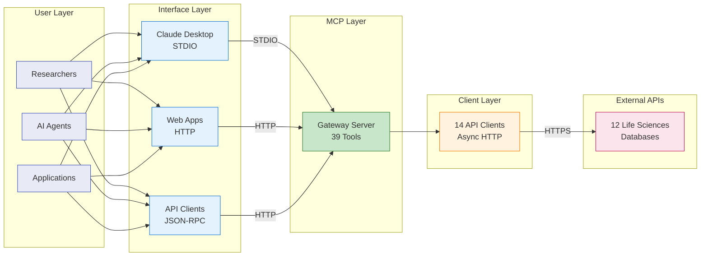
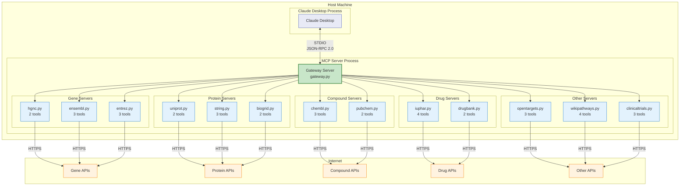
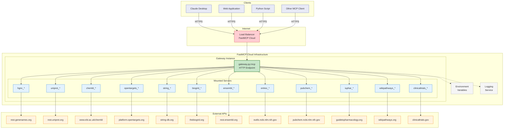
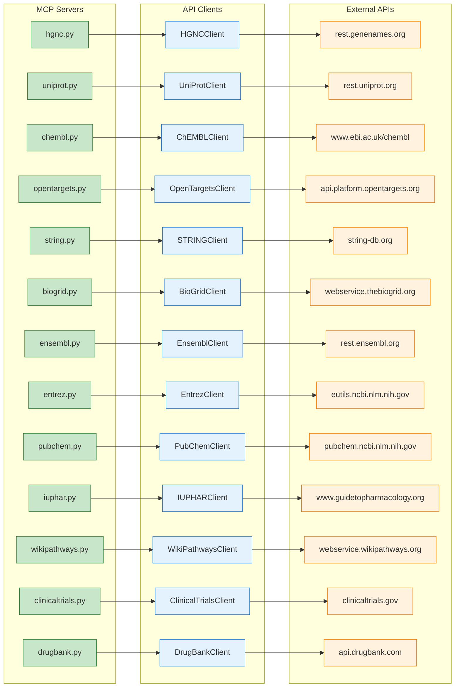
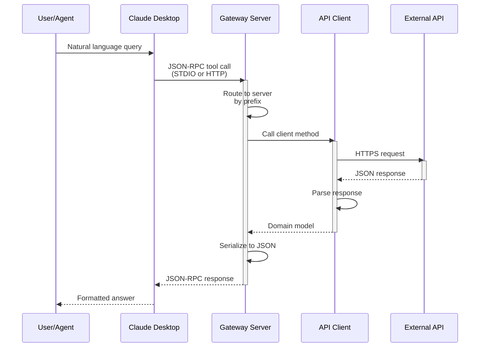
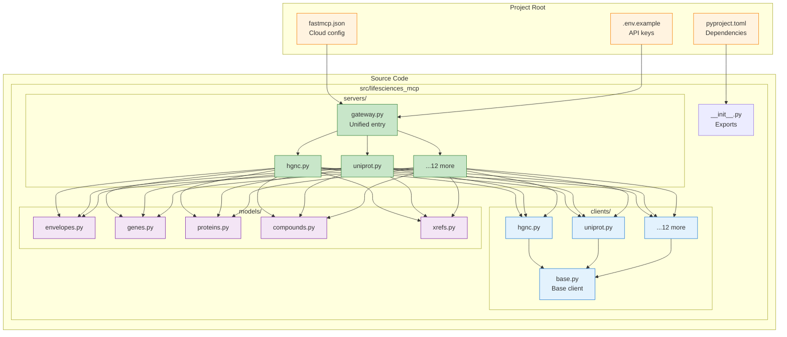
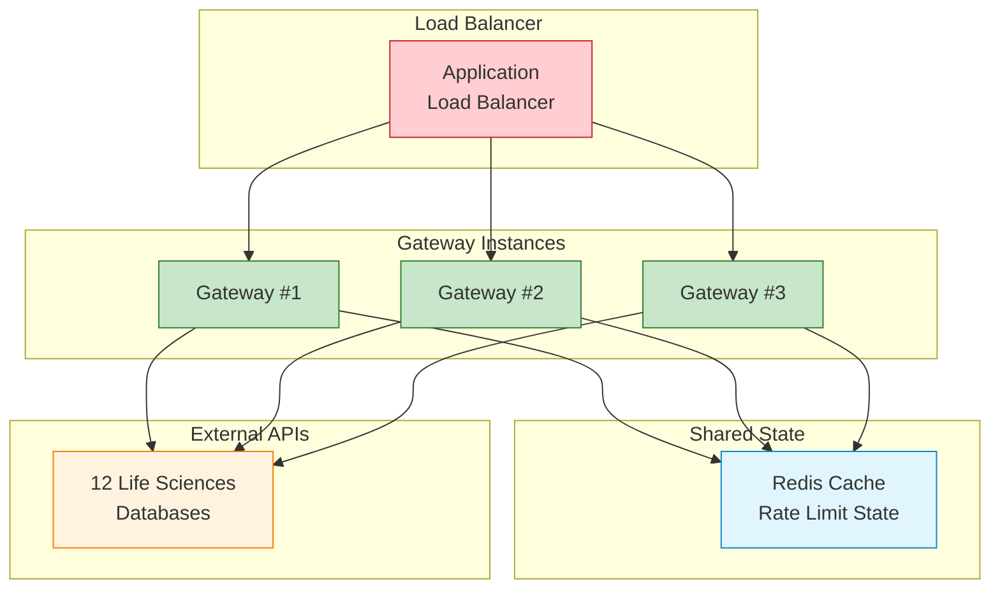
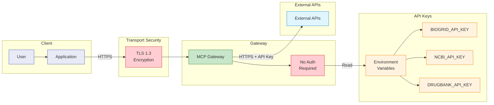
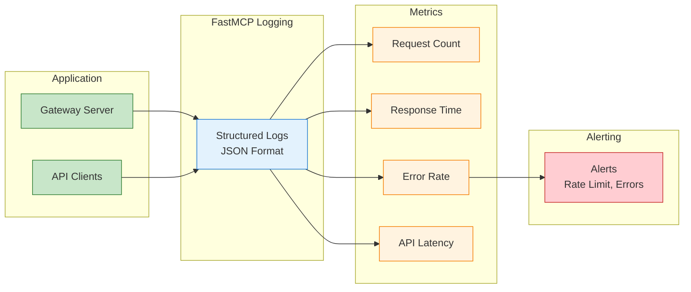
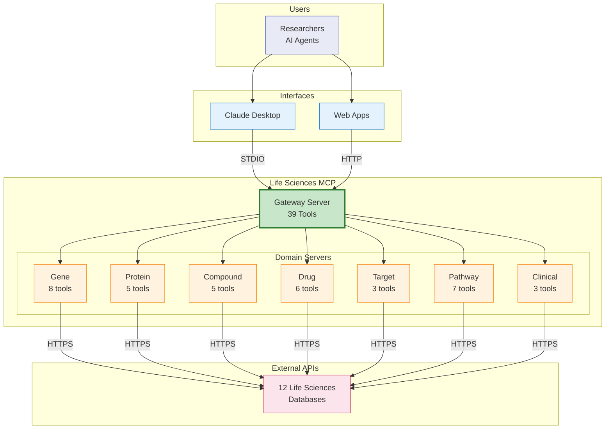

# Deployment Architecture Diagrams

> **Analysis Date:** 2026-01-05
> **Project:** Life Sciences MCP
> **Deployment Model:** Client-side MCP + Optional Cloud Gateway

## Overview

This document provides visual representations of the Life Sciences MCP deployment topology, resource relationships, and network architecture. The project supports two deployment modes:

1. **Local STDIO Mode** - Primary deployment for Claude Desktop integration
2. **HTTP Gateway Mode** - Optional cloud deployment via FastMCP Cloud

---

## Deployment Topology

### High-Level System Context

---

## Local Deployment Architecture

### STDIO Mode (Primary)

**What you're looking at:** Complete local deployment showing process boundaries and data flow.

### Narrative

The local STDIO deployment runs as a single Python process spawned by Claude Desktop. The gateway server (`gateway.py`) acts as a facade, mounting all 12 domain servers with zero-overhead direct function calls (`as_proxy=False`). Communication uses JSON-RPC 2.0 over standard input/output streams.

**Key Characteristics:**
- **Single process** - All servers run in one Python interpreter
- **No network overhead** - Internal calls are direct function invocations
- **STDIO transport** - Bidirectional JSON-RPC over stdin/stdout
- **Async I/O** - `httpx` for concurrent external API calls

---

## Cloud Deployment Architecture

### HTTP Gateway Mode (Optional)

**What you're looking at:** FastMCP Cloud deployment with HTTP transport.

### Narrative

The HTTP deployment mode uses FastMCP Cloud's managed infrastructure. The gateway server is deployed as an HTTP endpoint accessible via `https://lifesciences.fastmcp.app/mcp`. Multiple clients can connect simultaneously, sharing the same server instance.

**Key Characteristics:**
- **HTTP transport** - JSON-RPC over HTTPS
- **Managed infrastructure** - FastMCP Cloud handles scaling, SSL, logging
- **Multi-client** - Single endpoint serves multiple clients
- **Environment variables** - API keys injected at deployment

---

## Resource Relationships

### Server-Client-API Mapping

### Narrative

The architecture follows a strict **1:1:1 mapping**: each MCP server has exactly one API client, which communicates with exactly one external API. This pattern ensures:

- **Clear ownership** - Each server owns its domain
- **Independent scaling** - Servers can be deployed individually
- **Isolation** - API failures are contained to their domain

---

## Network Architecture

### Data Flow Diagram

### Port and Protocol Summary

| Component | Protocol | Port | Notes |
|-----------|----------|------|-------|
| Claude Desktop ↔ Gateway | STDIO | N/A | Process pipes |
| HTTP Clients ↔ Gateway | HTTP/2 | 443 | FastMCP Cloud |
| Gateway ↔ External APIs | HTTPS | 443 | REST/GraphQL |

---

## Deployment Configuration

### File Structure

---

## Scaling Architecture

### Horizontal Scaling (Future)

### Narrative

For high-availability deployments, the gateway can be horizontally scaled behind a load balancer. The stateless architecture allows any instance to handle any request. A shared Redis cache would coordinate rate limiting across instances to avoid exceeding external API limits.

---

## Security Architecture

### Authentication & Authorization Flow

### Security Considerations

| Layer | Protection | Implementation |
|-------|------------|----------------|
| **Transport** | TLS 1.3 | FastMCP Cloud / HTTPS |
| **Gateway** | No auth (open) | Rely on client-side security |
| **API Keys** | Environment variables | `.env` file, not in code |
| **Rate Limiting** | Client-side | Built into API clients |
| **Input Validation** | Pydantic models | Type enforcement |

---

## Monitoring & Observability

### Logging Architecture

### Key Metrics

| Metric | Description | Threshold |
|--------|-------------|-----------|
| `request_count` | Total tool invocations | N/A |
| `response_time_ms` | End-to-end latency | < 5000ms |
| `error_rate` | Failed requests | < 5% |
| `api_latency_ms` | External API response time | < 3000ms |
| `rate_limit_hits` | Rate limit encounters | Log only |

---

## Summary Diagram

### Complete Architecture Overview

---

## Deployment Checklist

### Local Deployment
- [ ] Clone repository
- [ ] Install uv package manager
- [ ] Run `uv sync` to install dependencies
- [ ] Configure `.env` with API keys (optional)
- [ ] Test with `uv run fastmcp run src/lifesciences_mcp/servers/gateway.py`
- [ ] Configure Claude Desktop `claude_desktop_config.json`

### Cloud Deployment
- [ ] Create `fastmcp.json` configuration (exists)
- [ ] Set environment variables in FastMCP Cloud
- [ ] Deploy with `fastmcp deploy`
- [ ] Verify endpoint accessibility
- [ ] Test with sample tool call

---

*Generated: 2026-01-05*
*Analysis Scope: Deployment topology, resource relationships, network architecture*
