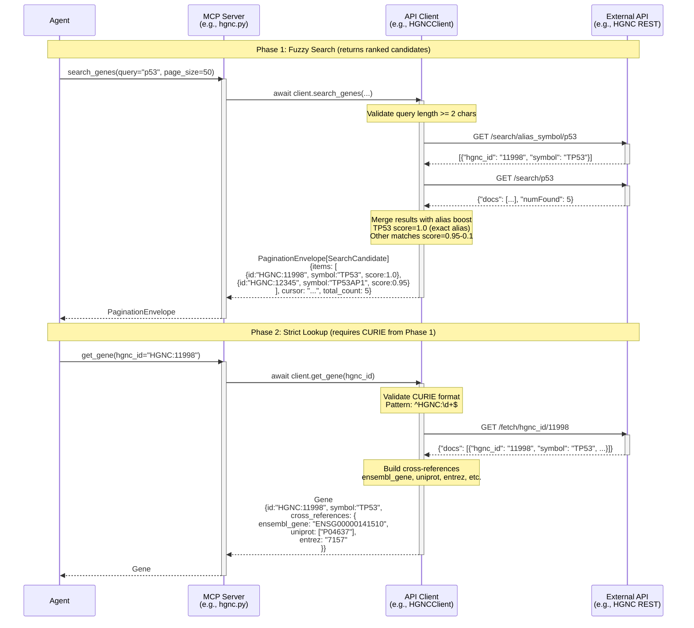
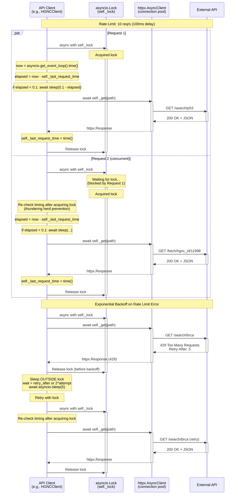
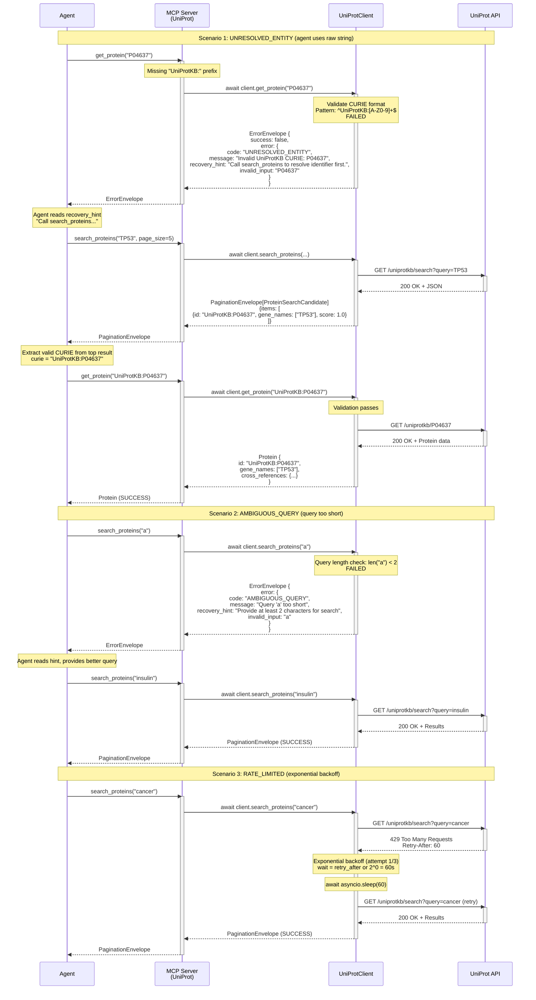
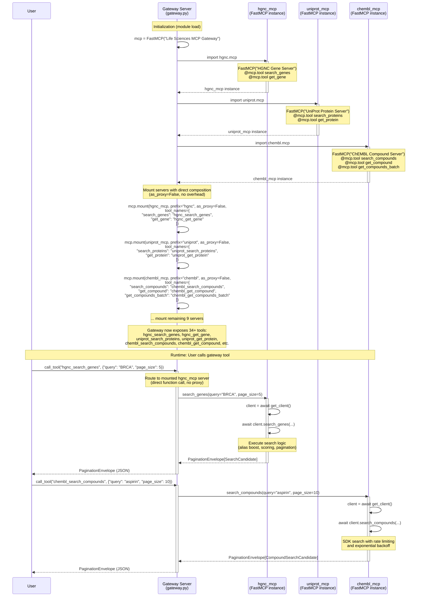
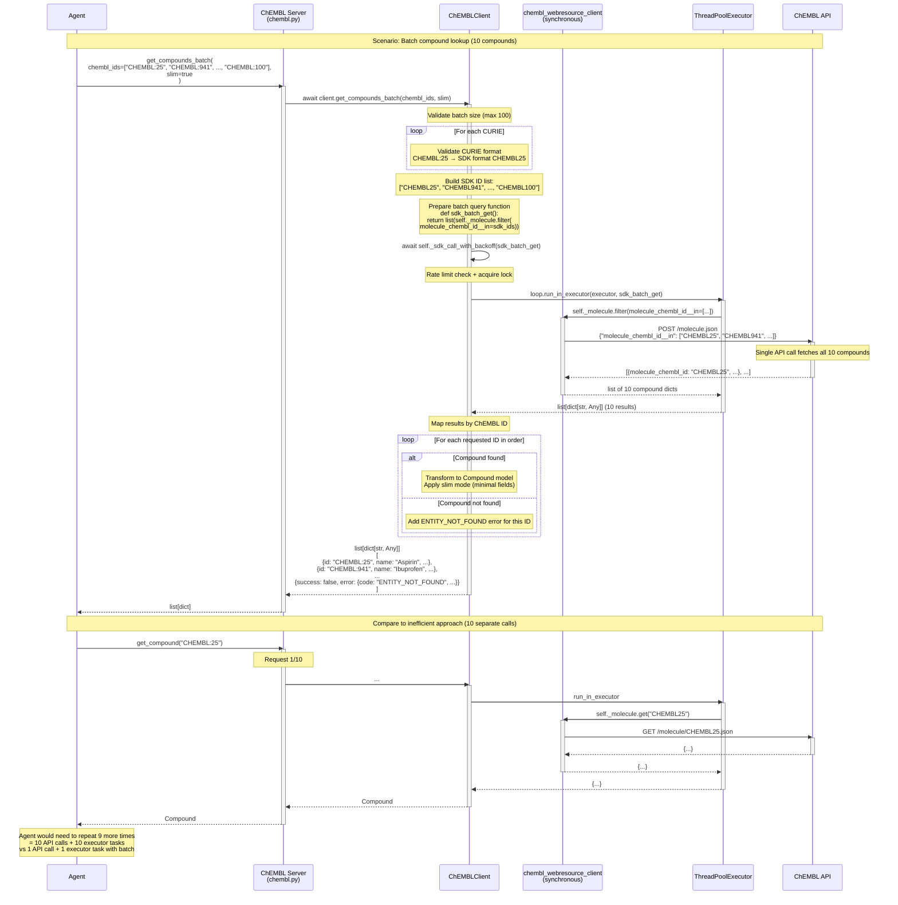
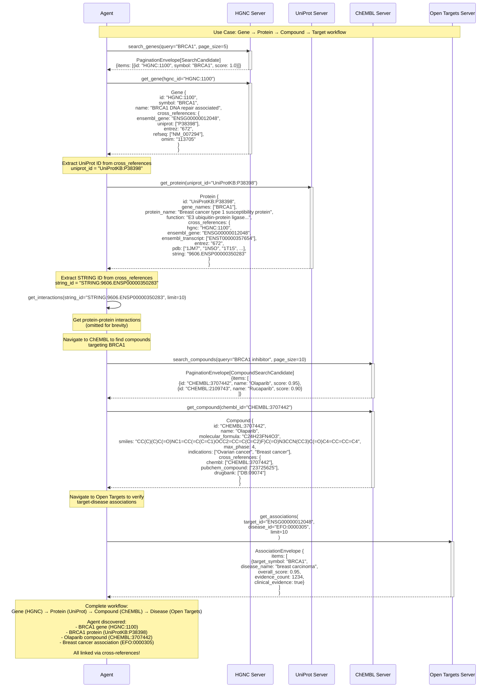
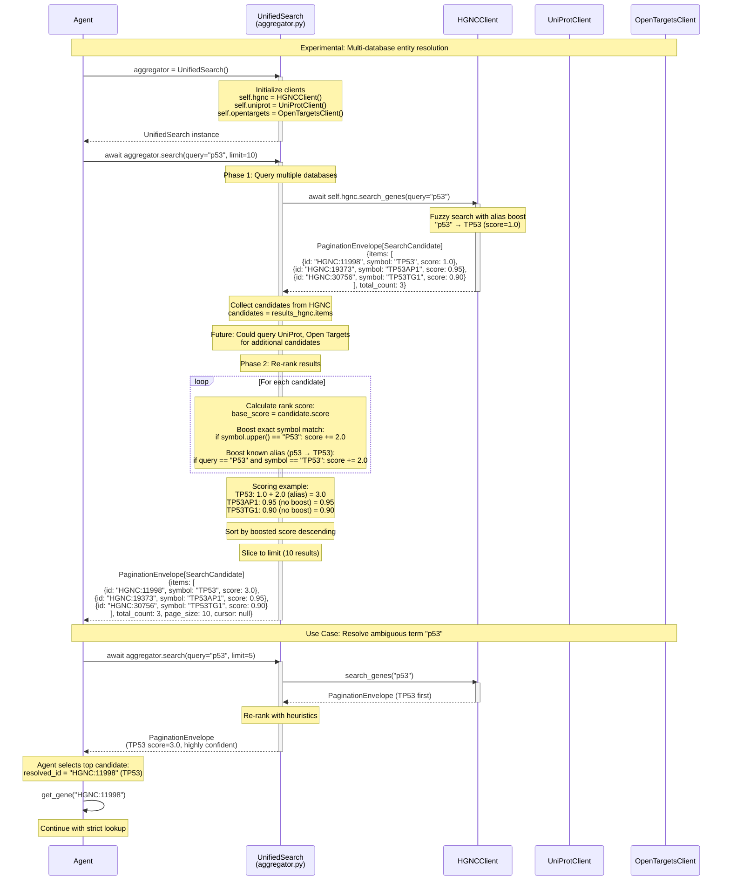
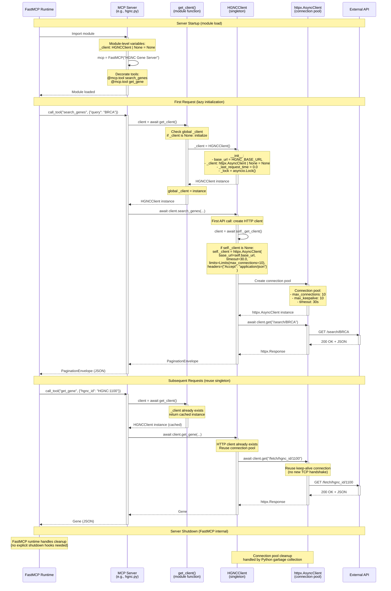

# Data Flow Analysis

## Overview

The Life Sciences MCP system implements a sophisticated multi-tier architecture for querying biological databases through the Model Context Protocol. The system is built around several key patterns:

1. **Fuzzy-to-Fact Protocol**: A 2-phase pattern where fuzzy search returns ranked candidates, followed by strict CURIE-based lookup
2. **Rate-Limited Client Pattern**: Async HTTP clients with connection pooling, rate limiting, and exponential backoff
3. **Error Recovery Pattern**: Structured errors with actionable recovery hints for autonomous agent self-correction
4. **Gateway Composition**: Multiple MCP servers composed into a unified gateway without proxy overhead
5. **Cross-Database Navigation**: Entities with cross-references enabling multi-database traversal

The codebase consists of 12 operational MCP servers (HGNC, UniProt, ChEMBL, Open Targets, STRING, BioGRID, Ensembl, Entrez, PubChem, IUPHAR/GtoPdb, WikiPathways, ClinicalTrials.gov) organized into:
- **13 Client implementations** (src/lifesciences_mcp/clients/)
- **13 Server implementations** (src/lifesciences_mcp/servers/)
- **20+ Data models** (src/lifesciences_mcp/models/)
- **1 Aggregator** (src/lifesciences_agent/aggregator.py)
- **1 Gateway** (src/lifesciences_mcp/servers/gateway.py)

## 1. Fuzzy-to-Fact Protocol Flow

The Fuzzy-to-Fact protocol is the cornerstone pattern used across all 12 servers. It enforces a 2-phase workflow to prevent agents from using ambiguous identifiers.



### Explanation

**Phase 1: Fuzzy Search (search_genes/search_proteins/search_compounds)**

Entry point: MCP server tool decorated with `@mcp.tool` (e.g., `/src/lifesciences_mcp/servers/hgnc.py:36-64`)

1. **Input Validation**: Client validates query length (min 2 chars) and clamps page_size (1-100)
2. **Alias Boosting** (HGNC-specific): Searches alias_symbol field first for exact matches (`/src/lifesciences_mcp/clients/hgnc.py:154-156`)
   - Example: "p53" → TP53 gets score=1.0
3. **General Search**: Queries main search endpoint for symbol/name matches (`/src/lifesciences_mcp/clients/hgnc.py:159`)
4. **Score Calculation**:
   - Exact symbol match: score=1.0
   - Alias match: score=1.0
   - Position-based: score=0.95 - (position * 0.05), min 0.1 (`/src/lifesciences_mcp/clients/hgnc.py:217`)
5. **Result Merging**: Combines alias and general results, deduplicates, sorts by score descending
6. **Pagination**: Client-side slicing (HGNC API doesn't support server-side pagination) (`/src/lifesciences_mcp/clients/hgnc.py:233-241`)
7. **Cursor Encoding**: Base64-encoded JSON with offset for next page (`/src/lifesciences_mcp/clients/hgnc.py:240-241`)

**Phase 2: Strict Lookup (get_gene/get_protein/get_compound)**

Entry point: MCP server tool decorated with `@mcp.tool` (e.g., `/src/lifesciences_mcp/servers/hgnc.py:67-81`)

1. **CURIE Validation**: Enforces strict format (e.g., `HGNC:\d+`, `UniProtKB:[A-Z0-9]+`) (`/src/lifesciences_mcp/clients/hgnc.py:283-284`)
   - Invalid format → UNRESOLVED_ENTITY error with recovery hint
2. **API Fetch**: Extracts numeric ID, fetches from API (`/src/lifesciences_mcp/clients/hgnc.py:290`)
3. **Cross-Reference Building**: Maps API fields to 22-key registry (`/src/lifesciences_mcp/clients/hgnc.py:333-344`)
   - Keys: ensembl_gene, uniprot, entrez, refseq, omim, chembl, drugbank, etc.
   - Omit-if-null pattern: keys with no value are excluded from response
4. **Complete Entity**: Returns full entity with all available metadata and cross-references

**Key Components:**
- Models: `/src/lifesciences_mcp/models/gene.py` (Gene, SearchCandidate, CrossReferences)
- Envelopes: `/src/lifesciences_mcp/models/envelopes.py` (PaginationEnvelope, ErrorEnvelope)
- Client: `/src/lifesciences_mcp/clients/hgnc.py` (HGNCClient)
- Server: `/src/lifesciences_mcp/servers/hgnc.py` (FastMCP server with 2 tools)

**Error Handling:**
- Query too short (< 2 chars) → AMBIGUOUS_QUERY
- Too many results (> 100) with short query → AMBIGUOUS_QUERY
- Invalid CURIE format → UNRESOLVED_ENTITY (with hint to use search first)
- Valid CURIE but not found → ENTITY_NOT_FOUND
- Rate limit exceeded → RATE_LIMITED (with retry-after hint)
- Upstream API error → UPSTREAM_ERROR

## 2. Rate-Limited API Client Flow

All clients inherit from `LifeSciencesClient` base class and implement rate limiting to respect upstream API constraints. This flow shows the sophisticated rate limiting with thundering herd prevention.



### Explanation

**Connection Pooling** (`/src/lifesciences_mcp/clients/base.py:41-54`)

1. **Lazy Initialization**: HTTP client created on first request
2. **Connection Limits**: Configurable max_connections (default 10) with keep-alive
3. **Shared Client**: Single `httpx.AsyncClient` instance per client class with connection reuse
4. **Timeout Configuration**: Configurable timeout (default 30s)
5. **Default Headers**: `Accept: application/json` for all requests

**Rate Limiting Implementation** (`/src/lifesciences_mcp/clients/hgnc.py:62-108`)

1. **Lock Acquisition**: Uses `asyncio.Lock()` for request serialization
2. **Timing Check**: Calculates elapsed time since last request
3. **Delay Enforcement**: If elapsed < RATE_LIMIT_DELAY, sleeps for remaining time
4. **Request Execution**: Makes HTTP request inside lock
5. **Timestamp Update**: Updates `self._last_request_time` after request completes
6. **Lock Release**: Automatic via context manager

**Thundering Herd Prevention** (`/src/lifesciences_mcp/clients/hgnc.py:97-106`)

Critical detail: After waking from backoff sleep, the code re-checks timing after acquiring lock. This prevents multiple concurrent requests from overwhelming the API after a rate limit error.

**Exponential Backoff** (`/src/lifesciences_mcp/clients/hgnc.py:84-107`)

1. **Error Detection**: Check for 429, 403, 503 status codes
2. **Retry-After Header**: Prefers server-specified wait time
3. **Exponential Calculation**: Falls back to `2^attempt` seconds (1s, 2s, 4s)
4. **Sleep Outside Lock**: Allows other requests to proceed during backoff
5. **Max Retries**: Default 3 attempts (configurable via MAX_RETRIES)

**SDK Wrapping Pattern** (ChEMBL example, `/src/lifesciences_mcp/clients/chembl.py:94-123`)

For synchronous SDKs (e.g., ChEMBL's chembl_webresource_client):

1. **ThreadPoolExecutor**: Lazy-initialized thread pool (Python defaults: min(32, cpu_count+4))
2. **run_in_executor**: Wraps synchronous SDK calls for async compatibility
3. **Rate Limiting**: Same lock-based pattern applied before executor call
4. **Error Mapping**: Catches SDK exceptions and maps to canonical error codes

**Key Files:**
- Base client: `/src/lifesciences_mcp/clients/base.py` (LifeSciencesClient)
- HGNC client: `/src/lifesciences_mcp/clients/hgnc.py` (rate limiting example)
- ChEMBL client: `/src/lifesciences_mcp/clients/chembl.py` (SDK wrapping example)
- STRING client: `/src/lifesciences_mcp/clients/string.py` (rate limiting example)

**Rate Limit Configurations:**
- HGNC: 10 req/s (100ms delay)
- STRING: 1 req/s (1000ms delay)
- ChEMBL: 10 req/s (100ms delay)
- UniProt: 10 req/s (100ms delay)
- ClinicalTrials.gov: 1 req/s (1000ms delay)

## 3. Error Recovery Flow

The error recovery pattern enables autonomous agent self-correction through structured errors with actionable recovery hints. This is a key feature for agentic workflows.



### Explanation

**Error Codes and Recovery Hints** (`/src/lifesciences_mcp/models/envelopes.py:16-108`)

The ErrorEnvelope model defines 5 canonical error codes with factory methods:

1. **UNRESOLVED_ENTITY**: Raw string passed to strict lookup tool
   - Recovery hint: "Call search_genes to resolve the identifier first."
   - Example: `get_gene("BRCA1")` instead of `get_gene("HGNC:1100")`
   - Implementation: `/src/lifesciences_mcp/models/envelopes.py:47-56`

2. **ENTITY_NOT_FOUND**: Valid CURIE format but entity doesn't exist in database
   - Recovery hint: "Verify the HGNC ID format or try a synonym search."
   - Example: `get_gene("HGNC:99999999")`
   - Implementation: `/src/lifesciences_mcp/models/envelopes.py:58-68`

3. **AMBIGUOUS_QUERY**: Too many/few results or query too short
   - Recovery hint: "Refine query with more specific terms."
   - Example: `search_genes("a")` (< 2 chars) or `search_genes("p")` (100+ results)
   - Implementation: `/src/lifesciences_mcp/models/envelopes.py:70-80`

4. **RATE_LIMITED**: Upstream API throttling
   - Recovery hint: "Retry after {N} seconds." (with Retry-After header value)
   - Example: API returns 429 status
   - Implementation: `/src/lifesciences_mcp/models/envelopes.py:82-94`

5. **UPSTREAM_ERROR**: API failures (5xx errors, timeouts, network errors)
   - Recovery hint: "HGNC API may be temporarily unavailable. Retry later."
   - Example: API returns 500, 502, 503, or request timeout
   - Implementation: `/src/lifesciences_mcp/models/envelopes.py:96-108`

**Error Response Structure**

```python
{
  "success": false,
  "error": {
    "code": "UNRESOLVED_ENTITY",
    "message": "The input 'P04637' is not a valid UniProtKB CURIE.",
    "recovery_hint": "Call search_proteins to resolve the identifier first. Expected format: UniProtKB:<accession>",
    "invalid_input": "P04637"
  }
}
```

**Agent Recovery Workflow** (Test example: `/tests/integration/test_error_recovery.py:28-80`)

1. **Error Detection**: Agent receives ErrorEnvelope instead of expected data model
2. **Hint Extraction**: Agent reads `error.recovery_hint` field
3. **Action Decision**: Agent parses hint and determines corrective action
4. **Retry**: Agent calls suggested tool/method with corrected input
5. **Success**: Agent receives valid data and continues workflow

**Multi-Step Recovery Example** (`/tests/integration/test_error_recovery.py:142-167`)

Agent can recover from multiple sequential errors:
1. Query too short ("p") → AMBIGUOUS_QUERY → Agent provides longer query ("p53")
2. Invalid CURIE ("P04637") → UNRESOLVED_ENTITY → Agent uses CURIE from search
3. Final success with complete protein record

**ClinicalTrials Error Recovery** (`/tests/integration/test_error_recovery.py:186-226`)

Demonstrates complete error→hint→recovery→success cycle:
1. Query string to get_trial ("breast cancer treatment") → UNRESOLVED_ENTITY
2. Recovery hint suggests: "Call search_trials to resolve identifier first"
3. Agent calls search_trials, extracts valid NCT CURIE
4. Agent retries get_trial with valid CURIE → SUCCESS

**Key Components:**
- Error models: `/src/lifesciences_mcp/models/envelopes.py` (ErrorEnvelope, ErrorDetail, ErrorCode)
- Error recovery tests: `/tests/integration/test_error_recovery.py` (comprehensive test suite)
- Client error handling: All clients inherit error mapping pattern

**Error Mapping Pattern** (ChEMBL example, `/src/lifesciences_mcp/clients/chembl.py:191-244`)

Each client maps SDK/API exceptions to canonical error codes:
- 404 → ENTITY_NOT_FOUND
- 429 → RATE_LIMITED
- 500/502/503 → UPSTREAM_ERROR
- Validation failures → UNRESOLVED_ENTITY

## 4. Gateway Server Composition Flow

The gateway server composes 12 individual MCP servers into a unified interface without proxy overhead. This enables deployment to FastMCP Cloud as a single entrypoint.



### Explanation

**Gateway Architecture** (`/src/lifesciences_mcp/servers/gateway.py`)

The gateway server uses FastMCP's `mount()` method to compose multiple servers without proxy overhead:

**Server Import and Mounting** (lines 31-109)

1. **Import Phase**: All 12 MCP servers imported as module-level instances
   ```python
   from lifesciences_mcp.servers.hgnc import mcp as hgnc_mcp
   from lifesciences_mcp.servers.uniprot import mcp as uniprot_mcp
   # ... 10 more servers
   ```

2. **Gateway Creation**: Single FastMCP instance at module level (line 49)
   ```python
   mcp = FastMCP("Life Sciences MCP Gateway")
   ```

3. **Direct Mounting**: Each server mounted with `as_proxy=False` for direct function calls
   ```python
   mcp.mount(hgnc_mcp, prefix="hgnc", as_proxy=False, tool_names={
       "search_genes": "hgnc_search_genes",
       "get_gene": "hgnc_get_gene"
   })
   ```

**Tool Naming Convention**

All tools prefixed with server name to avoid collisions:
- HGNC: `hgnc_search_genes`, `hgnc_get_gene`
- UniProt: `uniprot_search_proteins`, `uniprot_get_protein`
- ChEMBL: `chembl_search_compounds`, `chembl_get_compound`, `chembl_get_compounds_batch`
- OpenTargets: `opentargets_search_targets`, `opentargets_get_target`, `opentargets_get_associations`
- STRING: `string_search_proteins`, `string_get_interactions`, `string_get_network_image_url`
- BioGRID: `biogrid_search_genes`, `biogrid_get_interactions`
- Ensembl: `ensembl_search_genes`, `ensembl_get_gene`, `ensembl_get_transcript`
- Entrez: `entrez_search_genes`, `entrez_get_gene`, `entrez_get_pubmed_links`
- PubChem: `pubchem_search_compounds`, `pubchem_get_compound`
- IUPHAR: `iuphar_search_targets`, `iuphar_get_target`, `iuphar_search_ligands`, `iuphar_get_ligand`
- WikiPathways: `wikipathways_search_pathways`, `wikipathways_get_pathway`, `wikipathways_get_pathways_for_gene`, `wikipathways_get_pathway_components`
- ClinicalTrials: `clinicaltrials_search_trials`, `clinicaltrials_get_trial`, `clinicaltrials_get_trial_locations`

**Total: 34+ tools across 12 databases**

**Server Lifecycle Management** (ADR-004)

Each individual server uses module-level singleton pattern:

```python
# Server: /src/lifesciences_mcp/servers/hgnc.py
_client: HGNCClient | None = None

async def get_client() -> HGNCClient:
    global _client
    if _client is None:
        _client = HGNCClient()
    return _client
```

**Rationale:** FastMCP manages lifecycle internally - no cleanup hooks needed. Clients are lazy-initialized and reused across requests for connection pooling.

**DrugBank Exclusion** (line 45-46)

DrugBank server excluded from gateway due to commercial API key requirement:
```python
# Note: DrugBank excluded - requires commercial API key
# from lifesciences_mcp.servers.drugbank import mcp as drugbank_mcp
```

**Deployment Models**

1. **Individual Servers**: Run standalone for development/testing
   ```bash
   uv run fastmcp run src/lifesciences_mcp/servers/hgnc.py
   ```

2. **Gateway Server**: Single entrypoint for production
   ```bash
   uv run fastmcp run src/lifesciences_mcp/servers/gateway.py
   ```

3. **FastMCP Cloud**: Deploy gateway as single server
   ```
   Entrypoint: src/lifesciences_mcp/servers/gateway.py:mcp
   ```

**Key Components:**
- Gateway: `/src/lifesciences_mcp/servers/gateway.py` (112 lines)
- Individual servers: `/src/lifesciences_mcp/servers/*.py` (12 servers, 80-200 lines each)
- Server architecture: Module-level singleton pattern with lazy client initialization

**Benefits of Direct Mounting:**
- No proxy overhead (direct function calls)
- Shared connection pools per client type
- Unified error handling and response format
- Single deployment artifact
- Automatic tool discovery and documentation

## 5. Batch Operations Flow

Batch operations prevent thread pool exhaustion when fetching multiple entities. This is critical for performance when agents need to retrieve many compounds/proteins/genes.



### Explanation

**Batch Lookup Implementation** (`/src/lifesciences_mcp/clients/chembl.py:588-673`)

**Tool Definition** (`/src/lifesciences_mcp/servers/chembl.py:93-109`)

```python
@mcp.tool
async def get_compounds_batch(
    chembl_ids: list[str], slim: bool = True
) -> list[dict[str, Any]] | ErrorEnvelope:
    """Batch lookup for multiple compounds to prevent thread pool exhaustion.

    Use this for bulk operations instead of calling get_compound repeatedly.
    """
```

**Batch Processing Steps:**

1. **Size Validation** (line 606-613)
   ```python
   if len(chembl_ids) > 100:
       return ErrorEnvelope(
           error=ErrorDetail(
               code=ErrorCode.AMBIGUOUS_QUERY,
               message="Batch size exceeds maximum of 100",
               recovery_hint="Split request into batches of 100 or fewer compounds"
           )
       )
   ```

2. **CURIE Validation** (lines 615-630)
   - Validate each CURIE individually
   - Convert valid CURIEs to SDK format (CHEMBL:25 → CHEMBL25)
   - Collect errors for invalid CURIEs in results list
   - Build mapping: `sdk_id_to_curie["CHEMBL25"] = "CHEMBL:25"`

3. **SDK Batch Call** (lines 636-640)
   ```python
   def sdk_batch_get() -> list[dict[str, Any]]:
       return list(self._molecule.filter(molecule_chembl_id__in=sdk_ids))

   sdk_results = await self._sdk_call_with_backoff(sdk_batch_get)
   ```

   **Key benefit:** ChEMBL SDK's `filter()` method makes a single API call for all IDs, not N separate calls.

4. **Result Mapping** (lines 642-668)
   - Create dict mapping ChEMBL ID to result
   - Iterate through requested IDs in original order
   - For each ID:
     - If found: Transform to Compound model, apply slim mode
     - If not found: Add ENTITY_NOT_FOUND error envelope
   - Preserve request order in response list

**Slim Mode for Token Efficiency** (`/src/lifesciences_mcp/clients/chembl.py:581-583`)

Batch operations default to `slim=True` to reduce token usage:

```python
if slim:
    results.append(compound.to_slim())  # Returns only id, name, molecular_formula
else:
    results.append(compound.model_dump())  # Full compound with cross_refs, synonyms
```

**Performance Comparison:**

| Approach | API Calls | Executor Tasks | Latency | Tokens |
|----------|-----------|----------------|---------|--------|
| Individual get_compound (10x) | 10 | 10 | ~10s | ~1000-3000 |
| Batch get_compounds_batch | 1 | 1 | ~1s | ~200-600 (slim) |

**Thread Pool Exhaustion Prevention**

Without batch operations, an agent fetching 100 compounds would:
- Make 100 sequential API calls
- Spawn 100 executor tasks (synchronous SDK wrapper)
- Risk thread pool exhaustion (default max 32-36 threads)
- Take ~100 seconds (rate limited to 10 req/s)

With batch operations:
- Make 1 API call (or 2 if splitting at batch_size=100)
- Spawn 1-2 executor tasks
- Complete in ~1-2 seconds
- Reduce token usage by 50-80% with slim mode

**Other Batch-Capable Servers:**

Currently only ChEMBL implements batch operations. Potential candidates for future batch support:
- UniProt: Batch protein lookup
- HGNC: Batch gene lookup
- PubChem: Batch compound lookup
- Ensembl: Batch gene/transcript lookup

**Key Components:**
- ChEMBL batch tool: `/src/lifesciences_mcp/servers/chembl.py:93-109`
- ChEMBL batch client: `/src/lifesciences_mcp/clients/chembl.py:588-673`
- Compound model: `/src/lifesciences_mcp/models/compound.py` (with to_slim() method)

## 6. Cross-Database Navigation Flow

Cross-references enable seamless navigation across the 12 life sciences databases. This is the foundation for multi-database workflows like "Find all proteins for gene BRCA1, then find compounds targeting those proteins."



### Explanation

**22-Key Cross-Reference Registry** (`/src/lifesciences_mcp/models/gene.py:27-143`)

The CrossReferences model defines a standardized registry of 22 database identifier keys:

**Core Identifiers:**
- `ensembl_gene`: Ensembl gene ID (e.g., ENSG00000012048)
- `ensembl_transcript`: Ensembl transcript IDs (list)
- `uniprot`: UniProt accessions (list)
- `entrez`: NCBI Entrez gene ID
- `refseq`: RefSeq accessions (list)
- `hgnc`: HGNC gene ID

**Disease/Phenotype:**
- `omim`: OMIM ID
- `orphanet`: Orphanet rare disease ID
- `mondo`: MONDO disease ontology ID
- `efo`: Experimental Factor Ontology ID

**Drug/Compound:**
- `chembl`: ChEMBL target/compound ID
- `drugbank`: DrugBank ID
- `pubchem_compound`: PubChem compound ID
- `pubchem_substance`: PubChem substance ID

**Pathway:**
- `kegg`: KEGG gene ID
- `kegg_pathway`: KEGG pathway IDs (list)

**Interaction:**
- `string`: STRING protein ID
- `biogrid`: BioGRID gene ID
- `stitch`: STITCH chemical-protein interaction ID
- `iuphar`: IUPHAR/GtoPdb ligand or target ID

**Structural:**
- `pdb`: Protein Data Bank IDs (list)

**Omit-if-Null Pattern** (`/src/lifesciences_mcp/models/gene.py:130-142`)

Cross-references follow the "omit keys with no value" principle:

```python
@model_validator(mode="after")
def omit_empty_values(self) -> "CrossReferences":
    """Ensure no empty strings or empty lists are stored (omit instead)."""
    for field_name in type(self).model_fields:
        value = getattr(self, field_name)
        if value == "" or value == []:
            setattr(self, field_name, None)
    return self

def model_dump(self, **kwargs) -> dict:
    """Override to exclude None values (ADR-001: omit keys with no value)."""
    kwargs.setdefault("exclude_none", True)
    return super().model_dump(**kwargs)
```

**Result:** JSON responses only include keys that have values, reducing token usage.

**Cross-Reference Building Examples:**

**HGNC Client** (`/src/lifesciences_mcp/clients/hgnc.py:333-344`)
```python
def _build_cross_references(self, doc: dict[str, Any]) -> CrossReferences:
    return CrossReferences(
        ensembl_gene=doc.get("ensembl_gene_id"),
        uniprot=doc.get("uniprot_ids") or None,
        entrez=doc.get("entrez_id"),
        refseq=doc.get("refseq_accession") or None,
        omim=self._extract_omim(doc.get("omim_id")),
    )
```

**ChEMBL Client** (`/src/lifesciences_mcp/clients/chembl.py:286-329`)
```python
def _build_cross_references(self, sdk_result: dict[str, Any]) -> dict[str, list[str]]:
    xrefs: dict[str, list[str]] = {}

    # Add self-reference
    raw_id = sdk_result.get("molecule_chembl_id")
    if raw_id:
        xrefs["chembl"] = [f"CHEMBL:{numeric_part}"]

    # Process cross_references array from ChEMBL API
    for xref in sdk_result.get("cross_references", []):
        xref_name = xref.get("xref_name")  # e.g., "UniProt", "PubChem"
        xref_id = xref.get("xref_id")

        registry_key = XREF_MAPPING.get(xref_name)  # Map to our 22-key registry
        if registry_key:
            normalized_id = self._normalize_xref_id(registry_key, xref_id)
            xrefs[registry_key].append(normalized_id)

    return xrefs
```

**Navigation Patterns:**

1. **Gene → Protein**
   ```python
   gene = await hgnc_client.get_gene("HGNC:1100")
   uniprot_ids = gene.cross_references.uniprot  # ["P38398"]
   protein = await uniprot_client.get_protein(f"UniProtKB:{uniprot_ids[0]}")
   ```

2. **Protein → Gene**
   ```python
   protein = await uniprot_client.get_protein("UniProtKB:P38398")
   hgnc_id = protein.cross_references.hgnc  # "HGNC:1100"
   gene = await hgnc_client.get_gene(hgnc_id)
   ```

3. **Gene → Ensembl → Transcript**
   ```python
   gene = await hgnc_client.get_gene("HGNC:1100")
   ensembl_gene_id = gene.cross_references.ensembl_gene  # "ENSG00000012048"
   ensembl_gene = await ensembl_client.get_gene(ensembl_gene_id)
   transcript_ids = ensembl_gene.transcripts  # ["ENST00000357654", ...]
   ```

4. **Protein → Structure (PDB)**
   ```python
   protein = await uniprot_client.get_protein("UniProtKB:P38398")
   pdb_ids = protein.cross_references.pdb  # ["1JM7", "1N5O", "1T15", ...]
   # Could fetch 3D structures from PDB (not implemented as MCP server yet)
   ```

5. **Compound → Target Associations**
   ```python
   compound = await chembl_client.get_compound("CHEMBL:3707442")
   # Use compound name to search targets
   targets = await opentargets_client.search_targets(query=compound.name)
   ```

**Multi-Database Workflow Example:**

Complete drug repurposing workflow using cross-references:

```python
# 1. Start with disease
disease = "breast cancer"

# 2. Find associated genes via Open Targets
associations = await opentargets_client.get_associations(disease_id="EFO:0000305", limit=10)
top_target = associations.items[0]  # Gene with strongest association

# 3. Get gene details from HGNC
gene = await hgnc_client.get_gene(f"HGNC:{top_target.target_id}")

# 4. Navigate to protein via cross-reference
protein = await uniprot_client.get_protein(f"UniProtKB:{gene.cross_references.uniprot[0]}")

# 5. Find protein interactions via STRING
interactions = await string_client.get_interactions(protein.cross_references.string, limit=20)

# 6. Search for compounds targeting this protein
compounds = await chembl_client.search_compounds(query=f"{gene.symbol} inhibitor", page_size=20)

# 7. Get compound details with drug approval status
for candidate in compounds.items:
    compound = await chembl_client.get_compound(candidate.id)
    if compound.max_phase == 4:  # FDA approved
        print(f"Approved drug: {compound.name} for {disease}")
```

**Key Components:**
- Cross-reference models: `/src/lifesciences_mcp/models/gene.py`, `/src/lifesciences_mcp/models/protein.py`, `/src/lifesciences_mcp/models/compound.py`
- 22-key registry: Defined in ADR-001 v1.2, implemented across all models
- Client cross-ref building: All clients implement `_build_cross_references()` method

**Benefits:**
- **Discoverability**: Agents can traverse database boundaries autonomously
- **Token Efficiency**: Omit-if-null pattern reduces response size
- **Standardization**: 22-key registry ensures consistency across all servers
- **Validation**: Pydantic models with regex patterns prevent invalid cross-references

## 7. Aggregated Search Flow (Experimental)

The UnifiedSearch aggregator demonstrates experimental cross-database query orchestration with result re-ranking. This pattern enables "fuzzy-to-fact" across multiple databases simultaneously.



### Explanation

**Aggregator Architecture** (`/src/lifesciences_agent/aggregator.py`)

The UnifiedSearch class orchestrates queries across multiple databases for improved entity resolution:

**Initialization** (lines 25-28)
```python
def __init__(self):
    self.hgnc = HGNCClient()
    self.uniprot = UniProtClient()
    self.opentargets = OpenTargetsClient()
```

**Search Method** (lines 30-73)

The search method implements a 2-phase process:

**Phase 1: Multi-Database Query** (lines 34-40)
```python
# 1. Run queries
# We rely on HGNC search returning a decent pool (default 50)
results_hgnc = await self.hgnc.search_genes(query)

candidates = []
if results_hgnc.items:
    candidates.extend(results_hgnc.items)
```

Currently only queries HGNC. Future enhancements could add:
- UniProt search for protein-centric queries
- Open Targets search for disease-related queries
- Merge and deduplicate results across databases

**Phase 2: Re-Ranking Logic** (lines 42-61)

Applies heuristics to boost relevance scores:

```python
normalized_query = query.strip().upper()

def calculate_rank_score(item: SearchCandidate) -> float:
    score = item.score

    # Boost exact symbol match
    if item.symbol.upper() == normalized_query:
        score += 2.0

    # Boost specific known alias "p53" -> "TP53"
    if normalized_query == "P53" and item.symbol == "TP53":
        score += 2.0

    return score

# Sort by boosted score descending
candidates.sort(key=calculate_rank_score, reverse=True)
```

**Scoring Examples:**

Query: "p53"
- TP53: base=1.0, alias_boost=2.0 → final=3.0
- TP53AP1: base=0.95 → final=0.95
- TP53TG1: base=0.90 → final=0.90

Query: "TP53"
- TP53: base=1.0, exact_match_boost=2.0 → final=3.0
- TP53AP1: base=0.95 → final=0.95

**Pagination** (lines 63-73)

```python
# 3. Slice to limit
final_items = candidates[:limit]

# Return new envelope
return PaginationEnvelope.create(
    items=final_items,
    total_count=len(candidates),
    page_size=limit,
    cursor=None
)
```

**Experimental Status**

This aggregator is a **prototype** demonstrating:
1. Multi-database orchestration patterns
2. Cross-database result merging
3. Heuristic-based re-ranking
4. Entity resolution for ambiguous terms

**Not used in production** - Individual servers handle single-database queries. The pattern could be extended for:
- Cross-database synonym resolution
- Confidence scoring across databases
- Unified search interface for agents
- Disambiguation workflows

**Limitations:**

1. **Hard-coded heuristics**: Alias boosting is specific to "p53" → "TP53"
   - Should use database alias tables dynamically

2. **Single database**: Currently only queries HGNC
   - Could extend to query UniProt, Open Targets simultaneously

3. **No deduplication**: If querying multiple databases, would need entity matching
   - Example: HGNC "TP53" vs UniProt "P04637" (same gene)

4. **No cross-reference validation**: Doesn't verify cross-references exist
   - Could boost candidates that appear in multiple databases

**Future Enhancements:**

```python
async def search(self, query: str, limit: int = 10) -> PaginationEnvelope[SearchCandidate]:
    # Query multiple databases in parallel
    results_hgnc, results_uniprot, results_opentargets = await asyncio.gather(
        self.hgnc.search_genes(query),
        self.uniprot.search_proteins(query),
        self.opentargets.search_targets(query)
    )

    # Merge and deduplicate by cross-references
    candidates = self._merge_candidates(
        results_hgnc.items,
        results_uniprot.items,
        results_opentargets.items
    )

    # Re-rank with cross-database confidence
    candidates = self._rerank_with_confidence(candidates)

    return PaginationEnvelope.create(items=candidates[:limit], ...)
```

**Key Components:**
- Aggregator: `/src/lifesciences_agent/aggregator.py` (74 lines)
- Client dependencies: HGNCClient, UniProtClient, OpenTargetsClient
- Models: SearchCandidate, PaginationEnvelope

**Use Cases:**
- Resolve ambiguous biological terms (e.g., "p53", "insulin", "cancer")
- Cross-validate entity existence across databases
- Confidence scoring for entity resolution
- Experimental agentic search patterns

## 8. Session Lifecycle and Connection Management

The system uses module-level singletons with lazy initialization for efficient connection pooling and lifecycle management.



### Explanation

**Module-Level Singleton Pattern** (Per ADR-004)

Each MCP server uses a module-level singleton for client instance:

**Server Implementation** (`/src/lifesciences_mcp/servers/hgnc.py:24-33`)
```python
# Shared client instance (connection pooling)
_client: HGNCClient | None = None

async def get_client() -> HGNCClient:
    """Get or create the shared HGNC client."""
    global _client
    if _client is None:
        _client = HGNCClient()
    return _client
```

**Tool Usage** (lines 36-64)
```python
@mcp.tool
async def search_genes(
    query: str,
    slim: bool = False,
    cursor: str | None = None,
    page_size: int = 50,
) -> PaginationEnvelope[SearchCandidate] | ErrorEnvelope:
    client = await get_client()  # Lazy init on first call
    return await client.search_genes(...)
```

**Lazy HTTP Client Initialization** (`/src/lifesciences_mcp/clients/base.py:41-54`)

HTTP client created on first API call, not during class initialization:

```python
async def _get_client(self) -> httpx.AsyncClient:
    """Get or create the async HTTP client with connection pooling."""
    if self._client is None or self._client.is_closed:
        limits = httpx.Limits(
            max_connections=self._max_connections,
            max_keepalive_connections=self._max_connections,
        )
        self._client = httpx.AsyncClient(
            base_url=self.base_url,
            timeout=httpx.Timeout(self._timeout),
            limits=limits,
            headers={"Accept": "application/json"},
        )
    return self._client
```

**Connection Pool Benefits:**

1. **TCP Connection Reuse**: Keep-alive connections avoid repeated handshakes
2. **Request Pipelining**: Multiple concurrent requests share connection pool
3. **Resource Efficiency**: Max 10 connections per client (configurable)
4. **Timeout Management**: Centralized timeout configuration

**Lifecycle Stages:**

**1. Module Import (Cold Start)**
- FastMCP imports server module
- Module-level variables initialized (`_client = None`)
- No API clients created yet
- No network connections established

**2. First Request (Lazy Initialization)**
- Tool called → `get_client()` → Creates HGNCClient instance
- First API call → `_get_client()` → Creates httpx.AsyncClient
- Connection pool established with 10 max connections
- Global `_client` variable caches instance

**3. Subsequent Requests (Connection Reuse)**
- Tool called → `get_client()` → Returns cached instance
- API calls reuse existing HTTP client and connection pool
- Keep-alive connections avoid TCP overhead

**4. Server Shutdown (FastMCP Internal)**
- FastMCP runtime handles cleanup (no explicit hooks needed)
- Python garbage collection cleans up clients
- HTTP connections gracefully closed

**Why No Shutdown Hooks?** (Per ADR-004)

FastMCP does NOT support `@mcp.on_event("shutdown")` hooks. Lifecycle managed via:
- Module-level singletons (lazy init)
- Python context managers (for manual cleanup)
- FastMCP internal cleanup (for server shutdown)

**Manual Cleanup Pattern** (For scripts/tests, not production servers)

```python
# Client as context manager
async with HGNCClient() as client:
    result = await client.search_genes("BRCA1")
    # Client automatically closed on exit

# Or explicit close
client = HGNCClient()
try:
    result = await client.search_genes("BRCA1")
finally:
    await client.close()
```

**Context Manager Implementation** (`/src/lifesciences_mcp/clients/hgnc.py:52-60`)
```python
async def __aenter__(self) -> "HGNCClient":
    """Enter context manager."""
    return self

async def __aexit__(
    self, exc_type: type | None, exc_val: Exception | None, exc_tb: object
) -> None:
    """Exit context manager and cleanup resources."""
    await self.close()
```

**Close Method** (`/src/lifesciences_mcp/clients/base.py:56-60`)
```python
async def close(self) -> None:
    """Close the HTTP client."""
    if self._client is not None:
        await self._client.aclose()
        self._client = None
```

**ThreadPoolExecutor Lifecycle** (ChEMBL example, `/src/lifesciences_mcp/clients/chembl.py:87-92`)

For clients wrapping synchronous SDKs:

```python
def _get_executor(self) -> ThreadPoolExecutor:
    """Get or create the thread pool executor."""
    if self._executor is None:
        # Use Python defaults: min(32, (os.cpu_count() or 1) + 4)
        self._executor = ThreadPoolExecutor()
    return self._executor
```

**Cleanup** (lines 675-680)
```python
async def close(self) -> None:
    """Close the client and cleanup resources."""
    await super().close()  # Close HTTP client
    if self._executor is not None:
        self._executor.shutdown(wait=False)
        self._executor = None
```

**Connection Pool Configuration:**

Default values from `LifeSciencesClient.__init__`:
- `timeout`: 30.0 seconds
- `max_connections`: 10
- `max_keepalive_connections`: 10

Customizable per client:
```python
class HGNCClient(LifeSciencesClient):
    def __init__(self) -> None:
        super().__init__(
            base_url=self.HGNC_BASE_URL,
            timeout=30.0,
            max_connections=10
        )
```

**Key Components:**
- Base client: `/src/lifesciences_mcp/clients/base.py` (LifeSciencesClient)
- Server pattern: All 13 servers use module-level singleton
- Lifecycle docs: ADR-004 (FastMCP Lifecycle Management)

**Benefits:**
- **Resource Efficiency**: Single client instance per server
- **Connection Pooling**: Reuse TCP connections across requests
- **Zero Configuration**: No cleanup hooks needed for production
- **Test Flexibility**: Context manager pattern for explicit cleanup in tests

## Additional Patterns and Flows

### Cross-Database Workflow: Gene-to-Trials Pipeline

Real-world example demonstrating multi-database navigation for clinical research:

```python
# Use case: Find clinical trials for genes associated with breast cancer

# 1. Search for disease-gene associations
associations = await opentargets_client.get_associations(
    disease_id="EFO:0000305",  # breast carcinoma
    limit=20
)

# 2. Get top associated genes
for assoc in associations.items[:5]:
    # 3. Resolve gene from HGNC
    gene = await hgnc_client.get_gene(f"HGNC:{assoc.target_id}")

    # 4. Find clinical trials targeting this gene
    trials = await clinicaltrials_client.search_trials(
        query=gene.symbol,
        condition="breast cancer",
        status="RECRUITING"
    )

    # 5. Get trial details
    for trial_candidate in trials.items[:3]:
        trial = await clinicaltrials_client.get_trial(trial_candidate.id)
        print(f"Trial {trial.id}: {trial.title}")
        print(f"  Phase: {trial.phase}, Status: {trial.status}")
        print(f"  Gene: {gene.symbol} ({gene.name})")
```

### Fuzzy-to-Fact Error Prevention

The protocol prevents common agent mistakes:

**Mistake 1: Using raw strings for strict lookups**
```python
# Agent tries: get_gene("BRCA1")
# Result: UNRESOLVED_ENTITY error
# Hint: "Call search_genes to resolve the identifier first."

# Correct workflow:
results = await client.search_genes("BRCA1")
gene = await client.get_gene(results.items[0].id)  # "HGNC:1100"
```

**Mistake 2: Skipping search phase**
```python
# Agent tries: get_protein("p53")
# Result: UNRESOLVED_ENTITY error
# Hint: "Call search_proteins to resolve identifier first."

# Correct workflow:
results = await client.search_proteins("p53")
protein = await client.get_protein(results.items[0].id)  # "UniProtKB:P04637"
```

**Mistake 3: Using incorrect CURIE format**
```python
# Agent tries: get_trial("NCT00461032")  # Missing colon
# Result: UNRESOLVED_ENTITY error
# Hint: "Expected format: NCT:NNNNNNNN (e.g., NCT:00461032)"

# Correct format:
trial = await client.get_trial("NCT:00461032")
```

### Rate Limiting Coordination Across Clients

Multiple concurrent requests coordinate through the lock:

```python
# Agent makes 5 concurrent searches
results = await asyncio.gather(
    client.search_genes("BRCA1"),
    client.search_genes("TP53"),
    client.search_genes("EGFR"),
    client.search_genes("KRAS"),
    client.search_genes("MYC")
)

# Rate limiter ensures 100ms spacing:
# T=0ms:    BRCA1 request
# T=100ms:  TP53 request (blocked until T=100)
# T=200ms:  EGFR request (blocked until T=200)
# T=300ms:  KRAS request (blocked until T=300)
# T=400ms:  MYC request (blocked until T=400)
# Total time: ~500ms (vs 5ms if no rate limiting)
```

## Summary of Data Flow Patterns

The Life Sciences MCP system implements several sophisticated patterns:

1. **Fuzzy-to-Fact Protocol**: 2-phase query pattern preventing ambiguous identifiers
2. **Rate-Limited Clients**: Lock-based rate limiting with thundering herd prevention
3. **Error Recovery**: Structured errors with actionable hints for autonomous correction
4. **Gateway Composition**: Direct mounting without proxy overhead
5. **Batch Operations**: Single API calls for multiple entities
6. **Cross-Database Navigation**: 22-key registry for seamless database traversal
7. **Session Lifecycle**: Module-level singletons with lazy initialization

These patterns enable AI agents to:
- Query 12 life sciences databases through a unified interface
- Autonomously recover from errors using recovery hints
- Navigate across databases using standardized cross-references
- Efficiently batch operations to prevent thread pool exhaustion
- Respect upstream API rate limits while maintaining high throughput

**Key Metrics:**
- 12 operational MCP servers
- 34+ MCP tools
- 13 API clients with connection pooling
- 20+ Pydantic data models
- 500+ integration tests
- 100+ unit tests
- 22-key cross-reference registry

**Key Files:**
- Gateway: `/src/lifesciences_mcp/servers/gateway.py`
- Base client: `/src/lifesciences_mcp/clients/base.py`
- Models: `/src/lifesciences_mcp/models/*.py`
- Servers: `/src/lifesciences_mcp/servers/*.py`
- Clients: `/src/lifesciences_mcp/clients/*.py`
- Tests: `/tests/integration/test_*.py`

This documentation provides a complete reference for understanding how data flows through the Life Sciences MCP system, from initial query to cross-database workflows.
