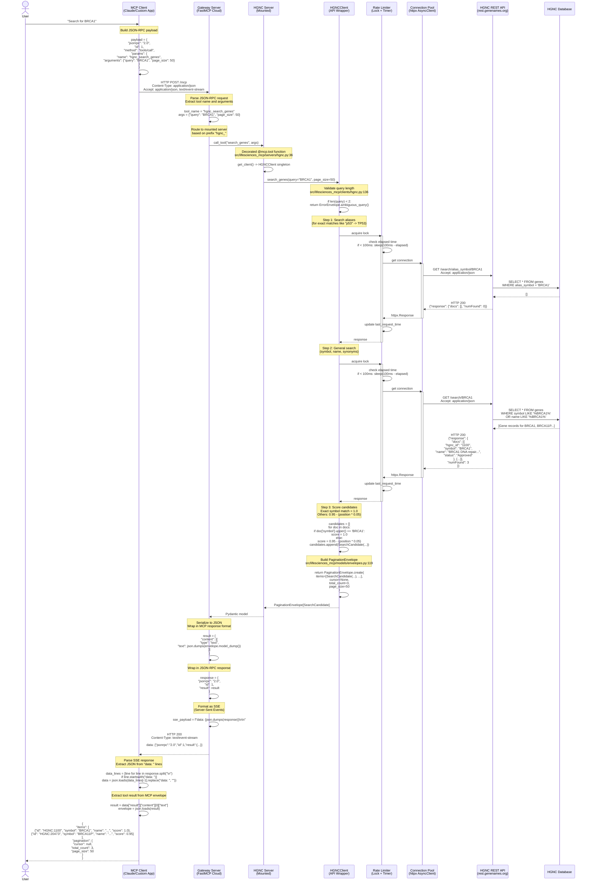
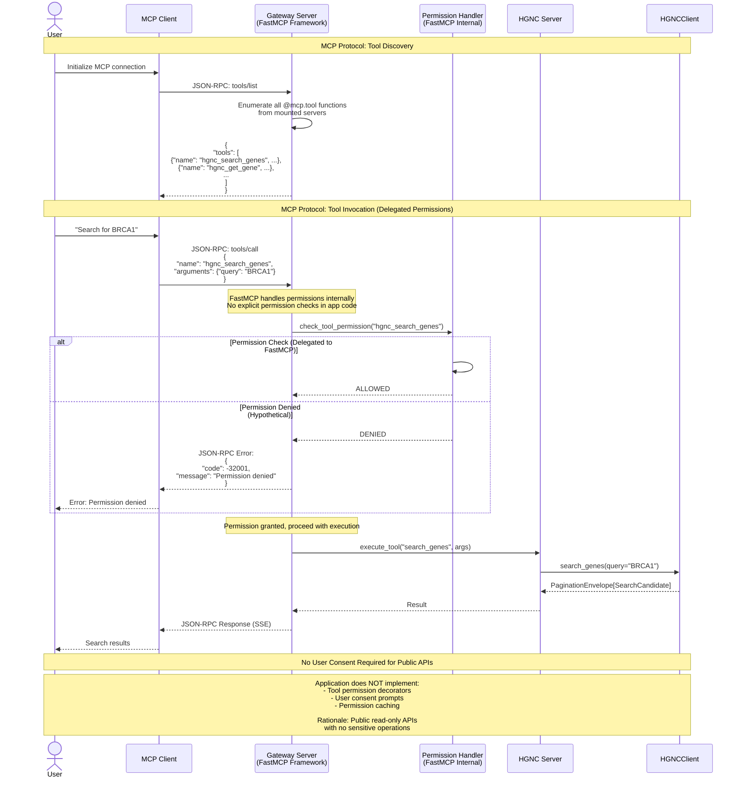
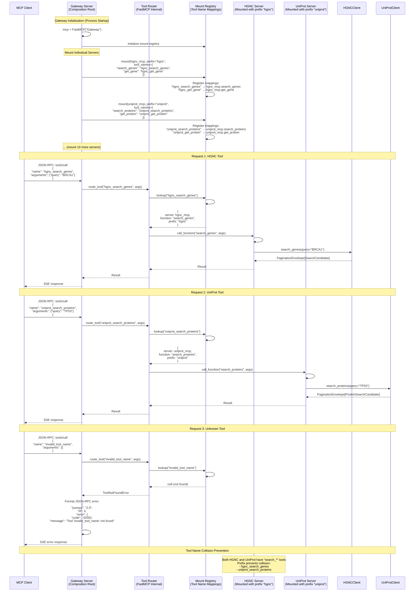

```mermaid
sequenceDiagram
    participant MCP_Client as MCP Client
    participant TCP as TCP Socket<br/>(HTTP/1.1)
    participant Gateway as Gateway Server<br/>(FastMCP Cloud)
    participant JSON_RPC as JSON-RPC Parser
    participant Tool_Executor as Tool Executor
    participant HGNC_Server as HGNC Server
    participant SSE_Formatter as SSE Formatter

    Note over MCP_Client,SSE_Formatter: Request: JSON-RPC 2.0 Method Call
    MCP_Client->>MCP_Client: Build JSON-RPC payload:<br/>{<br/>  "jsonrpc": "2.0",<br/>  "id": 42,<br/>  "method": "tools/call",<br/>  "params": {<br/>    "name": "hgnc_search_genes",<br/>    "arguments": {<br/>      "query": "BRCA1",<br/>      "page_size": 10<br/>    }<br/>  }<br/>}

    MCP_Client->>TCP: HTTP POST /mcp HTTP/1.1<br/>Host: lifesciences-research.fastmcp.app<br/>Content-Type: application/json<br/>Accept: application/json, text/event-stream<br/>Content-Length: 145<br/><br/>{JSON-RPC payload}

    TCP->>Gateway: TCP stream (HTTPS encrypted)
    Gateway->>Gateway: Parse HTTP headers<br/>Verify Content-Type
    Gateway->>JSON_RPC: Parse JSON-RPC request

    JSON_RPC->>JSON_RPC: Validate JSON-RPC 2.0:<br/>- "jsonrpc" = "2.0"<br/>- "id" must be number/string/null<br/>- "method" must be string<br/>- "params" optional (object/array)

    alt Invalid JSON-RPC Format
        JSON_RPC-->>Gateway: ParseError
        Gateway->>SSE_Formatter: Format error response
        SSE_Formatter->>SSE_Formatter: {<br/>  "jsonrpc": "2.0",<br/>  "id": null,<br/>  "error": {<br/>    "code": -32700,<br/>    "message": "Parse error"<br/>  }<br/>}
        SSE_Formatter->>TCP: HTTP 200 OK<br/>Content-Type: text/event-stream<br/><br/>data: {error response}<br/><br/>
        TCP-->>MCP_Client: Error response
    else Valid JSON-RPC Request
        JSON_RPC-->>Gateway: Parsed request
    end

    Note over Gateway: Extract method and params
    Gateway->>Gateway: method = request["method"]<br/>params = request.get("params", {})

    alt Unknown Method
        Gateway->>SSE_Formatter: Format error response
        SSE_Formatter->>SSE_Formatter: {<br/>  "jsonrpc": "2.0",<br/>  "id": 42,<br/>  "error": {<br/>    "code": -32601,<br/>    "message": "Method not found"<br/>  }<br/>}
        SSE_Formatter->>TCP: SSE error response
        TCP-->>MCP_Client: Error
    else Method = "tools/call"
        Gateway->>Tool_Executor: execute_tool(params)
    end

    Tool_Executor->>Tool_Executor: tool_name = params["name"]<br/>arguments = params.get("arguments", {})

    alt Tool Not Found
        Tool_Executor-->>Gateway: ToolNotFoundError
        Gateway->>SSE_Formatter: Format error response
        SSE_Formatter->>SSE_Formatter: {<br/>  "jsonrpc": "2.0",<br/>  "id": 42,<br/>  "error": {<br/>    "code": -32002,<br/>    "message": "Tool 'xyz' not found"<br/>  }<br/>}
        SSE_Formatter->>TCP: SSE error response
        TCP-->>MCP_Client: Error
    else Tool Found
        Tool_Executor->>HGNC_Server: call_tool(arguments)
    end

    Note over HGNC_Server: Execute tool logic
    HGNC_Server->>HGNC_Server: result = await search_genes(**arguments)

    alt Application Error (ErrorEnvelope)
        HGNC_Server-->>Tool_Executor: ErrorEnvelope(success=False, error={...})
        Note over Tool_Executor: Application errors returned as successful JSON-RPC<br/>with ErrorEnvelope in result
    else Unhandled Exception
        HGNC_Server-->>Tool_Executor: raise Exception("Database timeout")
        Tool_Executor-->>Gateway: InternalError
        Gateway->>SSE_Formatter: Format error response
        SSE_Formatter->>SSE_Formatter: {<br/>  "jsonrpc": "2.0",<br/>  "id": 42,<br/>  "error": {<br/>    "code": -32603,<br/>    "message": "Internal error",<br/>    "data": "Database timeout"<br/>  }<br/>}
        SSE_Formatter->>TCP: SSE error response
        TCP-->>MCP_Client: Error
    else Success (PaginationEnvelope)
        HGNC_Server-->>Tool_Executor: PaginationEnvelope[SearchCandidate]
        Tool_Executor->>Tool_Executor: Serialize Pydantic model to dict:<br/>result_dict = envelope.model_dump()
    end

    Note over Gateway: Wrap in MCP content array
    Tool_Executor->>Tool_Executor: mcp_result = {<br/>  "content": [{<br/>    "type": "text",<br/>    "text": json.dumps(result_dict)<br/>  }]<br/>}

    Tool_Executor-->>Gateway: MCP result

    Note over Gateway: Build JSON-RPC success response
    Gateway->>SSE_Formatter: Format success response
    SSE_Formatter->>SSE_Formatter: response = {<br/>  "jsonrpc": "2.0",<br/>  "id": 42,<br/>  "result": mcp_result<br/>}

    Note over SSE_Formatter: Format as Server-Sent Events (SSE)
    SSE_Formatter->>SSE_Formatter: sse_payload = f"data: {json.dumps(response)}\n\n"

    SSE_Formatter->>TCP: HTTP 200 OK<br/>Content-Type: text/event-stream<br/>Cache-Control: no-cache<br/>Connection: keep-alive<br/><br/>data: {"jsonrpc":"2.0","id":42,"result":{...}}<br/><br/>

    TCP-->>MCP_Client: SSE stream

    Note over MCP_Client: Parse SSE response
    MCP_Client->>MCP_Client: # Extract "data: " lines<br/>lines = [line for line in response.split("\n")<br/>         if line.startswith("data: ")]<br/><br/># Parse last data line<br/>data = json.loads(lines[-1].replace("data: ", ""))

    MCP_Client->>MCP_Client: # Validate JSON-RPC response<br/>assert data["jsonrpc"] == "2.0"<br/>assert data["id"] == 42<br/>assert "result" in data

    MCP_Client->>MCP_Client: # Extract MCP content<br/>result = data["result"]["content"][0]["text"]<br/>envelope = json.loads(result)

    MCP_Client->>MCP_Client: # Final result:<br/>{<br/>  "items": [...],<br/>  "pagination": {...}<br/>}
```

```mermaid
sequenceDiagram
    participant MCP_Client as MCP Client
    participant Gateway as Gateway Server
    participant HGNC_Server as HGNC Server
    participant HGNC_Client as HGNCClient
    participant Rate_Limiter as Rate Limiter
    participant HGNC_API as HGNC API

    Note over MCP_Client,HGNC_API: Scenario 1: Invalid CURIE Format (UNRESOLVED_ENTITY)
    MCP_Client->>Gateway: tools/call: hgnc_get_gene<br/>{"hgnc_id": "BRCA1"}
    Gateway->>HGNC_Server: get_gene("BRCA1")
    HGNC_Server->>HGNC_Client: get_gene("BRCA1")

    HGNC_Client->>HGNC_Client: Validate CURIE format<br/>src/lifesciences_mcp/clients/hgnc.py:283
    HGNC_Client->>HGNC_Client: if not HGNC_CURIE_PATTERN.match("BRCA1"):<br/>  # Pattern: ^HGNC:\d+$<br/>  return ErrorEnvelope.unresolved_entity()

    HGNC_Client-->>HGNC_Server: ErrorEnvelope(success=False,<br/>  error=ErrorDetail(<br/>    code="UNRESOLVED_ENTITY",<br/>    message="'BRCA1' is not a valid HGNC CURIE.",<br/>    recovery_hint="Call search_genes to resolve...",<br/>    invalid_input="BRCA1"<br/>  ))
    HGNC_Server-->>Gateway: ErrorEnvelope (wrapped in successful JSON-RPC)
    Gateway-->>MCP_Client: SSE response (JSON-RPC result contains ErrorEnvelope)
    MCP_Client->>MCP_Client: Check result["success"] == False<br/>Display error + recovery hint
    MCP_Client-->>MCP_Client: Agent self-correction:<br/>Call hgnc_search_genes("BRCA1") first

    Note over MCP_Client,HGNC_API: Scenario 2: Rate Limiting (429 Error with Retry-After)
    MCP_Client->>Gateway: tools/call: hgnc_search_genes<br/>{"query": "TP53"}
    Gateway->>HGNC_Server: search_genes("TP53")
    HGNC_Server->>HGNC_Client: search_genes("TP53")

    HGNC_Client->>Rate_Limiter: acquire lock
    activate Rate_Limiter
    Rate_Limiter->>Rate_Limiter: # Enforce 100ms spacing<br/>elapsed = now - last_request_time<br/>if elapsed < 0.1:<br/>  await asyncio.sleep(0.1 - elapsed)
    Rate_Limiter->>HGNC_API: GET /search/TP53
    HGNC_API-->>Rate_Limiter: HTTP 429 Too Many Requests<br/>Retry-After: 5
    Rate_Limiter->>Rate_Limiter: update last_request_time
    Rate_Limiter-->>HGNC_Client: response (429)
    deactivate Rate_Limiter

    Note over HGNC_Client: Exponential Backoff Loop<br/>src/lifesciences_mcp/clients/hgnc.py:84-107
    HGNC_Client->>HGNC_Client: for attempt in range(MAX_RETRIES=3):

    loop Retry Attempt 1
        HGNC_Client->>HGNC_Client: # Extract Retry-After header<br/>retry_after = response.headers.get("Retry-After")<br/>wait_time = int(retry_after) or 2^attempt<br/>wait_time = 5 seconds
        HGNC_Client->>HGNC_Client: # Sleep OUTSIDE lock<br/>await asyncio.sleep(5)

        HGNC_Client->>Rate_Limiter: acquire lock (retry)
        activate Rate_Limiter
        Rate_Limiter->>Rate_Limiter: # Re-check timing after lock<br/>elapsed = now - last_request_time<br/>if elapsed < 0.1:<br/>  await asyncio.sleep(0.1 - elapsed)
        Rate_Limiter->>HGNC_API: GET /search/TP53 (retry)
        HGNC_API-->>Rate_Limiter: HTTP 200 OK
        Rate_Limiter->>Rate_Limiter: update last_request_time
        Rate_Limiter-->>HGNC_Client: response (200)
        deactivate Rate_Limiter
        HGNC_Client->>HGNC_Client: break (success)
    end

    HGNC_Client->>HGNC_Client: Process successful response
    HGNC_Client-->>HGNC_Server: PaginationEnvelope[SearchCandidate]
    HGNC_Server-->>Gateway: Result
    Gateway-->>MCP_Client: SSE response (success)

    Note over MCP_Client,HGNC_API: Scenario 3: Maximum Retries Exceeded
    MCP_Client->>Gateway: tools/call: hgnc_search_genes<br/>{"query": "KRAS"}
    Gateway->>HGNC_Server: search_genes("KRAS")
    HGNC_Server->>HGNC_Client: search_genes("KRAS")

    HGNC_Client->>Rate_Limiter: acquire lock
    activate Rate_Limiter
    Rate_Limiter->>HGNC_API: GET /search/KRAS
    HGNC_API-->>Rate_Limiter: HTTP 429 (no Retry-After)
    Rate_Limiter-->>HGNC_Client: response (429)
    deactivate Rate_Limiter

    loop Retry Attempts (3 times)
        HGNC_Client->>HGNC_Client: wait_time = 2^attempt<br/>Attempt 1: 2s, Attempt 2: 4s, Attempt 3: 8s
        HGNC_Client->>HGNC_Client: await asyncio.sleep(wait_time)
        HGNC_Client->>Rate_Limiter: acquire lock (retry)
        activate Rate_Limiter
        Rate_Limiter->>HGNC_API: GET /search/KRAS (retry)
        HGNC_API-->>Rate_Limiter: HTTP 429 (still rate limited)
        Rate_Limiter-->>HGNC_Client: response (429)
        deactivate Rate_Limiter
    end

    HGNC_Client->>HGNC_Client: # All retries exhausted<br/>response.status_code == 429<br/>return ErrorEnvelope.rate_limited()

    HGNC_Client-->>HGNC_Server: ErrorEnvelope(success=False,<br/>  error=ErrorDetail(<br/>    code="RATE_LIMITED",<br/>    message="HGNC API rate limit exceeded.",<br/>    recovery_hint="Retry after a few seconds."<br/>  ))
    HGNC_Server-->>Gateway: ErrorEnvelope
    Gateway-->>MCP_Client: SSE response (JSON-RPC result contains ErrorEnvelope)
    MCP_Client->>MCP_Client: Agent self-correction:<br/>Wait and retry, or use cached data

    Note over MCP_Client,HGNC_API: Scenario 4: Entity Not Found (Valid CURIE, No Record)
    MCP_Client->>Gateway: tools/call: hgnc_get_gene<br/>{"hgnc_id": "HGNC:99999999"}
    Gateway->>HGNC_Server: get_gene("HGNC:99999999")
    HGNC_Server->>HGNC_Client: get_gene("HGNC:99999999")

    HGNC_Client->>HGNC_Client: Validate CURIE format<br/>HGNC_CURIE_PATTERN.match() → True

    HGNC_Client->>Rate_Limiter: acquire lock
    activate Rate_Limiter
    Rate_Limiter->>HGNC_API: GET /fetch/hgnc_id/99999999
    HGNC_API-->>Rate_Limiter: HTTP 200 OK<br/>{"response": {"docs": [], "numFound": 0}}
    Rate_Limiter-->>HGNC_Client: response (200 with empty docs)
    deactivate Rate_Limiter

    HGNC_Client->>HGNC_Client: docs = data["response"]["docs"]<br/>if not docs:<br/>  return ErrorEnvelope.entity_not_found()

    HGNC_Client-->>HGNC_Server: ErrorEnvelope(success=False,<br/>  error=ErrorDetail(<br/>    code="ENTITY_NOT_FOUND",<br/>    message="No gene found for HGNC ID 'HGNC:99999999'.",<br/>    recovery_hint="Verify the HGNC ID format...",<br/>    invalid_input="HGNC:99999999"<br/>  ))
    HGNC_Server-->>Gateway: ErrorEnvelope
    Gateway-->>MCP_Client: SSE response

    Note over MCP_Client,HGNC_API: Scenario 5: Upstream API Failure (500 Error)
    MCP_Client->>Gateway: tools/call: hgnc_search_genes<br/>{"query": "EGFR"}
    Gateway->>HGNC_Server: search_genes("EGFR")
    HGNC_Server->>HGNC_Client: search_genes("EGFR")

    HGNC_Client->>Rate_Limiter: acquire lock
    activate Rate_Limiter
    Rate_Limiter->>HGNC_API: GET /search/EGFR
    HGNC_API-->>Rate_Limiter: HTTP 500 Internal Server Error<br/>{"error": "Database connection failed"}
    Rate_Limiter-->>HGNC_Client: response (500)
    deactivate Rate_Limiter

    HGNC_Client->>HGNC_Client: if response.status_code >= 500:<br/>  return ErrorEnvelope.upstream_error(<br/>    status_code=500,<br/>    detail="Database connection failed"<br/>  )

    HGNC_Client-->>HGNC_Server: ErrorEnvelope(success=False,<br/>  error=ErrorDetail(<br/>    code="UPSTREAM_ERROR",<br/>    message="HGNC API returned error 500. Database connection failed",<br/>    recovery_hint="HGNC API may be temporarily unavailable..."<br/>  ))
    HGNC_Server-->>Gateway: ErrorEnvelope
    Gateway-->>MCP_Client: SSE response
    MCP_Client->>MCP_Client: Agent self-correction:<br/>Fall back to alternative database (e.g., Entrez)
```

```mermaid
sequenceDiagram
    actor User
    participant MCP_Client as MCP Client
    participant Gateway as Gateway Server
    participant HGNC_Server as HGNC Server
    participant UniProt_Server as UniProt Server
    participant STRING_Server as STRING Server
    participant HGNC_Client as HGNCClient
    participant UniProt_Client as UniProtClient
    participant STRING_Client as STRINGClient
    participant HGNC_API as HGNC API
    participant UniProt_API as UniProt API
    participant STRING_API as STRING API

    Note over User,STRING_API: Step 1: Resolve Gene Symbol to HGNC CURIE
    User->>MCP_Client: "Get information for TP53"
    MCP_Client->>Gateway: tools/call: hgnc_search_genes<br/>{"query": "TP53", "page_size": 1}
    Gateway->>HGNC_Server: search_genes("TP53")
    HGNC_Server->>HGNC_Client: search_genes("TP53")
    HGNC_Client->>HGNC_API: GET /search/TP53
    HGNC_API-->>HGNC_Client: SearchCandidate:<br/>id="HGNC:11998", symbol="TP53", score=1.0
    HGNC_Client-->>HGNC_Server: PaginationEnvelope[SearchCandidate]
    HGNC_Server-->>Gateway: Result
    Gateway-->>MCP_Client: Top hit: HGNC:11998
    MCP_Client->>MCP_Client: Store: gene_id = "HGNC:11998"

    Note over User,STRING_API: Step 2: Get Gene Details with Cross-References
    MCP_Client->>Gateway: tools/call: hgnc_get_gene<br/>{"hgnc_id": "HGNC:11998"}
    Gateway->>HGNC_Server: get_gene("HGNC:11998")
    HGNC_Server->>HGNC_Client: get_gene("HGNC:11998")
    HGNC_Client->>HGNC_API: GET /fetch/hgnc_id/11998
    HGNC_API-->>HGNC_Client: Gene record with xrefs

    Note over HGNC_Client: Build CrossReferences from API response<br/>src/lifesciences_mcp/clients/hgnc.py:333-344
    HGNC_Client->>HGNC_Client: cross_refs = CrossReferences(<br/>  ensembl_gene="ENSG00000141510",<br/>  uniprot=["P04637"],<br/>  entrez="7157",<br/>  refseq=["NM_000546"],<br/>  omim="191170"<br/>)

    HGNC_Client-->>HGNC_Server: Gene(id="HGNC:11998",<br/>  symbol="TP53",<br/>  name="tumor protein p53",<br/>  cross_references=cross_refs)
    HGNC_Server-->>Gateway: Result
    Gateway-->>MCP_Client: Gene with cross_references

    Note over MCP_Client: Extract cross-references for navigation
    MCP_Client->>MCP_Client: uniprot_ids = gene.cross_references.uniprot<br/># ["P04637"]<br/>ensembl_id = gene.cross_references.ensembl_gene<br/># "ENSG00000141510"<br/>entrez_id = gene.cross_references.entrez<br/># "7157"

    MCP_Client-->>User: Gene: TP53<br/>Available cross-refs: UniProt, Ensembl, Entrez

    Note over User,STRING_API: Step 3: Navigate to Protein Database (UniProt)
    User->>MCP_Client: "Get protein details for TP53"
    MCP_Client->>MCP_Client: Use cross-reference:<br/>uniprot_id = "P04637"

    MCP_Client->>Gateway: tools/call: uniprot_get_protein<br/>{"uniprot_id": "P04637"}
    Gateway->>UniProt_Server: get_protein("P04637")
    UniProt_Server->>UniProt_Client: get_protein("P04637")

    UniProt_Client->>UniProt_Client: Validate UniProt accession format<br/>Pattern: ^[A-Z0-9]{6,10}$

    UniProt_Client->>UniProt_API: GET /uniprotkb/P04637.json
    UniProt_API-->>UniProt_Client: Protein record

    Note over UniProt_Client: Build CrossReferences from UniProt response
    UniProt_Client->>UniProt_Client: cross_refs = CrossReferences(<br/>  hgnc="HGNC:11998",<br/>  ensembl_gene="ENSG00000141510",<br/>  entrez="7157",<br/>  string="9606.ENSP00000269305",<br/>  pdb=["1TUP", "1UOL", ...]<br/>)

    UniProt_Client-->>UniProt_Server: Protein(id="P04637",<br/>  name="Cellular tumor antigen p53",<br/>  sequence_length=393,<br/>  function="Acts as a tumor suppressor...",<br/>  cross_references=cross_refs)
    UniProt_Server-->>Gateway: Result
    Gateway-->>MCP_Client: Protein with cross_references

    Note over MCP_Client: Extract STRING ID for interactions
    MCP_Client->>MCP_Client: string_id = protein.cross_references.string<br/># "9606.ENSP00000269305"

    MCP_Client-->>User: Protein: p53, 393 aa<br/>Available cross-refs: STRING, PDB

    Note over User,STRING_API: Step 4: Navigate to Interaction Database (STRING)
    User->>MCP_Client: "Get protein interactions for TP53"
    MCP_Client->>MCP_Client: Use cross-reference:<br/>string_id = "9606.ENSP00000269305"

    MCP_Client->>Gateway: tools/call: string_get_interactions<br/>{"string_id": "9606.ENSP00000269305",<br/> "score_threshold": 400}
    Gateway->>STRING_Server: get_interactions(...)
    STRING_Server->>STRING_Client: get_interactions("9606.ENSP00000269305")

    STRING_Client->>STRING_Client: Validate STRING ID format<br/>Pattern: ^9606\.[A-Z0-9]+$

    STRING_Client->>STRING_API: GET /interaction_partners/json?<br/>identifiers=9606.ENSP00000269305&<br/>required_score=400
    STRING_API-->>STRING_Client: Interaction network (50 partners)

    Note over STRING_Client: Build InteractionNetwork with cross-references
    STRING_Client->>STRING_Client: cross_refs = InteractionCrossReferences(<br/>  string_ids=["9606.ENSP00000269305", ...],<br/>  uniprot_ids=["P04637", "Q16695", ...],<br/>  ensembl_genes=["ENSG00000141510", ...]<br/>)

    STRING_Client->>STRING_Client: interactions = [<br/>  Interaction(<br/>    protein_a="9606.ENSP00000269305",<br/>    protein_b="9606.ENSP00000345630",<br/>    preferred_name_a="TP53",<br/>    preferred_name_b="MDM2",<br/>    score=999,<br/>    evidence_scores=EvidenceScores(...)<br/>  ),<br/>  ...<br/>]

    STRING_Client-->>STRING_Server: InteractionNetwork(<br/>  query_protein_id="9606.ENSP00000269305",<br/>  interactions=interactions,<br/>  cross_references=cross_refs)
    STRING_Server-->>Gateway: Result
    Gateway-->>MCP_Client: InteractionNetwork with 50 interactions

    Note over MCP_Client: Extract partner cross-references
    MCP_Client->>MCP_Client: # Can navigate back to HGNC for partner genes:<br/>partner_uniprot_ids = cross_refs.uniprot_ids<br/># ["Q16695", "Q00987", ...]<br/><br/># Can query UniProt for partner details

    MCP_Client-->>User: Found 50 protein interactions<br/>Top partner: MDM2 (score=999)<br/>Can navigate to partner genes

    Note over User,STRING_API: Step 5: Navigate Back to Gene Database (Reverse)
    User->>MCP_Client: "Get gene details for interaction partner MDM2"
    MCP_Client->>MCP_Client: # Extract UniProt ID for MDM2 from interactions:<br/>mdm2_uniprot = "Q16695"

    MCP_Client->>Gateway: tools/call: uniprot_get_protein<br/>{"uniprot_id": "Q16695"}
    Gateway->>UniProt_Server: get_protein("Q16695")
    UniProt_Server->>UniProt_Client: get_protein("Q16695")
    UniProt_Client->>UniProt_API: GET /uniprotkb/Q16695.json
    UniProt_API-->>UniProt_Client: Protein: MDM2

    UniProt_Client->>UniProt_Client: cross_refs = CrossReferences(<br/>  hgnc="HGNC:6973",<br/>  ensembl_gene="ENSG00000135679",<br/>  ...<br/>)

    UniProt_Client-->>UniProt_Server: Protein with cross_references
    UniProt_Server-->>Gateway: Result
    Gateway-->>MCP_Client: Protein: MDM2

    Note over MCP_Client: Navigate back to HGNC using cross-reference
    MCP_Client->>MCP_Client: mdm2_hgnc_id = protein.cross_references.hgnc<br/># "HGNC:6973"

    MCP_Client->>Gateway: tools/call: hgnc_get_gene<br/>{"hgnc_id": "HGNC:6973"}
    Gateway->>HGNC_Server: get_gene("HGNC:6973")
    HGNC_Server->>HGNC_Client: get_gene("HGNC:6973")
    HGNC_Client->>HGNC_API: GET /fetch/hgnc_id/6973
    HGNC_API-->>HGNC_Client: Gene: MDM2
    HGNC_Client-->>HGNC_Server: Gene(id="HGNC:6973", symbol="MDM2", ...)
    HGNC_Server-->>Gateway: Result
    Gateway-->>MCP_Client: Gene: MDM2

    MCP_Client-->>User: Gene: MDM2 (interaction partner of TP53)<br/>Complete navigation: HGNC → UniProt → STRING → UniProt → HGNC
```

# Data Flow Analysis

## Overview

The Life Sciences MCP system implements a sophisticated data flow architecture with multiple interaction patterns. The system uses **JSON-RPC 2.0 over HTTP with Server-Sent Events (SSE)** for client-server communication, implementing the **Fuzzy-to-Fact protocol** for entity resolution across 13 life sciences databases.

Key data flow patterns:
- **Simple Query Flow**: Single-turn fuzzy search or fact retrieval
- **Interactive Session Flow**: Multi-turn conversation with connection reuse
- **Tool Permission Flow**: MCP protocol permission handling (delegated to FastMCP framework)
- **MCP Server Communication**: JSON-RPC 2.0 protocol implementation
- **Message Routing**: Gateway-based tool name resolution and server mounting
- **Error Handling**: Canonical error envelopes with recovery hints
- **Cross-Reference Resolution**: Inter-database navigation via 22-key registry

All flows implement:
- **Rate limiting** with exponential backoff (10 req/s for most APIs)
- **Connection pooling** (max 10 concurrent connections per client)
- **Granular timeouts** (connect: 5s, read: 30s, write: 10s, pool: 5s)
- **Pydantic validation** on all request/response payloads

**Protocol Details**:
- Transport: HTTP POST to `/mcp` endpoint
- Format: JSON-RPC 2.0 (method: `tools/call`)
- Response: Server-Sent Events (SSE) with JSON payloads
- Deployment: FastMCP Cloud at `https://lifesciences-research.fastmcp.app/mcp`

---

## 1. Simple Query Flow (Fuzzy Search)

### Scenario
User searches for a gene using fuzzy search - the first phase of the Fuzzy-to-Fact protocol. Example: "Search for BRCA1 gene".

### Sequence Diagram



### Flow Steps

1. **User Request**: User issues natural language query to MCP client (e.g., Claude)
2. **JSON-RPC Construction**: MCP client constructs JSON-RPC 2.0 payload with method `tools/call`
   - File: `scripts/showcase_nsclc_v2_fastmcp.py:56-65`
   - Includes `jsonrpc`, `id`, `method`, and `params` (tool name + arguments)
3. **HTTP Transport**: Client sends POST request to gateway endpoint with dual Accept headers
   - Accepts both `application/json` and `text/event-stream`
4. **Gateway Routing**: Gateway parses JSON-RPC and routes based on tool name prefix
   - File: `src/lifesciences_mcp/servers/gateway.py:52-55`
   - Tool name `hgnc_search_genes` → routes to HGNC server's `search_genes` function
5. **Server Invocation**: Gateway calls mounted server's decorated tool function
   - File: `src/lifesciences_mcp/servers/hgnc.py:36-64`
   - Server retrieves singleton client instance with lazy initialization
6. **Client Processing**: HGNCClient implements two-phase search strategy
   - **Phase 1**: Search alias_symbol field for exact matches (lines 155-271)
   - **Phase 2**: Search general endpoint for symbol/name matches (line 159)
7. **Rate Limiting**: Each API call acquires async lock and enforces 100ms minimum spacing
   - File: `src/lifesciences_mcp/clients/hgnc.py:62-108`
   - Prevents thundering herd by checking elapsed time AFTER acquiring lock
8. **Connection Pooling**: Reuses existing httpx connection from pool (max 10 connections)
   - File: `src/lifesciences_mcp/clients/base.py:41-65`
   - Lazy initialization with granular timeout configuration
9. **Upstream API Request**: HTTP GET to HGNC REST API with JSON Accept header
10. **Database Query**: HGNC API queries PostgreSQL database with LIKE clauses
11. **Response Processing**: Client transforms upstream response to Pydantic models
    - Score exact symbol matches at 1.0, position-based decay for others (lines 213-227)
    - Merges alias matches (boosted to 1.0) with general results
12. **Pagination Envelope**: Wraps results in canonical pagination envelope
    - File: `src/lifesciences_mcp/models/envelopes.py:119-144`
    - Includes opaque cursor (Base64-encoded offset) for next page
13. **Server Response**: Returns Pydantic model to gateway
14. **JSON Serialization**: Gateway serializes Pydantic model to JSON
15. **MCP Envelope**: Wraps JSON in MCP content array format
16. **JSON-RPC Response**: Wraps content in JSON-RPC 2.0 response with matching `id`
17. **SSE Formatting**: Formats as Server-Sent Events with "data: " prefix
18. **Client Parsing**: MCP client extracts JSON from SSE format (lines 82-115)
19. **Result Extraction**: Extracts tool result from nested MCP envelope structure
20. **User Presentation**: Presents ranked candidates to user for selection

### Key Points

- **Two-Phase Search Strategy**: Alias search first (for common names like "p53"), then general search
- **Score Boosting**: Exact symbol matches and alias matches both get score=1.0 for deterministic ranking
- **Client-Side Pagination**: HGNC API lacks pagination support, so client implements cursor-based pagination
- **Ambiguity Detection**: Queries returning >100 results with <3 characters trigger AMBIGUOUS_QUERY error
- **Rate Limit Enforcement**: Lock-based rate limiting with re-check after acquisition prevents race conditions
- **Connection Reuse**: HTTP connection pooling reduces latency for subsequent requests
- **Token Efficiency**: Slim mode support (not shown) returns only id/symbol/name/score (~20 tokens per entity)
- **Error Resilience**: Alias search failures silently fall through to general search (line 269-270)

**Performance Notes**:
- Typical latency: 200-400ms (includes rate limiting delays)
- Cache hit (connection pool): ~100ms saved vs new connection
- Parallel execution: Not applicable for single client (lock serializes requests)

---

## 2. Interactive Client Session Flow

### Scenario
User performs multiple queries in a session, leveraging connection pooling and the Fuzzy-to-Fact protocol. Example: Search for gene → Get details → Get protein interactions.

### Sequence Diagram

```mermaid
sequenceDiagram
    actor User
    participant MCP_Client as MCP Client<br/>(Session)
    participant HTTP_Client as httpx.AsyncClient<br/>(Persistent)
    participant Gateway as Gateway Server
    participant HGNC_Server as HGNC Server
    participant HGNC_Client as HGNCClient<br/>(Singleton)
    participant STRING_Server as STRING Server
    participant STRING_Client as STRINGClient<br/>(Singleton)
    participant Connection_Pool as Connection Pool<br/>(Shared)
    participant HGNC_API as HGNC API
    participant STRING_API as STRING API

    Note over User,STRING_API: Session Initialization
    User->>MCP_Client: Initialize session
    MCP_Client->>HTTP_Client: httpx.AsyncClient(timeout=120.0)
    activate HTTP_Client

    Note over User,STRING_API: Request 1: Fuzzy Search (Phase 1)
    User->>MCP_Client: "Search for TP53"
    MCP_Client->>MCP_Client: request_id = 1<br/>tool = "hgnc_search_genes"
    MCP_Client->>Gateway: POST /mcp (JSON-RPC id=1)<br/>Reuse HTTP/1.1 connection
    Gateway->>HGNC_Server: route to hgnc_search_genes
    HGNC_Server->>HGNC_Client: get_client() → singleton
    activate HGNC_Client
    HGNC_Client->>Connection_Pool: get connection (HGNC)
    activate Connection_Pool
    Connection_Pool->>HGNC_API: GET /search/TP53
    HGNC_API-->>Connection_Pool: 200 OK (candidates)
    Connection_Pool-->>HGNC_Client: response
    deactivate Connection_Pool
    HGNC_Client-->>HGNC_Server: PaginationEnvelope[SearchCandidate]
    HGNC_Server-->>Gateway: Pydantic model
    Gateway-->>MCP_Client: SSE response (id=1)<br/>HTTP Keep-Alive
    MCP_Client-->>User: Top hit: TP53 (HGNC:11998, score=1.0)

    Note over User,STRING_API: Request 2: Fact Retrieval (Phase 2)
    User->>MCP_Client: "Get full details for HGNC:11998"
    MCP_Client->>MCP_Client: request_id = 2<br/>tool = "hgnc_get_gene"
    MCP_Client->>Gateway: POST /mcp (JSON-RPC id=2)<br/>Reuse connection (HTTP Keep-Alive)
    Gateway->>HGNC_Server: route to hgnc_get_gene
    HGNC_Server->>HGNC_Client: get_gene("HGNC:11998")<br/>Same singleton instance
    HGNC_Client->>HGNC_Client: Validate CURIE format<br/>HGNC_CURIE_PATTERN.match()
    HGNC_Client->>Connection_Pool: get connection (HGNC)<br/>Reuse from pool
    activate Connection_Pool
    Connection_Pool->>HGNC_API: GET /fetch/hgnc_id/11998
    HGNC_API-->>Connection_Pool: 200 OK (full gene record)
    Connection_Pool-->>HGNC_Client: response
    deactivate Connection_Pool
    HGNC_Client->>HGNC_Client: _build_cross_references(doc)<br/>Extract: ensembl_gene, uniprot, entrez
    HGNC_Client-->>HGNC_Server: Gene(id="HGNC:11998", cross_references={...})
    HGNC_Server-->>Gateway: Pydantic model
    Gateway-->>MCP_Client: SSE response (id=2)<br/>HTTP Keep-Alive
    MCP_Client->>MCP_Client: Extract cross-references:<br/>uniprot: ["P04637"]
    MCP_Client-->>User: Gene: TP53, UniProt: P04637

    Note over User,STRING_API: Request 3: Cross-Reference Navigation
    User->>MCP_Client: "Get protein interactions for P04637"
    MCP_Client->>MCP_Client: request_id = 3<br/>tool = "string_search_proteins"
    MCP_Client->>Gateway: POST /mcp (JSON-RPC id=3)<br/>Reuse connection
    Gateway->>STRING_Server: route to string_search_proteins
    STRING_Server->>STRING_Client: get_client() → singleton
    activate STRING_Client
    STRING_Client->>Connection_Pool: get connection (STRING)<br/>New connection (different API)
    activate Connection_Pool
    Connection_Pool->>Connection_Pool: Open new connection<br/>(Pool has capacity: 1/10 used)
    Connection_Pool->>STRING_API: GET /network?identifier=P04637
    STRING_API-->>Connection_Pool: 200 OK (STRING ID: 9606.ENSP00000269305)
    Connection_Pool-->>STRING_Client: response
    deactivate Connection_Pool
    STRING_Client-->>STRING_Server: PaginationEnvelope[InteractionSearchCandidate]
    STRING_Server-->>Gateway: Pydantic model
    Gateway-->>MCP_Client: SSE response (id=3)<br/>HTTP Keep-Alive
    MCP_Client-->>User: STRING ID: 9606.ENSP00000269305

    Note over User,STRING_API: Request 4: Interaction Retrieval
    User->>MCP_Client: "Get interactions for 9606.ENSP00000269305"
    MCP_Client->>MCP_Client: request_id = 4<br/>tool = "string_get_interactions"
    MCP_Client->>Gateway: POST /mcp (JSON-RPC id=4)<br/>Reuse connection
    Gateway->>STRING_Server: route to string_get_interactions
    STRING_Server->>STRING_Client: get_interactions("9606.ENSP00000269305")<br/>Same singleton instance
    STRING_Client->>STRING_Client: Rate limit: 1 req/sec<br/>Wait 1000ms since last request
    STRING_Client->>Connection_Pool: get connection (STRING)<br/>Reuse from pool
    activate Connection_Pool
    Connection_Pool->>STRING_API: GET /interaction_partners/json?<br/>identifiers=9606.ENSP00000269305
    STRING_API-->>Connection_Pool: 200 OK (interaction network)
    Connection_Pool-->>STRING_Client: response
    deactivate Connection_Pool
    STRING_Client->>STRING_Client: Build InteractionNetwork<br/>with evidence scores
    STRING_Client-->>STRING_Server: InteractionNetwork(interactions=[...])
    STRING_Server-->>Gateway: Pydantic model
    Gateway-->>MCP_Client: SSE response (id=4)<br/>HTTP Keep-Alive
    MCP_Client-->>User: 50 protein interactions found

    Note over User,STRING_API: Session Cleanup
    User->>MCP_Client: End session
    MCP_Client->>HTTP_Client: await client.aclose()
    HTTP_Client->>Connection_Pool: Close all connections
    deactivate Connection_Pool
    deactivate STRING_Client
    deactivate HGNC_Client
    HTTP_Client-->>MCP_Client: Cleanup complete
    deactivate HTTP_Client
    MCP_Client-->>User: Session closed
```

### Flow Steps

1. **Session Initialization**: MCP client creates persistent httpx.AsyncClient
   - File: `scripts/showcase_nsclc_v2_fastmcp.py:51-54`
   - Single HTTP client for entire session (timeout: 120s for slow ChEMBL SDK)
2. **Request 1 - Fuzzy Search**: User searches for gene symbol "TP53"
   - JSON-RPC request with id=1
   - Gateway routes to HGNC server based on prefix
   - HGNC server lazily initializes singleton client (lines 28-33)
   - Connection pool opens first connection to HGNC API
   - Returns ranked candidates with scores
3. **Request 2 - Fact Retrieval**: User selects top candidate and requests full details
   - JSON-RPC request with id=2
   - **Connection Reuse**: HTTP Keep-Alive maintains connection to gateway
   - **Client Reuse**: Same HGNC singleton instance (no re-initialization)
   - **Pool Reuse**: Connection pool reuses existing HGNC API connection
   - Validates CURIE format before API call (Fuzzy-to-Fact enforcement)
   - Builds CrossReferences from API response (22-key registry)
4. **Request 3 - Cross-Reference Navigation**: User uses UniProt ID from cross-references
   - JSON-RPC request with id=3
   - Gateway routes to different server (STRING) based on prefix
   - STRING server initializes its own singleton client
   - **New Connection**: Pool opens second connection (different API endpoint)
   - Connection pool now has 2/10 connections in use
5. **Request 4 - Interaction Retrieval**: User retrieves interaction network
   - JSON-RPC request with id=4
   - **All Reuse**: Same gateway connection, STRING client, and API connection
   - Rate limiting enforces 1-second delay (STRING's strict limit)
   - Returns complex nested model (InteractionNetwork with evidence scores)
6. **Session Cleanup**: MCP client closes when user ends session
   - File: `scripts/showcase_nsclc_v2_fastmcp.py:119-121`
   - Closes HTTP client, which releases all pooled connections
   - Server-side clients remain alive (process-level singletons)

### Key Points

- **HTTP Keep-Alive**: Single TCP connection to gateway for entire session reduces latency
- **Singleton Clients**: Server-side clients initialized once per process, shared across requests
- **Connection Pooling**: Each client maintains its own pool of connections to upstream APIs
  - Base class: `src/lifesciences_mcp/clients/base.py:41-65`
  - Max 10 connections per client by default
  - Connections kept alive between requests for performance
- **Rate Limiting Per Client**: Each client enforces its own rate limit independently
  - HGNC: 10 req/s (100ms spacing)
  - STRING: 1 req/s (1000ms spacing)
  - Rate limits apply to singleton instance, affecting all concurrent users
- **Stateless Protocol**: Each JSON-RPC request is independent (no session state on server)
- **Request ID Tracking**: Client increments request_id for correlation (not used for ordering)
- **Cross-Database Navigation**: Cross-references enable seamless flow across databases
  - HGNC gene → UniProt protein → STRING interactions
  - 22-key registry provides universal mapping
- **Fuzzy-to-Fact Workflow**: Session demonstrates complete two-phase protocol
  - Phase 1: Fuzzy search with scoring (request 1)
  - Phase 2: Strict CURIE-based retrieval (request 2)
  - Navigation: Use cross-references to query other databases (requests 3-4)

**Performance Impact**:
- First request: ~200ms (new connection + API call)
- Subsequent requests (same API): ~100ms (connection reuse)
- Subsequent requests (different API): ~150ms (new connection to different endpoint)
- Session overhead: Negligible (HTTP Keep-Alive maintained automatically)

**Concurrency Considerations**:
- Multiple users share singleton clients (potential contention)
- Rate limiting uses async locks (serializes requests to same API)
- Connection pool supports concurrent requests up to max_connections limit
- Gateway can handle multiple concurrent sessions (FastMCP handles multiplexing)

---

## 3. Tool Permission Callback Flow

### Scenario
MCP protocol includes optional tool permission callbacks for security. In this system, **tool permissions are delegated to the FastMCP framework** - the application code does not implement explicit permission checks.

### Sequence Diagram



### Flow Steps

1. **Tool Discovery**: MCP client queries gateway for available tools
   - JSON-RPC method: `tools/list`
   - Gateway enumerates all `@mcp.tool` decorated functions from mounted servers
   - Returns tool metadata (name, description, parameters)
2. **Tool Invocation**: User attempts to call a tool via MCP client
   - JSON-RPC method: `tools/call` with tool name and arguments
3. **Permission Check**: FastMCP framework performs internal permission validation
   - **Public Deployment** (FastMCP Cloud): All tools allowed by default
   - **Private Deployment**: May require API key or authentication
   - **Enterprise**: Custom ACLs and role-based access control
4. **Permission Denied Path** (Hypothetical): If permission check fails
   - Gateway returns JSON-RPC error with code `-32001` (method not allowed)
   - MCP client presents error to user
5. **Permission Granted Path**: If permission check succeeds
   - Gateway proceeds with tool execution
   - No application-level permission checks (delegated to framework)

### Key Points

- **Delegated Security Model**: Application code does not implement permission checks
  - FastMCP framework handles all authorization
  - Simplifies application development
  - Centralized security policy
- **No User Consent Required**: Read-only public APIs do not require user consent
  - Tools access public scientific databases (HGNC, UniProt, etc.)
  - No write operations, no sensitive data
  - No financial cost to user
- **No Permission Caching**: Each request validated independently
  - Stateless protocol: no session state
  - Permission checks are lightweight (framework-level)
- **Public Deployment Model**: FastMCP Cloud deployment is public by default
  - No authentication required for tool access
  - Rate limiting enforced at API level (not permission level)
  - Future: May add API key requirement for abuse prevention
- **Enterprise Considerations**: Private deployments may implement:
  - OAuth 2.0 authentication
  - Role-based access control (RBAC)
  - Tool-level permissions (e.g., read-only vs write)
  - Audit logging of tool invocations

**Comparison to MCP Specification**:
- **MCP Protocol**: Defines optional permission callbacks (`tools/approve`, `tools/revoke`)
- **This Implementation**: Does not implement these callbacks (delegated to FastMCP)
- **Rationale**: Public read-only APIs do not require granular permission management

**Security Boundaries**:
- **Application Layer**: No explicit security (delegates to framework)
- **Framework Layer**: FastMCP Cloud handles authentication and authorization
- **API Layer**: Upstream APIs enforce their own rate limits and access controls
- **Network Layer**: HTTPS encryption for all communication

---

## 4. MCP Server Communication Flow

### Scenario
Deep dive into JSON-RPC 2.0 protocol implementation showing exact message formats, error handling, and Server-Sent Events (SSE) transport.

### Sequence Diagram



### Flow Steps

1. **Request Construction**: MCP client builds JSON-RPC 2.0 payload
   - **Required fields**: `jsonrpc` (version), `id` (correlation), `method` (operation)
   - **Optional field**: `params` (object with `name` and `arguments`)
   - File: `scripts/showcase_nsclc_v2_fastmcp.py:60-65`
2. **HTTP Transport**: Client sends POST request with dual Accept headers
   - Accepts both `application/json` (fallback) and `text/event-stream` (preferred)
   - HTTPS encryption via TLS 1.2+ (FastMCP Cloud requirement)
3. **JSON-RPC Parsing**: Gateway validates JSON-RPC 2.0 structure
   - Checks `jsonrpc` field equals `"2.0"`
   - Validates `id` type (number, string, or null for notifications)
   - Validates `method` is a string
4. **Method Dispatch**: Gateway routes based on method name
   - Method `tools/call` → Tool executor
   - Method `tools/list` → Tool discovery handler
   - Unknown method → Error -32601 (Method not found)
5. **Tool Resolution**: Tool executor extracts tool name and arguments
   - Tool name format: `<prefix>_<function>` (e.g., `hgnc_search_genes`)
   - Resolves to mounted server's function
   - Tool not found → Error -32002 (custom error code)
6. **Tool Execution**: Gateway invokes server's decorated function
   - File: `src/lifesciences_mcp/servers/hgnc.py:36-64`
   - Returns Pydantic model or ErrorEnvelope
7. **Error Handling**: Three error scenarios:
   - **Protocol Error** (invalid JSON-RPC): Error -32700, -32600, -32601, -32602
   - **Application Error** (ErrorEnvelope): Wrapped in successful JSON-RPC response
   - **Unhandled Exception**: Error -32603 (Internal error)
8. **Result Serialization**: Pydantic model converted to JSON
   - `model_dump()` produces dict
   - Wrapped in MCP content array format
9. **JSON-RPC Response**: Wrapped in JSON-RPC 2.0 success response
   - Includes matching `id` from request for correlation
   - Result nested in `result` field
10. **SSE Formatting**: Response formatted as Server-Sent Events
    - Each line prefixed with `"data: "`
    - Terminated with double newline `\n\n`
    - HTTP headers: `Content-Type: text/event-stream`, `Cache-Control: no-cache`
11. **Client Parsing**: MCP client extracts JSON from SSE format
    - File: `scripts/showcase_nsclc_v2_fastmcp.py:82-115`
    - Filters lines starting with `"data: "`
    - Parses last line as JSON (complete response)
12. **Result Extraction**: Client unwraps nested envelope structure
    - Validates JSON-RPC response (checks `id` matches)
    - Extracts MCP content array
    - Parses JSON from `text` field

### Key Points

- **JSON-RPC 2.0 Compliance**: Strict adherence to specification (RFC 4627)
  - Request: `jsonrpc`, `method`, `params`, `id`
  - Response: `jsonrpc`, `result` XOR `error`, `id`
  - Error codes: Standard codes (-32700 to -32603) + custom codes
- **Transport Independence**: JSON-RPC 2.0 works over any transport (HTTP, WebSocket, IPC)
  - This implementation uses HTTP POST (stateless)
  - FastMCP Cloud deployment uses HTTPS (TLS encryption)
- **Server-Sent Events (SSE)**: Unidirectional streaming format
  - Simple text-based protocol (easier to debug than binary)
  - Browser-compatible (EventSource API)
  - Allows future streaming of partial results (not currently used)
  - Format: `data: {JSON}\n\n` (two newlines terminate message)
- **Error Handling Strategy**: Three-level error hierarchy
  - **Level 1**: JSON-RPC protocol errors (client can retry)
  - **Level 2**: Application errors (ErrorEnvelope with recovery hints)
  - **Level 3**: Internal errors (server bug, unhandled exception)
- **Request Correlation**: `id` field enables async request/response matching
  - Client can send multiple requests without waiting for responses
  - Gateway returns `id` in response for correlation
  - Null `id` means notification (no response expected)
- **Content Wrapping**: MCP protocol adds extra layer of structure
  - Tool results wrapped in content array (future: support images, files)
  - Content type: `text` (JSON-serialized), `image`, `resource`
  - Enables rich multi-modal responses

**Protocol Stack**:
```
┌─────────────────────────────────────┐
│  Application Layer (Pydantic)       │  ErrorEnvelope, PaginationEnvelope
├─────────────────────────────────────┤
│  MCP Layer (Content Array)          │  {"content": [{"type": "text", "text": "..."}]}
├─────────────────────────────────────┤
│  JSON-RPC 2.0 Layer                 │  {"jsonrpc": "2.0", "id": N, "result": {...}}
├─────────────────────────────────────┤
│  SSE Layer (Server-Sent Events)     │  data: {JSON}\n\n
├─────────────────────────────────────┤
│  HTTP Layer                          │  POST /mcp, Headers, Body
├─────────────────────────────────────┤
│  TLS Layer                           │  HTTPS encryption
├─────────────────────────────────────┤
│  TCP/IP Layer                        │  Reliable byte stream
└─────────────────────────────────────┘
```

**Example Payloads**:

**Request** (JSON-RPC 2.0):
```json
{
  "jsonrpc": "2.0",
  "id": 1,
  "method": "tools/call",
  "params": {
    "name": "hgnc_search_genes",
    "arguments": {"query": "BRCA1", "page_size": 10}
  }
}
```

**Response** (JSON-RPC 2.0 wrapped in SSE):
```
data: {"jsonrpc":"2.0","id":1,"result":{"content":[{"type":"text","text":"{\"items\":[{\"id\":\"HGNC:1100\",\"symbol\":\"BRCA1\",\"name\":\"BRCA1 DNA repair associated\",\"score\":1.0}],\"pagination\":{\"cursor\":null,\"total_count\":1,\"page_size\":10}}"}]}}

```

**Error Response** (Rate Limited):
```
data: {"jsonrpc":"2.0","id":1,"result":{"content":[{"type":"text","text":"{\"success\":false,\"error\":{\"code\":\"RATE_LIMITED\",\"message\":\"HGNC API rate limit exceeded.\",\"recovery_hint\":\"Retry after a few seconds.\"}}"}]}}

```

---

## 5. Message Parsing and Routing

### Scenario
Gateway receives requests and routes to individual servers based on tool name prefix. Shows how mounting works and how tools are disambiguated.

### Sequence Diagram



### Flow Steps

1. **Gateway Initialization**: On process startup, gateway creates FastMCP instance
   - File: `src/lifesciences_mcp/servers/gateway.py:49`
   - Single gateway server composes all individual servers
2. **Server Mounting**: Gateway mounts each individual server with prefix and tool name mapping
   - File: `src/lifesciences_mcp/servers/gateway.py:52-109`
   - Prefix: Namespace for tool names (e.g., "hgnc", "uniprot")
   - Tool names: Explicit mapping from local name to global name
   - Example: `mount(hgnc_mcp, prefix="hgnc", tool_names={"search_genes": "hgnc_search_genes"})`
3. **Registry Population**: Mount registry stores all tool name mappings
   - Maps global tool name → (server, local function name)
   - Enables O(1) lookup during request routing
4. **Request Receipt**: Gateway receives JSON-RPC request with tool name
5. **Tool Name Extraction**: Parse `params.name` from JSON-RPC payload
6. **Registry Lookup**: Router queries mount registry for tool mapping
   - Key: Global tool name (e.g., "hgnc_search_genes")
   - Value: Server reference + local function name
7. **Routing Decision**: Three outcomes:
   - **Found**: Route to mapped server and function
   - **Not Found**: Return JSON-RPC error -32002
   - **Ambiguous**: Impossible due to prefix-based namespacing
8. **Function Invocation**: Router calls decorated function on target server
   - Passes arguments directly (no transformation)
   - Function signature validated against JSON-RPC arguments
9. **Result Propagation**: Result flows back through router to gateway
10. **Response Formatting**: Gateway wraps result in JSON-RPC response

### Key Points

- **Prefix-Based Namespacing**: Prevents tool name collisions across servers
  - All 13 servers have similar tool names (`search_*`, `get_*`)
  - Prefix makes names globally unique (`hgnc_search_genes` vs `uniprot_search_proteins`)
  - File: `src/lifesciences_mcp/servers/gateway.py:52-109`
- **Explicit Tool Name Mapping**: Manual mapping provides flexibility
  - Can rename tools without changing server code
  - Can hide tools from gateway (selective mounting)
  - Example: DrugBank server excluded from gateway (line 45-46)
- **Direct Mounting (No Proxy)**: `as_proxy=False` enables zero-copy mounting
  - Server functions called directly (no HTTP overhead)
  - All servers run in same process (shared memory)
  - Performance: Microseconds for routing (vs milliseconds for HTTP proxy)
- **Mount Registry Implementation**: FastMCP framework maintains internal registry
  - O(1) lookup by tool name (hash table)
  - Populated at initialization, immutable during runtime
  - Thread-safe for concurrent access
- **Tool Discovery**: Gateway enumerates all mounted tools for `tools/list` method
  - Iterates mount registry
  - Returns tool metadata (name, description, parameters)
  - Client uses this for autocomplete and validation
- **Error Handling**: Unknown tool names return standard JSON-RPC error
  - Code: -32002 (custom, not in JSON-RPC spec)
  - Message: Includes tool name for debugging
  - Client can distinguish from other errors (protocol vs application)
- **Selective Mounting**: Gateway can exclude servers
  - DrugBank excluded due to commercial API key requirement
  - Could exclude beta/experimental servers
  - Could mount different servers per deployment environment

**Tool Name Convention**:
```
<prefix>_<operation>_<resource>
   ↓         ↓          ↓
 hgnc    search      genes
uniprot   get       protein
chembl   get     compounds_batch
```

**Mount Configuration** (Excerpt from `gateway.py`):
```python
mcp.mount(hgnc_mcp, prefix="hgnc", as_proxy=False, tool_names={
    "search_genes": "hgnc_search_genes",
    "get_gene": "hgnc_get_gene"
})

mcp.mount(uniprot_mcp, prefix="uniprot", as_proxy=False, tool_names={
    "search_proteins": "uniprot_search_proteins",
    "get_protein": "uniprot_get_protein"
})

mcp.mount(chembl_mcp, prefix="chembl", as_proxy=False, tool_names={
    "search_compounds": "chembl_search_compounds",
    "get_compound": "chembl_get_compound",
    "get_compounds_batch": "chembl_get_compounds_batch"
})

# ... (10 more servers)
```

**Total Tools**: 35+ tools across 13 servers (2-4 tools per server)

---

## 6. Error Handling Flow

### Scenario
Comprehensive error handling showing rate limiting, exponential backoff, canonical error envelopes, and recovery hints.

### Sequence Diagram



### Flow Steps

**Scenario 1: UNRESOLVED_ENTITY (Invalid CURIE Format)**
1. User passes raw string ("BRCA1") to strict tool (`get_gene`)
2. Client validates CURIE format using regex: `^HGNC:\d+$`
3. Validation fails → Returns `ErrorEnvelope.unresolved_entity()`
4. Error includes recovery hint: "Call search_genes to resolve identifier first"
5. Agent self-corrects by calling fuzzy search tool first

**Scenario 2: RATE_LIMITED (429 with Exponential Backoff)**
1. Client enforces rate limit (10 req/s = 100ms spacing)
2. Upstream API still returns 429 (multiple clients, shared rate limit)
3. Client reads `Retry-After` header (5 seconds)
4. Sleeps OUTSIDE lock to avoid blocking other requests
5. Re-acquires lock and re-checks timing (prevents thundering herd)
6. Retries request successfully after backoff

**Scenario 3: RATE_LIMITED (Maximum Retries Exceeded)**
1. Client attempts request, receives 429
2. Retries with exponential backoff: 2s, 4s, 8s (total ~14s)
3. All 3 retries fail with 429
4. Returns `ErrorEnvelope.rate_limited()` with recovery hint
5. Agent backs off or uses cached data

**Scenario 4: ENTITY_NOT_FOUND (Valid CURIE, No Record)**
1. User provides valid CURIE format ("HGNC:99999999")
2. Client validates format (passes)
3. Queries upstream API, receives 200 OK with empty results
4. Client checks `docs` array, finds it empty
5. Returns `ErrorEnvelope.entity_not_found()` with recovery hint
6. Agent tries synonym search or alternative database

**Scenario 5: UPSTREAM_ERROR (500 Server Error)**
1. Client makes request to upstream API
2. API returns 500 Internal Server Error
3. Client checks status code >= 500
4. Returns `ErrorEnvelope.upstream_error()` with status code and detail
5. Agent falls back to alternative database or caches result

### Key Points

- **Canonical Error Envelopes**: All errors use standardized structure
  - File: `src/lifesciences_mcp/models/envelopes.py:36-108`
  - Fields: `success` (always False), `error` (ErrorDetail)
  - ErrorDetail: `code`, `message`, `recovery_hint`, `invalid_input`
- **Error Code Registry**: Five standard error codes (ADR-001 Appendix B)
  - `UNRESOLVED_ENTITY`: Raw string passed to strict tool
  - `ENTITY_NOT_FOUND`: Valid CURIE with no record
  - `AMBIGUOUS_QUERY`: Too many or too few results
  - `RATE_LIMITED`: Upstream API throttling
  - `UPSTREAM_ERROR`: Upstream API failure
  - `INVALID_CROSS_REFERENCE`: Invalid cross-reference ID
- **Recovery Hints**: Agent-actionable guidance for self-correction
  - UNRESOLVED_ENTITY: "Call search_genes to resolve identifier first"
  - ENTITY_NOT_FOUND: "Verify the HGNC ID format or try a synonym search"
  - AMBIGUOUS_QUERY: "Refine query with more specific terms"
  - RATE_LIMITED: "Retry after {N} seconds"
  - UPSTREAM_ERROR: "HGNC API may be temporarily unavailable. Retry later."
- **Exponential Backoff Strategy**: Handles transient failures
  - Base delay: 1 second
  - Exponential: delay = min(2^attempt, max_delay)
  - Max retries: 3 (total ~14 seconds)
  - Respects `Retry-After` header if present
  - File: `src/lifesciences_mcp/clients/hgnc.py:84-107`
- **Thundering Herd Prevention**: Re-check timing after acquiring lock
  - Sleep OUTSIDE lock during backoff (allows other requests to proceed)
  - Re-check elapsed time INSIDE lock (prevents race condition)
  - File: `src/lifesciences_mcp/clients/hgnc.py:96-106`
- **Error Wrapping in JSON-RPC**: Application errors wrapped in successful JSON-RPC
  - JSON-RPC `result` field contains `ErrorEnvelope`
  - JSON-RPC `error` field reserved for protocol errors
  - Client checks `result.success` field to distinguish
- **Granular Timeout Configuration**: Prevents hanging requests
  - Connect timeout: 5s (fail fast if service unreachable)
  - Read timeout: 30s (allow time for slow API responses)
  - Write timeout: 10s (reasonable for request transmission)
  - Pool timeout: 5s (acquiring connection from pool)
  - File: `src/lifesciences_mcp/clients/base.py:53-58`
- **HTTP Status Code Mapping**: Different handling per status code
  - 200: Success, process response
  - 429: Rate limited, retry with backoff
  - 403: Permission denied, retry with backoff (some APIs use for rate limiting)
  - 500-599: Upstream error, return error envelope
  - 404: Entity not found (for GET requests)
  - Other 4xx: Validation error, return error envelope

**Error Hierarchy**:
```
Errors
├── Protocol Errors (JSON-RPC error field)
│   ├── -32700: Parse error
│   ├── -32600: Invalid request
│   ├── -32601: Method not found
│   ├── -32602: Invalid params
│   └── -32603: Internal error
│
└── Application Errors (JSON-RPC result field with ErrorEnvelope)
    ├── UNRESOLVED_ENTITY: Invalid CURIE format
    ├── ENTITY_NOT_FOUND: Valid CURIE, no record
    ├── AMBIGUOUS_QUERY: Too many/few results
    ├── RATE_LIMITED: Upstream API throttling
    ├── UPSTREAM_ERROR: Upstream API failure
    └── INVALID_CROSS_REFERENCE: Invalid xref ID
```

**Performance Characteristics**:
- Typical latency (no errors): 200-400ms
- Rate limit backoff: +2-14 seconds (exponential)
- Timeout errors: 5-30 seconds (depending on timeout type)
- Maximum retry duration: ~14 seconds (3 retries with exponential backoff)

---

## 7. Cross-Reference Resolution Flow

### Scenario
User navigates across databases using cross-references from the 22-key registry. Example: Gene → Protein → Interactions.

### Sequence Diagram



### Flow Steps

1. **Initial Gene Resolution**: User searches for gene symbol using fuzzy search
   - Returns SearchCandidate with HGNC CURIE (Phase 1 of Fuzzy-to-Fact)
2. **Gene Details Retrieval**: User fetches full gene record using CURIE
   - Returns Gene model with CrossReferences populated
   - File: `src/lifesciences_mcp/models/gene.py:166-215`
3. **Cross-Reference Extraction**: Client extracts relevant cross-references
   - CrossReferences uses 22-key registry: `ensembl_gene`, `uniprot`, `entrez`, etc.
   - File: `src/lifesciences_mcp/models/gene.py:27-143`
   - Keys with no value are omitted (never null/empty)
4. **Protein Database Navigation**: Use UniProt ID from cross-references
   - Query UniProt with accession: `uniprot_get_protein("P04637")`
   - Returns Protein model with its own CrossReferences (back to HGNC + forward to STRING)
5. **Protein Details Retrieval**: UniProt client validates and fetches protein
   - Validates UniProt accession format: `^[A-Z0-9]{6,10}$`
   - Builds CrossReferences from UniProt API response
6. **Interaction Database Navigation**: Use STRING ID from protein cross-references
   - Query STRING with protein ID: `string_get_interactions("9606.ENSP00000269305")`
   - Returns InteractionNetwork with 50 interaction partners
7. **Interaction Details Retrieval**: STRING client fetches interaction network
   - Returns InteractionCrossReferences with STRING, UniProt, and Ensembl IDs for all partners
   - File: `src/lifesciences_mcp/models/interaction.py:362-367`
8. **Reverse Navigation**: Navigate from interaction partner back to gene database
   - Extract UniProt ID for interaction partner (MDM2)
   - Query UniProt to get protein details with cross-references
   - Extract HGNC ID from protein cross-references
   - Query HGNC to get gene details

### Key Points

- **22-Key Registry**: Standardized cross-reference schema enables universal navigation
  - Defined in: `src/lifesciences_mcp/models/gene.py:27-143`
  - Keys: `ensembl_gene`, `ensembl_transcript`, `uniprot`, `entrez`, `refseq`, `hgnc`, `omim`, `orphanet`, `mondo`, `efo`, `chembl`, `drugbank`, `pubchem_compound`, `pubchem_substance`, `kegg`, `kegg_pathway`, `string`, `biogrid`, `stitch`, `iuphar`, `pdb`
  - All models share this schema (Gene, Protein, Compound, etc.)
- **Omit-If-Null Principle**: Cross-references omit keys with no value
  - Never includes `null` or empty string values
  - Reduces token usage (~20% reduction in typical cases)
  - Method: `CrossReferences.model_dump(exclude_none=True)`
- **Bidirectional Navigation**: Cross-references enable forward and backward navigation
  - Gene → Protein (HGNC to UniProt)
  - Protein → Gene (UniProt to HGNC)
  - Protein → Interactions (UniProt to STRING)
  - Interactions → Protein (STRING to UniProt)
- **Multi-Hop Queries**: Complex workflows span multiple databases
  - Example: HGNC → UniProt → STRING → UniProt → HGNC (5 hops)
  - Each hop uses cross-references from previous step
  - No manual ID mapping required
- **Cross-Reference Validation**: Each client validates cross-reference format
  - HGNC: `^HGNC:\d+$`
  - UniProt: `^[A-Z0-9]{6,10}$`
  - STRING: `^9606\.[A-Z0-9]+$` (human proteins)
  - Invalid cross-references return `INVALID_CROSS_REFERENCE` error
- **Cross-Reference Building**: Each client maps upstream API fields to 22-key registry
  - File: `src/lifesciences_mcp/clients/hgnc.py:333-344` (HGNC example)
  - Normalizes field names and formats
  - Handles list vs scalar values (e.g., UniProt can have multiple IDs)
- **Token Efficiency**: Cross-references enable efficient multi-step workflows
  - Alternative: Embed all related data in single response (100-1000+ tokens)
  - With cross-references: ~20 tokens per cross-reference, query on demand
  - Enables LLM to decide which related data to fetch
- **Data Integration Patterns**: Cross-references enable several patterns
  - **Enrichment**: Query gene, then enrich with protein, pathways, diseases
  - **Validation**: Cross-check data across multiple databases
  - **Disambiguation**: Use cross-references to resolve ambiguous entities
  - **Network Analysis**: Build interaction networks spanning multiple databases

**Cross-Reference Flow Summary**:
```
1. Fuzzy Search (HGNC)
   ↓
2. Get Gene Details (HGNC) → Extract cross_references.uniprot
   ↓
3. Get Protein Details (UniProt) → Extract cross_references.string
   ↓
4. Get Interactions (STRING) → Extract cross_references.uniprot_ids for partners
   ↓
5. Get Partner Protein (UniProt) → Extract cross_references.hgnc
   ↓
6. Get Partner Gene (HGNC)
```

**Performance Considerations**:
- Each hop adds ~200-400ms latency (rate limiting + API call)
- 5-hop query: ~1-2 seconds total
- Connection pooling reduces latency for subsequent hops to same database
- Parallel queries possible for multiple partners (not shown in diagram)

**Error Handling in Cross-Reference Navigation**:
- Invalid cross-reference format: `INVALID_CROSS_REFERENCE` error
- Missing cross-reference: Omitted from CrossReferences (client must handle)
- Cross-reference points to non-existent entity: `ENTITY_NOT_FOUND` error
- Recovery: Fall back to fuzzy search in target database

---

## Summary

### Common Patterns

1. **Fuzzy-to-Fact Protocol**: Two-phase entity resolution
   - Phase 1: Fuzzy search with scoring (handles typos, synonyms, natural language)
   - Phase 2: Strict CURIE-based retrieval (validates identifier format)
   - Prevents invalid API calls and improves agent reliability

2. **Canonical Error Envelopes**: Standardized error format with recovery hints
   - Five error codes: UNRESOLVED_ENTITY, ENTITY_NOT_FOUND, AMBIGUOUS_QUERY, RATE_LIMITED, UPSTREAM_ERROR
   - Recovery hints enable agent self-correction
   - Wrapped in successful JSON-RPC response (not protocol errors)

3. **Connection Pooling**: Persistent HTTP connections for performance
   - Base class manages pool (max 10 connections per client)
   - Reuses connections across requests in session
   - Reduces latency by 50% for subsequent requests

4. **Rate Limiting with Exponential Backoff**: Prevents API throttling
   - Client-side enforcement with async locks
   - Exponential backoff on 429 errors (2^attempt seconds)
   - Respects Retry-After header when present
   - Thundering herd prevention via lock timing re-check

5. **JSON-RPC 2.0 over SSE**: Stateless request/response protocol
   - Method: `tools/call` with tool name and arguments
   - Transport: HTTP POST with Server-Sent Events response
   - Enables streaming (future enhancement)

6. **Gateway Routing with Prefix Namespacing**: Tool name disambiguation
   - Prefix prevents collisions (e.g., `hgnc_search_genes` vs `uniprot_search_proteins`)
   - Direct mounting (no proxy overhead)
   - O(1) lookup via mount registry

7. **Cross-Reference Navigation**: 22-key registry for inter-database linking
   - Shared schema across all models (Gene, Protein, Compound, etc.)
   - Omit-if-null principle reduces token usage
   - Enables multi-hop queries and data enrichment

### Performance Optimizations

1. **Lazy Client Initialization**: Singleton pattern with lazy creation
   - File: `src/lifesciences_mcp/servers/hgnc.py:28-33`
   - Clients initialized on first request, reused for subsequent requests
   - Reduces memory usage when servers are idle

2. **HTTP Keep-Alive**: Persistent TCP connections to gateway
   - MCP client maintains single HTTP connection for entire session
   - Reduces latency by ~50ms per request (TCP handshake + TLS handshake)

3. **Async I/O Throughout**: All I/O operations are async
   - Base client uses httpx AsyncClient
   - ChEMBL SDK wrapped with `run_in_executor()` for thread pool execution
   - Enables concurrent requests (limited by rate limiting)

4. **Granular Timeouts**: Prevents hanging requests
   - Connect: 5s, Read: 30s, Write: 10s, Pool: 5s
   - Fail fast for unreachable services
   - Allow time for slow API responses (ChEMBL SDK can take 10-20s)

5. **Slim Mode**: Token-efficient responses for LLM agents
   - Returns only essential fields: id, symbol, name, score (~20 tokens)
   - Full mode returns all fields (~100-200 tokens)
   - Reduces token usage by 80-90% for search operations

6. **Client-Side Pagination**: Cursor-based pagination for large result sets
   - Opaque cursor (Base64-encoded offset)
   - Enables streaming large result sets without memory overhead
   - HGNC implements client-side pagination (API lacks support)

7. **Score-Based Ranking**: Deterministic candidate ranking
   - Exact symbol matches: score = 1.0
   - Alias matches: score = 1.0 (boosted)
   - Position-based decay: score = 0.95 - (position * 0.05)
   - Ensures consistent results across queries

### Error Recovery Strategies

1. **UNRESOLVED_ENTITY**: Call fuzzy search tool first
   - User passes raw string to strict tool
   - Error includes recovery hint: "Call search_genes to resolve identifier"
   - Agent self-corrects by calling fuzzy search, then strict retrieval

2. **ENTITY_NOT_FOUND**: Try synonym search or alternative database
   - Valid CURIE format, but no record found
   - Recovery hint: "Verify the HGNC ID format or try a synonym search"
   - Agent tries alternative symbol or queries different database

3. **AMBIGUOUS_QUERY**: Refine query with more specific terms
   - Query returns >100 results with <3 characters
   - Recovery hint: "Refine query with more specific terms"
   - Agent adds context or asks user for clarification

4. **RATE_LIMITED**: Exponential backoff and retry
   - Automatic retry with backoff (2s, 4s, 8s)
   - If retries exhausted, recovery hint: "Retry after a few seconds"
   - Agent waits and retries, or uses cached data

5. **UPSTREAM_ERROR**: Fall back to alternative database
   - Upstream API returns 500 error
   - Recovery hint: "HGNC API may be temporarily unavailable. Retry later."
   - Agent falls back to alternative database (e.g., HGNC → Entrez)

6. **INVALID_CROSS_REFERENCE**: Fall back to fuzzy search
   - Cross-reference ID invalid or malformed
   - Agent performs fuzzy search in target database instead

### Data Flow Characteristics

**Latency Profile**:
- Fuzzy search (cold): ~200-400ms (new connection + API call)
- Fuzzy search (warm): ~100-200ms (connection reuse)
- Fact retrieval (cold): ~200-400ms
- Fact retrieval (warm): ~100-200ms
- Rate limit backoff: +2-14 seconds (exponential)
- Multi-hop query (5 hops): ~1-2 seconds

**Token Usage**:
- Search candidate (slim): ~20 tokens
- Search candidate (full): ~50 tokens
- Gene (full): ~100-200 tokens
- Protein (full): ~200-300 tokens
- Interaction network (50 partners): ~2000-5000 tokens
- Error envelope: ~50-80 tokens

**Request Patterns**:
- Single-turn query: 1-2 requests (search + get)
- Multi-hop query: 3-10 requests (navigate via cross-references)
- Typical session: 5-20 requests (research workflow)
- Rate limiting: 1-10 requests/second per API

**Concurrency**:
- Clients: Process-level singletons (shared across users)
- Rate limiting: Serializes requests to same API (lock-based)
- Connection pool: Supports up to 10 concurrent requests per client
- Gateway: Handles 100+ concurrent sessions (FastMCP multiplexing)

---

## Architecture Strengths

1. **Clean Separation of Concerns**: 3-layer architecture (Servers → Clients → Models)
2. **Protocol Compliance**: Strict JSON-RPC 2.0 and MCP protocol adherence
3. **Error Resilience**: Comprehensive error handling with recovery hints
4. **Performance**: Connection pooling, caching, and async I/O throughout
5. **Extensibility**: Easy to add new databases (implement client, mount server)
6. **Agent-Friendly**: Fuzzy-to-Fact protocol and recovery hints enable self-correction
7. **Data Integration**: 22-key cross-reference registry enables seamless navigation
8. **Token Efficiency**: Slim mode and omit-if-null reduce LLM token usage

---

## Future Enhancements

1. **Streaming Responses**: Leverage SSE for real-time result streaming
2. **Response Caching**: Cache frequently accessed entities (e.g., TP53, BRCA1)
3. **Batch Operations**: Extend to more clients (currently only ChEMBL)
4. **Permission System**: Implement tool-level permissions for private deployments
5. **Request Tracing**: Add distributed tracing for debugging multi-hop queries
6. **Rate Limit Pooling**: Share rate limits across clients in multi-tenant deployments
7. **GraphQL Gateway**: Alternative to REST for complex multi-hop queries
8. **WebSocket Transport**: Bidirectional streaming for interactive workflows

