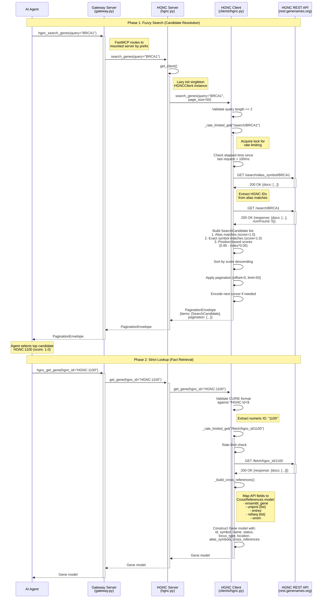
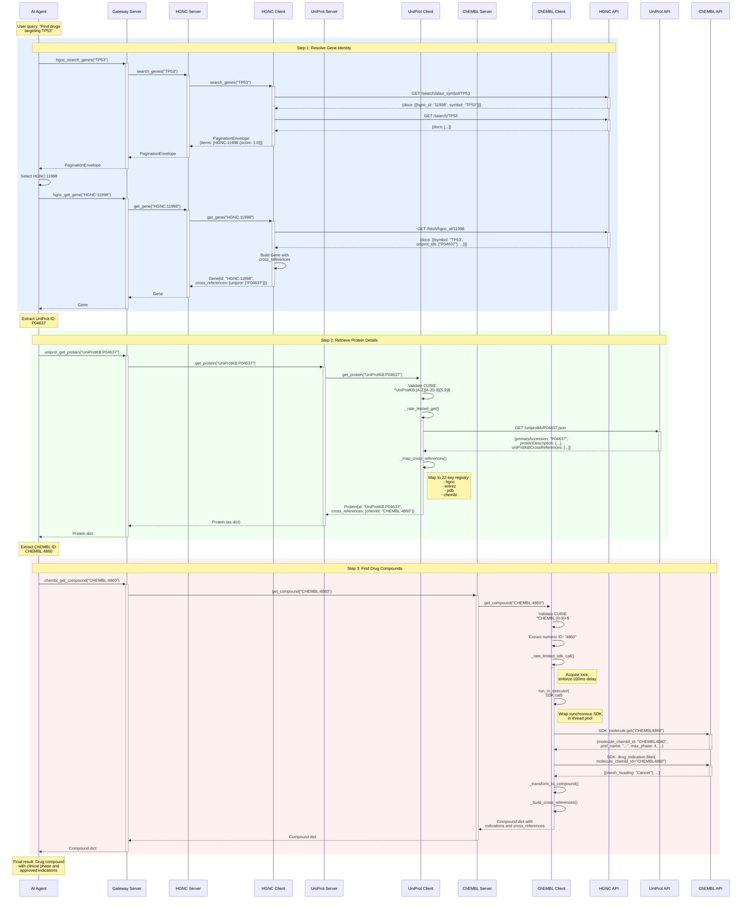
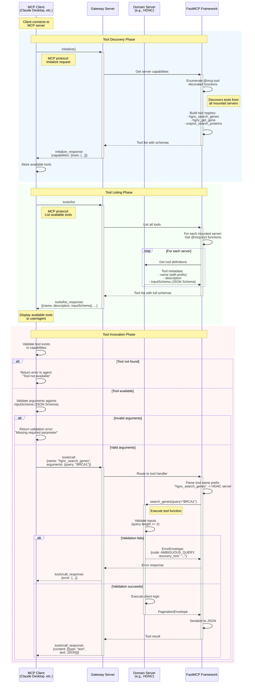
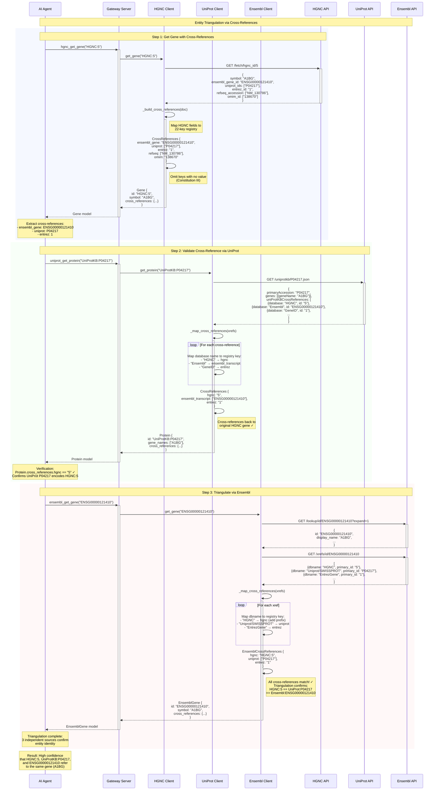

```mermaid
sequenceDiagram
    participant Client as MCP Client
    participant Gateway as Gateway Server<br/>(gateway.py)
    participant FastMCP as FastMCP Framework
    participant HGNC as HGNC Server<br/>(hgnc.py)
    participant UniProt as UniProt Server<br/>(uniprot.py)
    participant ChEMBL as ChEMBL Server<br/>(chembl.py)

    Note over Client,ChEMBL: Server Initialization Phase

    rect rgb(245, 245, 250)
        Note over Gateway: Gateway server starts
        Gateway->>Gateway: Import all server modules:<br/>from servers.hgnc import mcp as hgnc_mcp<br/>from servers.uniprot import mcp as uniprot_mcp<br/>...

        Note over HGNC: HGNC server module loads
        HGNC->>HGNC: mcp = FastMCP("HGNC Gene Server")
        HGNC->>HGNC: Define @mcp.tool functions:<br/>- search_genes<br/>- get_gene

        Note over UniProt: UniProt server module loads
        UniProt->>UniProt: mcp = FastMCP("UniProt Protein Server")
        UniProt->>UniProt: Define @mcp.tool functions:<br/>- search_proteins<br/>- get_protein

        Note over ChEMBL: ChEMBL server module loads
        ChEMBL->>ChEMBL: mcp = FastMCP("ChEMBL Compound Server")
        ChEMBL->>ChEMBL: Define @mcp.tool functions:<br/>- search_compounds<br/>- get_compound<br/>- get_compounds_batch

        Gateway->>Gateway: Create gateway server:<br/>mcp = FastMCP("Life Sciences MCP Gateway")

        Gateway->>+FastMCP: mcp.mount(hgnc_mcp,<br/>prefix="hgnc",<br/>as_proxy=False,<br/>tool_names={<br/> "search_genes": "hgnc_search_genes",<br/> "get_gene": "hgnc_get_gene"<br/>})
        FastMCP->>FastMCP: Register tools with prefixed names
        FastMCP-->>-Gateway: Mounted

        Gateway->>+FastMCP: mcp.mount(uniprot_mcp,<br/>prefix="uniprot",<br/>tool_names={...})
        FastMCP-->>-Gateway: Mounted

        Gateway->>+FastMCP: mcp.mount(chembl_mcp,<br/>prefix="chembl",<br/>tool_names={...})
        FastMCP-->>-Gateway: Mounted

        Note over Gateway: ...mount remaining 9 servers

        Gateway->>Gateway: mcp.run()
        Note right of Gateway: Listen for MCP<br/>client connections
    end

    Note over Client,ChEMBL: Tool Call Routing Phase

    rect rgb(255, 250, 245)
        Client->>+Gateway: tools/call<br/>{name: "hgnc_search_genes",<br/>arguments: {query: "BRCA1"}}

        Gateway->>+FastMCP: Dispatch tool call
        FastMCP->>FastMCP: Parse tool name:<br/>"hgnc_search_genes"
        FastMCP->>FastMCP: Lookup in tool registry:<br/>prefix="hgnc",<br/>original_name="search_genes"

        Note right of FastMCP: as_proxy=False means<br/>direct function call,<br/>not HTTP proxy

        FastMCP->>+HGNC: search_genes(query="BRCA1")
        Note right of HGNC: Direct Python<br/>function call,<br/>no network overhead

        HGNC->>HGNC: get_client()
        HGNC->>HGNC: client.search_genes(...)
        HGNC-->>-FastMCP: PaginationEnvelope

        FastMCP->>FastMCP: Serialize response to JSON
        FastMCP-->>-Gateway: JSON result
        Gateway-->>-Client: tools/call_response
    end

    rect rgb(245, 255, 250)
        Client->>+Gateway: tools/call<br/>{name: "uniprot_get_protein",<br/>arguments: {uniprot_id: "UniProtKB:P04637"}}

        Gateway->>+FastMCP: Dispatch tool call
        FastMCP->>FastMCP: Parse tool name:<br/>"uniprot_get_protein"
        FastMCP->>FastMCP: Lookup: prefix="uniprot",<br/>original_name="get_protein"

        FastMCP->>+UniProt: get_protein(uniprot_id="UniProtKB:P04637")
        UniProt->>UniProt: get_client()
        UniProt->>UniProt: client.get_protein(...)
        UniProt-->>-FastMCP: Protein dict

        FastMCP->>FastMCP: Serialize to JSON
        FastMCP-->>-Gateway: JSON result
        Gateway-->>-Client: tools/call_response
    end

    rect rgb(255, 245, 250)
        Client->>+Gateway: tools/call<br/>{name: "chembl_get_compounds_batch",<br/>arguments: {chembl_ids: ["CHEMBL:25", ...]}}

        Gateway->>+FastMCP: Dispatch tool call
        FastMCP->>FastMCP: Parse: prefix="chembl",<br/>original_name="get_compounds_batch"

        FastMCP->>+ChEMBL: get_compounds_batch(chembl_ids=[...])
        ChEMBL->>ChEMBL: get_client()
        ChEMBL->>ChEMBL: client.get_compounds_batch(...)
        ChEMBL-->>-FastMCP: List[dict] or ErrorEnvelope

        FastMCP->>FastMCP: Serialize to JSON
        FastMCP-->>-Gateway: JSON result
        Gateway-->>-Client: tools/call_response
    end
```

```mermaid
sequenceDiagram
    participant Client as MCP Client
    participant Transport as STDIO/SSE Transport
    participant FastMCP as FastMCP Framework
    participant Pydantic as Pydantic Models
    participant Handler as Tool Handler<br/>(server function)
    participant DomainClient as Domain Client<br/>(e.g., HGNCClient)

    Note over Client,DomainClient: Request Parsing Phase

    rect rgb(245, 250, 255)
        Client->>Client: Build MCP request:<br/>{jsonrpc: "2.0",<br/>method: "tools/call",<br/>params: {name: "hgnc_search_genes",<br/>arguments: {query: "BRCA1",<br/>page_size: 50}}}

        Client->>+Transport: Write JSON to STDIO
        Note right of Client: JSON-RPC 2.0<br/>over STDIO

        Transport->>Transport: Read from stdin
        Transport->>Transport: Parse JSON bytes

        Transport->>+FastMCP: Dispatch MCP message
        Note right of Transport: MCP protocol<br/>message routing

        FastMCP->>FastMCP: Parse method: "tools/call"
        FastMCP->>FastMCP: Extract params:<br/>{name: "hgnc_search_genes",<br/>arguments: {...}}

        FastMCP->>FastMCP: Lookup tool in registry
        FastMCP->>FastMCP: Get function signature<br/>for search_genes()

        Note over FastMCP,Pydantic: Automatic Schema Validation

        FastMCP->>+Pydantic: Validate arguments against<br/>function signature:<br/>search_genes(<br/> query: str,<br/> slim: bool = False,<br/> cursor: str | None = None,<br/> page_size: int = 50<br/>)

        Pydantic->>Pydantic: Check required params:<br/>query is present ✓
        Pydantic->>Pydantic: Validate types:<br/>query is str ✓<br/>page_size is int ✓
        Pydantic->>Pydantic: Apply defaults:<br/>slim = False<br/>cursor = None

        alt Validation fails
            Pydantic-->>FastMCP: ValidationError:<br/>"query is required"
            FastMCP->>FastMCP: Build error response:<br/>{error: {code: -32602,<br/>message: "Invalid params"}}
            FastMCP-->>Transport: JSON-RPC error
            Transport-->>Client: Error response
        else Validation succeeds
            Pydantic-->>-FastMCP: Validated arguments:<br/>{query: "BRCA1",<br/>slim: False,<br/>cursor: None,<br/>page_size: 50}
        end
    end

    Note over Client,DomainClient: Tool Execution Phase

    rect rgb(250, 255, 245)
        FastMCP->>+Handler: search_genes(**validated_args)
        Note right of FastMCP: Direct function call<br/>with unpacked kwargs

        Handler->>+DomainClient: client.search_genes(<br/>query="BRCA1",<br/>slim=False,<br/>cursor=None,<br/>page_size=50)

        DomainClient->>DomainClient: Execute business logic
        DomainClient->>DomainClient: Build PaginationEnvelope:<br/>PaginationEnvelope.create(<br/> items=[...],<br/> cursor="...",<br/> total_count=5,<br/> page_size=50<br/>)

        Note over DomainClient,Pydantic: Response Model Construction

        DomainClient->>+Pydantic: Instantiate PaginationEnvelope
        Pydantic->>Pydantic: Validate SearchCandidate items
        loop For each candidate
            Pydantic->>Pydantic: Validate HGNC CURIE:<br/>^HGNC:\d+$
            Pydantic->>Pydantic: Validate score: 0.0 <= x <= 1.0
            Pydantic->>Pydantic: Validate required fields:<br/>id, symbol, name, score
        end

        Pydantic->>Pydantic: Validate Pagination:<br/>cursor, total_count, page_size
        Pydantic-->>-DomainClient: Valid PaginationEnvelope instance

        DomainClient-->>-Handler: PaginationEnvelope
        Handler-->>-FastMCP: PaginationEnvelope
    end

    Note over Client,DomainClient: Response Serialization Phase

    rect rgb(255, 250, 245)
        FastMCP->>+Pydantic: Serialize PaginationEnvelope<br/>to JSON

        Pydantic->>Pydantic: model_dump(exclude_none=True)
        Note right of Pydantic: Omit keys with None values<br/>(Constitution Principle III)

        Pydantic->>Pydantic: Convert items to dicts
        loop For each SearchCandidate
            Pydantic->>Pydantic: candidate.model_dump():<br/>{id: "HGNC:1100",<br/>symbol: "BRCA1",<br/>name: "...",<br/>score: 1.0}
        end

        Pydantic->>Pydantic: Build final structure:<br/>{items: [...],<br/>pagination: {<br/> cursor: "...",<br/> total_count: 5,<br/> page_size: 50<br/>}}

        Pydantic-->>-FastMCP: Python dict

        FastMCP->>FastMCP: json.dumps(result)
        FastMCP->>FastMCP: Build MCP response:<br/>{jsonrpc: "2.0",<br/>id: request_id,<br/>result: {<br/> content: [{<br/>  type: "text",<br/>  text: JSON_STRING<br/> }]<br/>}}

        FastMCP-->>-Transport: JSON-RPC response
        Transport->>Transport: Write JSON to stdout
        Transport-->>-Client: Read from stdout

        Client->>Client: Parse JSON response
        Client->>Client: Extract result.content[0].text
        Client->>Client: JSON.parse(text) to get<br/>PaginationEnvelope structure
    end
```

# Data Flow Analysis

## Overview

The Life Sciences MCP system implements a sophisticated data flow architecture built around the **Fuzzy-to-Fact protocol**. This architectural pattern enforces a two-phase resolution process:

1. **Phase 1 (Fuzzy)**: Search operations return ranked candidates with relevance scores
2. **Phase 2 (Fact)**: Strict lookup operations require validated CURIEs for precision retrieval

All data flows are wrapped in canonical envelope models (`PaginationEnvelope`, `ErrorEnvelope`) that provide:
- Consistent error handling with recovery hints
- Pagination metadata for large result sets
- Cross-reference identifiers enabling entity triangulation across 13+ databases

The system uses a **gateway server pattern** where 12 individual MCP servers are composed into a unified interface with tool name prefixing. All communication is asynchronous with rate limiting, connection pooling, and exponential backoff for resilience.

---

## 1. Simple Query Flow

**Scenario:** AI agent looks up a gene by symbol (e.g., "BRCA1") through the HGNC server

### Sequence Diagram



### Explanation

This flow demonstrates the **Fuzzy-to-Fact protocol** in action:

**Phase 1: Fuzzy Search (lines 11-48)**
1. The AI agent calls `hgnc_search_genes` through the gateway server
2. Gateway server routes the request to the HGNC server based on the `hgnc_` prefix (gateway.py:52-54)
3. HGNC server retrieves the singleton client instance using lazy initialization (hgnc.py:28-33)
4. Client validates query length minimum 2 characters (clients/hgnc.py:136-137)
5. Client performs **two parallel searches** with alias boosting:
   - First: `/search/alias_symbol/{query}` to find exact alias matches (lines 155-171)
   - Second: `/search/{query}` for general symbol/name matches (line 159)
6. **Rate limiting** enforces 10 req/s using a lock with thundering herd prevention (lines 75-108)
7. Client builds ranked candidates with score calculation:
   - Alias matches get perfect score (1.0)
   - Exact symbol matches get perfect score (1.0)
   - Other results use position-based scoring: `max(0.1, 0.95 - index * 0.05)`
8. Results are sorted by score descending and wrapped in `PaginationEnvelope`
9. Pagination cursor is base64-encoded JSON containing offset (lines 240-241)

**Phase 2: Strict Lookup (lines 52-85)**
10. Agent selects the top candidate and calls `hgnc_get_gene` with the CURIE
11. Client validates CURIE format using regex `^HGNC:\d+$` (clients/hgnc.py:283-284)
12. If invalid, returns `ErrorEnvelope.unresolved_entity()` with recovery hint
13. Client extracts numeric ID and fetches from `/fetch/hgnc_id/{id}` endpoint
14. Cross-references are mapped from HGNC response fields to the 22-key registry (lines 333-344)
15. Complete `Gene` model is returned with all metadata and cross-references

**Key Design Patterns:**
- **Singleton pattern**: Client instances are module-level globals to enable connection pooling
- **Rate limiting with lock**: Prevents concurrent requests from violating API limits
- **Omit-if-null**: Cross-references only include keys with values (never null/empty)
- **CURIE validation**: Strict format enforcement prevents ambiguous queries reaching backend

### Key Code References

- **Gateway routing**: `src/lifesciences_mcp/servers/gateway.py` (lines 52-54) - mcp.mount() with prefix and tool name mapping
- **Server tool decorator**: `src/lifesciences_mcp/servers/hgnc.py` (lines 36-64) - @mcp.tool annotation exposes search_genes
- **Client rate limiting**: `src/lifesciences_mcp/clients/hgnc.py` (lines 62-108) - _rate_limited_get() with thundering herd prevention
- **Alias boosting**: `src/lifesciences_mcp/clients/hgnc.py` (lines 154-156, 185-198) - Two-stage search with perfect scores for aliases
- **Score calculation**: `src/lifesciences_mcp/clients/hgnc.py` (lines 200-227) - Position-based decay with exact match detection
- **CURIE validation**: `src/lifesciences_mcp/clients/hgnc.py` (lines 283-284) - Regex pattern matching with ErrorEnvelope on failure
- **Cross-reference mapping**: `src/lifesciences_mcp/clients/hgnc.py` (lines 333-344) - _build_cross_references() using 22-key registry
- **Envelope models**: `src/lifesciences_mcp/models/envelopes.py` (lines 119-144) - PaginationEnvelope and ErrorEnvelope definitions

---

## 2. Interactive Client Session Flow

**Scenario:** Multi-step workflow where agent searches for a gene, then triangulates to find its protein, then looks up compound interactions

### Sequence Diagram



### Explanation

This flow demonstrates **cross-reference triangulation** - a key capability enabled by the 22-key cross-reference registry. The agent performs a multi-hop query across three different databases using identifiers from previous responses:

**Step 1: Gene Resolution (HGNC:11998)**
1. Agent searches for "TP53" using fuzzy search
2. HGNC client performs alias boosting to prioritize "TP53" (a well-known alias for the gene)
3. Agent selects top candidate `HGNC:11998`
4. Agent retrieves full gene record which includes `cross_references.uniprot: ["P04637"]`

**Step 2: Protein Lookup via Cross-Reference (UniProtKB:P04637)**
5. Agent extracts UniProt ID from gene's cross-references
6. Formats as CURIE: `UniProtKB:P04637`
7. UniProt client validates CURIE format: `^UniProtKB:[A-Z][A-Z0-9]{5,9}$` (clients/uniprot.py:328)
8. Retrieves protein record from `/uniprotkb/{accession}.json` endpoint
9. `_map_cross_references()` extracts ChEMBL target ID from UniProt's cross-references (clients/uniprot.py:114-168)
10. Returns protein with `cross_references.chembl: "CHEMBL:4860"`

**Step 3: Compound Lookup via Triangulation (CHEMBL:4860)**
11. Agent extracts ChEMBL ID from protein's cross-references
12. ChEMBL client validates CURIE and extracts numeric ID "4860"
13. **SDK wrapping**: ChEMBL uses synchronous SDK, wrapped with `run_in_executor` (clients/chembl.py:94-123)
14. Makes **two SDK calls** in sequence:
    - `molecule.get("CHEMBL4860")` for compound data
    - `drug_indication.filter()` for approved indications (lines 561-571)
15. Returns compound with clinical phase, indications, and additional cross-references

**Key Design Patterns:**
- **Cross-reference registry**: 22-key standard enables identifier hopping across databases
- **CURIE format enforcement**: Each client validates format before API calls
- **SDK wrapping**: ChEMBL's synchronous SDK is wrapped with `asyncio.run_in_executor()` (ADR-001 §2 exception)
- **Rate limiting per-client**: Each client has independent rate limiting (10 req/s HGNC, 10 req/s UniProt, 10 req/s ChEMBL)
- **Lazy initialization**: Each server creates client singleton on first use

### Key Code References

- **Cross-reference extraction**: `src/lifesciences_mcp/clients/hgnc.py` (lines 333-344) - _build_cross_references()
- **UniProt cross-ref mapping**: `src/lifesciences_mcp/clients/uniprot.py` (lines 114-168) - _map_cross_references() with 22-key registry
- **ChEMBL SDK wrapping**: `src/lifesciences_mcp/clients/chembl.py` (lines 94-123) - _rate_limited_sdk_call() with run_in_executor
- **ChEMBL indication fetching**: `src/lifesciences_mcp/clients/chembl.py` (lines 558-573) - Separate API call for drug indications
- **Gateway prefix routing**: `src/lifesciences_mcp/servers/gateway.py` (lines 52-109) - mcp.mount() for all 12 servers
- **Cross-reference model**: `src/lifesciences_mcp/models/gene.py` (lines 27-143) - CrossReferences with omit-if-null pattern

---

## 3. Tool Permission Callback Flow

**Scenario:** MCP client validates tool availability and checks permissions before allowing execution

### Sequence Diagram



### Explanation

This flow shows the **MCP protocol's tool discovery and validation mechanism**. The FastMCP framework handles all permission and capability negotiation automatically:

**Tool Discovery Phase**
1. MCP client (e.g., Claude Desktop) sends `initialize()` request on connection
2. Gateway server queries FastMCP framework for capabilities
3. FastMCP enumerates all `@mcp.tool` decorated functions across mounted servers (gateway.py:52-109)
4. Returns server capabilities including available tools
5. Client stores tool list for validation

**Tool Listing Phase**
6. Client requests full tool list via `tools/list` MCP protocol message
7. FastMCP iterates through all mounted servers and collects tool definitions
8. Each tool includes:
   - Name (with server prefix, e.g., `hgnc_search_genes`)
   - Description (from docstring)
   - Input schema (auto-generated from function signature using Pydantic)
9. Client displays tools to user/agent

**Tool Invocation Phase**
10. Client validates tool exists in capabilities list before sending request
11. Client validates arguments against JSON Schema from inputSchema
12. If validation fails, client returns error without network call
13. If valid, client sends `tools/call` message with tool name and arguments
14. FastMCP routes to correct server based on prefix
15. Server function executes with input validation
16. Returns either PaginationEnvelope (success) or ErrorEnvelope (failure)
17. FastMCP serializes result to JSON and wraps in MCP response

**Key Design Patterns:**
- **Auto-discovery**: `@mcp.tool` decorator automatically registers tools
- **Prefix-based routing**: Gateway uses prefixes to route to correct server
- **JSON Schema validation**: FastMCP auto-generates schemas from Pydantic models
- **No explicit permissions**: All mounted tools are available (permissions handled by MCP client)
- **Error envelope pattern**: All errors use canonical ErrorEnvelope format

**Important Note on Permissions:**
The current implementation **does not implement tool-level permissions**. All tools mounted on the gateway are available to any connected client. The MCP protocol supports permission callbacks, but FastMCP handles this at the client connection level, not per-tool. For production deployments requiring fine-grained access control, consider:
- Deploying separate gateway instances for different permission levels
- Using MCP client-side filtering of available tools
- Implementing custom middleware in FastMCP for per-tool authorization

### Key Code References

- **Gateway mounting**: `src/lifesciences_mcp/servers/gateway.py` (lines 52-109) - mcp.mount() with prefix and tool_names
- **Tool decorator**: `src/lifesciences_mcp/servers/hgnc.py` (line 36) - @mcp.tool annotation
- **FastMCP framework**: Uses Pydantic models for auto-schema generation
- **Error envelope**: `src/lifesciences_mcp/models/envelopes.py` (lines 36-109) - ErrorEnvelope with recovery hints
- **Input validation**: Each client validates inputs before API calls (e.g., clients/hgnc.py:136-137)

---

## 4. MCP Server Communication Flow

**Scenario:** Gateway server composes multiple domain servers and routes tool calls with prefix-based resolution

### Sequence Diagram



### Explanation

This flow demonstrates the **gateway server composition pattern** that enables deploying all 12 servers as a single unified MCP endpoint:

**Server Initialization Phase**
1. Gateway server imports all 12 individual server modules (gateway.py:31-42)
2. Each server module creates its own `FastMCP` instance with `@mcp.tool` decorated functions
3. Gateway creates a new `FastMCP` instance for composition (line 49)
4. Gateway mounts each server using `mcp.mount()` with three key parameters:
   - **prefix**: Namespace for tool names (e.g., "hgnc", "uniprot")
   - **as_proxy=False**: Direct function calls, not HTTP proxy (zero network overhead)
   - **tool_names**: Map original names to prefixed names (e.g., "search_genes" → "hgnc_search_genes")
5. FastMCP builds a unified tool registry with all prefixed tools
6. Gateway runs as single MCP server listening for connections

**Tool Call Routing Phase**
7. Client sends `tools/call` with prefixed tool name (e.g., "hgnc_search_genes")
8. FastMCP parses the tool name to extract prefix and original name
9. Looks up the mounted server in the registry
10. Since `as_proxy=False`, FastMCP makes a **direct Python function call** to the mounted server's tool
11. No network overhead or serialization between gateway and domain servers
12. Domain server executes the tool function using its client
13. Result flows back through FastMCP to gateway to client

**Key Design Patterns:**
- **Composition over inheritance**: Gateway composes existing servers rather than reimplementing
- **Direct mounting (as_proxy=False)**: Zero-overhead composition via Python function calls
- **Prefix-based namespacing**: Prevents tool name collisions across 12 servers
- **Explicit tool name mapping**: Clear mapping in gateway.py makes routing transparent
- **Single deployment artifact**: All 12 servers run in one process

**Benefits of this approach:**
- **Single endpoint**: Clients connect to one gateway URL instead of 12 different servers
- **Zero network overhead**: Direct function calls between gateway and domain servers
- **Independent development**: Each server is independently testable and deployable
- **Clear separation**: Gateway is pure composition (110 lines), domain servers own business logic

**Alternative approaches considered:**
- **HTTP proxy (as_proxy=True)**: Would add network latency for inter-server calls
- **Single monolithic server**: Would create tight coupling and merge concerns
- **Separate deployments**: Would require clients to manage 12 different connections

### Key Code References

- **Gateway composition**: `src/lifesciences_mcp/servers/gateway.py` (lines 29-109) - Import and mount all servers
- **Server mounting**: `src/lifesciences_mcp/servers/gateway.py` (lines 52-54) - Example mount with prefix and tool_names
- **HGNC server definition**: `src/lifesciences_mcp/servers/hgnc.py` (lines 22-82) - FastMCP instance with @mcp.tool functions
- **UniProt server definition**: `src/lifesciences_mcp/servers/uniprot.py` (lines 20-98) - Independent server module
- **ChEMBL server definition**: `src/lifesciences_mcp/servers/chembl.py` (lines 26-113) - Batch operation support

---

## 5. Message Parsing and Routing

**Scenario:** How requests are parsed from JSON, validated against Pydantic models, routed to handlers, and serialized back to JSON responses

### Sequence Diagram



### Explanation

This flow shows the complete **request/response lifecycle** with automatic Pydantic validation and serialization:

**Request Parsing Phase**
1. MCP client builds JSON-RPC 2.0 request with method="tools/call"
2. Request includes tool name and arguments as JSON
3. Transport layer (STDIO/SSE) reads JSON bytes from stdin
4. FastMCP parses method and extracts params
5. FastMCP looks up tool function and gets its Python signature
6. **Pydantic auto-validation**: FastMCP uses Pydantic to validate arguments against function signature
   - Checks required parameters are present
   - Validates types match annotations (str, int, bool, etc.)
   - Applies default values for optional parameters
7. If validation fails, returns JSON-RPC error response immediately
8. If valid, unpacks arguments as kwargs for function call

**Tool Execution Phase**
9. FastMCP calls tool handler function with validated arguments
10. Handler delegates to domain client
11. Client executes business logic and constructs response model
12. **Pydantic model construction**: Client builds PaginationEnvelope using Pydantic models
13. Pydantic validates all fields:
    - SearchCandidate items must have valid HGNC CURIEs (regex: `^HGNC:\d+$`)
    - Scores must be between 0.0 and 1.0 (field constraint)
    - All required fields must be present
14. If any validation fails, raises ValidationError
15. Returns valid PaginationEnvelope instance

**Response Serialization Phase**
16. FastMCP receives Pydantic model from handler
17. Calls `model_dump(exclude_none=True)` to serialize to dict
18. **Omit-if-null pattern**: None values are excluded from dict (Constitution Principle III)
19. Nested models (SearchCandidate, Pagination) are recursively serialized
20. FastMCP wraps dict in MCP response format
21. JSON serializes dict to string
22. Transport writes JSON to stdout
23. Client reads and parses response

**Key Design Patterns:**
- **Pydantic-driven validation**: Function signatures with type hints enable auto-validation
- **Fail-fast**: Invalid requests are rejected before reaching business logic
- **Type safety**: Pydantic ensures runtime types match annotations
- **Omit-if-null**: `exclude_none=True` removes clutter from JSON responses
- **Nested model serialization**: Pydantic handles complex nested structures automatically

**Validation Examples:**
```python
# Valid request
{
  "query": "BRCA1",      # str ✓
  "page_size": 50        # int ✓
}

# Invalid request - missing required param
{
  "page_size": 50
}
# → ValidationError: "query is required"

# Invalid request - wrong type
{
  "query": "BRCA1",
  "page_size": "50"     # str instead of int
}
# → ValidationError: "page_size must be int"

# Invalid response - bad CURIE format
SearchCandidate(
  id="BRCA1",           # Not HGNC:NNNNN format
  symbol="BRCA1",
  name="...",
  score=1.0
)
# → ValidationError: "Invalid HGNC CURIE format"
```

### Key Code References

- **Function signatures**: `src/lifesciences_mcp/servers/hgnc.py` (lines 37-64) - Type-annotated parameters for auto-validation
- **PaginationEnvelope model**: `src/lifesciences_mcp/models/envelopes.py` (lines 119-144) - Generic envelope with type parameter
- **SearchCandidate model**: `src/lifesciences_mcp/models/gene.py` (lines 145-164) - Field validators and CURIE pattern
- **CURIE validation**: `src/lifesciences_mcp/models/gene.py` (lines 156-163) - @field_validator with regex
- **Envelope creation**: `src/lifesciences_mcp/models/envelopes.py` (lines 128-144) - Factory method for consistent construction
- **Model serialization**: `src/lifesciences_mcp/models/gene.py` (lines 139-142) - model_dump() with exclude_none

---

## Cross-Cutting Concerns

### Error Handling Flow

```mermaid
sequenceDiagram
    participant Client as MCP Client
    participant Server as MCP Server
    participant DomainClient as Domain Client<br/>(e.g., HGNCClient)
    participant API as External API

    Note over Client,API: Error Propagation Chain

    rect rgb(255, 245, 245)
        Note over Client,API: Scenario 1: Invalid CURIE Format
        Client->>+Server: get_gene("BRCA1")
        Note right of Client: Raw string instead<br/>of CURIE format

        Server->>+DomainClient: get_gene("BRCA1")
        DomainClient->>DomainClient: Validate CURIE:<br/>HGNC_CURIE_PATTERN.match("BRCA1")
        Note right of DomainClient: Regex: ^HGNC:\d+$<br/>Match fails ✗

        DomainClient->>DomainClient: Build ErrorEnvelope:<br/>ErrorEnvelope.unresolved_entity(<br/> invalid_input="BRCA1"<br/>)

        DomainClient-->>-Server: ErrorEnvelope {<br/> success: false,<br/> error: {<br/>  code: "UNRESOLVED_ENTITY",<br/>  message: "...",<br/>  recovery_hint: "Call search_genes...",<br/>  invalid_input: "BRCA1"<br/> }<br/>}

        Server-->>-Client: ErrorEnvelope (JSON)

        Note over Client: Agent reads recovery_hint<br/>and calls search_genes<br/>to resolve identifier
    end

    rect rgb(255, 250, 240)
        Note over Client,API: Scenario 2: Entity Not Found
        Client->>+Server: get_gene("HGNC:99999999")
        Note right of Client: Valid CURIE format<br/>but doesn't exist

        Server->>+DomainClient: get_gene("HGNC:99999999")
        DomainClient->>DomainClient: Validate CURIE ✓
        DomainClient->>+API: GET /fetch/hgnc_id/99999999
        API-->>-DomainClient: 200 OK {response: {docs: []}}
        Note right of API: Empty docs array

        DomainClient->>DomainClient: Check: len(docs) == 0
        DomainClient->>DomainClient: Build ErrorEnvelope:<br/>ErrorEnvelope.entity_not_found(<br/> hgnc_id="HGNC:99999999"<br/>)

        DomainClient-->>-Server: ErrorEnvelope {<br/> error: {<br/>  code: "ENTITY_NOT_FOUND",<br/>  message: "No gene found...",<br/>  recovery_hint: "Verify the HGNC ID...",<br/>  invalid_input: "HGNC:99999999"<br/> }<br/>}

        Server-->>-Client: ErrorEnvelope (JSON)
    end

    rect rgb(245, 245, 255)
        Note over Client,API: Scenario 3: Rate Limited
        Client->>+Server: search_genes("TP53")
        Server->>+DomainClient: search_genes("TP53")
        DomainClient->>+API: GET /search/TP53
        API-->>-DomainClient: 429 Too Many Requests<br/>Retry-After: 10

        DomainClient->>DomainClient: Exponential backoff:<br/>attempt 1/3
        DomainClient->>DomainClient: await asyncio.sleep(10)
        DomainClient->>+API: GET /search/TP53 (retry)
        API-->>-DomainClient: 429 Too Many Requests

        DomainClient->>DomainClient: Exponential backoff:<br/>attempt 2/3
        DomainClient->>DomainClient: await asyncio.sleep(20)
        DomainClient->>+API: GET /search/TP53 (retry)
        API-->>-DomainClient: 429 Too Many Requests

        Note over DomainClient: Max retries exhausted

        DomainClient->>DomainClient: Build ErrorEnvelope:<br/>ErrorEnvelope.rate_limited(<br/> retry_after=10<br/>)

        DomainClient-->>-Server: ErrorEnvelope {<br/> error: {<br/>  code: "RATE_LIMITED",<br/>  message: "...",<br/>  recovery_hint: "Retry after 10 seconds"<br/> }<br/>}

        Server-->>-Client: ErrorEnvelope (JSON)
    end

    rect rgb(245, 255, 245)
        Note over Client,API: Scenario 4: Upstream Error
        Client->>+Server: get_gene("HGNC:1100")
        Server->>+DomainClient: get_gene("HGNC:1100")
        DomainClient->>+API: GET /fetch/hgnc_id/1100
        API-->>-DomainClient: 503 Service Unavailable

        DomainClient->>DomainClient: Build ErrorEnvelope:<br/>ErrorEnvelope.upstream_error(<br/> status_code=503<br/>)

        DomainClient-->>-Server: ErrorEnvelope {<br/> error: {<br/>  code: "UPSTREAM_ERROR",<br/>  message: "HGNC API returned error 503",<br/>  recovery_hint: "Retry later"<br/> }<br/>}

        Server-->>-Client: ErrorEnvelope (JSON)
    end
```



**Error Code Registry:**

| Error Code | Trigger | Recovery Hint | Example |
|---|---|---|---|
| `UNRESOLVED_ENTITY` | Invalid CURIE format passed to strict tool | Call search tool first to resolve identifier | User passes "BRCA1" instead of "HGNC:1100" |
| `ENTITY_NOT_FOUND` | Valid CURIE but record doesn't exist | Verify ID format or try synonym search | "HGNC:99999999" doesn't exist |
| `AMBIGUOUS_QUERY` | Too many/few results or query too short | Refine query with more specific terms | Query "p" returns 1000+ results |
| `RATE_LIMITED` | Exceeded API rate limit | Retry after N seconds | 429 response from upstream |
| `UPSTREAM_ERROR` | API failure, network error, timeout | Retry later or check connectivity | 503, timeout, connection refused |
| `INVALID_CROSS_REFERENCE` | Cross-ref ID fails validation | Verify format in source database | "ENSG123" fails Ensembl pattern |

**Key Design Decisions:**

1. **All errors use ErrorEnvelope**: No raw exceptions escape to client - always wrapped
2. **Recovery hints are actionable**: Guide agent to next step (e.g., "Call search_genes first")
3. **Distinguish UNRESOLVED vs NOT_FOUND**: Different semantic meanings and recovery paths
4. **Preserve invalid_input**: Client can inspect what caused error for debugging
5. **Exponential backoff**: 3 retries with 2^attempt delay for rate limits (lines 85-108 in hgnc.py)

**Code References:**
- Error envelope factory methods: `src/lifesciences_mcp/models/envelopes.py` (lines 46-108)
- CURIE validation: `src/lifesciences_mcp/clients/hgnc.py` (lines 283-284)
- Rate limit handling: `src/lifesciences_mcp/clients/hgnc.py` (lines 62-108)
- Upstream error mapping: `src/lifesciences_mcp/clients/hgnc.py` (lines 162-166, 292-297)

---

### Pagination Flow

```mermaid
sequenceDiagram
    participant Client as MCP Client
    participant Server as MCP Server
    participant DomainClient as Domain Client
    participant API as External API

    Note over Client,API: Initial Page Request

    rect rgb(245, 250, 255)
        Client->>+Server: search_genes(query="kinase",<br/>page_size=50)
        Note right of Client: No cursor =<br/>first page

        Server->>+DomainClient: search_genes(<br/>query="kinase",<br/>cursor=None,<br/>page_size=50)

        DomainClient->>DomainClient: Decode cursor:<br/>cursor is None → offset=0

        DomainClient->>+API: GET /search/kinase
        API-->>-DomainClient: {docs: [...200 results...],<br/>numFound: 200}

        DomainClient->>DomainClient: Apply client-side pagination:<br/>page_start = 0<br/>page_end = 50<br/>page_items = results[0:50]

        DomainClient->>DomainClient: Calculate next cursor:<br/>next_offset = 50<br/>cursor_data = {"offset": 50}<br/>next_cursor = base64(JSON(cursor_data))
        Note right of DomainClient: Cursor encodes offset<br/>for stateless pagination

        DomainClient->>DomainClient: Build PaginationEnvelope:<br/>PaginationEnvelope.create(<br/> items=page_items,<br/> cursor="eyJvZmZzZXQiOiA1MH0=",<br/> total_count=200,<br/> page_size=50<br/>)

        DomainClient-->>-Server: PaginationEnvelope {<br/> items: [...50 items...],<br/> pagination: {<br/>  cursor: "eyJvZmZzZXQiOiA1MH0=",<br/>  total_count: 200,<br/>  page_size: 50<br/> }<br/>}

        Server-->>-Client: PaginationEnvelope (JSON)

        Note over Client: Client displays:<br/>Showing 1-50 of 200 results
    end

    Note over Client,API: Second Page Request

    rect rgb(250, 255, 245)
        Client->>+Server: search_genes(<br/>query="kinase",<br/>cursor="eyJvZmZzZXQiOiA1MH0=",<br/>page_size=50)
        Note right of Client: Pass cursor from<br/>previous response

        Server->>+DomainClient: search_genes(<br/>cursor="eyJvZmZzZXQiOiA1MH0=",<br/>page_size=50)

        DomainClient->>DomainClient: Decode cursor:<br/>base64_decode("eyJ...") →<br/>{"offset": 50}<br/>offset = 50

        DomainClient->>+API: GET /search/kinase
        Note right of API: Same query,<br/>client-side slicing
        API-->>-DomainClient: {docs: [...200 results...]}

        DomainClient->>DomainClient: Apply pagination:<br/>page_start = 50<br/>page_end = 100<br/>page_items = results[50:100]

        DomainClient->>DomainClient: Calculate next cursor:<br/>next_offset = 100<br/>cursor_data = {"offset": 100}<br/>next_cursor = base64(JSON(cursor_data))

        DomainClient->>DomainClient: Build PaginationEnvelope:<br/>cursor="eyJvZmZzZXQiOiAxMDB9",<br/>total_count=200

        DomainClient-->>-Server: PaginationEnvelope {<br/> items: [...50 items...],<br/> pagination: {<br/>  cursor: "eyJvZmZzZXQiOiAxMDB9",<br/>  total_count: 200,<br/>  page_size: 50<br/> }<br/>}

        Server-->>-Client: PaginationEnvelope (JSON)

        Note over Client: Showing 51-100 of 200
    end

    Note over Client,API: Final Page Request

    rect rgb(255, 250, 245)
        Client->>+Server: search_genes(<br/>query="kinase",<br/>cursor="eyJvZmZzZXQiOiAxNTB9",<br/>page_size=50)

        Server->>+DomainClient: search_genes(cursor="...")
        DomainClient->>DomainClient: Decode: offset = 150
        DomainClient->>+API: GET /search/kinase
        API-->>-DomainClient: {docs: [...200 results...]}

        DomainClient->>DomainClient: Apply pagination:<br/>page_start = 150<br/>page_end = 200<br/>page_items = results[150:200]

        DomainClient->>DomainClient: Calculate next cursor:<br/>next_offset = 200<br/>200 >= total_count (200)<br/>→ next_cursor = None
        Note right of DomainClient: cursor=None signals<br/>end of results

        DomainClient->>DomainClient: Build PaginationEnvelope:<br/>cursor=None

        DomainClient-->>-Server: PaginationEnvelope {<br/> items: [...50 items...],<br/> pagination: {<br/>  cursor: null,<br/>  total_count: 200,<br/>  page_size: 50<br/> }<br/>}

        Server-->>-Client: PaginationEnvelope (JSON)

        Note over Client: Showing 151-200 of 200<br/>(no more pages)
    end
```



**Pagination Strategies by Database:**

| Database | Strategy | Cursor Format | Total Count Available? |
|---|---|---|---|
| HGNC | Client-side slicing | `{"offset": N}` | Yes (numFound) |
| UniProt | Server-side (API cursor) | Opaque string from API | No |
| ChEMBL | Client-side slicing | `{"offset": N}` | Yes (result count) |
| Ensembl | Client-side slicing | `{"offset": N}` | Yes (result count) |

**Key Design Decisions:**

1. **Opaque cursors**: Base64-encoded JSON prevents clients from manipulating offset
2. **Stateless pagination**: Cursor contains all state needed (no server-side session)
3. **cursor=null signals end**: Client knows when to stop requesting pages
4. **total_count optional**: Some APIs (UniProt) don't provide it
5. **Client-side slicing for HGNC**: API doesn't support pagination, so client buffers results

**Cursor Structure:**
```python
# Before encoding
cursor_data = {
    "offset": 50,
    "query_hash": "abc123"  # Optional: verify cursor matches original query
}

# After base64 encoding
cursor = "eyJvZmZzZXQiOiA1MCwgInF1ZXJ5X2hhc2giOiAiYWJjMTIzIn0="
```

**Code References:**
- Cursor encoding: `src/lifesciences_mcp/clients/hgnc.py` (lines 240-241)
- Cursor decoding: `src/lifesciences_mcp/clients/hgnc.py` (lines 147-152)
- Client-side pagination: `src/lifesciences_mcp/clients/hgnc.py` (lines 232-241)
- UniProt server-side: `src/lifesciences_mcp/clients/uniprot.py` (lines 279-286) - Uses API's cursor directly
- Pagination model: `src/lifesciences_mcp/models/envelopes.py` (lines 111-127)

---

### Cross-Reference Resolution Flow



**Cross-Reference Registry (22 Keys):**

| Registry Key | Example CURIE | Source Databases | Format |
|---|---|---|---|
| `hgnc` | HGNC:5 | HGNC, UniProt, Ensembl | HGNC:NNNNN |
| `ensembl_gene` | ENSG00000121410 | HGNC, UniProt | ENSG + 11 digits |
| `ensembl_transcript` | ENST00000263100 | UniProt, Ensembl | ENST + 11 digits |
| `uniprot` | UniProtKB:P04217 | HGNC, Ensembl, ChEMBL | UniProtKB:ACCESSION |
| `entrez` | 1 | HGNC, UniProt, Ensembl | Numeric ID |
| `refseq` | NM_130786 | HGNC, UniProt | [NX][MR]_NNNNN |
| `omim` | 138670 | HGNC, UniProt | 6-digit numeric |
| `chembl` | CHEMBL:4860 | UniProt, ChEMBL | CHEMBL:NNNNN |
| `pubchem_compound` | 2244 | ChEMBL, PubChem | Numeric ID |
| `drugbank` | DB:01050 | ChEMBL | DB:NNNNN |
| `pdb` | 1HZH | UniProt, Ensembl | Uppercase alphanumeric |
| ... | ... | ... | ... |

**Triangulation Validation:**

1. **Fetch entity from Database A** (e.g., HGNC:5)
   - Extract cross-references: `{uniprot: ["P04217"], ensembl_gene: "ENSG00000121410"}`

2. **Fetch cross-referenced entity from Database B** (e.g., UniProtKB:P04217)
   - Extract cross-references: `{hgnc: "5", ensembl_transcript: ["ENSG00000121410"]}`
   - **Validate**: Does `cross_references.hgnc` match original HGNC:5? ✓

3. **Fetch from Database C** (e.g., Ensembl ENSG00000121410)
   - Extract cross-references: `{hgnc: "HGNC:5", uniprot: ["P04217"]}`
   - **Validate**: Do cross-references match both original identifiers? ✓

4. **Result**: If all cross-references are bidirectional and consistent, high confidence that identifiers refer to same biological entity

**Why Triangulation Matters:**

- **Data quality issues**: Some cross-references may be outdated or incorrect
- **Multiple isoforms**: One gene may have multiple proteins (UniProt entries)
- **Disambiguation**: Common names may map to multiple entities
- **Confidence scoring**: More matching cross-references = higher confidence

**Code References:**
- HGNC cross-ref mapping: `src/lifesciences_mcp/clients/hgnc.py` (lines 333-344)
- UniProt cross-ref mapping: `src/lifesciences_mcp/clients/uniprot.py` (lines 114-168)
- Ensembl cross-ref mapping: `src/lifesciences_mcp/clients/ensembl.py` (lines 184-221)
- CrossReferences model: `src/lifesciences_mcp/models/gene.py` (lines 27-143)
- Omit-if-null pattern: `src/lifesciences_mcp/models/gene.py` (lines 130-142)

---

## Summary

The Life Sciences MCP system implements a sophisticated **data flow architecture** with several key patterns:

### Core Architectural Patterns

1. **Fuzzy-to-Fact Protocol**
   - Two-phase resolution: fuzzy search → strict lookup
   - CURIE validation enforces unambiguous identifiers
   - Recovery hints enable agent self-correction

2. **Gateway Composition**
   - 12 independent domain servers composed into single endpoint
   - Direct function calls (as_proxy=False) eliminate network overhead
   - Prefix-based routing with explicit tool name mapping

3. **Canonical Envelopes**
   - `PaginationEnvelope` for search operations with cursor-based pagination
   - `ErrorEnvelope` with standardized error codes and recovery hints
   - Omit-if-null pattern reduces JSON payload size

4. **Cross-Reference Triangulation**
   - 22-key registry enables identifier hopping across databases
   - Bidirectional validation increases confidence
   - Independent sources confirm entity identity

### Resilience Features

1. **Rate Limiting**
   - Per-client rate limiting with asyncio locks
   - Thundering herd prevention via time re-checks after lock acquisition
   - Database-specific limits (10 req/s HGNC, 15 req/s Ensembl)

2. **Error Handling**
   - Exponential backoff for 429/503 errors (3 retries, 2^attempt delay)
   - All errors wrapped in ErrorEnvelope (never raw exceptions)
   - Actionable recovery hints guide agent to resolution

3. **Connection Pooling**
   - Singleton clients with httpx.AsyncClient
   - Configurable max_connections per client
   - Thread pool for synchronous SDKs (ChEMBL)

### Data Quality Patterns

1. **Pydantic Validation**
   - Runtime type checking against function signatures
   - CURIE format validation with regex patterns
   - Field constraints (e.g., score between 0.0-1.0)

2. **Score Calculation**
   - Alias boosting (perfect score for known aliases)
   - Exact match detection (symbol == query)
   - Position-based decay for relevance ranking

3. **Cross-Reference Mapping**
   - Consistent CURIE formats across all databases
   - Omit-if-null pattern for cleaner JSON
   - Validation against registry patterns

### Performance Optimizations

1. **Client-Side Pagination**
   - HGNC/ChEMBL buffer results for cursor-based slicing
   - Opaque base64 cursors prevent manipulation
   - total_count enables progress indicators

2. **Batch Operations**
   - ChEMBL batch lookup prevents thread pool exhaustion
   - Single API call for multiple compounds
   - Preserves order and handles individual failures

3. **Lazy Initialization**
   - Singleton clients created on first use
   - Connection pools established on demand
   - No resource allocation for unused servers

This architecture provides a **robust, scalable foundation** for biological data integration with clear separation of concerns, consistent error handling, and strong validation guarantees.
