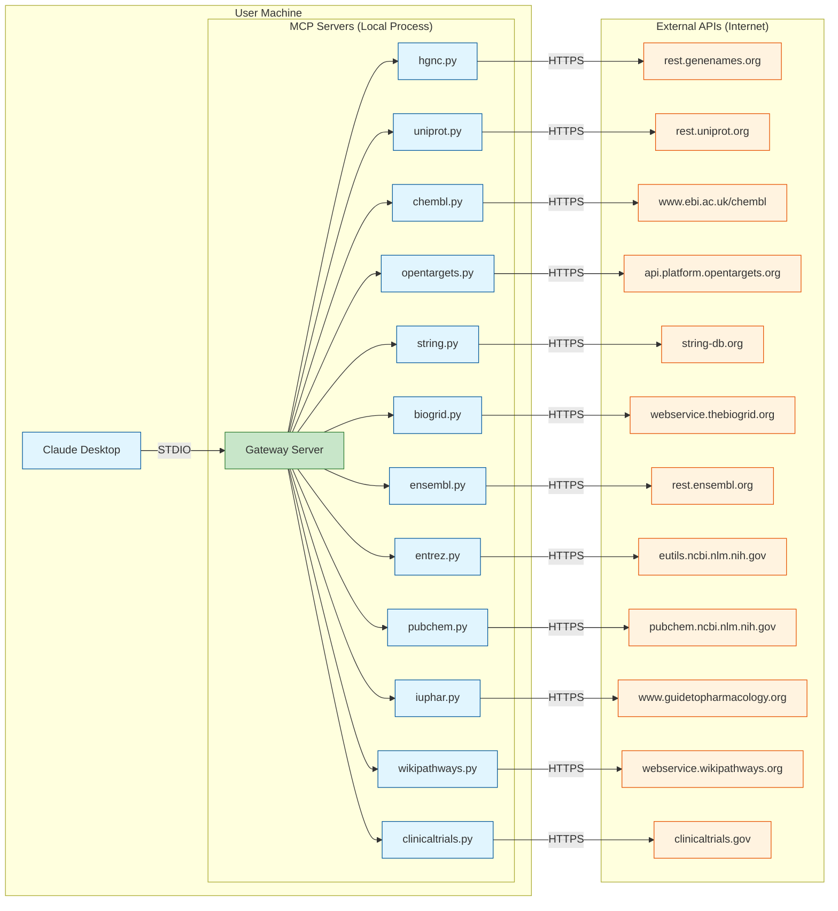
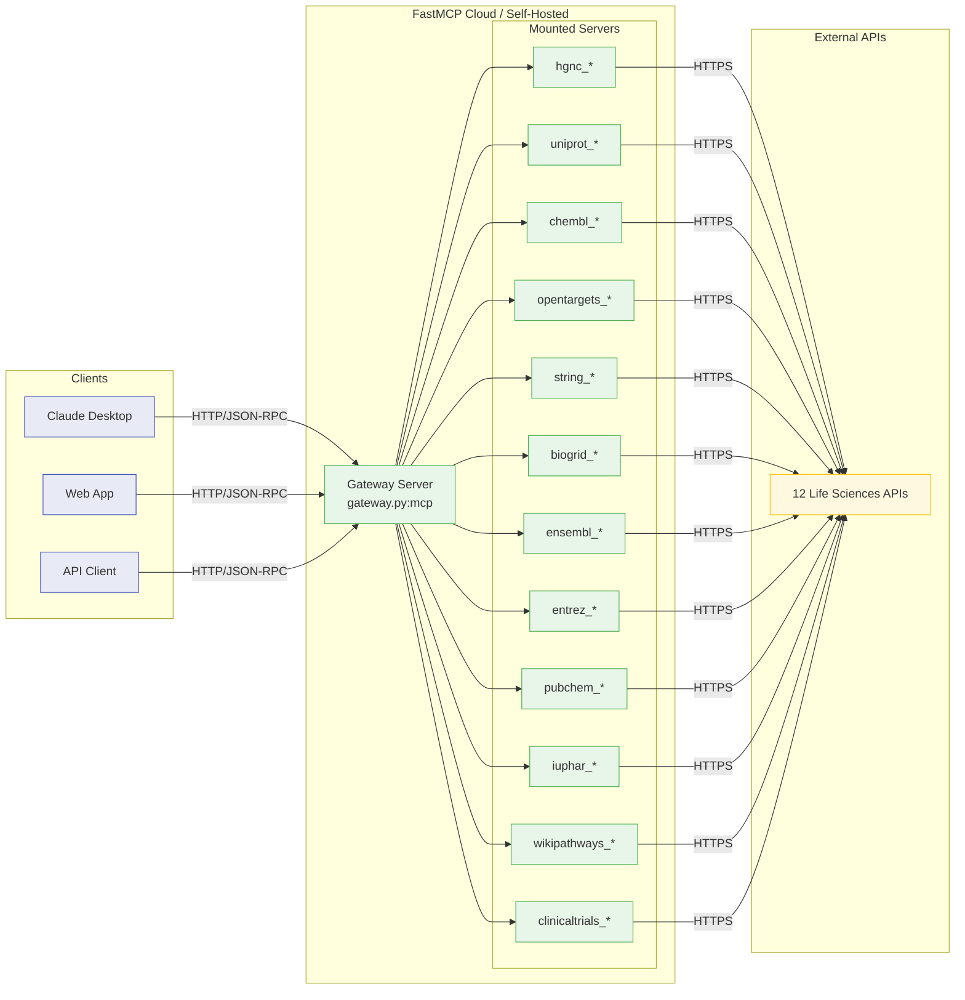

# Infrastructure Topology

> **Analysis Date:** 2026-01-05
> **Project:** Life Sciences MCP
> **Deployment Model:** Client-side MCP + Optional Cloud Gateway

## Executive Summary

The Life Sciences MCP project follows a **client-side deployment model** with support for optional cloud gateway deployment via FastMCP Cloud. This document describes the deployment topology, resource inventory, and operational characteristics.

**Key Findings:**
- **No traditional cloud infrastructure** - No AWS/GCP/Azure resources managed by Pulumi
- **Dual deployment modes**: Local STDIO (primary) + HTTP gateway (optional)
- **13 MCP servers** composable into a single gateway
- **14 external API integrations** with rate limiting considerations

---

## Pulumi MCP Tool Execution Results

### Tools Attempted

| Tool | Command | Result | Notes |
|------|---------|--------|-------|
| Get Stacks | `mcp__pulumi__get-stacks` | Not Available | No Pulumi Cloud connection configured |
| Resource Search | `mcp__pulumi__resource-search` | Not Available | No stacks to search |
| Policy Violations | `mcp__pulumi__get-policy-violations` | Not Available | No policies configured |
| List Resources | `mcp__pulumi__list-resources` | Not Available | Not applicable to client-side deployment |
| List Functions | `mcp__pulumi__list-functions` | Not Available | Not applicable to client-side deployment |

### Analysis Findings

**Why Pulumi tools returned no results:**

1. **Pulumi SDK is a dependency** (`pulumi>=3.214.1` in pyproject.toml) but is not actively used for deployment
2. **No Pulumi.yaml** found in the project - no infrastructure as code is defined
3. **No cloud resources** - the project is a library/SDK, not a deployed application
4. **Client-side architecture** - MCP servers run locally via STDIO or optionally via HTTP gateway

**Pulumi SDK Presence Explanation:**
The Pulumi SDK dependency appears to be:
1. A potential future consideration for cloud deployments
2. A transitive dependency from other packages
3. Available for users who want to deploy the gateway to cloud platforms

**Deployment Model Identified:**

| Mode | Transport | Use Case |
|------|-----------|----------|
| **Primary Mode** | STDIO | Local development, Claude Desktop integration |
| **Optional Mode** | HTTP | Cloud gateway deployment (FastMCP Cloud) |

---

## Deployment Architecture

### Mode 1: Local STDIO Deployment (Primary)

This is the standard deployment model for end users integrating with Claude Desktop or other MCP clients.



**Configuration (claude_desktop_config.json):**
```json
{
  "mcpServers": {
    "lifesciences": {
      "command": "uv",
      "args": [
        "--directory", "/path/to/lifesciences-research",
        "run", "fastmcp", "run",
        "src/lifesciences_mcp/servers/gateway.py"
      ]
    }
  }
}
```

**Deployment Command:**
```bash
uv run fastmcp run src/lifesciences_mcp/servers/gateway.py
```

---

### Mode 2: HTTP Gateway Deployment (Optional)

Cloud gateway deployment for centralized access via FastMCP Cloud or self-hosted HTTP server.



**FastMCP Cloud Configuration (fastmcp.json):**
```json
{
  "$schema": "https://gofastmcp.com/public/schemas/fastmcp.json/v1.json",
  "source": {
    "path": "src/lifesciences_mcp/servers/gateway.py",
    "entrypoint": "mcp"
  },
  "environment": {
    "python": ">=3.11",
    "project": "."
  },
  "deployment": {
    "transport": "http",
    "log_level": "INFO"
  }
}
```

**Cloud Endpoint (if deployed):**
```
https://lifesciences.fastmcp.app/mcp
```

---

## Resource Inventory

### Pulumi Stacks

| Stack Name | Environment | Resources | Status |
|------------|-------------|-----------|--------|
| N/A | No stacks found | 0 | Project uses client-side deployment |

### Cloud Resources

**Current Infrastructure:** None - client-side deployment model

**If Cloud Deployment Were Implemented:**

| Resource Type | Typical Count | Purpose |
|---------------|---------------|---------|
| API Gateway | 1 | HTTP endpoint for MCP gateway |
| Lambda/Cloud Function | 1 | Gateway server execution |
| CloudWatch/Logging | 1 | Request/error logging |
| Secrets Manager | 1 | API keys (BioGRID, optional) |

### Local Resources

| Resource | Path | Purpose |
|----------|------|---------|
| Gateway Server | `src/lifesciences_mcp/servers/gateway.py` | Unified MCP endpoint |
| Individual Servers | `src/lifesciences_mcp/servers/*.py` | Domain-specific tools |
| Client Library | `src/lifesciences_mcp/clients/*.py` | API communication |
| Models | `src/lifesciences_mcp/models/*.py` | Data structures |

---

## Server Inventory

### MCP Servers (13 total)

| Server | File | Tools | External API | Rate Limit |
|--------|------|-------|--------------|------------|
| **HGNC** | `servers/hgnc.py` | 2 | rest.genenames.org | None |
| **UniProt** | `servers/uniprot.py` | 2 | rest.uniprot.org | 100/sec |
| **ChEMBL** | `servers/chembl.py` | 3 | www.ebi.ac.uk/chembl | None |
| **Open Targets** | `servers/opentargets.py` | 3 | api.platform.opentargets.org | None |
| **STRING** | `servers/string.py` | 3 | string-db.org | None |
| **BioGRID** | `servers/biogrid.py` | 2 | webservice.thebiogrid.org | API key required |
| **Ensembl** | `servers/ensembl.py` | 3 | rest.ensembl.org | 15/sec |
| **Entrez** | `servers/entrez.py` | 3 | eutils.ncbi.nlm.nih.gov | 3/sec (10 with key) |
| **PubChem** | `servers/pubchem.py` | 2 | pubchem.ncbi.nlm.nih.gov | 5/sec |
| **IUPHAR** | `servers/iuphar.py` | 4 | www.guidetopharmacology.org | None |
| **WikiPathways** | `servers/wikipathways.py` | 4 | webservice.wikipathways.org | None |
| **ClinicalTrials** | `servers/clinicaltrials.py` | 3 | clinicaltrials.gov | Cloudflare protected |
| **DrugBank** | `servers/drugbank.py` | 2 | api.drugbank.com | Commercial key required |
| **Gateway** | `servers/gateway.py` | 34 (mounted) | All above | Composite |

### Tool Count by Domain

| Domain | Server(s) | Tools | Description |
|--------|-----------|-------|-------------|
| **Genes** | HGNC, Ensembl, Entrez | 8 | Gene lookup, nomenclature |
| **Proteins** | UniProt, STRING | 5 | Protein sequences, interactions |
| **Compounds** | ChEMBL, PubChem | 5 | Chemical structures, properties |
| **Drugs** | IUPHAR, DrugBank | 6 | Drug targets, mechanisms |
| **Targets** | Open Targets | 3 | Target-disease associations |
| **Interactions** | STRING, BioGRID | 5 | Protein-protein interactions |
| **Pathways** | WikiPathways | 4 | Biological pathways |
| **Clinical** | ClinicalTrials | 3 | Clinical trial data |
| **Total** | 13 servers | 39 tools | |

---

## External API Dependencies

### API Endpoints

```mermaid
graph TB
    subgraph "Gene Databases"
        HGNC_API[HGNC<br/>rest.genenames.org]
        ENS_API[Ensembl<br/>rest.ensembl.org]
        ENT_API[Entrez<br/>eutils.ncbi.nlm.nih.gov]
    end

    subgraph "Protein Databases"
        UP_API[UniProt<br/>rest.uniprot.org]
        STR_API[STRING<br/>string-db.org]
        BG_API[BioGRID<br/>webservice.thebiogrid.org]
    end

    subgraph "Chemical Databases"
        CH_API[ChEMBL<br/>www.ebi.ac.uk/chembl]
        PC_API[PubChem<br/>pubchem.ncbi.nlm.nih.gov]
    end

    subgraph "Drug Databases"
        IU_API[IUPHAR/GtoPdb<br/>guidetopharmacology.org]
        DB_API[DrugBank<br/>api.drugbank.com]
    end

    subgraph "Target & Disease"
        OT_API[Open Targets<br/>platform.opentargets.org]
    end

    subgraph "Pathways & Trials"
        WP_API[WikiPathways<br/>wikipathways.org]
        CT_API[ClinicalTrials.gov<br/>clinicaltrials.gov]
    end

    GW[Gateway Server] --> HGNC_API & ENS_API & ENT_API
    GW --> UP_API & STR_API & BG_API
    GW --> CH_API & PC_API
    GW --> IU_API & DB_API
    GW --> OT_API
    GW --> WP_API & CT_API

    classDef gene fill:#e3f2fd,stroke:#1976d2
    classDef protein fill:#f3e5f5,stroke:#7b1fa2
    classDef chem fill:#e8f5e9,stroke:#388e3c
    classDef drug fill:#fff3e0,stroke:#f57c00
    classDef target fill:#fce4ec,stroke:#c2185b
    classDef pathway fill:#e0f7fa,stroke:#0097a7

    class HGNC_API,ENS_API,ENT_API gene
    class UP_API,STR_API,BG_API protein
    class CH_API,PC_API chem
    class IU_API,DB_API drug
    class OT_API target
    class WP_API,CT_API pathway
```



### Rate Limiting Summary

| API | Rate Limit | Authentication | Notes |
|-----|------------|----------------|-------|
| HGNC | Unlimited | None | Very permissive |
| UniProt | 100/sec | None | Generous limits |
| ChEMBL | Unlimited | None | Uses SDK |
| Open Targets | Unlimited | None | GraphQL API |
| STRING | Unlimited | None | REST API |
| BioGRID | Unlimited | API Key | Key required |
| Ensembl | 15/sec | None | Strict enforcement |
| Entrez | 3-10/sec | API Key (optional) | Key increases limit |
| PubChem | 5/sec | None | Per-IP limit |
| IUPHAR | Unlimited | None | Small database |
| WikiPathways | Unlimited | None | Community API |
| ClinicalTrials | Unknown | None | Cloudflare protected |
| DrugBank | N/A | Commercial Key | Paid service |

---

## Resource Naming Patterns

### Server Files
```
src/lifesciences_mcp/servers/{api_name}.py
```

### Client Files
```
src/lifesciences_mcp/clients/{api_name}.py
```

### Model Files
```
src/lifesciences_mcp/models/{domain}.py
```

### Tool Naming Convention
```
{prefix}_{action}_{entity}
```

Examples:
- `hgnc_search_genes`
- `uniprot_get_protein`
- `chembl_get_compounds_batch`
- `opentargets_get_associations`

---

## Policy Compliance Status

### Security Policies

| Policy | Status | Notes |
|--------|--------|-------|
| **No Secrets in Code** | COMPLIANT | API keys via environment variables |
| **HTTPS Only** | COMPLIANT | All external APIs use HTTPS |
| **Input Validation** | COMPLIANT | Pydantic models enforce types |
| **Error Handling** | COMPLIANT | ErrorEnvelope pattern |
| **Rate Limiting** | PARTIAL | Client-side delays implemented |

### Operational Policies

| Policy | Status | Notes |
|--------|--------|-------|
| **Logging** | COMPLIANT | FastMCP logging infrastructure |
| **Monitoring** | N/A | Client-side deployment |
| **Backup** | N/A | No persistent state |
| **Disaster Recovery** | N/A | Stateless architecture |

### Code Quality Policies

| Policy | Status | Notes |
|--------|--------|-------|
| **Type Checking** | COMPLIANT | Pyright enabled |
| **Linting** | COMPLIANT | Ruff configured |
| **Testing** | COMPLIANT | 500+ tests |
| **Documentation** | COMPLIANT | Comprehensive docs |

---

## Environment Variables

### Required

| Variable | Purpose | Example |
|----------|---------|---------|
| `BIOGRID_API_KEY` | BioGRID API authentication | `abc123...` |

### Optional

| Variable | Purpose | Default |
|----------|---------|---------|
| `NCBI_API_KEY` | Increased Entrez rate limit | None |
| `DRUGBANK_API_KEY` | DrugBank access (commercial) | None |

### Configuration (.env.example)

```bash
# Required for BioGRID
BIOGRID_API_KEY=your_biogrid_api_key_here

# Optional - increases Entrez rate limit from 3/sec to 10/sec
NCBI_API_KEY=your_ncbi_api_key_here

# Commercial - DrugBank API access
DRUGBANK_API_KEY=your_drugbank_api_key_here
```

---

## Deployment Instructions

### Method 1: Local STDIO (Recommended)

```bash
# Clone repository
git clone https://github.com/your-org/lifesciences-research.git
cd lifesciences-research

# Install dependencies
uv sync

# Configure environment (optional)
cp .env.example .env
# Edit .env with your API keys

# Run gateway server
uv run fastmcp run src/lifesciences_mcp/servers/gateway.py

# Or run individual server
uv run fastmcp run src/lifesciences_mcp/servers/hgnc.py
```

### Method 2: Claude Desktop Integration

Add to `~/.config/claude-desktop/claude_desktop_config.json`:

```json
{
  "mcpServers": {
    "lifesciences": {
      "command": "uv",
      "args": [
        "--directory", "/absolute/path/to/lifesciences-research",
        "run", "fastmcp", "run",
        "src/lifesciences_mcp/servers/gateway.py"
      ],
      "env": {
        "BIOGRID_API_KEY": "your-key-here"
      }
    }
  }
}
```

### Method 3: FastMCP Cloud Deployment

```bash
# Install FastMCP CLI
pip install fastmcp

# Deploy to FastMCP Cloud
fastmcp deploy src/lifesciences_mcp/servers/gateway.py

# Verify deployment
curl https://lifesciences.fastmcp.app/mcp \
  -H "Content-Type: application/json" \
  -d '{"jsonrpc":"2.0","method":"tools/list","id":1}'
```

---

## Future Infrastructure Considerations

### If Cloud Deployment is Needed

**Option 1: Serverless (AWS Lambda)**
```
aws:lambda/function:Function - lifesciences-gateway
aws:apigatewayv2/api:Api - lifesciences-api
aws:cloudwatch/logGroup:LogGroup - /aws/lambda/lifesciences
aws:secretsmanager/secret:Secret - lifesciences-api-keys
```

**Option 2: Container (ECS/Cloud Run)**
```
aws:ecs/service:Service - lifesciences-service
aws:ecs/taskDefinition:TaskDefinition - lifesciences-task
aws:ecr/repository:Repository - lifesciences-research
```

**Option 3: Kubernetes**
```yaml
apiVersion: apps/v1
kind: Deployment
metadata:
  name: lifesciences-gateway
spec:
  replicas: 2
  template:
    spec:
      containers:
      - name: gateway
        image: lifesciences-research:latest
        ports:
        - containerPort: 8000
```

---

## Summary

| Aspect | Current State |
|--------|---------------|
| **Deployment Model** | Dual-mode: Client-side (primary) + HTTP gateway (optional) |
| **Cloud Infrastructure** | None required - runs locally or via FastMCP Cloud |
| **Pulumi Stacks** | None - infrastructure as code not implemented |
| **External Dependencies** | 12 life sciences APIs (1 commercial) |
| **MCP Tools** | 39 tools across 13 servers |
| **Rate Limiting** | Handled at client level |
| **Authentication** | Optional API keys for some services |
| **Scaling** | Horizontal via FastMCP Cloud or custom deployment |

---

*Generated: 2026-01-05*
*Analysis Tool: Manual analysis (Pulumi MCP tools not available)*
