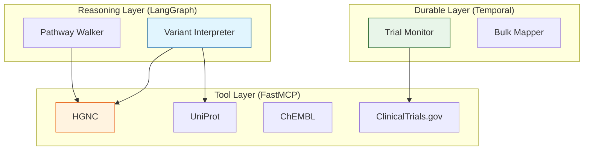

# ADR-007: Agentic Technology Stack (Draft)

## Status
Draft

## Context
The project is expanding from "Stateless Tools" (MCP Servers) to "Stateful reasoning" (Strategic Roadmap AGE-119 to AGE-122), making consideration on where **LangGraph**, **Claude Code**, and **Temporal.io** fit into this architecture becomes highly relevant.

## Decision
We will adopt a **High-Low Architecture** with strict **Separation of Concerns**:

### Layer 1: The "Tool Layer" (This Repository)
- **Role**: Stateless, deterministic data access.
- **Tech**: FastMCP, Pydantic.
- **Scope**: `lifesciences-research` remains a pure tool provider. It does *not* contain agents.

### Layer 2: The "Agent Layer" (New Repository/Layer)
- **Role**: Stateful reasoning, orchestration, and durable workflows.
- **Tech**: LangGraph (Reasoning), Temporal (Durability).
- **Scope**: External to `lifesciences-research`. Consumes tools via MCP protocol.

## Implementation Strategy

### 1. LangGraph (The "Brain")
**Best For**: Complex Reasoning Loops (AGE-120, AGE-122).

*   **UseCase**: **Variant Interpretation (AGE-122)**
    *   *Why*: Parsing "KRAS G12C" requires a multi-step loop:
        1.  Search Gene "KRAS" (Tool: HGNC)
        2.  Get Sequence (Tool: Ensembl)
        3.  Map Coord 12 (Tool: UniProt)
        4.  Verify G>C change.
    *   *Fit*: LangGraph manages this state ("I found the gene, now looking for the residue").

*   **UseCase**: **Pathway Traversal (AGE-120)**
    *   *Why*: "Find downstream targets" is a graph traversal problem.
    *   *Fit*: A LangGraph agent can "walk" the graph node-by-node, deciding where to go next based on intermediate results.

### 2. Temporal.io (The "Backbone")
**Best For**: Durable Workflows & Monitoring (AGE-121, AGE-84).

*   **UseCase**: **Clinical Trial Monitoring (AGE-121)**
    *   *Why*: "Notify me when a trial opens" is a process that runs for *months*.
    *   *Fit*: Temporal ensures the "Poller" never dies, retries on API failures, and manages the long sleep cycles.

*   **UseCase**: **Bulk ID Mapping (AGE-84)**
    *   *Why*: Mapping 100,000 IDs might take hours and hit rate limits.
    *   *Fit*: Temporal manages the "Saga," handling retries, checkpointing progress, and resuming after crashes.

### 3. FastMCP (The "Hands")
**Best For**: Atomic Actions (AGE-119).

*   **UseCase**: **Drug Repurposing Metadata (AGE-119)**
    *   *Why*: This is a simple data retrieval task.
    *   *Fit*: Keep it in FastMCP. Agents don't need to "reason" about fetching a field; they just call the tool.

## Visual Summary

