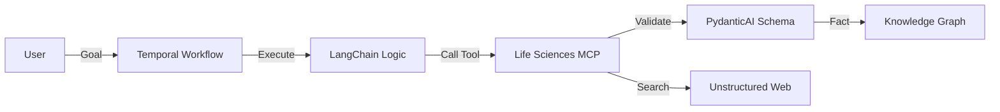

# Agentic Architectural Patterns for Life Sciences

**Status**: Draft
**Date**: 2026-01-12
**Context**: Synthesized from `lifesciences-research` MCP competency question analysis.

## 1. Core Agentic Patterns

### Pattern A: "Fuzzy-to-Fact" Protocol (The Grounding Layer)
*   **Problem**: LLMs hallucinate identifiers. Simple lookups fail when entities have synonyms (e.g., "Gleevec" vs "Imatinib").
*   **Solution**: A mandatory **Two-Step Resolution** process.
    1.  **Fuzzy Search**: `search_tools(query)` -> Returns list of candidates with relevance scores.
    2.  **Fact Resolution**: Agent selects the best candidate (Score 1.0 or Context Match) and retrieves the canonical CURIE (e.g., `CHEMBL:941`).
*   **Application**: Universal entry point for all Skills (Genomics, Pharma, Clinical).

### Pattern B: Federated Domain Traversal (The "Agentic Biolink")
*   **Problem**: Biological data is siloed (ClinicalTrials.gov, ChEMBL, OpenTargets are separate worlds).
*   **Solution**: The Agent acts as the **Federated Join Key**.
    *   It executes a "Hop" by taking an Output ID from Domain A (e.g., Gene `HGNC:171`) and using it as an Input ID for Domain B (e.g., Drug Target search).
    *   This effectively builds a transient Knowledge Graph on-the-fly without needing a massive centralized warehouse.

### Pattern C: Triangulated Validation
*   **Problem**: Structured databases are incomplete (e.g., STRING missing `RARG->ACVR1`).
*   **Solution**: **Multi-Modal Verification**.
    *   If Structured Tool -> No Result:
    *   **Fallback**: Invoke Unstructured Tool (Web Search / Literature RAG).
    *   **Synthesize**: Agent combines "Zero hits in DB" + "Strong evidence in Paper" = "Valid but novel connection."

### Pattern D: Self-Healing Knowledge Graphs
*   **Problem**: Static Knowledge Drift. IDs become obsolete (e.g., CQ7 `MONDO:0014109`), or schemas change.
*   **Solution**: **Agentic Repair Loop**.
    *   **Detect**: Catch `ENTITY_NOT_FOUND` or `OBSOLETE` errors.
    *   **Diagnose**: Use `search_web` to find the "New Identity" of the concept.
    *   **Repair**: Update the active context with the new ID and proceed.
    *   **Persist**: The Agent doesn't just crash; it *fixes* the graph for future users.

---

## 2. Implementation Framework Analysis

To productionize these patterns, we evaluate modern Agentic Frameworks:

### LangChain DeepAgents (Orchestration)
*   **Fit**: High.
*   **Role**: **Planner & Router**.
*   **Use Case**: Managing the high-level workflows (e.g., "CQ2 Repurposing"). DeepAgents can handle the state of the "Federated Hop" (keeping track of the Gene ID while searching for Drugs).
*   **Key Feature**: Hierarchical Agents (Supervisor -> Specialist). Perfect for the `lifesciences-*` skill separation.

### PydanticAI (Agent Framework)
*   **Fit**: **Critical**.
*   **Role**: **Type-Safe Agent Logic & Dependency Injection**.
*   **Use Case**: Building the Agents themselves, not just the data schemas.
    *   **Dependency Injection**: Using `RunContext` to safely inject the `LifeSciencesClient` into tools.
    *   **Type-Safe Control Flow**: Ensuring the "reasoning loop" itself adheres to strict Pydantic models.
*   **Why**: Unlike generic agent frameworks, PydanticAI brings the *rigour* of the Pydantic library to the *Agent* layer. It prevents "prompt drift" by enforcing type safety on the *entire* agent interaction, not just the outputs.

### Temporal (Durability)
*   **Fit**: High (for specific workflows).
*   **Role**: **Long-Running Process Management**.
*   **Use Case**: "CQ12: Health Emergencies" or "CQ15: Regulatory Monitoring".
    *   These are not chat interactions; they are **Background Jobs**.
    *   Example: "Monitor ClinicalTrials.gov every week for new CAR-T trials and alert me."
*   **Why**: Temporal ensures that if the agent fails on step 4 of a 50-step regulatory analysis, it resumes at step 4, not step 1.

## 3. Recommended Architecture: "The Durable Specialist"

Combine the strengths:
1.  **Temporal Workflow** as the backbone for reliability.
2.  **LangGraph/DeepAgents** for the cognitive loop (Planning/Reasoning).
3.  **PydanticAI** for the tool interface (Strict Inputs/Outputs).
4.  **MCP** as the standard protocol for tool delivery.

**Diagram**:

