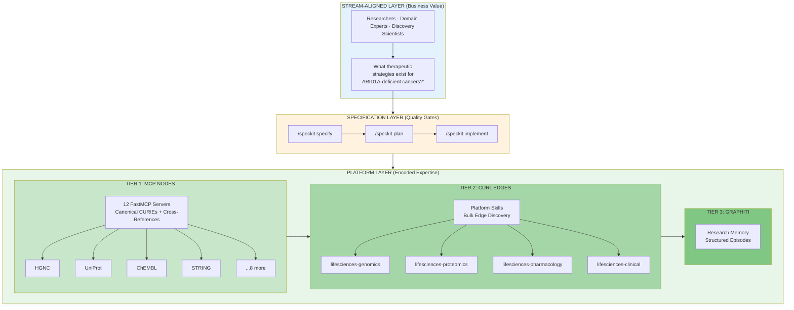
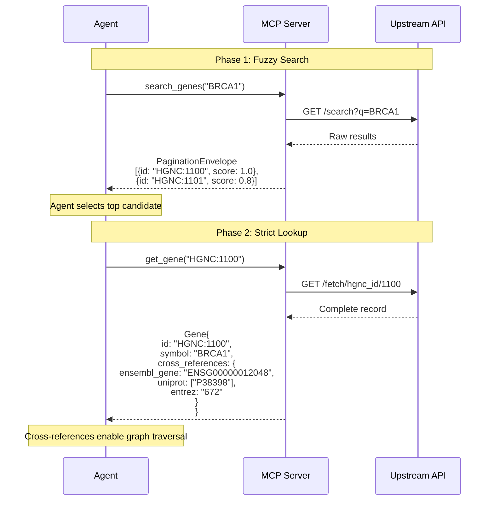
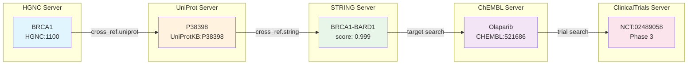
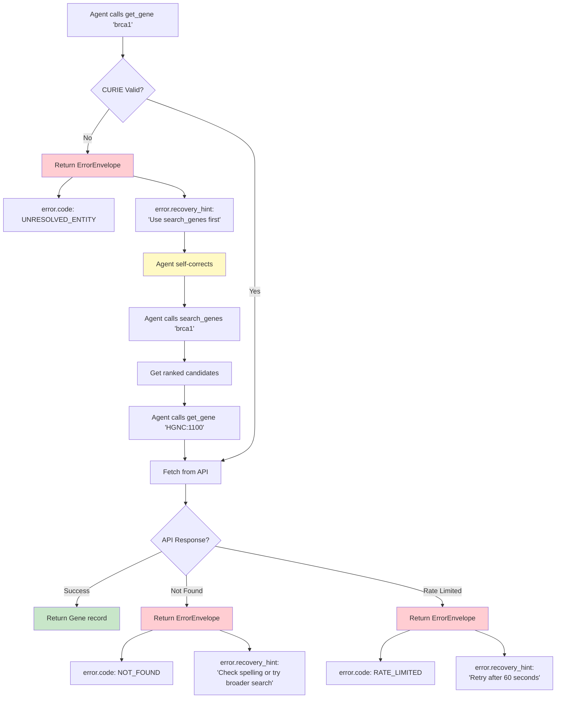
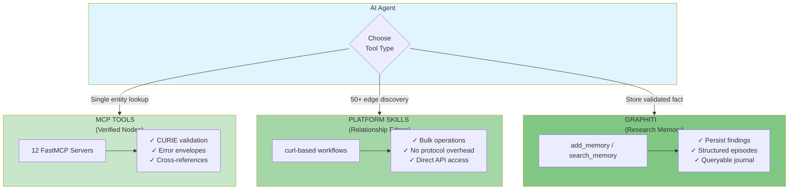
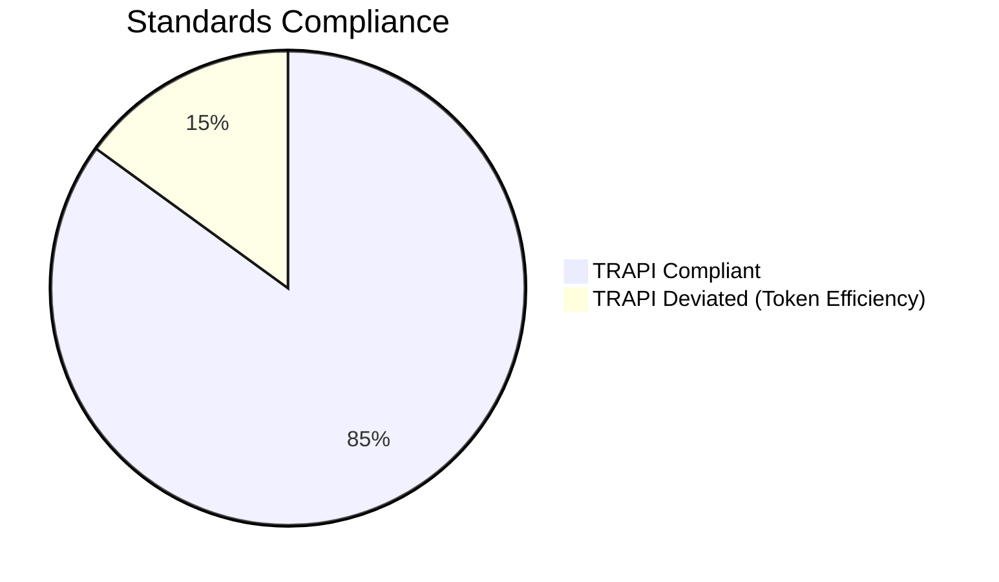
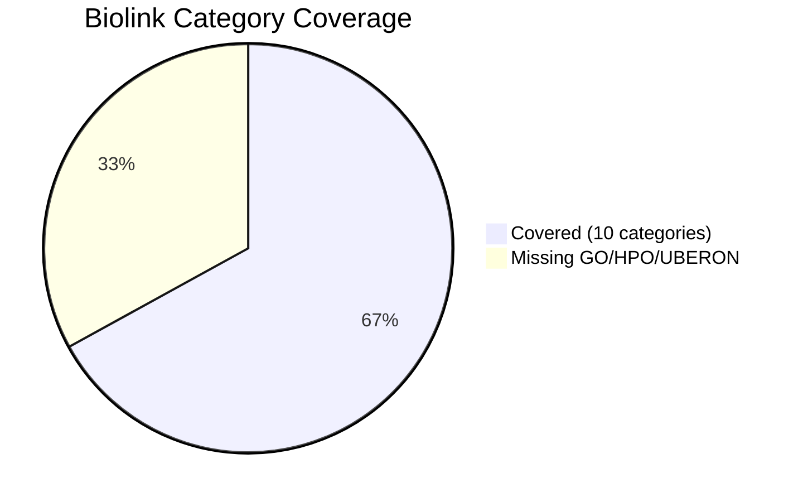
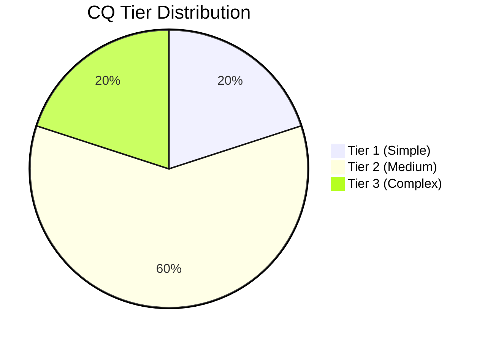

# Architecture Diagrams

This file contains Mermaid diagram sources for the Life Sciences MCP Platform pitch deck.

---

## 1. Three-Tier Architecture (MCP Nodes → curl Edges → Graphiti)



---

## 2. Fuzzy-to-Fact Protocol Flow



---

## 3. Cross-Reference Graph Traversal



---

## 4. Error Handling with Recovery Hints



---

## 5. ARID1A Synthetic Lethality Workflow

```mermaid
flowchart LR
    subgraph Step1["Step 1: Gene Resolution"]
        Q1["'ARID1A'"] --> S1["hgnc_search_genes"]
        S1 --> R1["HGNC:11110"]
    end

    subgraph Step2["Step 2: Cross-Reference"]
        R1 --> S2["get_gene"]
        S2 --> R2["ensembl_gene:<br/>ENSG00000117713"]
    end

    subgraph Step3["Step 3: Interactions"]
        R2 --> S3["string_get_interactions"]
        S3 --> R3["EZH2 (0.999)<br/>SMARCC1 (0.997)<br/>SMARCA4 (0.996)"]
    end

    subgraph Step4["Step 4: Drug Search"]
        R3 --> S4["chembl_search_compounds<br/>'EZH2 inhibitor'"]
        S4 --> R4["Tazemetostat<br/>CHEMBL:3414621"]
    end

    subgraph Step5["Step 5: Clinical Trials"]
        R4 --> S5["clinicaltrials_search_trials<br/>'Tazemetostat ARID1A'"]
        S5 --> R5["NCT:03348631<br/>Phase 2"]
    end

    subgraph Result["Knowledge Graph"]
        KG["Gene → Protein → Drug → Trial<br/>with full provenance"]
    end

    R5 --> KG

    style Step1 fill:#e1f5fe
    style Step2 fill:#e3f2fd
    style Step3 fill:#e8f5e9
    style Step4 fill:#f3e5f5
    style Step5 fill:#fce4ec
    style Result fill:#fff9c4
```



---

## 6. Platform Skills Layer



---

## 7. Industry Standards Alignment





---

## 8. Competency Question Complexity Distribution



---

## Usage Notes

### Rendering Mermaid Diagrams

These diagrams can be rendered:

1. **GitHub/GitLab**: Markdown preview renders Mermaid natively
2. **VS Code**: Install "Mermaid Preview" extension
3. **Online**: Use https://mermaid.live for interactive editing
4. **PDF Export**: Use Mermaid CLI (`mmdc`) or Slidev with Mermaid plugin

### Converting to Images

```bash
# Install Mermaid CLI
npm install -g @mermaid-js/mermaid-cli

# Convert single diagram
mmdc -i architecture-diagram.md -o diagram.png -t neutral

# Convert with specific theme
mmdc -i architecture-diagram.md -o diagram.svg -t forest
```

### Recommended Themes

- **Presentation**: `neutral` or `default`
- **Print**: `neutral`
- **Dark mode**: `dark`

---

**Version:** 1.0
**Last Updated:** 2026-01-26
