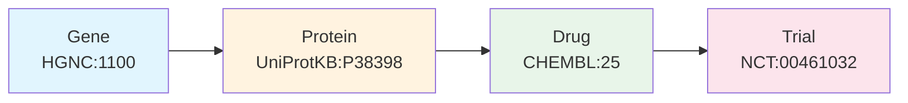

# Life Sciences MCP Platform: Grounded AI for Drug Discovery

**Tagline:** *From researcher question to connected knowledge graph in seconds*

---

## Slide 1: Title

### Life Sciences MCP Platform
### Grounded AI for Drug Discovery

*From researcher question to connected knowledge graph in seconds*



---

## Slide 2: The Problem

### LLMs Hallucinate Biomedical Knowledge

**The status quo is broken:**

| Challenge | Impact |
|-----------|--------|
| **No authoritative access** | LLMs rely on stale training data or hallucinate |
| **Identifier fragmentation** | BRCA1 = `HGNC:1100` = `P38398` = `ENSG00000012048` = `672` |
| **Manual integration burden** | Days/weeks per database, code breaks when APIs change |
| **Cognitive load** | Scientists become integration engineers |

> *"When asked about drug-target interactions, LLMs either hallucinate or rely on stale training data."*
>
> — docs/prior-art-api-patterns.md

**Researchers spend 60-80% of their time on data wrangling.**

---

## Slide 3: The Solution

### Platform Engineering for Biomedical AI Agents

**12 authoritative APIs wrapped in a unified MCP interface:**

- **Fuzzy-to-Fact Protocol:** Natural language → Canonical identifiers
- **Cross-reference graph:** Automatic multi-hop traversal
- **Token budgeting:** `slim=True` reduces 115+ tokens → 20 tokens per entity

```
┌─────────────────────────────────────────────────────────────────┐
│  TIER 1: MCP NODES (Verified Entities)                          │
│  12 FastMCP servers with canonical CURIEs + cross-references    │
├─────────────────────────────────────────────────────────────────┤
│  TIER 2: CURL EDGES (Relationship Discovery)                    │
│  Platform skills for bulk traversal without protocol overhead   │
├─────────────────────────────────────────────────────────────────┤
│  TIER 3: GRAPHITI (Research Memory)                             │
│  Persist validated findings as structured episodes              │
└─────────────────────────────────────────────────────────────────┘
```

---

## Slide 4: Quantitative Evidence

### Structured APIs Outperform Unstructured Retrieval

| Study | Baseline | With APIs | Improvement |
|-------|----------|-----------|-------------|
| **BTE-RAG (GPT-4o mini)** | 51% | 75.8% | **+24.8 pp** |
| **BTE-RAG (GPT-4o)** | 69.8% | 78.6% | **+8.8 pp** |
| **RAG Systematic Review** | 1.0x | 1.35x | **35% odds ratio** |

**Sources:**
- Xu et al. (2025) "Federated Knowledge Retrieval Elevates LLM Performance" *bioRxiv*
- Wang et al. (2025) "RAG in Biomedicine: A Systematic Review" *JAMIA*

**Key insight:** Canonical CURIEs, typed entities, and evidence scores aren't just convenient—they're what benchmarks prove works.

---

## Slide 5: Value Pillar 1 — Rapid API Scaffolding

### Add New APIs in Hours, Not Weeks

**`/scaffold-fastmcp` generates consistent project structure:**

| Component | What's Generated |
|-----------|------------------|
| **Client** | Async httpx client with rate limiting |
| **Server** | FastMCP server with tool stubs |
| **Models** | Pydantic models with CURIE validation |
| **Tests** | Integration test scaffolding |

**Platform statistics:**

| Metric | Count |
|--------|-------|
| MCP Servers | 12 |
| Total Tests | 600+ |
| Client LOC | 8,200 |
| Server LOC | 2,200 |

**Example:** Adding Reactome = 1-2 hours (vs. weeks of custom integration)

---

## Slide 6: Value Pillar 2 — Deterministic Nodes, Agentic Edges

### The Intentional Separation

| Layer | Implementation | Purpose |
|-------|----------------|---------|
| **MCP Servers** | 12 FastMCP endpoints | Verified node retrieval (canonical CURIEs) |
| **Platform Skills** | curl-based workflows | Agentic edge discovery (flexible traversal) |
| **Graphiti Memory** | JSON episodes | Persist validated research findings |

**Why separate?**

- MCP carries JSON-RPC protocol overhead (~100ms/call)
- curl is efficient for bulk edge discovery (10-50 calls/workflow)
- Agents choose the right tool for the job

**Available platform skills:**
- `lifesciences-genomics` — Ensembl, NCBI, HGNC
- `lifesciences-proteomics` — UniProt, STRING, BioGRID
- `lifesciences-pharmacology` — ChEMBL, PubChem, IUPHAR
- `lifesciences-clinical` — Open Targets, ClinicalTrials.gov

---

## Slide 7: The Fuzzy-to-Fact Protocol

### Solving the Identifier Problem

```
Phase 1 (Fuzzy):  "BRCA1"  →  Ranked candidates with CURIEs
                              ├── HGNC:1100 (score: 1.0, exact match)
                              ├── HGNC:1101 (score: 0.8, BRCA2)
                              └── ...

Phase 2 (Strict):  "HGNC:1100"  →  Complete record with cross-references
                                    ├── ensembl_gene: "ENSG00000012048"
                                    ├── uniprot: ["P38398"]
                                    ├── entrez: "672"
                                    └── ...
```

**Why this matters:**

1. **Prevents hallucination** — Forces entity resolution before retrieval
2. **Enables self-healing** — Error envelopes include recovery hints
3. **Enables graph traversal** — Cross-references link across databases

```json
{
  "error": {
    "code": "UNRESOLVED_ENTITY",
    "message": "Invalid CURIE format: 'brca1'",
    "recovery_hint": "Use search_genes('brca1') first to resolve to HGNC CURIE, then call get_gene() with the resolved ID."
  }
}
```

---

## Slide 8: Value Pillar 3 — Embracing Our Gaps

### Honest Positioning: What We're Not (Yet)

| Gap | Status | Planned Resolution |
|-----|--------|-------------------|
| **Gene Ontology keys** | Missing `go_process`, `go_function`, `go_component` | Q1 2026 |
| **Confidence calibration** | No STRING-style benchmarking | Q2 2026 |
| **Phenotype integration** | No HPO support | Q2 2026 (Monarch Initiative) |
| **DrugMechDB validation** | Gold standard not integrated | Immediate priority |

**Our philosophy:**
1. Document prior art first (§1-6 of research docs)
2. Then articulate unique contributions (§7)
3. Alignment with standards is a **strength**, not a limitation

> *"Embracing alignment with standards like TRAPI, Biolink, and the Fuzzy-to-Fact pattern is a strength—it means the work builds on proven foundations rather than reinventing them."*

---

## Slide 9: Industry Standards Alignment

### Standing on Proven Foundations

| Standard | Compliance | Notes |
|----------|------------|-------|
| **TRAPI** | 85% | Intentional deviations for 60% token reduction |
| **Biolink Model** | 80% | 22-key cross-reference registry |
| **W3C CURIE Syntax** | Full | Bioregistry-validated prefixes |
| **BioThings Explorer** | Aligned | Federated API query patterns |

**Collaborations:**
- NCATS Translator (TRAPI standard)
- Bioregistry (canonical prefixes)
- ELIXIR infrastructure (European life sciences data)

**Key validation:** Our cross-reference registry covers 10 of 15 major Biolink categories, with documented gaps for GO, HPO, and UBERON.

---

## Slide 10: Novel Contributions

### What We Add to the Field

| Contribution | Description | Impact |
|--------------|-------------|--------|
| **Token Budgeting** | `slim=True` reduces 115-300 → 20 tokens/entity | 5-15x context efficiency |
| **Recovery Hints** | Error envelopes guide agent self-correction | Autonomous multi-step workflows |
| **Fuzzy-to-Fact as Protocol** | Named, documented, testable pattern | Teachable and enforceable |
| **Multi-Dimensional Quality Metrics** | Completeness, Precision, Coherence, Provenance | Quantifiable graph quality |
| **CQ Complexity Classification** | Tier 1-3 stress testing framework | Systematic capability validation |

**Unique insight:** We separate node retrieval (MCP tools) from edge discovery (curl skills) because MCP protocol overhead matters at scale.

---

## Slide 11: Drug Discovery Workflow Demo

### Synthetic Lethality Target Discovery (ARID1A)

**Researcher question:** *"Show me synthetic lethal partners for ARID1A in ovarian cancer"*

```
Step 1: hgnc_search_genes("ARID1A")     → HGNC:11110
        └── Resolve gene symbol to canonical CURIE

Step 2: get_gene("HGNC:11110")          → cross_references.ensembl_gene
        └── Get Ensembl ID for STRING lookup

Step 3: string_get_interactions(...)    → EZH2 (0.999), SMARCC1 (0.997)
        └── Find high-confidence interaction partners

Step 4: chembl_search_compounds("EZH2 inhibitor")  → Tazemetostat
        └── Find drugs targeting synthetic lethal partner

Step 5: clinicaltrials_search_trials("Tazemetostat ARID1A")  → NCT03348631
        └── Find active clinical trials
```

**Result:** Connected knowledge graph with provenance in seconds

| Metric | Before | After |
|--------|--------|-------|
| Time to insight | 1 week | Seconds |
| Manual API calls | 50+ | 0 |
| Identifier reconciliation | Hours | Automatic |

---

## Slide 12: Call to Action

### Join Us in Building Grounded Biomedical AI

**For Researchers:**
- Use the platform for drug discovery workflows
- Test the 15 competency questions in our catalog

**For Bioinformaticians:**
- Contribute API wrappers via `/scaffold-fastmcp`
- Help close the Gene Ontology and HPO gaps

**For AI Engineers:**
- Build agents using MCP tools + platform skills
- Explore the Fuzzy-to-Fact protocol for other domains

**For Standards Bodies:**
- Help us align with TRAPI, Biolink, DrugMechDB
- Validate our cross-reference registry against Bioregistry

---

### Links

| Resource | URL |
|----------|-----|
| GitHub Repository | `github.com/donbr/lifesciences-research` |
| Documentation | `docs/platform-engineering-rationale.md` |
| ADR-001 Specification | `docs/adr/accepted/adr-001-v1.4.md` |
| Competency Questions | `docs/competency-questions/` |

---

**Life Sciences MCP Platform**

*Canonical identifiers. Structured responses. Grounded AI.*

